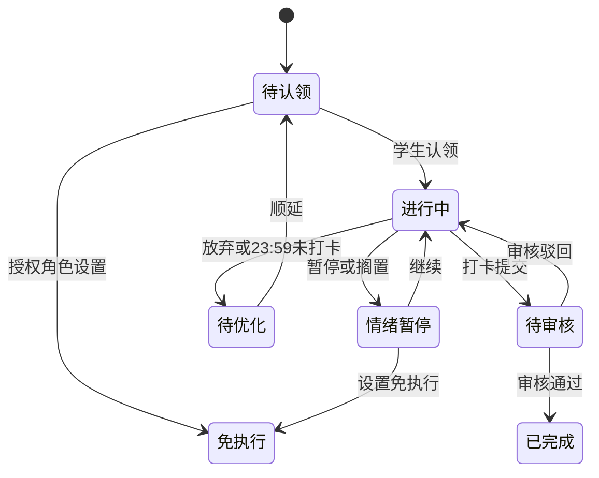
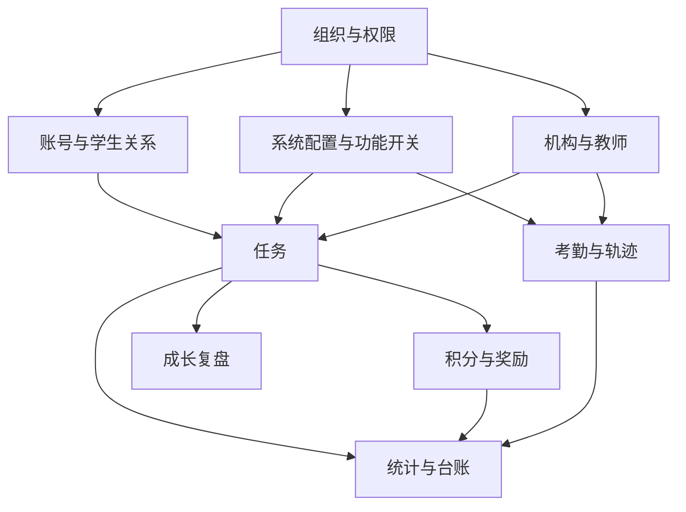

# 灵动学习功能详细设计（FSD）

**版本**：V1.0（设计基线草案）  
**状态**：待评审  
**业务依据**：[灵动学习-业务需求说明书-V1.0.md](../../灵动学习-业务需求说明书-V1.0.md) 第 3 至 6 章  
**关联文档**：[设计文档体系与需求追溯](00-设计文档体系与需求追溯-V1.0.md)

## 1. 设计边界与通用约定

### 1.1 功能编号

| 编号前缀 | 功能域 |
|---|---|
| FSD-ORG | 组织、组织类型与组织管理员 |
| FSD-IAM | 用户、角色、权限与数据范围 |
| FSD-SYS | 系统配置、系统任务审核与功能开关 |
| FSD-AUTH | 账号、登录、会话与设备 |
| FSD-STU | 学生账号、亲子关系与家校关联 |
| FSD-TASK | 家庭、机构、教师任务与学生执行 |
| FSD-POINT | 积分、奖励与兑换 |
| FSD-GROW | 成长复盘、报表订阅与匿名排行 |
| FSD-INST | 学校、班级、教师、学员与异常报备 |
| FSD-ATT | 地理考勤与轨迹 |
| FSD-COM | 附件、字典、模板、缓存、消息、帮助与维护 |
| FSD-RPT | 统计、台账、导出 |

### 1.2 全局规则

1. 业务角色固定为系统管理员、系统审核员、机构（学校）管理员、教师、家长、学生；系统管理员可创建自定义角色，但不得授予超过其可授权范围的功能、组织或数据权限。
2. 访问决策顺序固定为：**功能开关 > 用户明确禁止 > 角色允许 > 用户补充允许 > 数据范围 > 组织范围**。前端仅按结果展示，后端必须重复校验并拦截未授权操作。
3. 功能关闭后，菜单、入口、页面、按钮、弹窗和操作项均隐藏；旧链接或收藏地址也不能绕过后端校验。历史数据按具体业务规则保留，只读或可导出不代表可以新增、编辑、审核。
4. 家庭任务、奖励、家庭积分配置和家庭复盘是家庭私有数据；机构关联家长后，仅可取得学生维度的机构公开数据，不得取得家庭私有数据。
5. 所有附件、下拉字典、导入导出模板和接口服务分别使用统一公共能力，业务模块只声明归属、用途和数据权限。
6. 操作日志应覆盖权限变更、系统配置、审核、导出、缓存、围栏、数据恢复和业务关键状态变更；热存储 180 天后冷归档。
7. 所有需要主动通知的功能遵循 22:00 至次日 07:00 夜间抑制规则；用户主动操作不受影响。消息必须能跳转到相应业务详情。

### 1.3 端应用边界

| 能力类型 | Web 端 | 小程序端 |
|---|---|---|
| 权限、组织、字典、模板、接口、缓存配置 | 完整提供 | 不提供完整配置 |
| 系统任务审核与台账 | 完整提供 | 可提供待办与简化审批；不替代 Web 完整台账 |
| 机构、教师、家长高频单笔操作 | 提供 | 提供 |
| 学生任务执行 | 可展示关联页面 | 主使用端 |
| 批量导入、全量台账、复杂统计、复杂导出 | 主使用端 | 仅摘要查看 |
| 定位、轨迹、地图 | 首次个人主体发布包不包含 | 首次个人主体发布包不包含 |

## 2. 组织与权限

### FSD-ORG-01 组织类型与组织树

**使用角色**：系统管理员；被授权的组织管理员仅在其组织范围内执行授权事项。  
**业务对象**：区域、学校、校区、年级、班级和自定义组织类型。

**主流程**：维护组织类型 -> 创建区域/学校等树节点 -> 校验同级名称、组织编码和父子层级 -> 配置启用状态 -> 记录操作日志。

| 功能点 | 输入与校验 | 结果与联动 |
|---|---|---|
| 新增组织类型 | 类型编码、名称、排序、启停状态；编码和名称唯一 | 可作为组织树节点分类；停用后不能用于新增节点 |
| 新增组织节点 | 组织编码、名称、类型、上级、排序、状态 | 生成并维护组织树路径；同一上级下名称不得重复 |
| 编辑组织节点 | 允许更新名称、排序、状态等业务允许字段 | 变更写入操作日志；不得破坏既有父子关系与数据范围 |
| 停用组织节点 | 二次确认；重要组织停用属于高风险系统任务 | 本节点及下级不产生新业务；历史数据保留查询 |
| 配置组织管理员 | 选择已存在用户，且其组织关联满足授权边界 | 管理范围限定为绑定节点及子树中被授予的事项 |

**异常与边界**：家长不是组织树节点；学生可以仅由家庭创建而不属于机构；教师可关联多个班级；组织停用不删除历史数据；跨区域扩大组织管理员范围须走系统任务审核。

### FSD-IAM-01 用户、角色与权限

**使用角色**：系统管理员。  
**主流程**：创建或维护用户 -> 关联组织 -> 分配内置或自定义角色 -> 分配角色权限与数据范围 -> 按需配置用户补充允许/禁止权限 -> 记录变更日志。

| 功能点 | 关键规则 |
|---|---|
| 用户管理 | 账号全局唯一；状态为启用、停用或锁定。停用后不可登录，已有历史数据保留。 |
| 角色管理 | 内置角色不可删除；自定义角色可新增、停用。角色含菜单、页面、按钮、操作、数据和组织范围。 |
| 角色权限 | 未授权菜单和按钮不展示；权限变更后下一次进入页面按最新结果生效。 |
| 用户权限 | 仅用于补充或明确限制；明确禁止优先于允许；不得以用户权限扩大组织/数据范围。 |
| 数据范围 | 支持全部、本区域、本学校、本班级、本人、自定义。实际访问还必须同时满足用户组织关联和组织管理员范围。 |
| 组织管理员 | 不是一个越权角色；只能管理对应组织子树中已授予的事项。 |

**数据隔离规则**：系统管理员按审计和管理需要查看全局数据；系统审核员仅查看待审系统任务与审批历史；机构管理员按授权机构；教师按授权班级；家长按已绑定学生；学生仅本人。

## 3. 系统配置、系统审核与功能开关

### FSD-SYS-01 系统任务与审核

**发起角色**：系统管理员。**审批角色**：系统审核员。  
**任务状态**：草稿 -> 待审核 -> 已通过/已驳回 -> 已生效；已驳回可修改后重新提交。

| 功能点 | 处理规则 |
|---|---|
| 创建系统任务 | 填写任务类型、标题、说明、影响范围；任务类型包括公告发布、机构停用、数据恢复、敏感导出、功能开关调整和系统配置调整。 |
| 提交审核 | 仅发起人可提交自己的草稿；审批中不得重复提交。 |
| 审批通过 | 系统审核员记录审批人、时间、意见；后续由具体业务变更执行并标记已生效。 |
| 审批驳回 | 驳回意见必填，最长 500 字；不能直接生效。 |
| 审批边界 | 审核员不得审批自己提交的任务，且不进入学习任务、打卡、积分、兑换或考勤的业务审核流。 |

**必须经系统审核的高风险事项**：全局公告发布、重要组织停用、数据恢复、敏感导出、全局功能开关、全量或用户会话缓存清除、接口服务新增/停用/扩大授权、跨区域组织管理员授权、关键字典变更、超出原组织范围的数据权限调整。

### FSD-SYS-02 附件管理

**功能目标**：统一上传、下载、查看、预览、删除规则，业务模块不单独定义文件能力。

| 配置项 | 规则 |
|---|---|
| 附件类型与格式 | 由附件规则配置；业务需求列举图片、文档、表格、PDF、音视频等类型，实际白名单应以配置为准。 |
| 文件大小与批量上传 | 由附件规则配置，超出规则不允许上传。 |
| 预览与下载 | 依据附件规则和所属业务数据权限决定；不支持预览时只显示下载入口。 |
| 删除 | 默认解除业务可见关系；归档业务保留追溯记录；物理删除申请属于受控操作。 |
| 归属 | 每个附件必须关联所属模块、业务对象、上传人和上传时间。 |

### FSD-SYS-03 缓存、字典、模板和接口服务

| 功能 | 操作 | 关键规则 |
|---|---|---|
| 缓存管理 | 按权限、字典、组织、功能开关、用户会话、业务统计等类型刷新或清除 | 默认按模块处理；全量清除和清除用户会话需说明影响范围、二次确认并走系统审核；失败保留失败记录。 |
| 数据字典 | 字典类型、字典项新增、编辑、排序、启停、默认项 | 所有下拉、状态、类型和枚举统一来源；同一类型编码唯一、最多一个默认项；停用项不可新选，历史仍原值展示；关键字典变更需审核。 |
| 导入导出模板 | 模板类型、适用模块、版本、默认项、启停 | 同模块同类型只有一个默认模板；新变更只影响新任务，历史导入记录和导出文件保留原模板版本。 |
| 接口服务 | 服务名称、方向、用途、调用方、授权范围、状态、责任人 | 未具备授权范围、责任人或状态不能启用；新增、停用、扩大范围均需审核；保留调用结果和异常说明。 |

### FSD-SYS-04 功能开关

**主流程**：系统管理员创建全局开关调整任务 -> 系统审核员审批 -> 审批通过后变更生效 -> 清理或刷新受影响缓存 -> 前后端按最新开关执行。

**通用结果**：关闭后阻止新建、编辑、审核、采集、生成新待办、新通知和新数据；历史数据保留，具体待办处理以所属功能的规则为准。

**定位专项**：`GEO_ATTENDANCE` 和 `STUDENT_LOCATION_TRACK` 默认关闭。关闭时两端均隐藏围栏、考勤、轨迹和位置授权入口，后端拒绝位置、地图、自动签到签退和轨迹请求。个人主体工具类目首次小程序构建包不得包含相关能力；未来启用前同时满足高风险任务审批、可发布主体条件和家长位置授权。

## 4. 账号、学生与家校关系

### FSD-AUTH-01 多角色登录、会话与设备

| 功能点 | 规则 |
|---|---|
| 家长登录 | 支持手机号验证码、密码；小程序支持微信授权。微信与手机号一对一绑定，授权失败回落至验证码登录。 |
| 学生登录 | V21 已实现小程序 8 位学生账号加 4 位登录码登录；学生不得自主注册，扫码和微信登录仍为后续能力。Web 密码登录明确拒绝学生账号。 |
| 登录安全 | V21 已实现登录码连续错误 5 次后要求账号与设备绑定的单次图形验证码，连续错误 10 次锁定 15 分钟；登录按账号设备及来源地址限流。二维码有效期 5 分钟仍属后续设计。 |
| 设备管理 | 查看已登录设备、退出当前设备、一键下线；状态变更留痕。 |
| 密码与验证码 | 密码为 8 至 20 位字母加数字；验证码 6 位、5 分钟有效、1 分钟内最多发送 3 次。 |

### FSD-STU-01 学生账号与亲子关系

**V19-V21 已实现边界**：已实现学生姓名、可选年级编码、启用状态、一个主家长关系和一个直接机构关系的创建与查询。家长创建时自动建立自己的主家长关系；机构管理员创建时必须是目标启用组织的直接管理员。系统管理员可读取全量，家长与机构管理员分别按活动亲子关系、直接管理组织关系读取，两个身份并存时取范围并集。V20 已实现机构管理员为其直接管理组织下、尚无主家长的学生签发绑定邀请。V21 在创建学生的同一事务中建立独立 `STUDENT` 用户、分配 `STUDENT` 角色、生成 8 位年度顺序账号和 4 位登录码；创建响应只显示一次初始登录码。历史学生由主家长或学生当前机构的直接机构管理员显式初始化，重置登录码会撤销该学生全部活动会话。当前仍不包含二维码、头像、微信绑定、短信/微信/站内消息投递、副家长、解绑、转班转学或注销。

**主流程一（家庭）**：家长登录 -> 创建学生 -> 同事务生成学生账号和一次性初始登录码 -> 建立主家长关系 -> 学生在小程序登录。

**主流程二（机构）**：机构管理员创建学生 -> 同事务生成学生账号和一次性初始登录码 -> 发送家长绑定邀请 -> 家长确认 -> 建立亲子与家校关联。

**历史学生流程**：主家长或直接机构管理员初始化登录凭证 -> 一次性安全转交账号和登录码 -> 学生登录；遗失后由同一对象范围内的操作者重置，旧会话立即撤销。

| 功能点 | 关键规则 |
|---|---|
| 学生创建 | 仅家长或机构管理员可创建；当前字段为学生姓名、可选年级和机构侧可选组织。账号采用创建年份后两位加 6 位年度序号（`YYNNNNNN`），每年从 `000001` 递增，达到 `999999` 后拒绝继续分配。 |
| 登录凭证 | 登录码为 `SecureRandom` 生成的 4 位数字；数据库只保存独立随机盐、HMAC-SHA256 摘要和密钥版本。初始或重置明文只在对应成功响应出现一次，普通学生详情和日志不得返回。 |
| 功能开关 | `STUDENT_CODE_LOGIN` 关闭后，小程序首页隐藏学生登录入口，登录页直达显示不可用，验证码和登录接口均由后端拒绝且不创建会话。 |
| 主副家长 | 首次绑定为主家长；副家长默认查看与接收指定消息，无编辑、审核、奖励配置权限。 |
| 主家长变更 | 主家长解绑后，最早绑定的副家长自动升级；无副家长时家庭审核暂停，历史可查看。 |
| 机构邀请 | V20 已实现机构不得强制绑定家长；仅学生直接所属组织的直接机构管理员可签发；邀请固定有效期 7 天，拒绝或过期不建立关系，可重新发送。每名学生至多一个未过期待处理邀请，接受时原子建立唯一主家长关系。当前由机构线下受控转交一次性令牌，不含消息投递和小程序页面。 |
| 账号注销 | 家长先解除学生绑定；学生注销须满足无机构关联等 BRD 条件，状态不可逆。 |
| 转班转学 | 由机构侧维护组织关联，家庭关系和历史家庭数据不因机构关系变化而向机构开放。 |

## 5. 学习任务与学生执行

### FSD-TASK-00 V22 当前落地边界

V22 已实现学习任务第一条可运行闭环：机构管理员配置学生当前班级和教师班级关系；家长、机构管理员、教师在 Web 创建和编辑草稿；发布时按当前有效亲子、组织、班级和学生状态展开学生任务实例；学生在 uni-app 小程序按本人身份查询待认领任务列表和只读详情。`LEARNING_TASK_MANAGEMENT` 关闭后，Web 与小程序入口隐藏、直达页面不请求任务数据，后端任务及班级关系接口同时拒绝。

当前只实现 `DRAFT`、`PUBLISHED` 两种任务定义状态和 `PENDING_CLAIM` 学生实例初始状态。认领、打卡、审核、积分、暂停、放弃、顺延、免执行、消息及统计仍属于后续功能点，不得从当前页面或接口推断为已实现。

| 来源 | 创建角色 | 来源与目标约束 | 默认审核人 |
|---|---|---|---|
| 家庭 | 主家长 | 不指定来源组织；目标只能是当前家长活动主关系下的学生。 | 当前家长。 |
| 机构 | 机构管理员 | 来源组织须在当前数据范围；目标为来源组织子树内启用组织或活动学生。 | 当前机构管理员；可指定覆盖全部目标班级/学生的启用教师。 |
| 教师 | 教师 | 来源须为当前教师活动班级；目标为该班级或班内活动学生。 | 当前教师。 |

草稿字段为标题、难度、执行时长、计划日期、分类、标签、备注、审核人和原始目标。难度取 1 至 3，基础积分由服务端按难度乘以 10 生成，审核超时固定为 72 小时；分类与标签读取启用字典。任务一经发布即不可编辑，重复发布返回状态冲突。

发布使用任务行锁和状态条件更新，在同一事务内重新校验来源、目标与审核人，按学生标识排序去重后写入实例；零有效学生拒绝发布。批量发布最多 100 个不重复任务标识，每项通过独立新事务执行，部分失败不回滚其他成功项，客户端只收到中性失败原因。

### FSD-TASK-01 创建与下发

**创建角色与来源**：主家长创建家庭任务；机构管理员创建机构任务；教师创建授权班级的教师任务。任务必须自动带有家庭、机构或教师来源标识。

| 关键字段 | 规则 |
|---|---|
| 标题 | 必填，最长 50 字。 |
| 难度、积分、执行时长 | 必填；积分按任务规则计算，学生不能修改。 |
| 分类、标签 | 可选，统一由字典提供，标签可多选。 |
| 备注 | 最长 200 字；任务认领后仅可编辑辅助信息。 |
| 审核人 | 家庭默认主家长；教师默认创建教师；机构默认机构管理员，可指定授权教师。 |
| 审核超时 | 默认 72 小时，可由功能配置调整。 |

**下发范围**：机构任务可下发至学校、班级或指定学生；教师任务仅授权班级或学生；家庭任务仅绑定学生。批量复制和批量下发按单条独立处理，成功立即生效、失败汇总并可重试；按学生复制昨日任务每日一次。

### FSD-TASK-02 执行、审核与状态

| 场景 | 处理规则 |
|---|---|
| 打卡 | 学生提交文字、图片等素材后进入待审核；无有效审核人不得提交成功。 |
| 审核通过 | 任务已完成，发放积分；已完成任务禁止手动删除。 |
| 审核驳回 | 驳回意见必填且使用中性文案；退回进行中，可重新提交。 |
| 情绪暂停/难题搁置 | 仅进行中任务可使用；基础状态不变，记录暂停类型；单次最长 2 小时。 |
| 放弃与逾期 | 转为待优化，无次数上限、无扣分或负面评价。 |
| 顺延 | 待优化任务手动或自动顺延，保留原配置和来源。 |
| 免执行 | 家长或授权管理角色可设置；立即终止执行，不产生积分和待优化。 |
| 审核人失效 | 教师任务转交同班授权教师，无人时转机构/组织管理员；机构任务逐级转交；家庭任务转交新主家长或暂停。所有转交必须记录原审核人、新审核人、原因和时间。 |

## 6. 积分、奖励与成长复盘

### FSD-POINT-01 积分与奖励

| 功能点 | 规则 |
|---|---|
| 积分发放 | 仅任务审核通过后发放；三类任务均进入同一个累计总积分账户和可用积分账户。 |
| 积分台账 | 记录来源任务、来源类型、获取时间、数量、审核状态、审核人、审核时间和来源组织。 |
| 积分衰减 | 同一固定任务连续完成达到阈值后按规则衰减，最大 40%；具体阈值需作为可配置且可追溯规则。 |
| 休眠清零 | 连续 30 天无任务执行和积分变动时，未使用积分清零，清零前提醒；累计总积分不减少。 |
| 积分纠错 | 家长误操作审核通过后可在 72 小时内发起；必须保留原台账和纠错依据。 |
| 奖励库 | 仅主家长配置，奖励名称最长 30 字、描述最长 200 字，不能含商业诱导。 |
| 兑换 | 学生可用积分充足才可申请；主家长同意后扣可用积分并变为待核销；72 小时未审批自动驳回且不扣积分。 |
| 核销 | 主家长确认实际兑现；已核销不得重复核销。 |

### FSD-GROW-01 复盘、订阅与匿名排行

| 功能点 | 规则 |
|---|---|
| 每日复盘 | 每日 21:00 生成当日初稿，包含任务完成率、积分、暂停次数、待优化任务等。 |
| 周/月报 | 周一生成上周周报，每月 1 日生成上月月报；支持趋势与类型分布。 |
| 补录与导出 | 主家长可按 BRD 规则补录；PDF 导出受功能开关控制，关闭后不展示入口。 |
| 周报订阅 | 家长可开关每周推送；启用后于周一推送上周报，可随时取消。 |
| 匿名排行 | 班级内不展示真实姓名；家长仅查看自家子女所在班级的匿名排行。 |

## 7. 机构、教师、考勤和家校协同

### FSD-INST-01 学校、班级、教师与学员

| 功能点 | 规则 |
|---|---|
| 班级管理 | 学校下维护班级、教师和学生绑定；班级停用后不接收新机构任务，历史数据保留。 |
| 教师管理 | 教师可关联多个班级，数据范围以授权班级为准。 |
| 学员管理 | 支持单个或批量创建学生、班级绑定、家长邀请；机构只能查看机构公开数据。 |
| 机构停用 | 机构业务暂停；家长仍可使用并查看家庭私有数据。 |
| 异常报备 | 教师提交出勤、学习状态、心态异常；按班级数据范围处理，不得写入家庭私有内容。 |

### FSD-ATT-01 地理考勤与轨迹

**状态**：默认停用且不进入首次个人主体工具类目小程序构建包。  
**启用前置**：全局高风险任务审批通过、可发布主体条件满足、家长位置授权有效。

| 功能点 | 规则 |
|---|---|
| 围栏与时段 | 机构在授权范围内配置学校地理范围、签到签退时段和规则。 |
| 考勤结果 | 家长仅查看自家子女考勤结果；机构授权角色可查看规定范围内考勤与轨迹。 |
| 位置采集 | 未授权、授权撤销、功能关闭或构建包不包含能力时，后端拒绝采集且不生成位置、考勤或轨迹数据。 |
| 留存 | 轨迹数据留存 180 天，到期自动清除。 |

## 8. 公共能力、统计与运维协同

### FSD-COM-01 消息、帮助、反馈与维护

| 功能点 | 规则 |
|---|---|
| 站内消息与微信服务通知 | 消息应说明对象、业务来源、跳转地址、已读状态和归档状态；主动推送遵守夜间抑制。 |
| 消息对象 | 家庭审批类通知以主家长为主；副家长按 BRD 指定范围接收学生直接相关状态通知；机构类通知发给对应教师和机构管理员。 |
| 帮助与反馈 | 提供帮助中心及功能建议、问题报告、其他三类反馈入口；反馈形成可跟踪处理记录。 |
| 维护模式 | 提前 24 小时公告；维护期间历史数据只读，禁止新增、编辑、提交等写操作。 |

### FSD-RPT-01 台账、统计与导出

1. 台账至少覆盖系统任务审批、权限变更、附件、缓存、数据字典、模板、接口服务、学生任务、积分、奖励兑换、机构任务、考勤和异常报备。
2. 导出必须继承功能、数据和组织范围权限；敏感导出属于系统高风险任务，导出过程记录导出人、时间、范围、原因和文件。
3. 复杂统计在 Web 端完整展示，小程序只提供与角色相关的摘要；统计指标、筛选维度和导出字段以《统计口径与报表设计》为准。

## 9. 模块依赖

## 10. 实施前检查

1. 每个功能编码前，必须在本文件、交互说明、数据库设计、API 设计和权限安全设计中找到对应编号。
2. 发现 BRD 与原始素材存在历史终端或阶段冲突时，以已确认的 BRD 口径为准，不新增历史终端或阶段建设范围。
3. 实现过程中新增的字段、状态、任务类型、错误码、权限码、字典项和统计公式必须先回填相应设计文档并完成评审。
