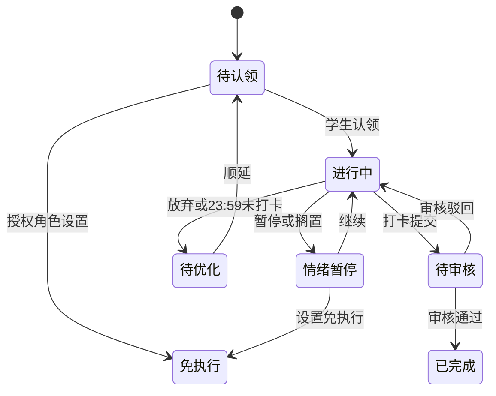
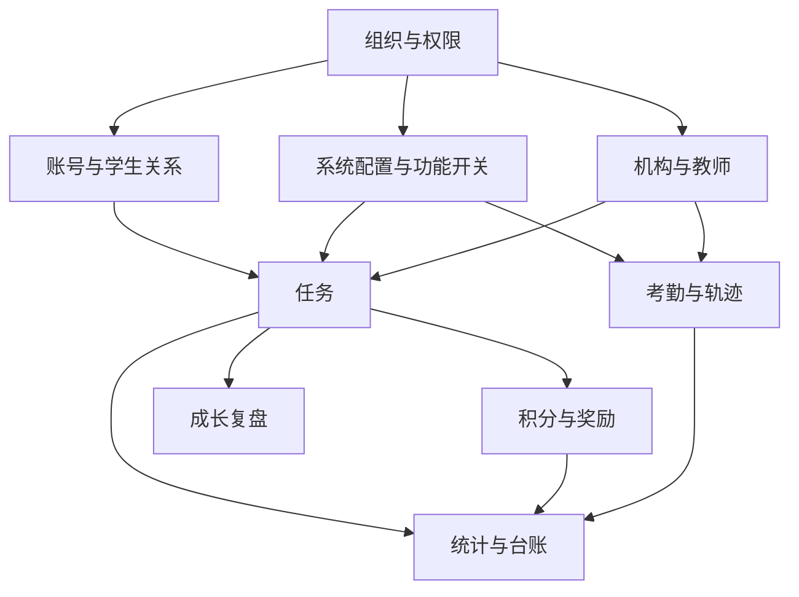

# 灵动学习功能详细设计（FSD）

**版本**：V1.0（设计基线草案）  
**状态**：待评审  
**业务依据**：[灵动学习-业务需求说明书-V1.0.md](../../灵动学习-业务需求说明书-V1.0.md) 第 3 至 6 章  
**关联文档**：[设计文档体系与需求追溯](00-设计文档体系与需求追溯-V1.0.md)

## 1. 设计边界与通用约定

### 1.1 功能编号

| 编号前缀 | 功能域 |
|---|---|
| FSD-ORG | 组织、组织类型与组织管理员 |
| FSD-IAM | 用户、角色、权限与数据范围 |
| FSD-SYS | 系统配置、系统任务审核与功能开关 |
| FSD-AUTH | 账号、登录、会话与设备 |
| FSD-STU | 学生账号、亲子关系与家校关联 |
| FSD-TASK | 家庭、机构、教师任务与学生执行 |
| FSD-POINT | 积分、奖励与兑换 |
| FSD-GROW | 成长复盘、报表订阅与匿名排行 |
| FSD-INST | 学校、班级、教师、学员与异常报备 |
| FSD-ATT | 地理考勤与轨迹 |
| FSD-COM | 附件、字典、模板、缓存、消息、帮助与维护 |
| FSD-RPT | 统计、台账、导出 |

### 1.2 全局规则

1. 业务角色固定为系统管理员、系统审核员、机构（学校）管理员、教师、家长、学生；系统管理员可创建自定义角色，但不得授予超过其可授权范围的功能、组织或数据权限。
2. 访问决策顺序固定为：**功能开关 > 用户明确禁止 > 角色允许 > 用户补充允许 > 数据范围 > 组织范围**。前端仅按结果展示，后端必须重复校验并拦截未授权操作。
3. 功能关闭后，菜单、入口、页面、按钮、弹窗和操作项均隐藏；旧链接或收藏地址也不能绕过后端校验。历史数据按具体业务规则保留，只读或可导出不代表可以新增、编辑、审核。
4. 家庭任务、奖励、家庭积分配置和家庭复盘是家庭私有数据；机构关联家长后，仅可取得学生维度的机构公开数据，不得取得家庭私有数据。
5. 所有附件、下拉字典、导入导出模板和接口服务分别使用统一公共能力，业务模块只声明归属、用途和数据权限。
6. 操作日志应覆盖权限变更、系统配置、审核、导出、缓存、围栏、数据恢复和业务关键状态变更；热存储 180 天后冷归档。
7. 所有需要主动通知的功能遵循 22:00 至次日 07:00 夜间抑制规则；用户主动操作不受影响。消息必须能跳转到相应业务详情。

### 1.3 端应用边界

| 能力类型 | Web 端 | 小程序端 |
|---|---|---|
| 权限、组织、字典、模板、接口、缓存配置 | 完整提供 | 不提供完整配置 |
| 系统任务审核与台账 | 完整提供 | 可提供待办与简化审批；不替代 Web 完整台账 |
| 机构、教师、家长高频单笔操作 | 提供 | 提供 |
| 学生任务执行 | 可展示关联页面 | 主使用端 |
| 批量导入、全量台账、复杂统计、复杂导出 | 主使用端 | 仅摘要查看 |
| 定位、轨迹、地图 | 首次个人主体发布包不包含 | 首次个人主体发布包不包含 |

## 2. 组织与权限

### FSD-ORG-01 组织类型与组织树

**使用角色**：系统管理员；被授权的组织管理员仅在其组织范围内执行授权事项。  
**业务对象**：区域、学校、校区、年级、班级和自定义组织类型。

**主流程**：维护组织类型 -> 创建区域/学校等树节点 -> 校验同级名称、组织编码和父子层级 -> 配置启用状态 -> 记录操作日志。

| 功能点 | 输入与校验 | 结果与联动 |
|---|---|---|
| 新增组织类型 | 类型编码、名称、排序、启停状态；编码和名称唯一 | 可作为组织树节点分类；停用后不能用于新增节点 |
| 新增组织节点 | 组织编码、名称、类型、上级、排序、状态 | 生成并维护组织树路径；同一上级下名称不得重复 |
| 编辑组织节点 | 允许更新名称、排序、状态等业务允许字段 | 变更写入操作日志；不得破坏既有父子关系与数据范围 |
| 停用组织节点 | 二次确认；重要组织停用属于高风险系统任务 | 本节点及下级不产生新业务；历史数据保留查询 |
| 配置组织管理员 | 选择已存在用户，且其组织关联满足授权边界 | 管理范围限定为绑定节点及子树中被授予的事项 |

**异常与边界**：家长不是组织树节点；学生可以仅由家庭创建而不属于机构；教师可关联多个班级；组织停用不删除历史数据；跨区域扩大组织管理员范围须走系统任务审核。

### FSD-IAM-01 用户、角色与权限

**使用角色**：系统管理员。  
**主流程**：创建或维护用户 -> 关联组织 -> 分配内置或自定义角色 -> 分配角色权限与数据范围 -> 按需配置用户补充允许/禁止权限 -> 记录变更日志。

| 功能点 | 关键规则 |
|---|---|
| 用户管理 | 账号全局唯一；状态为启用、停用或锁定。停用后不可登录，已有历史数据保留。 |
| 角色管理 | 内置角色不可删除；自定义角色可新增、停用。角色含菜单、页面、按钮、操作、数据和组织范围。 |
| 角色权限 | 未授权菜单和按钮不展示；权限变更后下一次进入页面按最新结果生效。 |
| 用户权限 | 仅用于补充或明确限制；明确禁止优先于允许；不得以用户权限扩大组织/数据范围。 |
| 数据范围 | 支持全部、本区域、本学校、本班级、本人、自定义。实际访问还必须同时满足用户组织关联和组织管理员范围。 |
| 组织管理员 | 不是一个越权角色；只能管理对应组织子树中已授予的事项。 |

**数据隔离规则**：系统管理员按审计和管理需要查看全局数据；系统审核员仅查看待审系统任务与审批历史；机构管理员按授权机构；教师按授权班级；家长按已绑定学生；学生仅本人。

## 3. 系统配置、系统审核与功能开关

### FSD-SYS-01 系统任务与审核

**发起角色**：系统管理员。**审批角色**：系统审核员。  
**任务状态**：草稿 -> 待审核 -> 已通过/已驳回 -> 已生效；已驳回可修改后重新提交。

| 功能点 | 处理规则 |
|---|---|
| 创建系统任务 | 填写任务类型、标题、说明、影响范围；任务类型包括公告发布、机构停用、数据恢复、敏感导出、功能开关调整和系统配置调整。 |
| 提交审核 | 仅发起人可提交自己的草稿；审批中不得重复提交。 |
| 审批通过 | 系统审核员记录审批人、时间、意见；后续由具体业务变更执行并标记已生效。 |
| 审批驳回 | 驳回意见必填，最长 500 字；不能直接生效。 |
| 审批边界 | 审核员不得审批自己提交的任务，且不进入学习任务、打卡、积分、兑换或考勤的业务审核流。 |

**必须经系统审核的高风险事项**：全局公告发布、重要组织停用、数据恢复、敏感导出、全局功能开关、全量或用户会话缓存清除、接口服务新增/停用/扩大授权、跨区域组织管理员授权、关键字典变更、超出原组织范围的数据权限调整。

### FSD-SYS-02 附件管理

**功能目标**：统一上传、下载、查看、预览、删除规则，业务模块不单独定义文件能力。

| 配置项 | 规则 |
|---|---|
| 附件类型与格式 | 由附件规则配置；业务需求列举图片、文档、表格、PDF、音视频等类型，实际白名单应以配置为准。 |
| 文件大小与批量上传 | 由附件规则配置，超出规则不允许上传。 |
| 预览与下载 | 依据附件规则和所属业务数据权限决定；不支持预览时只显示下载入口。 |
| 删除 | 默认解除业务可见关系；归档业务保留追溯记录；物理删除申请属于受控操作。 |
| 归属 | 每个附件必须关联所属模块、业务对象、上传人和上传时间。 |

### FSD-SYS-03 缓存、字典、模板和接口服务

| 功能 | 操作 | 关键规则 |
|---|---|---|
| 缓存管理 | 按权限、字典、组织、功能开关、用户会话、业务统计等类型刷新或清除 | 默认按模块处理；全量清除和清除用户会话需说明影响范围、二次确认并走系统审核；失败保留失败记录。 |
| 数据字典 | 字典类型、字典项新增、编辑、排序、启停、默认项 | 所有下拉、状态、类型和枚举统一来源；同一类型编码唯一、最多一个默认项；停用项不可新选，历史仍原值展示；关键字典变更需审核。 |
| 导入导出模板 | 模板类型、适用模块、版本、默认项、启停 | 同模块同类型只有一个默认模板；新变更只影响新任务，历史导入记录和导出文件保留原模板版本。 |
| 接口服务 | 服务名称、方向、用途、调用方、授权范围、状态、责任人 | 未具备授权范围、责任人或状态不能启用；新增、停用、扩大范围均需审核；保留调用结果和异常说明。 |

### FSD-SYS-04 功能开关

**主流程**：系统管理员创建全局开关调整任务 -> 系统审核员审批 -> 审批通过后变更生效 -> 清理或刷新受影响缓存 -> 前后端按最新开关执行。

**通用结果**：关闭后阻止新建、编辑、审核、采集、生成新待办、新通知和新数据；历史数据保留，具体待办处理以所属功能的规则为准。

**定位专项**：`GEO_ATTENDANCE` 和 `STUDENT_LOCATION_TRACK` 默认关闭。关闭时两端均隐藏围栏、考勤、轨迹和位置授权入口，后端拒绝位置、地图、自动签到签退和轨迹请求。个人主体工具类目首次小程序构建包不得包含相关能力；未来启用前同时满足高风险任务审批、可发布主体条件和家长位置授权。

## 4. 账号、学生与家校关系

### FSD-AUTH-01 多角色登录、会话与设备

| 功能点 | 规则 |
|---|---|
| 家长登录 | 支持手机号验证码、密码；小程序支持微信授权。微信与手机号一对一绑定，授权失败回落至验证码登录。 |
| 学生登录 | V21 已实现小程序 8 位学生账号加 4 位登录码登录；学生不得自主注册，扫码和微信登录仍为后续能力。Web 密码登录明确拒绝学生账号。 |
| 登录安全 | V21 已实现登录码连续错误 5 次后要求账号与设备绑定的单次图形验证码，连续错误 10 次锁定 15 分钟；登录按账号设备及来源地址限流。二维码有效期 5 分钟仍属后续设计。 |
| 设备管理 | 查看已登录设备、退出当前设备、一键下线；状态变更留痕。 |
| 密码与验证码 | 密码为 8 至 20 位字母加数字；验证码 6 位、5 分钟有效、1 分钟内最多发送 3 次。 |

### FSD-STU-01 学生账号与亲子关系

**V19-V21 已实现边界**：已实现学生姓名、可选年级编码、启用状态、一个主家长关系和一个直接机构关系的创建与查询。家长创建时自动建立自己的主家长关系；机构管理员创建时必须是目标启用组织的直接管理员。系统管理员可读取全量，家长与机构管理员分别按活动亲子关系、直接管理组织关系读取，两个身份并存时取范围并集。V20 已实现机构管理员为其直接管理组织下、尚无主家长的学生签发绑定邀请。V21 在创建学生的同一事务中建立独立 `STUDENT` 用户、分配 `STUDENT` 角色、生成 8 位年度顺序账号和 4 位登录码；创建响应只显示一次初始登录码。历史学生由主家长或学生当前机构的直接机构管理员显式初始化，重置登录码会撤销该学生全部活动会话。当前仍不包含二维码、头像、微信绑定、短信/微信/站内消息投递、副家长、解绑、转班转学或注销。

**主流程一（家庭）**：家长登录 -> 创建学生 -> 同事务生成学生账号和一次性初始登录码 -> 建立主家长关系 -> 学生在小程序登录。

**主流程二（机构）**：机构管理员创建学生 -> 同事务生成学生账号和一次性初始登录码 -> 发送家长绑定邀请 -> 家长确认 -> 建立亲子与家校关联。

**历史学生流程**：主家长或直接机构管理员初始化登录凭证 -> 一次性安全转交账号和登录码 -> 学生登录；遗失后由同一对象范围内的操作者重置，旧会话立即撤销。

| 功能点 | 关键规则 |
|---|---|
| 学生创建 | 仅家长或机构管理员可创建；当前字段为学生姓名、可选年级和机构侧可选组织。账号采用创建年份后两位加 6 位年度序号（`YYNNNNNN`），每年从 `000001` 递增，达到 `999999` 后拒绝继续分配。 |
| 登录凭证 | 登录码为 `SecureRandom` 生成的 4 位数字；数据库只保存独立随机盐、HMAC-SHA256 摘要和密钥版本。初始或重置明文只在对应成功响应出现一次，普通学生详情和日志不得返回。 |
| 功能开关 | `STUDENT_CODE_LOGIN` 关闭后，小程序首页隐藏学生登录入口，登录页直达显示不可用，验证码和登录接口均由后端拒绝且不创建会话。 |
| 主副家长 | 首次绑定为主家长；副家长默认查看与接收指定消息，无编辑、审核、奖励配置权限。 |
| 主家长变更 | 主家长解绑后，最早绑定的副家长自动升级；无副家长时家庭审核暂停，历史可查看。 |
| 机构邀请 | V20 已实现机构不得强制绑定家长；仅学生直接所属组织的直接机构管理员可签发；邀请固定有效期 7 天，拒绝或过期不建立关系，可重新发送。每名学生至多一个未过期待处理邀请，接受时原子建立唯一主家长关系。当前由机构线下受控转交一次性令牌，不含消息投递和小程序页面。 |
| 账号注销 | 家长先解除学生绑定；学生注销须满足无机构关联等 BRD 条件，状态不可逆。 |
| 转班转学 | 由机构侧维护组织关联，家庭关系和历史家庭数据不因机构关系变化而向机构开放。 |

## 5. 学习任务与学生执行

### FSD-TASK-00 V24 当前落地边界

V22 已实现任务定义、发布和学生本人查询。V23 在该基础上实现学生认领、情绪暂停/难题搁置、手动恢复、放弃转待优化、文字打卡、当前审核人待办与驳回、同来源候选审核人转交，以及授权管理角色设置免执行。V24 新增当前审核人通过打卡，并在同一事务内完成打卡通过、任务完成、累计与可用积分增加、任务奖励台账和审核通过事件。`LEARNING_TASK_MANAGEMENT` 关闭后，Web 与小程序入口隐藏、直达页面不请求任务数据，后端任务、学生执行、业务审核及班级关系接口同时拒绝。

任务定义状态仍为 `DRAFT`、`PUBLISHED`。学生实例已支持 `PENDING_CLAIM`、`IN_PROGRESS`、`PENDING_REVIEW`、`NEEDS_IMPROVEMENT`、`EXEMPT`、`COMPLETED`，暂停通过活动暂停记录派生为 `PAUSED`。V31 已支持 JPG/PNG 图片打卡；V32 已支持 23:59 转待优化、00:00 自动顺延及 Web 手动顺延；V33 已支持 Web 主家长按学生复制昨日家庭任务；V34 已支持系统预置常用模板和家长个人模板。音视频打卡、审核超时、自动转交、消息和统计仍属于后续功能点。

| 来源 | 创建角色 | 来源与目标约束 | 默认审核人 |
|---|---|---|---|
| 家庭 | 主家长 | 不指定来源组织；目标只能是当前家长活动主关系下的学生。 | 当前家长。 |
| 机构 | 机构管理员 | 来源组织须在当前数据范围；目标为来源组织子树内启用组织或活动学生。 | 当前机构管理员；可指定覆盖全部目标班级/学生的启用教师。 |
| 教师 | 教师 | 来源须为当前教师活动班级；目标为该班级或班内活动学生。 | 当前教师。 |

草稿字段为标题、难度、执行时长、计划日期、分类、标签、备注、审核人和原始目标。难度取 1 至 3，基础积分由服务端按难度乘以 10 生成，审核超时固定为 72 小时；分类与标签读取启用字典。任务一经发布即不可编辑，重复发布返回状态冲突。

发布使用任务行锁和状态条件更新，在同一事务内重新校验来源、目标与审核人，按学生标识排序去重后写入实例；零有效学生拒绝发布。批量发布最多 100 个不重复任务标识，每项通过独立新事务执行，部分失败不回滚其他成功项，客户端只收到中性失败原因。

### FSD-TASK-01 创建与下发

**创建角色与来源**：主家长创建家庭任务；机构管理员创建机构任务；教师创建授权班级的教师任务。任务必须自动带有家庭、机构或教师来源标识。

| 关键字段 | 规则 |
|---|---|
| 标题 | 必填，最长 50 字。 |
| 难度、积分、执行时长 | 必填；积分按任务规则计算，学生不能修改。 |
| 分类、标签 | 可选，统一由字典提供，标签可多选。 |
| 备注 | 最长 200 字；任务认领后仅可编辑辅助信息。 |
| 审核人 | 家庭默认主家长；教师默认创建教师；机构默认机构管理员，可指定授权教师。 |
| 审核超时 | 默认 72 小时，可由功能配置调整。 |

**下发范围**：机构任务可下发至学校、班级或指定学生；教师任务仅授权班级或学生；家庭任务仅绑定学生。批量复制和批量下发按单条独立处理，成功立即生效、失败汇总并可重试；按学生复制昨日任务每日一次。

### FSD-TASK-02 执行、审核与状态

| 场景 | 处理规则 |
|---|---|
| 打卡 | 学生提交文字、图片等素材后进入待审核；无有效审核人不得提交成功。 |
| 审核通过 | 任务已完成，发放积分；已完成任务禁止手动删除。 |
| 审核驳回 | 驳回意见必填且使用中性文案；退回进行中，可重新提交。 |
| 情绪暂停/难题搁置 | 仅进行中任务可使用；基础状态不变，记录暂停类型；单次最长 2 小时。 |
| 放弃与逾期 | 转为待优化，无次数上限、无扣分或负面评价。 |
| 顺延 | 待优化任务手动或自动顺延，保留原配置和来源。 |
| 免执行 | 家长或授权管理角色可设置；立即终止执行，不产生积分和待优化。 |
| 审核人失效 | 教师任务转交同班授权教师，无人时转机构/组织管理员；机构任务逐级转交；家庭任务转交新主家长或暂停。所有转交必须记录原审核人、新审核人、原因和时间。 |

当前转交由审核人手动发起，候选人由服务端按家庭主关系、教师活动班级或机构组织范围裁剪；自动失效检测和逐级转交尚未实现。文字打卡每次生成独立提交序号，驳回只更新本次打卡审核结果并将任务退回进行中，不覆盖历史提交。Web 审核待办展示服务端基础积分并提供二次确认的审核通过、驳回和转交操作；小程序不提供审核操作。

## 6. 积分、奖励与成长复盘

### FSD-POINT-01 积分与奖励

V24 已落地学生唯一积分账户、不可变任务奖励台账及审核通过原子入账；V25 已落地学生本人和活动主关系家长的账户、台账只读查询；V26 已落地主家长积分纠错、反向台账和任务回退待审核；V27 已落地家庭奖励兑换闭环；V28 已落地日、周、月成长复盘；V29 已落地固定任务连续完成衰减、27 天提醒待投递和 30 天可用积分清零；V30 已落地每日固定任务配置、跨日实例补生成和主动停止。提醒实际投递、PDF、周报订阅和匿名排行仍为后续开发范围。

| 功能点 | 规则 |
|---|---|
| 积分发放 | 仅任务审核通过后发放；三类任务均进入同一个累计总积分账户和可用积分账户。 |
| 积分台账 | V24 已记录来源任务实例、来源类型、来源组织、获取时间、数量、可用积分变化和审核人；原记录禁止覆盖。V25 按发生时间、主键倒序分页展示。V26 允许任务纠错后重新审核再次发奖，并以 `correction_of_id` 保证每笔原奖励最多一笔纠错。 |
| 积分衰减 | V29 已实现。同一任务标识、学生、来源类型与来源主体按自然计划日连续完成：第 1 至 7 天按 100% 发放，第 8 至 15 天衰减 20%，第 16 天起衰减 40%；缺失任一自然日、新任务标识或来源变化均重新从第 1 天计算。实发积分、基础积分、规则标识、衰减比例与连续天数进入不可变台账。 |
| 休眠清零 | V29 已实现后台判定、提醒待投递与清零。连续 27 天无有效任务操作、积分变动或用户复盘补录时生成幂等提醒记录；连续 30 天时将可用积分清零并追加唯一清零台账，累计总积分不减少。登录、查看和自动生成复盘不视为活跃。 |
| 积分纠错 | V26 已实现。仅活动主家长可纠正本人误审的家庭任务奖励；从原奖励发生时间起 72 小时内整笔冲销，原因必填且最长 500 字。累计积分扣整笔，可用积分最多扣到 0；原台账保留，新增反向台账，任务和最新已通过打卡回退待审核并记录事件。 |
| 奖励库 | V27 已实现。仅活动主家长在 Web 按孩子配置、编辑、上下架和逻辑删除；名称 1 至 30 字、描述最多 200 字、所需积分为正整数、有效期为空或晚于当前时间。学生只见本人在线且未到期奖励。 |
| 兑换 | V27 已实现。学生可用积分充足才可申请，申请保存奖励快照且不扣分；主家长同意时再次校验余额并只扣可用积分，进入待核销；驳回、72 小时自动驳回和奖励到期均不扣积分。 |
| 核销 | V27 已实现。待核销记录不受奖励后续编辑、下架、删除或到期影响；仅当前活动主家长可确认实际兑现，重复核销返回状态冲突。 |

#### V25 账户与台账查询流程

1. 公共能力接口返回 `growthPointQueryEnabled`；Web 与小程序仅在开关启用时显示积分入口，直达页也必须重新核验。
2. 学生从 `MINIAPP` 会话解析本人学生档案，查询请求不接受学生标识；返回累计积分、可用积分和本人不可变台账。
3. 家长从 `WEB` 会话查询活动主关系学生列表，只能读取所选活动主关系学生的统一账户和台账；无关系或失效关系统一按不可访问资源处理。
4. 统一账户汇总家庭、机构和教师来源，故 V25 不向教师、机构管理员、系统管理员或系统审核员开放该账户。后续机构与教师报表必须按来源类型和组织范围过滤，不能复用统一账户越权汇总家庭数据。
5. 台账响应包含变更类型、积分数量、可用积分变化、来源任务实例、来源类型、来源组织、任务标题、审核人、发生时间和备注；所有 19 位标识按字符串返回，账户内部版本号不对外暴露。

#### V26 积分纠错流程

1. Web 公共能力摘要仅在 `GROWTH_POINT_CORRECTION` 启用时返回 `growthPointCorrectionEnabled=true`；功能关闭后操作列隐藏，后端写接口同时拒绝。
2. 家长台账查询由服务端返回 `correctable` 和 72 小时截止时间；只有活动主关系、家庭来源、任务奖励、本人原审核、未纠错、任务仍为已完成且在时限内时才允许操作。
3. 家长选择纠错后必须确认整笔扣除和任务回退影响，并填写 1 至 500 字原因；客户端只提交原台账标识和原因，不提交积分、账户余额或任务状态。
4. 服务端依次锁定原奖励、任务实例、最新已通过打卡和积分账户，在一个事务内扣减账户、写 `CORRECTION` 台账、恢复打卡为 `SUBMITTED`、任务回退 `PENDING_REVIEW`、清空完成时间并写 `POINT_CORRECTED` 事件。
5. 纠错后原审核人可重新审核同一次打卡；重新通过会生成新的任务奖励台账。重复纠错、超时、非本人审核、非家庭来源或任一版本冲突均整体失败，不产生部分数据。

#### V27 家庭奖励兑换流程

1. 奖励状态为 `ONLINE`、`OFFLINE`、`DELETED`。删除为逻辑删除，历史兑换继续保留申请时名称、积分和说明快照。
2. 兑换状态为 `PENDING_APPROVAL`、`PENDING_VERIFICATION`、`REJECTED`、`AUTO_REJECTED`、`EXPIRED`、`VERIFIED`；同一学生与奖励同一时刻最多一笔待审批或待核销记录。
3. 学生申请只提交奖励标识，服务端从 `MINIAPP` 会话反查学生和积分账户。主家长处理只使用 `WEB` 会话和活动主关系，教师、机构及无关家长均不可处理。
4. 同意操作在同一事务内锁定兑换、奖励和积分账户，条件更新兑换状态和账户版本，并追加唯一 `REDEMPTION` 台账；累计积分不变，可用积分减少。并发双审批只允许一笔成功。
5. 四类列表端点按页码和每页数量受控分页，每页最多 100 条；Web 与小程序按分页契约读取，不依赖无限制全量响应。

### FSD-GROW-01 复盘、订阅与匿名排行

| 功能点 | 规则 |
|---|---|
| 每日复盘 | 每日 21:00 生成当日初稿，包含任务完成率、积分、暂停次数、待优化任务等。 |
| 周/月报 | 周一生成上周周报，每月 1 日生成上月月报；支持趋势与类型分布。 |
| 补录与导出 | 主家长可按 BRD 规则补录；PDF 导出受功能开关控制，关闭后不展示入口。 |
| 周报订阅 | 家长可开关每周推送；启用后于周一推送上周报，可随时取消。 |
| 匿名排行 | 班级内不展示真实姓名；家长仅查看自家子女所在班级的匿名排行。 |

#### V28 成长复盘流程

1. `DAILY_GROWTH_REVIEW` 控制日报自动生成和补录，`PERIODIC_GROWTH_REPORT` 控制周报、月报自动生成；关闭后不生成新快照，历史记录仍按对象权限可读。
2. 日报在上海时区每日 21:00 生成；周报在周一 00:00 生成上一自然周；月报在每月 1 日 00:00 生成上一自然月；每日 00:15 对前一日执行一次幂等回补。
3. 一个学生、周期类型、开始日期和结束日期只对应一条逻辑复盘。每次事实变化追加不可变快照版本并切换当前快照指针；内容指纹一致时不新增版本。
4. 完成率公式为 `已完成数 /（任务总数 - 进行中数）`，分母为 0 时取 0；免执行和待优化保留在分母中。累计获取只汇总 `TASK_REWARD` 与 `CORRECTION`，兑换和休眠清零不计入。
5. 学生仅通过小程序本人接口查询日报并补录；活动主家长仅通过 Web 孩子接口查询日、周、月复盘并补录日报。教师、机构管理员、系统管理员、系统审核员和无关家长不复用统一学生复盘接口。
6. 学生和主家长可在复盘当日及次日追加成长观察、优势与待提升、下一步计划三类内容，次数不限；补录独立追加，不改写统计快照。
7. Web 展示孩子切换、日/周/月筛选、分类和每日趋势；小程序只展示学生本人日报摘要、分类和补录，不承载复杂周/月统计。
8. PDF、实际微信推送、周报订阅和匿名排行不属于 V28 已实现范围；积分衰减和休眠清零已由 V29 承接。

#### V29 积分生命周期流程

1. `POINT_LIFECYCLE` 同时控制任务奖励衰减和沉睡扫描；关闭后新审核按基础积分全额发放，后台不创建提醒、不执行清零，历史台账仍可读取。
2. 任务审核通过时，服务端以任务标识、学生标识、来源类型、来源主体和任务计划日期查询未被纠错的历史任务奖励；复制出的新任务具有新任务标识，不继承原任务连续天数。
3. 服务端按自然日连续性计算连续天数，读取审核时点已生效的衰减规则，使用整数比例计算实发积分，并在同一事务内更新账户、任务状态、打卡状态、事件和积分台账。
4. 沉睡扫描按学生标识游标分页，综合任务有效操作、非休眠清零积分台账和用户主动复盘补录确定最后活跃时间；单个学生在独立事务内处理，失败不回滚其他学生。
5. 第 27 天提醒按学生和沉睡周期幂等创建。存在活动主家长时状态为 `PENDING`，无活动主家长时状态为 `NO_RECIPIENT`；V29 只形成待投递记录，不宣称微信、短信或站内消息已送达。
6. 第 30 天仅在可用积分大于 0 时原子清零，并追加 `DORMANCY_CLEAR` 台账；重复扫描不重复清零。清零后出现新的有效活动时开始新的沉睡周期。
7. Web 与 uni-app 积分明细展示连续天数、基础积分和衰减比例；19 位任务、规则和台账标识均按字符串传输。
8. V30 已提供每日固定任务配置、可选结束日和自动生成实例；V31 已提供文字、JPG/PNG 图片及图文混合打卡；V32 已提供顺延；V33 已提供 Web 主家长按学生复制昨日任务；V34 已提供 Web 家长任务模板。周规则、Cron、跳过节假日、音频和视频不属于当前已实现范围。

#### V30 每日固定任务流程

1. 家长、机构管理员或教师在自己可管理的任务草稿中启用每日固定任务，可不填结束日；结束日不得早于首个计划日，关闭固定任务时结束日必须为空。
2. 发布事务按当前有效目标生成首日学生实例；固定任务同时创建唯一 `ACTIVE` 计划，下一生成日为首日加一天。首日无有效学生时沿用发布规则拒绝发布。
3. 调度默认每日 00:05 按上海时区扫描到期计划，按计划雪花标识分页；每个计划在独立事务中锁行，防止同一计划并发推进。
4. 生成时重新展开当前有效学生目标，逐个计划日查询已存在学生实例，只插入缺失项；目标为空仍推进日期游标，避免计划永久堵塞。
5. 每个实例复用原任务标识、来源和审核人，计划日期为生成日，截止时间为当日 23:59:59；因此 V29 可按同任务相邻自然日计算连续完成。
6. 下一生成日超过可选结束日时计划转为 `COMPLETED`；无结束日时保持 `ACTIVE`。重复执行依靠计划锁、版本条件和任务/学生/计划日唯一约束保持幂等。
7. 管理人可主动停止 `ACTIVE` 计划；服务端复核功能开关、动态权限和家庭/组织/教师数据范围，记录停止人和时间，不删除已生成实例。
8. 当前仅支持 `DAILY`。周规则、Cron、节假日跳过和小程序周期管理仍未实现；顺延由 V32 实现，按学生复制昨日任务由 V33 实现。

#### V31 图片打卡流程

1. 学生在小程序任务详情选择最多 9 张 JPG/PNG 图片；客户端展示本地预览、上传进度、失败重试和移除操作。
2. 每张图片先通过统一附件接口上传。服务端按模块与分类读取规则，校验扩展名、文件头、大小、上传端、上传人和功能权限，生成不可预测存储键并保存摘要。
3. 学生可提交纯文字、纯图片或图文混合内容，但文字与图片不能同时为空。打卡请求只提交文字和文件标识，不提交存储路径。
4. 服务端在同一事务内校验附件归属、未关联状态和数量，将打卡、任务状态、事件及附件关系原子写入；任一校验失败时整次提交失败。
5. 已关联附件不能通过临时文件删除接口删除或再次绑定。学生本人和当前审核人可读取内容，其他用户统一返回资源不存在。
6. Web 审核抽屉通过认证 Blob 请求加载缩略图和预览；关闭页面时释放临时对象地址。V31 不开放音频、视频、公共直链或附件管理后台。

#### V32 待优化与顺延流程

1. 每日 23:59:59 按上海时区扫描截止时间已到的进行中任务；有效暂停任务跳过，其余任务转为“待优化”并写系统事件，不扣分、不发积分。
2. 每日 00:00 扫描昨日待优化任务。未被手动顺延的实例自动迁移到当日，状态重置为待认领，并永久显示“隔夜迁移”。
3. 家长、创建教师或授权机构管理员可在 Web 查看数据范围内的待优化任务，选择未来 1 至 7 天手动顺延；学生端不提供顺延操作。
4. 顺延克隆原任务配置和标签，关闭克隆任务的周期配置，保留同一学生实例标识并追加不可变历史。积分、难度、来源和审核人不变。
5. 手动顺延标记阻止自动重复处理。自动顺延后学生尚未认领时允许手动改期；学生已经认领后禁止覆盖。
6. 原计划日统计移除已迁移实例，目标日纳入统计；已生成复盘快照不修改，事实变化后按既有规则追加版本。

#### V33 按学生复制昨日任务流程

1. 仅 Web 活动主家长可以选择本人主关系学生；服务端按上海时区计算昨日和今日，客户端不得提交源日期或目标日期。
2. 候选仅包含该家长创建、昨日计划日、家庭来源且已发布的学生任务，不限制昨日实例最终状态；顺延到今日的任务不再作为昨日候选。
3. 预览返回候选数量、今日同名标题和当日已有批次。存在同名时必须二次确认；确认后允许复制，同名不是唯一约束。
4. 每个学生每日最多创建一个复制批次。每个源任务形成一个独立条目并在 `REQUIRES_NEW` 事务中处理，单条失败不回滚其他成功项，可显式重试失败条目。
5. 新任务复制标题、难度、基础积分、时长、分类、备注、审核人、审核时限和标签；生成类型为 `COPIED`，记录来源任务，关闭周期属性，只创建当前学生目标和待认领实例。
6. 不复制原实例状态、暂停、打卡、审核、顺延、积分、附件和周期计划。复制任务使用新任务标识，因此不继承原任务连续完成天数。
7. 重复提交返回当日既有批次；若上次进程在批次创建后中断，只恢复 `PENDING` 条目，不重放成功或失败条目。失败条目只能通过单条重试接口再次处理。
8. 小程序不显示复杂批量复制入口；关闭 `LEARNING_TASK_MANAGEMENT` 或 `COPY_PREVIOUS_DAY_TASK` 后 Web 入口隐藏且后端同时拒绝。

#### V34 任务模板流程

1. 系统模板由 Flyway 预置并保持只读；个人模板只属于当前 Web 家长，不存在机构、教师或跨家长共享模板。
2. 模板仅保存模板名称、任务标题、难度、执行时长、分类、标签、备注和排序，不保存任务来源、组织、学生、计划日期、审核人、周期、状态或积分事实。
3. 家长可从模板库选用系统或本人个人模板，也可将当前任务编辑器中的可复用字段保存为个人模板；选用后仍须补齐日期和学生并走现有草稿创建、发布校验。
4. 个人模板最多 100 个；同一家长活动模板名称唯一。编辑、逻辑删除和全量排序均携带版本号，并发变化时要求刷新后重试。
5. 删除模板不影响已创建任务；逻辑删除后允许复用名称。分类和标签必须来自当前启用字典，基础积分继续由任务难度规则计算。
6. `LEARNING_TASK_MANAGEMENT` 或 `LEARNING_TASK_TEMPLATE` 任一关闭时入口隐藏且后端拒绝。小程序能力固定关闭，不包含模板管理代码。

## 7. 机构、教师、考勤和家校协同

### FSD-INST-01 学校、班级、教师与学员

| 功能点 | 规则 |
|---|---|
| 班级管理 | 学校下维护班级、教师和学生绑定；班级停用后不接收新机构任务，历史数据保留。 |
| 教师管理 | 教师可关联多个班级，数据范围以授权班级为准。 |
| 学员管理 | 支持单个或批量创建学生、班级绑定、家长邀请；机构只能查看机构公开数据。 |
| 机构停用 | 机构业务暂停；家长仍可使用并查看家庭私有数据。 |
| 异常报备 | 教师提交出勤、学习状态、心态异常；按班级数据范围处理，不得写入家庭私有内容。 |

### FSD-ATT-01 地理考勤与轨迹

**状态**：默认停用且不进入首次个人主体工具类目小程序构建包。  
**启用前置**：全局高风险任务审批通过、可发布主体条件满足、家长位置授权有效。

| 功能点 | 规则 |
|---|---|
| 围栏与时段 | 机构在授权范围内配置学校地理范围、签到签退时段和规则。 |
| 考勤结果 | 家长仅查看自家子女考勤结果；机构授权角色可查看规定范围内考勤与轨迹。 |
| 位置采集 | 未授权、授权撤销、功能关闭或构建包不包含能力时，后端拒绝采集且不生成位置、考勤或轨迹数据。 |
| 留存 | 轨迹数据留存 180 天，到期自动清除。 |

## 8. 公共能力、统计与运维协同

### FSD-COM-01 消息、帮助、反馈与维护

| 功能点 | 规则 |
|---|---|
| 站内消息与微信服务通知 | 消息应说明对象、业务来源、跳转地址、已读状态和归档状态；主动推送遵守夜间抑制。 |
| 消息对象 | 家庭审批类通知以主家长为主；副家长按 BRD 指定范围接收学生直接相关状态通知；机构类通知发给对应教师和机构管理员。 |
| 帮助与反馈 | 提供帮助中心及功能建议、问题报告、其他三类反馈入口；反馈形成可跟踪处理记录。 |
| 维护模式 | 提前 24 小时公告；维护期间历史数据只读，禁止新增、编辑、提交等写操作。 |

### FSD-RPT-01 台账、统计与导出

1. 台账至少覆盖系统任务审批、权限变更、附件、缓存、数据字典、模板、接口服务、学生任务、积分、奖励兑换、机构任务、考勤和异常报备。
2. 导出必须继承功能、数据和组织范围权限；敏感导出属于系统高风险任务，导出过程记录导出人、时间、范围、原因和文件。
3. 复杂统计在 Web 端完整展示，小程序只提供与角色相关的摘要；统计指标、筛选维度和导出字段以《统计口径与报表设计》为准。

## 9. 模块依赖

## 10. 实施前检查

1. 每个功能编码前，必须在本文件、交互说明、数据库设计、API 设计和权限安全设计中找到对应编号。
2. 发现 BRD 与原始素材存在历史终端或阶段冲突时，以已确认的 BRD 口径为准，不新增历史终端或阶段建设范围。
3. 实现过程中新增的字段、状态、任务类型、错误码、权限码、字典项和统计公式必须先回填相应设计文档并完成评审。
