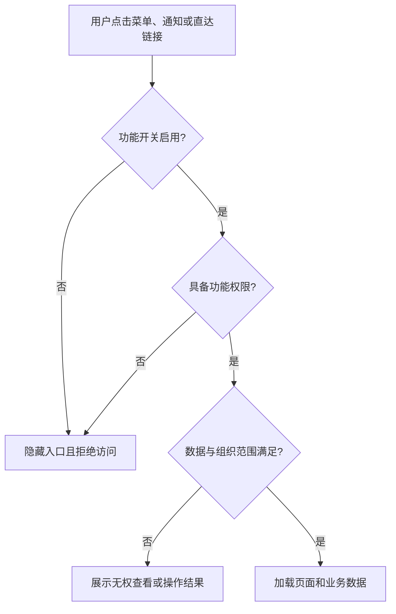
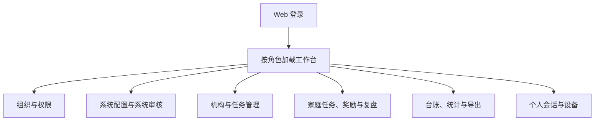
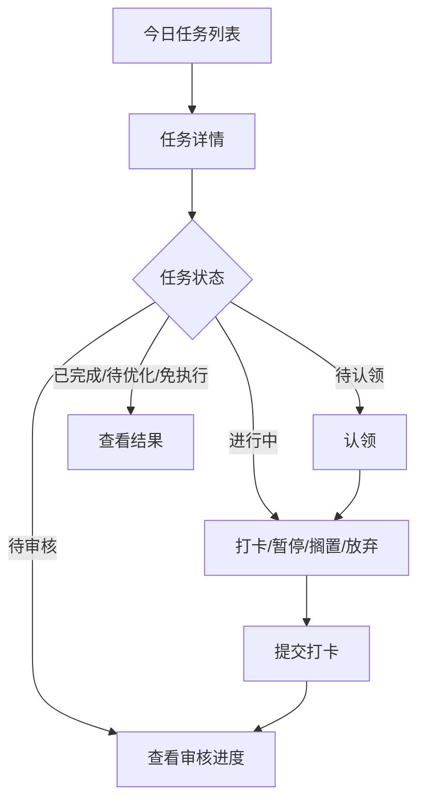

# 灵动学习 Web 与小程序交互说明

**版本**：V1.0（设计基线草案）  
**状态**：待评审  
**业务依据**：[灵动学习-业务需求说明书-V1.0.md](../../灵动学习-业务需求说明书-V1.0.md) 第 5 章  
**关联设计**：[功能详细设计 FSD](01-功能详细设计-FSD-V1.0.md)

## 1. 应用边界

1. `web/` 与 `miniapp/` 是两个独立前端应用，独立构建、发布、路由、状态管理和私密配置；不得通过复制页面或在同一工程中按终端隐藏来替代独立应用。
2. 两端共享后端 API 契约、状态枚举、字典、权限结果和功能开关结果，不共享 UI 页面代码。
3. 高风险批量管理、组织与权限配置、缓存、模板、接口服务、完整审核台账和复杂统计只能以 Web 为完整工作台；小程序提供高频单笔操作和角色相关摘要。
4. 地理围栏、位置授权、轨迹和地图页面在默认关闭状态下不展示。首次个人主体、工具类目小程序构建包不包含这些页面、SDK 调用和权限申请。

## 2. 全局交互状态

### 2.1 进入与访问拦截

| 状态 | 页面行为 |
|---|---|
| 功能关闭 | 菜单、按钮、弹窗和路由入口均不显示；旧链接进入时不给出可操作页面。 |
| 无功能权限 | 不显示未授权入口；直接访问由后端返回权限不足，前端回到可访问页面。 |
| 无数据权限 | 允许进入列表的角色只显示授权范围数据；直接请求越权对象显示无权查看。 |
| 维护只读 | 允许查看历史数据；新增、编辑、提交、审核、导出等写操作不可发起。 |
| 空数据 | 显示与当前角色、筛选条件相匹配的空态，不展示其他组织或家庭的数据。 |
| 加载/失败 | 列表、详情、图表和提交操作分别显示加载或失败反馈；失败不清空用户已填写的表单。 |

### 2.2 统一列表与表单规则

1. Web 列表默认每页 20 条，可切换 10/20/50/100 条，单页最多 100 条；任务和积分默认按创建或发生时间倒序，学生列表按姓名拼音或班级顺序。
2. 筛选条件来自数据字典或当前授权组织树。筛选项变更后只请求当前用户有权查看的数据。
3. 必填项实时校验，提交失败保留输入内容并定位问题字段；禁用字典项只能在历史数据中展示，不可用于新增或编辑。
4. 删除、停用、解绑、驳回、免执行、缓存清理、功能关闭、敏感导出等高风险操作必须二次确认，并展示影响范围。
5. 批量复制、下发、导入和导出显示处理进度；逐条处理的成功和失败结果必须分别反馈，不能以整体成功掩盖失败项。
6. 业务成功、失败、异常和权限不足使用统一、准确、中性的反馈；任务未完成统一使用“待优化”，不使用惩罚性文案。

## 3. Web 端页面与交互

### 3.1 Web 导航结构

导航仅显示同时满足“功能启用、菜单权限、数据范围”的菜单。系统管理员和系统审核员看到系统管理工作台；机构管理员、教师、家长按其角色显示对应业务工作台；学生以小程序为主，不在 Web 提供独立管理入口。

### 3.2 组织与权限页面

| 页面 | 使用角色 | 主要区域 | 核心操作 | 特殊状态 |
|---|---|---|---|---|
| 组织架构管理 | 系统管理员、授权组织管理员 | 左侧组织树、右侧节点详情与子节点列表 | 新增、编辑、启停组织 | 停用节点不提供新业务创建；历史数据入口只读。 |
| 组织类型管理 | 系统管理员 | 类型列表、排序、状态 | 新增、编辑、启停类型 | 停用类型不可用于新节点；已有节点正常展示。 |
| 组织管理员配置 | 系统管理员 | 组织树、管理员列表、授权范围 | 绑定、解绑、查看范围 | 跨区域或扩大范围时转为系统任务。 |
| 用户管理 | 系统管理员 | 用户筛选、账号详情、组织和角色页签 | 创建、启停、关联组织、分配角色 | 停用用户不能登录；敏感信息按权限脱敏。 |
| 角色管理 | 系统管理员 | 内置/自定义角色列表、详情抽屉 | 新增自定义角色、启停 | 内置角色不可删除；自定义角色不能超出可授权边界。 |
| 权限与数据范围 | 系统管理员 | 权限树、用户补充权限、数据范围、组织范围 | 授权、明确禁止、配置范围 | 明确禁止优先；保存前校验不得扩大组织范围。 |

### 3.3 系统配置与系统审核页面

| 页面 | 使用角色 | 关键交互 |
|---|---|---|
| 系统任务列表/详情 | 系统管理员、系统审核员 | 管理员可创建草稿、编辑、提交和查看本人任务；审核员处理待审任务并填写审批意见；不能审核本人任务。 |
| 功能开关管理 | 系统管理员 | 显示开关名称、范围、当前状态、影响范围、历史变更；全局调整创建高风险系统任务，审批生效后更新状态。 |
| 附件规则管理 | 系统管理员 | 维护类型、格式、大小、预览、下载、删除和权限规则；配置变化记录日志。 |
| 缓存管理 | 系统管理员 | 选择缓存类型、模块、刷新/清除；全量和会话缓存清除先显示影响并走审核。 |
| 数据字典管理 | 系统管理员 | 字典类型列表与字典项页签；支持排序、默认项、启停；关键字典变化转系统任务。 |
| 导入导出模板管理 | 系统管理员 | 按模板类型、适用模块、版本、状态筛选；默认模板唯一；历史文件可追溯原版本。 |
| 接口服务管理 | 系统管理员 | 维护方向、用途、调用方、范围、责任人、状态与调用台账；新增/停用/扩大范围走审核。 |

### 3.4 机构、任务和家庭业务页面

| 页面 | 角色 | 内容与操作 | 页面限制 |
|---|---|---|---|
| 学校/机构、班级、教师、学员 | 机构管理员、授权组织管理员 | 维护授权范围内的班级、教师、学生和家长绑定摘要；支持批量导入入口 | 家庭私有任务、奖励、积分配置和复盘不显示。 |
| 机构任务管理 | 机构管理员 | 创建、编辑、下发到学校/班级/指定学生，跟踪进度与审核转交 | 只显示授权机构任务。 |
| 教师任务管理 | 教师、机构管理员 | 教师创建/下发本班任务；查看完成进度；审核教师任务打卡 | 教师只操作授权班级，不能查看家庭私有内容。 |
| 家庭任务列表/详情 | 主家长、副家长 | 主家长创建、编辑、审核，副家长查看；按来源、状态筛选 | 机构与教师没有页面和数据入口。 |
| 任务审核 | 主家长、教师、机构管理员 | 展示打卡内容、附件、当前审核人和历史；通过或驳回 | 驳回必须填写中性意见；审核人失效时只显示系统转交后的有效审核人。 |
| 奖励库与兑换 | 主家长、学生 | 主家长维护奖励、审批和核销；学生申请兑换 | 可用积分不足时申请入口不可用；机构、教师无家庭奖励入口。 |
| 成长复盘 | 主家长、副家长、学生 | 日/周/月复盘、趋势、订阅、PDF 导出 | PDF 开关关闭时不显示导出；只呈现本人或绑定学生。 |
| 异常报备 | 教师 | 填报出勤、学习状态或心态异常 | 仅授权班级；不得展示或录入家庭私有内容。 |

### 3.5 Web 统计与台账

Web 完整提供系统任务审批、权限变更、附件、缓存、字典、模板、接口、任务、积分、奖励、机构任务、考勤和异常报备台账。页面统一包含筛选区、结果列表/图表、详情与导出操作；导出前再次校验数据范围、脱敏规则和敏感导出审批结果。

## 4. 小程序端页面与交互

### 4.1 小程序角色入口

| 角色 | 首页与高频入口 | 不提供的完整管理能力 |
|---|---|---|
| 系统管理员 | 系统任务待办、本人任务结果、公告摘要 | 组织、权限、字典、模板、缓存、接口服务完整配置和全量台账。 |
| 系统审核员 | 系统任务待审、通过/驳回、审批历史摘要 | 复杂筛选、批量审核、全量台账导出。 |
| 机构管理员 | 学员摘要、机构任务查看/下发、考勤摘要、简版统计 | 复杂权限配置、批量模板和全量统计分析。 |
| 教师 | 班级任务、创建任务、学生进度、任务审核、异常报备、班级摘要 | 超出授权班级的数据和系统配置。 |
| 家长 | 学生切换、家庭任务、任务审核、奖励、兑换审批、成长复盘 | 组织与系统管理、其他家庭数据。 |
| 学生 | 今日任务、任务详情、认领、打卡、暂停/搁置、积分、兑换申请、个人中心 | 任何任务配置、审核、奖励配置、组织与账号管理。 |

### 4.2 学生执行闭环

| 页面 | 内容 | 操作与规则 |
|---|---|---|
| 今日任务/全部任务 | 来源标签、状态、难度、积分、时长、筛选 | 只显示本人任务；家庭、机构、教师来源可筛选。 |
| 任务详情 | 任务要求、附件、审核人、执行记录、当前状态 | 依据状态展示认领、打卡、暂停、搁置、放弃等单一有效操作。 |
| 打卡提交 | 文字和统一附件入口 | 无审核人时不允许提交；提交后进入待审核。 |
| 暂停/搁置 | 暂停类型与当前任务信息 | 仅进行中任务可用；单次最长 2 小时，不改变任务基础状态。 |
| 积分与兑换 | 累计、可用积分、积分台账、奖励列表 | 不允许编辑积分；可用积分不足时不能发起兑换。 |
| 个人中心 | 头像、姓名、年级、绑定状态、设备 | 可查看设备并退出当前设备或一键下线；不能编辑学生账号配置。 |

### 4.3 家长、教师和机构高频操作

1. 家长小程序提供创建/编辑家庭任务、审核打卡、学生切换、奖励配置、兑换审批与核销、复盘查看和订阅开关。副家长入口只保留查看和允许接收的消息内容。
2. 教师小程序提供创建/编辑/下发本班任务、查看进度、审核打卡、异常报备和班级摘要。班级切换仅列出授权班级。
3. 机构管理员小程序提供机构任务高频下发、学员与家长绑定摘要、考勤结果摘要和简版数据。批量导入、复杂报表、组织和权限配置跳转或提示至 Web 完成。
4. 小程序的所有页面均须在请求前后处理功能开关、权限和数据范围；不因用户曾访问或保存页面而保留失效入口。

## 5. 通知、直达和历史态

1. 点击站内消息或微信服务通知时，先检查功能、权限、数据范围和对象是否仍存在；通过后进入对应详情，否则展示不可访问结果，不跳转空白首页。
2. 已停用功能的历史数据按业务规则只读展示时，详情页不得出现编辑、提交、审核、位置授权或新建按钮。
3. 审核人转交、任务驳回、兑换处理、绑定邀请、设备下线、系统任务审批等状态变更，消息内容须能定位到业务对象并符合角色可见范围。
4. 维护模式下，按钮以只读状态呈现，禁止发起写请求；维护公告需在开始前 24 小时可见。

## 6. 前端验收要点

1. Web 与小程序独立构建，互不包含对方路由、页面和私密配置。
2. 开关关闭、无权限、无数据权限、维护只读、对象已删除/停用、审核人失效等状态均有一致的入口隐藏与后端拦截结果。
3. 小程序首次发布包中检查不到位置授权、地图、轨迹采集代码和相关页面。
4. 任务、积分、奖励、复盘和统计的状态、字典名称、筛选条件与 FSD、API 和数据库设计一致。
