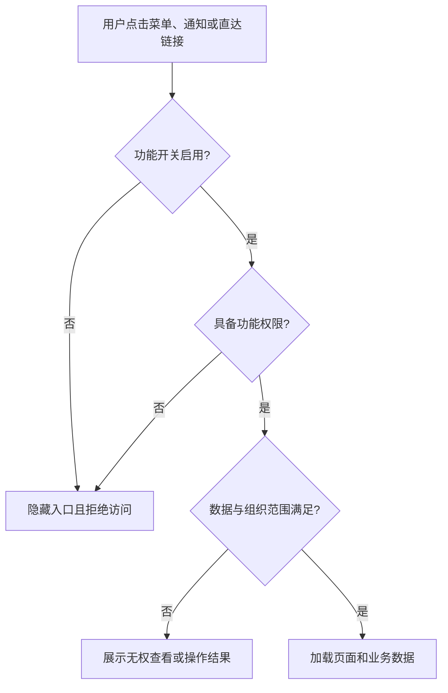
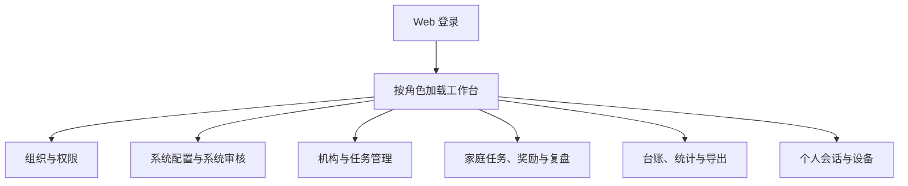
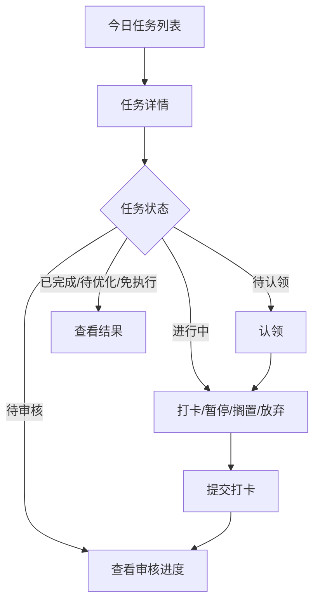

# 灵动伴随 Web 与小程序交互说明

## V63-A 周/月复盘模板补充

Web 周/月报告增加简洁版与详细版分段控件，默认详细版保留原呈现；简洁版只显示身份、周期、版本及核心统计。详细版展示分类、趋势、补录和快照事实摘要；下一步计划仅取已有 NEXT_PLAN 内容，没有则为空，不生成建议。切换不请求接口、不存储偏好、不改变快照；日报及独立 uni-app 日报保持不变。桌面与 390px 布局通过浏览器检查，本项不包含 PDF、订阅或排行。

**版本**：V1.0（设计基线草案）  
**状态**：待评审  
**业务依据**：[灵动伴随-业务需求说明书-V1.0.md](../../灵动伴随-业务需求说明书-V1.0.md) 第 5 章  
**关联设计**：[功能详细设计 FSD](01-功能详细设计-FSD-V1.0.md)

## 1. 应用边界

1. `lingdong-bansui-web/` 与 `lingdong-bansui-miniapp/` 是两个独立前端应用，独立构建、发布、路由、状态管理和私密配置；不得通过复制页面或在同一工程中按终端隐藏来替代独立应用。
2. 两端共享后端 API 契约、状态枚举、字典、权限结果和功能开关结果，不共享 UI 页面代码。
3. 高风险批量管理、组织与权限配置、缓存、模板、接口服务、完整审核台账和复杂统计只能以 Web 为完整工作台；小程序提供高频单笔操作和角色相关摘要。
4. 地理围栏、位置授权、轨迹和地图页面在默认关闭状态下不展示。首次个人主体、工具类目小程序构建包不包含这些页面、SDK 调用和权限申请。

## 2. 全局交互状态

### 2.1 进入与访问拦截

```mermaid
flowchart TD
    A[用户点击菜单、通知或直达链接] --> B{功能开关启用?}
    B -->|否| C[隐藏入口且拒绝访问]
    B -->|是| D{具备功能权限?}
    D -->|否| C
    D -->|是| E{数据与组织范围满足?}
    E -->|否| F[展示无权查看或操作结果]
    E -->|是| G[加载页面和业务数据]
```

| 状态 | 页面行为 |
|---|---|
| 功能关闭 | 菜单、按钮、弹窗和路由入口均不显示；旧链接进入时不给出可操作页面。 |
| 无功能权限 | 不显示未授权入口；直接访问由后端返回权限不足，前端回到可访问页面。 |
| 无数据权限 | 允许进入列表的角色只显示授权范围数据；直接请求越权对象显示无权查看。 |
| 维护只读 | 允许查看历史数据；新增、编辑、提交、审核、导出等写操作不可发起。 |
| 空数据 | 显示与当前角色、筛选条件相匹配的空态，不展示其他组织或家庭的数据。 |
| 加载/失败 | 列表、详情、图表和提交操作分别显示加载或失败反馈；失败不清空用户已填写的表单。 |

### 2.2 统一列表与表单规则

1. Web 列表默认每页 20 条，可切换 10/20/50/100 条，单页最多 100 条；任务和积分默认按创建或发生时间倒序，学生列表按姓名拼音或班级顺序。
2. 筛选条件来自数据字典或当前授权组织树。筛选项变更后只请求当前用户有权查看的数据。
3. 必填项实时校验，提交失败保留输入内容并定位问题字段；禁用字典项只能在历史数据中展示，不可用于新增或编辑。
4. 删除、停用、解绑、驳回、免执行、缓存清理、功能关闭、敏感导出等高风险操作必须二次确认，并展示影响范围。
5. 批量复制、下发、导入和导出显示处理进度；逐条处理的成功和失败结果必须分别反馈，不能以整体成功掩盖失败项。
6. 业务成功、失败、异常和权限不足使用统一、准确、中性的反馈；任务未完成统一使用“待优化”，不使用惩罚性文案。

## 3. Web 端页面与交互

### 3.1 Web 导航结构

```mermaid
flowchart TD
    A[Web 登录] --> B[按角色加载工作台]
    B --> C[组织与权限]
    B --> D[系统配置与系统审核]
    B --> E[机构与任务管理]
    B --> F[家庭任务、奖励与复盘]
    B --> G[台账、统计与导出]
    B --> H[个人会话与设备]
```

导航仅显示同时满足“功能启用、菜单权限、数据范围”的菜单。系统管理员和系统审核员看到系统管理工作台；机构管理员、教师、家长按其角色显示对应业务工作台；学生以小程序为主，不在 Web 提供独立管理入口。

### 3.2 组织与权限页面

| 页面 | 使用角色 | 主要区域 | 核心操作 | 特殊状态 |
|---|---|---|---|---|
| 组织架构管理 | 系统管理员、授权组织管理员 | 左侧组织树、右侧节点详情与子节点列表 | 新增、编辑、启停组织 | 停用节点不提供新业务创建；历史数据入口只读。 |
| 组织类型管理 | 系统管理员 | 类型列表、排序、状态 | 新增、编辑、启停类型 | 停用类型不可用于新节点；已有节点正常展示。 |
| 组织管理员配置 | 系统管理员 | 组织树、管理员列表、授权范围 | 绑定、解绑、查看范围 | 跨区域或扩大范围时转为系统任务。 |
| 用户管理 | 系统管理员 | 用户筛选、账号详情、组织和角色页签 | 创建、启停、关联组织、分配角色 | 停用用户不能登录；敏感信息按权限脱敏。 |
| 角色管理 | 系统管理员 | 内置/自定义角色列表、详情抽屉 | 新增自定义角色、启停 | 内置角色不可删除；自定义角色不能超出可授权边界。 |
| 权限与数据范围 | 系统管理员 | 权限树、用户补充权限、数据范围、组织范围 | 授权、明确禁止、配置范围 | 明确禁止优先；保存前校验不得扩大组织范围。 |

### 3.3 系统配置与系统审核页面

| 页面 | 使用角色 | 关键交互 |
|---|---|---|
| 系统任务列表/详情 | 系统管理员、系统审核员 | 管理员可创建草稿、编辑、提交和查看本人任务；审核员处理待审任务并填写审批意见；不能审核本人任务。 |
| 功能开关管理 | 系统管理员 | 显示开关名称、范围、当前状态、影响范围、历史变更；全局调整创建高风险系统任务，审批生效后更新状态。 |
| 附件规则管理 | 系统管理员 | 维护类型、格式、大小、预览、下载、删除和权限规则；配置变化记录日志。 |
| 缓存管理 | 系统管理员 | 选择缓存类型、模块、刷新/清除；全量和会话缓存清除先显示影响并走审核。 |
| 数据字典管理 | 系统管理员 | 字典类型列表与字典项页签；支持排序、默认项、启停；关键字典变化转系统任务。 |
| 导入导出模板管理 | 系统管理员 | 按模板类型、适用模块、版本、状态筛选；默认模板唯一；历史文件可追溯原版本。 |
| 接口服务管理 | 系统管理员 | 维护方向、用途、调用方、范围、责任人、状态与调用台账；新增/停用/扩大范围走审核。 |

### 3.4 机构、任务和家庭业务页面

| 页面 | 角色 | 内容与操作 | 页面限制 |
|---|---|---|---|
| 学校/机构、班级、教师、学员 | 机构管理员、授权组织管理员 | 维护授权范围内的班级、教师、学生和家长绑定摘要；支持批量导入入口 | 家庭私有任务、奖励、积分配置和复盘不显示。 |
| 机构任务管理 | 机构管理员 | 创建、编辑、下发到学校/班级/指定学生，跟踪进度与审核转交 | 只显示授权机构任务。 |
| 教师任务管理 | 教师、机构管理员 | 教师创建/下发本班任务；查看完成进度；审核教师任务打卡 | 教师只操作授权班级，不能查看家庭私有内容。 |
| 家庭任务列表/详情 | 主家长、副家长 | 主家长创建、编辑、审核，副家长查看；按来源、状态筛选 | 机构与教师没有页面和数据入口。 |
| 任务审核 | 主家长、教师、机构管理员 | 展示打卡内容、附件、当前审核人和历史；通过或驳回 | 驳回必须填写中性意见；审核人失效时只显示系统转交后的有效审核人。 |
| 积分台账 | 主家长 | 选择活动主关系孩子，查看累计/可用积分和来源可追溯台账分页；对服务端判定可纠错的本人家庭奖励填写原因并整笔纠错 | 查询开关关闭时菜单和直达路由隐藏；纠错开关关闭时操作列隐藏；教师、机构管理员、系统管理员和系统审核员无统一账户入口。 |
| 奖励库与兑换 | 主家长、学生 | V27 Web 主家长按孩子维护奖励，在“奖励库/兑换处理”页签完成上下架、审批、驳回和核销；学生在独立小程序页浏览、申请和查看历史 | 功能开关与角色同时满足才显示入口，直达页再次校验；可用积分不足时申请按钮禁用；机构、教师无家庭奖励入口。 |
| 成长复盘 | 主家长、学生 | V28：Web 日/周/月复盘与复杂趋势；小程序本人日报与补录。后续：订阅、PDF、排行 | 两个复盘开关关闭后入口和直达操作均不可用，历史仍按对象权限读取；所有 19 位标识按字符串传输。 |
| 异常报备 | 教师 | 填报出勤、学习状态或心态异常 | 仅授权班级；不得展示或录入家庭私有内容。 |

### 3.5 Web 统计与台账

Web 完整提供系统任务审批、权限变更、附件、缓存、字典、模板、接口、任务、积分、奖励、机构任务、考勤和异常报备台账。页面统一包含筛选区、结果列表/图表、详情与导出操作；导出前再次校验数据范围、脱敏规则和敏感导出审批结果。

## 4. 小程序端页面与交互

### 4.1 小程序角色入口

| 角色 | 首页与高频入口 | 不提供的完整管理能力 |
|---|---|---|
| 系统管理员 | 系统任务待办、本人任务结果、公告摘要 | 组织、权限、字典、模板、缓存、接口服务完整配置和全量台账。 |
| 系统审核员 | 系统任务待审、通过/驳回、审批历史摘要 | 复杂筛选、批量审核、全量台账导出。 |
| 机构管理员 | 学员摘要、机构任务查看/下发、考勤摘要、简版统计 | 复杂权限配置、批量模板和全量统计分析。 |
| 教师 | 班级任务、创建任务、学生进度、任务审核、异常报备、班级摘要 | 超出授权班级的数据和系统配置。 |
| 家长 | 学生切换、家庭任务、任务审核、奖励、兑换审批、成长复盘 | 组织与系统管理、其他家庭数据。 |
| 学生 | 今日任务、任务详情、认领、打卡、暂停/搁置、积分、兑换申请、个人中心 | 任何任务配置、审核、奖励配置、组织与账号管理。 |

### 4.2 学生执行闭环

```mermaid
flowchart TD
    A[今日任务列表] --> B[任务详情]
    B --> C{任务状态}
    C -->|待认领| D[认领]
    C -->|进行中| E[打卡/暂停/搁置/放弃]
    C -->|待审核| F[查看审核进度]
    C -->|已完成/待优化/免执行| G[查看结果]
    D --> E
    E --> H[提交打卡]
    H --> F
```

| 页面 | 内容 | 操作与规则 |
|---|---|---|
| 今日任务/全部任务 | 来源标签、状态、难度、积分、时长、筛选 | 只显示本人任务；家庭、机构、教师来源可筛选。 |
| 任务详情 | 任务要求、附件、审核人、执行记录、当前状态 | 依据状态展示认领、打卡、暂停、搁置、放弃等单一有效操作。 |
| 打卡提交 | 文字和统一附件入口 | 无审核人时不允许提交；提交后进入待审核。 |
| 暂停/搁置 | 暂停类型与当前任务信息 | 仅进行中任务可用；单次最长 2 小时，不改变任务基础状态。 |
| 积分与兑换 | V25 已实现累计、可用积分和积分台账；V26 同步展示反向纠错台账与原因；V27 新增独立“奖励兑换”页、奖励能力内可用积分摘要、奖励申请和兑换历史 | 学生不允许编辑奖励、审批、驳回、核销或发起纠错；页面从学生会话读取本人，不接受学生标识。 |
| 个人中心 | 头像、姓名、年级、绑定状态、设备 | 可查看设备并退出当前设备或一键下线；不能编辑学生账号配置。 |

### 4.3 家长、教师和机构高频操作

1. 家长小程序提供创建/编辑家庭任务、审核打卡、学生切换、奖励配置、兑换审批与核销、复盘查看和订阅开关。副家长入口只保留查看和允许接收的消息内容。
2. 教师小程序提供创建/编辑/下发本班任务、查看进度、审核打卡、异常报备和班级摘要。班级切换仅列出授权班级。
3. 机构管理员小程序提供机构任务高频下发、学员与家长绑定摘要、考勤结果摘要和简版数据。批量导入、复杂报表、组织和权限配置跳转或提示至 Web 完成。
4. 小程序的所有页面均须在请求前后处理功能开关、权限和数据范围；不因用户曾访问或保存页面而保留失效入口。

### 4.4 V25-V26 积分查询与纠错当前交互

1. 学生首页仅在 `growthPointQueryEnabled=true` 时显示“我的积分”；积分页进入时再次检查会话和开关，失效会话返回登录页，停用开关返回学生首页且不请求积分业务接口。
2. 小程序积分页顶部展示本人累计积分和可用积分，明细按发生时间倒序；支持下拉刷新和触底分页，空数据展示“暂无积分变动”。
3. Web 侧栏仅对家长显示“积分台账”；页面先加载活动主关系孩子选项，再并发加载所选孩子账户和明细，切换孩子后重置到第 1 页。
4. Web 表格展示发生时间、变动事项、来源、积分变动、可用变动和审核人；窄屏时表格只在内容区域横向滚动，页面主体不得溢出。
5. V26 仅在 Web 能力摘要启用纠错且台账项 `correctable=true` 时显示“纠错”；弹窗明确整笔扣分、任务回退和原台账保留，原因必填，成功后同时刷新账户和台账。
6. 学生小程序不提供纠错命令，只显示 `CORRECTION` 负积分、可用积分变化和纠错原因；当前小程序只有学生身份认证，不伪造主家长操作入口。

### 4.5 V27 家庭奖励与兑换当前交互

1. Web 仅在 `rewardExchangeEnabled=true` 且当前用户含 `PARENT` 角色时显示“奖励管理”；直达 `/rewards` 不满足条件时返回工作台。页面选择活动主关系孩子后并行加载奖励和兑换记录。
2. Web “奖励库”支持新增、编辑、上下架和逻辑删除，危险操作使用二次确认；“兑换处理”按状态筛选，待审批可同意或填写最多 500 字原因驳回，待核销可确认兑现。
3. 小程序首页仅在开关启用时显示“奖励兑换”；直达页每次显示先复核学生会话和开关，失效会话回登录页，关闭开关回学生首页且不请求奖励业务数据。
4. 小程序顶部展示奖励能力内的可用积分摘要；奖励项展示名称、说明、所需积分和有效期，积分不足时按钮禁用。提交前说明“家长同意后扣除”，成功后切换“我的兑换”并刷新摘要、奖励和历史。
5. 两端前端隐藏只负责体验，后端继续执行功能开关、权限和对象范围强制校验。分页响应每次最多 100 条，两端循环读取时不得丢失后续页。

### 4.6 V28 成长复盘当前交互

1. Web 仅在至少一个复盘开关启用且当前用户含 `PARENT` 角色时显示“成长复盘”；页面按活动主关系孩子、日报/周报/月报联动复盘列表、当前快照、分类、每日趋势和追加补录。
2. Web 日报显示补录按钮；服务端最终校验当天/次日时限。周报、月报只读，不展示补录、PDF、订阅或排行占位操作。
3. 小程序首页仅在 `dailyGrowthReviewEnabled=true` 时显示“成长复盘”；直达页重新检查学生会话和开关，只请求本人日报，不接受学生标识。
4. 小程序按日期切换日报，展示完成率、累计获取、进行中、待优化、暂停次数、分类和补录记录；可以追加成长观察、优势与待提升、下一步计划，不出现孩子切换或家长管理操作。
5. 两端全部复盘、快照、用户和补录雪花标识使用字符串。开关关闭后入口与补录操作隐藏且后端拒绝新写入，历史详情仍按学生本人或活动主家长范围读取。
6. 本地视觉验收已覆盖 Web `1440×900`、`390×844` 和移动补录弹窗；页面无横向溢出，复杂统计只在 Web 内容区展示。

### 4.7 V30 每日固定任务当前交互

1. Web 草稿抽屉使用开关配置“每日固定任务”；启用后可填写结束日，结束日不得早于计划日期；关闭时前端清空结束日，后端再次校验。
2. 已发布活动计划在任务列表显示“运行中”和停止图标。停止前二次确认“后续不再生成，已生成任务不会删除”，成功后刷新为“已停止”。
3. 只有 `ACTIVE` 计划显示停止操作；草稿显示“待发布”，自然到达结束日后显示“已完成”，重复停止不发送无效状态变更。
4. 小程序不提供周期配置和停止入口，只按学生本人权限读取各计划日已经生成的任务实例并执行原有认领、暂停、打卡流程。
5. Web 与小程序仍是独立前端应用；固定任务管理不进入小程序，复杂管理状态也不由小程序推断。

## 5. 通知、直达和历史态

1. 点击站内消息或微信服务通知时，先检查功能、权限、数据范围和对象是否仍存在；通过后进入对应详情，否则展示不可访问结果，不跳转空白首页。
2. 已停用功能的历史数据按业务规则只读展示时，详情页不得出现编辑、提交、审核、位置授权或新建按钮。
3. 审核人转交、任务驳回、兑换处理、绑定邀请、设备下线、系统任务审批等状态变更，消息内容须能定位到业务对象并符合角色可见范围。
4. 维护模式下，按钮以只读状态呈现，禁止发起写请求；维护公告需在开始前 24 小时可见。

## 6. 前端验收要点

1. Web 与小程序独立构建，互不包含对方路由、页面和私密配置。
2. 开关关闭、无权限、无数据权限、维护只读、对象已删除/停用、审核人失效等状态均有一致的入口隐藏与后端拦截结果。
3. 小程序首次发布包中检查不到位置授权、地图、轨迹采集代码和相关页面。
4. 任务、积分、奖励、复盘和统计的状态、字典名称、筛选条件与 FSD、API 和数据库设计一致。

## 7. V31 图片打卡交互

1. 小程序任务详情在打卡区提供图片选择入口，最多 9 张；每张图片固定展示预览、上传进度、失败状态、重试和移除，不因状态文字改变而挤压布局。
2. 上传成功后才允许把文件标识加入打卡请求。提交成功清空文字和图片；提交失败保留当前内容，便于修正后重试。
3. 历史打卡图片通过带登录态的下载请求获取后预览，不使用公开存储地址；无权、会话失效和文件失效分别使用统一错误反馈。
4. Web 审核抽屉展示附件缩略图、文件名和大小，加载失败时保留明确失败状态，不影响审核文字和其他附件展示。
5. Web 与小程序共享后端附件契约，但分别实现请求、状态和页面组件，禁止跨端复用前端运行时状态。

## 8. V32 待优化与顺延交互

1. Web 学习任务页面为家长、教师和机构管理员增加“待优化任务”独立视图，列表只展示其对象/组织范围内的待优化任务和可改期的自动顺延任务。
2. 顺延弹窗固定选择未来 1 至 7 天，提交后刷新列表；越权、状态变化、开关停用和并发冲突使用中性反馈。
3. 小程序任务列表和详情仅显示灰色“隔夜迁移”标签及新计划日期，不展示顺延按钮、日期选择或批处理入口。

## 9. V33 按学生复制昨日任务交互

1. Web 家长任务页仅在公共能力和角色条件同时满足时显示“复制昨日任务”；教师、机构管理员、学生及功能停用状态不显示入口。
2. 弹窗先选择活动主关系学生，再加载服务端计算的昨日候选数量和今日同名标题；无候选时禁用提交，不创建空批次。
3. 存在同名标题时显示明确列表并要求勾选确认；执行后展示成功数、失败数和逐条结果，失败条目提供单条重试并即时刷新汇总。
4. 重复提交展示当日已有批次；处理中断时可恢复未处理条目。小程序 H5 与微信产物均不包含复制入口或管理页面。

## 10. V34 任务模板交互

1. Web 家长任务页仅在学习任务与模板能力同时启用时显示“任务模板”和“保存为个人模板”；教师、机构管理员及能力停用状态不显示入口。
2. 模板库按“系统模板”“个人模板”分组。系统模板只提供选用；个人模板提供选用、新增、编辑、删除、上移和下移，删除须二次确认。
3. 选用模板后只回填标题、难度、时长、分类、标签和备注；来源、组织、计划日期、审核人、周期和任务目标保持新任务默认值或空值。
4. 保存当前配置时先校验标题、难度和时长，再打开个人模板表单；模板名称可修改，保存成功不自动创建或发布学习任务。
5. 重名、超过 100 个、字典失效和版本冲突使用明确中文反馈。小程序 H5 与微信产物均不包含模板入口或管理页面。

## 11. V35 学生扫码登录交互

1. Web 新增“学生登录”独立菜单，仅在 `STUDENT_QR_LOGIN` 开启且当前角色包含主家长或机构管理员时显示；直达路由执行相同判断。
2. 页面按后端对象范围列出学生，操作列使用二维码图标打开弹窗；停用学生不允许签发。
3. 弹窗使用 SVG 二维码，展示剩余秒数，5 分钟到期自动签发新票据，也可手动刷新；关闭后清除原始票据和计时器。
4. uni-app 学生登录页在账号登录与扫码登录均可用时显示分段模式；扫码模式调用 `uni.scanCode`，识别成功后再要求 4 位登录码。
5. 登录码错误、票据过期、撤销或已使用时清空当前扫码内容并要求重新扫码；触发图形验证码时，必须扫描新票据后领取验证码。
6. 功能停用后小程序扫码入口隐藏；账号登录是否可用仍独立由 `STUDENT_CODE_LOGIN` 决定。

## 12. V36 家长登录与首次引导交互

1. Web 登录页在开关启用时默认显示验证码模式并保留密码模式；验证码按钮固定宽度、60 秒倒计时，窄屏改为单列，不展示微信入口。
2. 验证码登录必须勾选当前协议；密码登录后查询服务端家长状态，不在前端推断协议版本或引导完成状态。
3. 协议版本升级时先显示协议接受页面，再进入欢迎、任务模式、产品理念、专注模式四步引导；完成后进入管理首页。
4. uni-app 首页并列提供家长和学生入口；两种身份即使同时存在本地会话，也由用户显式选择进入，不相互覆盖。
5. 家长首页每次显示时复核功能开关、协议和引导状态；停用或会话失效时仅清除家长会话并返回角色入口。

## 13. V37 家长微信小程序交互

1. 微信快捷登录按钮只参与 `mp-weixin` 条件编译；H5 与独立 Web 应用的源码产物和页面均不出现该入口，也不调用 `uni.login`。
2. 已绑定家长授权成功后直接保存独立家长会话，并按服务端协议与引导状态跳转；不得覆盖学生会话。
3. 首次授权进入手机号绑定态，显示手机号、6 位验证码、协议确认和绑定命令；验证码使用 `WECHAT_BIND` 用途，60 秒倒计时与 V36 规则一致。
4. 绑定票据过期、已使用、冲突或功能停用时清空当前绑定态并回到可重试登录页；用户仍可选择手机号验证码或密码登录。
5. 小程序页面不显示完整微信标识、临时凭证、票据内容或内部异常；按钮加载态、错误反馈和窄屏字段尺寸保持稳定。

## 14. V38 家长关系管理交互

1. Web 和 uni-app 仅在 `PARENT_RELATIONSHIP_MANAGEMENT` 启用且当前会话具有家长角色时显示关系管理入口；直达页面重新读取公开能力，停用时拒绝操作。
2. 两端均按关系专用学生接口展示活动关系学生、当前角色、主副家长显示名和脱敏手机号。主家长显示邀请、解除副家长、监护权转移和自行解绑操作；副家长只展示关系信息。
3. 邀请副家长和监护权转移返回 5 分钟到期反馈；已有活动副家长时邀请入口禁用并提示原因。解绑和转移均要求二次确认，提交期间固定按钮尺寸并禁止重复提交。
4. 未登录邀请确认页保留手机号、验证码、协议和接受/拒绝命令；失败后保留可修正表单，成功后只保存当前端的家长会话，不读取、覆盖或清除学生会话。
5. Web 与 uni-app 不共享页面代码、路由或状态；复杂统计继续只在 Web，关系生命周期属于操作功能，两端分别实现。

## 15. V39 账号安全交互

1. Web 在工作台展示当前身份、账号安全事件和设备会话。当前设备使用状态标签，不提供“下线此设备”按钮；其他设备下线及全部下线均二次确认，全部下线后清除 Web 本地会话。
2. 未读新设备事件使用警告提示，普通下线事件保持列表展示；单条已读和全部已读失败时保留页面状态并显示中文错误。
3. uni-app 使用独立账号安全页，入口显式携带 `identity=parent|student`。页面按身份读取对应本地会话并显式向 API 传递对应令牌，不自动选择另一身份。
4. 小程序全部下线时，家长身份只清除家长会话，学生身份只清除学生会话；能力关闭时两类首页隐藏入口，直达页重新读取能力并返回。

## 16. V40 机构管理员小程序交互

1. Web 只同步公开能力契约，不增加机构小程序入口、路由或会话；uni-app 独立增加机构登录页和机构工作台。
2. 小程序首页根据 `organizationMiniappAuthEnabled` 显示机构入口；已有机构会话进入工作台，否则进入专用登录页。功能停用时入口完全隐藏。
3. 机构登录页只包含账号、密码和登录命令；失败保留账号、清空密码并显示中性中文错误，不提供验证码、微信授权、角色或客户端选择。
4. 机构工作台展示当前显示名称、账号和直接管理组织；账号安全通过 `identity=organization` 显式读取机构令牌。全部下线和退出只清除机构会话，不影响家长或学生会话。

## 17. V41 学员机构关系交互

## 18. V42 家长账号生命周期交互

Web 在家长工作台显示独立“家长账号”面板，以分步弹窗完成旧号验证、新号验证和换绑；uni-app 在家长首页按能力开关显示“账号与手机号”，进入独立页面执行相同操作。换绑成功后两端分别清除本端家长会话并返回家长登录，不影响学生或机构会话。存在活动学生关系时注销按钮禁用并提示先解除关系；冷静期中显示截止时间和撤销入口，到期只显示待后续处理。功能停用时入口隐藏，uni-app 直达页面也会重新读取能力摘要并退出。

1. Web 在组织管理页仅向机构管理员且功能启用时展示“学员关系”，使用独立抽屉和分段模式完成校内转班或离校转出。
2. 两种操作均要求选择活动学员并填写原因；校内转班还需选择目标班级，跨校选择由服务端拒绝。转出使用危险操作样式和二次确认，失败保留当前表单。
3. uni-app 机构工作台按公开能力显示学员关系入口，独立页面显式使用机构会话加载学员和班级；直达页面重新校验会话和功能开关。
4. 小程序只承载高频单人操作，不提供批量导入或复杂历史统计；Web 与小程序不共享组件、路由或本地状态。

## 19. V43 家长最终注销交互

V43 不新增用户主动操作页面。冷静期到期后由后端执行最终注销，原 Web 与小程序会话因服务端撤销而失效，客户端按既有认证失败流程清理本地会话并返回登录页。Web 用户管理可筛选并显示“已注销”，但该行不提供启用、停用或锁定按钮；小程序不展示后台终结任务、失败原因或历史身份信息。功能开关停用时后台调度暂停，既有账号生命周期入口继续按 V42 规则隐藏和阻断直达。

## 20. V44 家长换号核验交互

1. Web 仅在当前用户具有机构管理员角色且公开能力启用时，在组织管理页显示“家长换号核验”，使用独立抽屉完成候选选择、新号验证码、核验原因、确认语句和二次提交。
2. uni-app 仅在机构工作台能力启用时显示同名入口，使用独立机构页面和机构会话；直达页面重新校验会话与开关，关闭时退出页面。
3. 两端只显示脱敏旧手机号，明确提示成功后撤销目标家长全部活动会话；失败保留可修正表单，不展示手机号摘要、内部范围或审计标识。
4. Web 与小程序分别实现页面、路由和状态，不共享前端代码；该操作不进入家长自助账号页，也不提供独立家庭候选人。

## 21. V45 学生账号注销交互

1. Web 只在当前用户具有机构管理员角色且 `studentAccountCancellationEnabled` 为真时，在组织管理页显示“学生账号注销”，使用独立危险操作抽屉。
2. 抽屉展示学生姓名、8 位账号和最近停用学校，要求注销原因、固定确认语句及二次确认；无候选时显示空选项，不允许输入任意学生标识。
3. uni-app 在机构工作台使用独立入口和独立页面；页面直达时重新校验机构会话与公开能力，开关关闭则返回机构工作台，无会话则返回首页。
4. 两端提交成功后提示全部登录凭据已失效并离开操作页；冲突或关系恢复时保留可修正信息。Web 与小程序不共享页面代码，只共享 REST 字段契约。

## V46 学生微信交互补充

- Web 不增加学生登录入口，只在家长可访问的“学生登录”管理页显示微信绑定状态和二次确认解绑；机构管理员不能解绑。
- 微信小程序学生登录页按开关显示微信模式，未绑定时依次输入学生账号、登录码和主监护人短信验证码。
- H5 学生登录页通过 uni-app 条件编译隐藏微信授权入口。
- 小程序家长端新增独立“学生微信绑定”页面；功能停用后首页入口隐藏，直接访问页面退回家长首页。
- 微信授权、绑定或快捷登录失败时保留原有账号与扫码登录能力。

## V47 组织节点生命周期交互补充

- 系统管理员在 Web 组织页查看组织类型、组织树和节点详情，可编辑名称与排序、重新启用节点，并提交停用、移动或删除申请；自身停用显示“自身停用”，自身启用但祖先停用显示“上级已停用”。
- 系统审核员进入同一路由时只显示组织变更审核列表，可查看申请快照、原因和执行状态并批准或驳回，不显示新增、编辑、启用或申请入口。
- 机构管理员仍在 Web 组织页使用学生机构关系、教师班级、家长手机号人工恢复和学生注销等既有机构业务，不获得平台组织树维护权限。
- `organizationManagementEnabled` 为假时，系统管理员和系统审核员的菜单及直达路由均不可用；后端继续执行功能开关校验。机构管理员的独立机构业务入口按各自能力开关判断，不与平台组织管理开关混用。
- uni-app 不增加平台组织树维护和系统审核入口；现有机构会话在组织自身或祖先停用后失效，新业务候选和提交接口也不再返回该组织范围。

## V48 班级基础管理交互补充

- Web 仅对机构管理员且 `classManagementEnabled` 为真时显示班级管理区域，提供学校筛选、班级列表、新增、编辑、启用和停用；停用操作明确提示未完成机构/教师任务将失效并要求二次确认。
- Web 继续复用教师班级绑定和学生机构关系抽屉，系统管理员组织树与系统审核员审核界面不显示班级业务面板。
- uni-app 在机构工作台显示独立“班级管理”入口和页面，提供同等高频操作、教师绑定/解绑及学员关系跳转；直达页面重新校验机构会话、角色和功能开关。
- 两端只共享 REST 字段契约，不共享页面、路由或会话状态；复杂统计不进入小程序页面。

## V49 权限授权边界交互补充

- Web“角色与权限”页面保留角色目录、权限目录和新增功能，新增“配置角色权限”“配置用户权限”两个独立弹窗。
- 管理员先选择角色或用户，再查看显式配置列表；选择启用权限并通过“允许/禁止”分段控件保存，撤销前必须二次确认。
- 用户补充允许不展示为数据范围扩权；服务端拒绝无活动角色用户的补充允许，并以统一错误消息反馈。
- 停用权限不进入新增配置选择项，历史显式配置仍可查看和撤销。uni-app 不增加平台 IAM 页面、路由或接口调用。

## 通用组织数据范围交互补充

- Web 和小程序只接收后端已经裁剪的组织、学校、班级、学员和任务候选，不展示或提交服务端根路径。
- 空组织范围使用“暂无可访问数据”状态，不回退到全量查询；本人范围由对应本人、孩子或任务关系页面处理，不显示为组织树授权。
- 角色、用户组织关系或组织管理员授权变化后，下一次请求重新解析范围；前端缓存不能继续展示已越权数据。

## V50 身份权限审计交互补充

- React Web 的“角色与权限”页面新增“权限变更日志”区域，提供事件、对象类型、操作者标识、目标标识和起止时间筛选，以及分页和每页数量切换。
- 查询中显示发生时间、事件中文名称、对象、目标、关联组织、前后值和操作者；空值统一显示短横线，宽表在区域内横向滚动。
- uni-app 不新增该复杂后台查询，避免把 Web 管理能力混入小程序应用。

## 统一访问边界交互验证补充

本专项不新增页面。Web 与小程序继续只展示后端裁剪后的学校和班级；权限或角色失效后的下一请求进入既有无权反馈，功能停用后两端依据公共能力隐藏入口，同时直达接口仍由后端拒绝。

## V51 数据字典交互补充

React Web 新增独立 `/dictionaries` 页面，左侧选择字典类型，右侧展示对应字典项；新增与编辑使用表单弹窗，编辑动作使用带提示的图标按钮。页面支持加载、空态、错误重试、提交中状态、排序、启停和默认项。功能开关开启且 `/api/v1/auth/me` 返回 `DICTIONARY_READ` 时显示菜单并允许进入直达路由；缺少 `DICTIONARY_MANAGE` 时页面保持只读并隐藏全部新增、编辑入口。uni-app 不增加页面、路由或管理 API。

## V52 缓存管理交互补充

React Web 新增独立 `/cache-management` 页面。操作台账页签对 `CACHE_READ` 可见；`CACHE_MANAGE` 控制“执行缓存操作”和“提交高风险操作”，普通操作弹窗当前只列出已有真实处理器的数据字典，避免把未实现领域显示为可成功操作。高风险弹窗只列出全部缓存和用户会话，固定为清除，并要求风险确认。`CACHE_REVIEW` 控制待审核页签及批准、驳回图标按钮，驳回意见必填。功能关闭或缺少查询权限时菜单隐藏且直达路由返回工作台；后端仍独立拦截。宽表在容器内横向滚动，390px 视口不产生页面级横向溢出。uni-app 不新增页面、路由或后台管理 API。

## V53 接口服务管理交互补充

React Web 新增独立 `/interface-services` 页面，包含服务登记、变更记录、变更审核和调用台账四个页签。`INTERFACE_SERVICE_READ` 控制菜单和直达路由，`INTERFACE_SERVICE_MANAGE` 控制登记、启停和授权调整，`INTERFACE_SERVICE_REVIEW` 控制审核页签及批准、驳回图标按钮。页面提供加载、空态、错误重试、提交中和审核反馈；宽表只在容器内横向滚动，桌面和 390px 窄屏均无页面级横向溢出，登记长表单可在弹窗内纵向滚动。uni-app 不新增接口服务后台页面、路由或管理 API。

## V54 附件统一管理交互补充

React Web 新增独立 `/attachment-management` 页面，包含附件规则和文件台账两个页签。附件总开关启用且用户具有规则读取或文件台账读取权限时显示菜单并允许直达；管理权限控制新增、编辑和启停图标按钮。规则弹窗在窄屏改为单列，文件与关系宽表只在容器内部滚动，桌面和 390px 窄屏均无页面级横向溢出。uni-app 不增加后台管理页面；公共能力明确返回附件停用时，任务详情隐藏待上传和历史图片、停止历史内容下载，但保留文字打卡操作。

## V55 导入导出模板管理交互补充

React Web 新增独立 `/import-export-templates` 页面。读取权限与公共能力共同控制菜单和直达路由；管理权限控制“新增模板版本”、启停和设默认，下载对读取权限开放。筛选区包含名称、类型、模块和状态，新增弹窗包含名称、类型、模块、版本、单文件上传和默认开关；冲突时提示数据已变化并刷新。桌面 1280px 和 390px 下页面均无横向溢出，宽表仅在表格内部滚动，弹窗不超出视口。uni-app 不增加模板管理页面、路由、API 或入口，复杂统计和后台配置继续只在 Web 端实现。

## V56 通用导入校验作业交互补充

模板新增弹窗为导入类型显示字段映射区，支持字段增删、上下排序、类型联动、必填、长度和字典配置；导出类型隐藏该区域。历史导入模板的字段抽屉在停用且未被引用时可编辑，启用或已引用时只读，版本冲突后关闭旧编辑态并刷新服务端记录。

React Web 新增独立 `/import-jobs` 页面，包含编码、模板、组织和状态筛选、作业台账、新建校验作业弹窗及详情抽屉。读取权限和三项功能能力共同控制菜单与直达路由，创建权限单独控制上传命令。详情展示模板快照、计数、字段和分页错误，不展示原始单元格值；错误文件使用下载图标和中文提示。1280px 信息密度正常，390px 筛选与弹窗单列，宽表只在自身区域滚动，详情长错误正常换行。uni-app 不增加导入后台页面、路由、API、菜单或权限码。

## V57 通用异步导出作业交互补充

React Web 新增独立 `/export-jobs` 数据导出中心。“我的导出”页签提供数据集和状态筛选、五秒活动作业刷新、行数进度、详情及成功结果下载；积分页面在已有学生上下文中提供导出快捷入口。“新建导出”弹窗根据权限只展示可用数据集，普通积分导出选择学生、时间和列，敏感权限审计额外提示必须审核并可选择事件类型。无读取权限但有审核权限的系统审核员只展示“敏感导出审核”，不请求本人作业接口。

审核页签只展示待当前系统审核员处理的申请，显示脱敏申请人、范围摘要、原因和申请时间，并提供批准、驳回图标按钮；驳回意见必填。功能开关关闭时菜单、积分快捷入口和直达路由全部隐藏，后端仍独立拒绝请求。1280px 页面保持紧凑表格，390px 筛选与创建弹窗单列，宽表只在表格区域滚动，页面无横向溢出。uni-app 不增加导出中心、菜单、路由、API、按钮或权限码。

## V58 机构学员批量导入交互补充

React Web 在 `/import-jobs` 的校验作业详情内增加“学员导入执行”区。满足四开关、执行权限、机构归属和校验通过条件时显示执行按钮，弹窗可选同校启用班级；创建后展示执行编码、终态计数、逐行结果和凭证状态。失败行提供重试命令，凭证可用且有下载权限时显示下载按钮，并在下载前明确提示只能获取一次。功能停用或权限撤回后相关操作全部隐藏，后端仍独立拒绝。uni-app 源码、路由、API 和构建产物不增加 V58 能力。

## V59 教师管理交互补充

React Web 新增独立 `/teachers` 页面，提供账号或姓名、学校、班级、状态筛选和服务端分页。新增、编辑、重置密码、班级范围和状态操作分别按动态权限显示，状态变更使用二次确认；初始班级控件只在具备班级分配权限时出现。具备批量权限且至少具备一种基础操作权限时才显示行选择和批量入口，弹窗只列出当前可执行的状态或班级操作，部分失败以成功数、失败数和中性说明反馈。宽表只在内容区横向滚动，窄屏表单单列。

uni-app 在机构工作台增加独立教师管理页，进入时重新校验机构会话、机构小程序认证能力、教师管理开关和查询权限。页面支持搜索、加载更多、新增、资料、密码、状态和单项班级维护；无班级权限时不显示初始班级或班级按钮。小程序没有复选框、批量入口、批量 API 或复杂统计。两端入口隐藏不能替代后端权限与范围校验。

## V60 机构与教师任务交互补充

React Web 在既有学习任务页面为具备进度权限的机构管理员和教师增加进度图标。仅已发布任务显示入口，弹窗展示学生、脱敏账号、班级、状态和计划日期；表格在窄屏自身横向滚动，不扩展复杂统计图表。

uni-app 增加独立教师工作台和机构或教师任务页。登录后由服务端工作台上下文识别机构管理员或教师，教师页展示有效班级；任务页根据身份加载组织或班级目标，支持草稿新增、编辑、单项下发、学生进度以及本人待审核通过或驳回。入口、命令和直达页均同时校验公开能力与实时权限。小程序不提供批量下发、复杂统计、定位、地图或轨迹能力。

## V62 人工考勤交互补充

Web 独立路由 `/attendance-records` 提供班级、姓名、状态、日期筛选、分页台账、点名抽屉及历史详情。宽表在自身容器滚动，1280px 和 390px 验证无整页横向溢出；不展示内部版本号为业务文案。载入名单不默认勾选、不默认正常；仅选中行提交，时间控件精确到分钟，更正携带原版本。

uni-app 独立 `pages/attendance/attendance` 按 teacher、organization、parent、student 身份读取对应会话，四种首页均按能力及权限展示入口。教师与机构身份可切换台账和班级点名；家长、学生无写入口。页面包含加载、空态、重试、分页、详情历史与冲突反馈；切换班级或日期清空旧名单，离页清理数据，恢复与提交前重查能力和权限，关闭后返回对应首页。不新增复杂报表、导出或位置能力。

## V61 学生异常报备交互补充

React Web 新增独立 `/exception-reports` 页面。读取权限与公开能力共同控制菜单和直达路由；教师创建权限控制“新增报备”，机构管理员处理权限控制待处理记录的处理说明和确认按钮。页面提供班级、异常类型、状态组合筛选、服务端分页、加载错误重试、空台账、详情及永久动作历史，宽表只在自身区域横向滚动。

uni-app 增加独立异常报备页，教师身份展示班级、学生、类型、事实描述和提交命令，机构管理员身份展示范围内台账和单项处理命令。两种身份共享详情历史但不共享 Web 页面代码；入口和直达页均重新校验公开能力及实时权限，无会话、功能停用或权限撤回时重启到小程序首页。小程序不增加批量处理、复杂统计、导出、定位、地图或轨迹调用。
