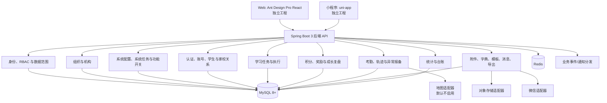
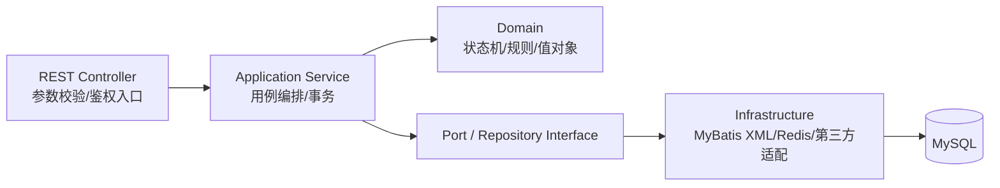
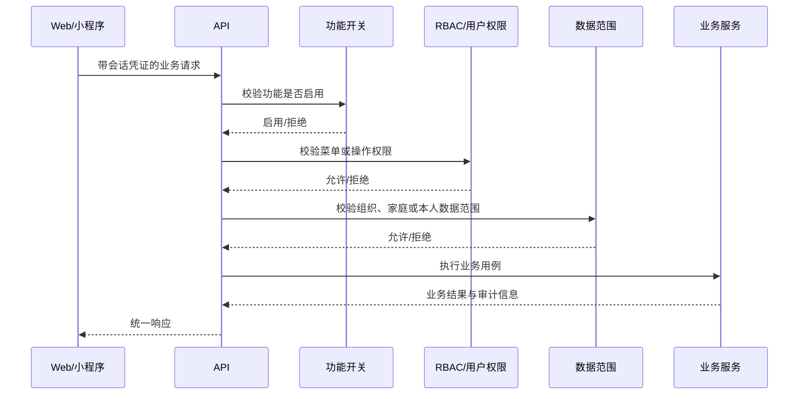

# 灵动学习系统架构设计（HLD）

**版本**：V1.0（设计基线草案）  
**状态**：待评审  
**业务依据**：[灵动学习-业务需求说明书-V1.0.md](../../灵动学习-业务需求说明书-V1.0.md) 第 6 章  
**关联设计**：[FSD](01-功能详细设计-FSD-V1.0.md)、[API](06-API接口设计-V1.0.md)、[安全设计](07-权限与安全设计-V1.0.md)

## 1. 架构目标与约束

1. 在单一业务系统内保持模块边界清晰、事务一致和可测试性，不预设微服务拆分；当前采用模块化单体后端。
2. Web 与小程序是独立应用，使用同一版本化后端 API 契约，不能共享前端工程或私密配置。
3. 后端使用 Spring Boot 3+、JDK 17+、Maven 3.9+并兼容 Maven 4、MyBatis XML、MySQL 8+、Redis、Flyway；后续数据库切换须通过方言适配和回归验证，不将 MySQL 私有语法散落进业务层。
4. 所有变更通过 Flyway 发布；不以手工改库、直接修改生产配置或临时 SQL 作为常规变更方式。
5. 未成年人定位与轨迹默认禁用，首次个人主体小程序构建包不包含位置和地图能力；架构上必须同时保证构建期排除和运行期拦截。

## 2. 总体架构

## 3. 应用模块边界

| 模块 | 职责 | 不承担的职责 |
|---|---|---|
| `iam` | 用户、角色、权限目录、角色授权、用户补充允许/禁止、权限结果 | 不直接维护家庭或机构业务数据。 |
| `organization` | 组织类型、区域/学校/班级树、树路径、组织状态 | 不直接定义教师、家长、学生业务关系。 |
| `datascope` | 组织数据范围计算、组织管理员范围、自定义范围 | 不替代业务对象的“本人/亲子关系”数据规则。 |
| `audit` | 系统管理员发起的高风险系统任务和系统审核员审批 | 不处理任务打卡、积分、兑换、考勤等普通业务审核。 |
| `feature` | 功能开关查询、变更申请、审批后生效、后端拦截 | 不存放业务历史数据和独立权限逻辑。 |
| `configuration` | 附件规则、缓存、字典、模板、接口服务、配置变更记录 | 不让业务模块自建同类配置。 |
| `account` / `student` | 登录、会话、设备、学生账号、亲子/家校关系 | 不处理任务、积分或机构统计。 |
| `task` | 三类任务、下发、认领、打卡、审核、转交、顺延、免执行 | 不直接修改积分余额，使用积分模块的领域服务。 |
| `points` / `growth` | 积分账户、台账、纠错、奖励、兑换、复盘、订阅、排行 | 不变更原任务状态。 |
| `institution` / `attendance` | 学校业务、班级教师学生关系、异常报备、围栏、考勤、轨迹 | 不读取家庭私有任务和奖励明细。 |
| `notification` | 站内消息、微信服务通知、夜间抑制、跳转与归档 | 不改变业务对象状态。 |
| `reporting` | 看板、台账、导出任务、脱敏导出 | 不提供绕过权限的数据读取。 |
| `integration` | 微信、地图、对象存储、对外接口适配器 | 不向业务层暴露供应商 SDK 类型。 |

模块间应以应用服务和稳定的命令/查询模型协作。禁止跨模块直接修改对方表；需要跨模块联动时，通过领域事件、事务后事件或受控应用服务完成。

## 4. 后端分层与代码约束

1. Controller 只处理 HTTP 协议、参数校验、身份上下文和响应封装，不编写业务状态机。
2. Application Service 是用例和事务边界；一个公共方法应对应一个明确业务动作，例如“提交系统任务”或“审核任务打卡”。
3. Domain 层保存状态流转、权限前提、金额/积分不变量和校验规则；禁止依赖 Web、数据库或第三方 SDK。
4. 持久层使用 MyBatis 接口和 XML；SQL 集中在模块的 `infrastructure/persistence` 中，禁止业务服务中拼接 SQL。
5. DTO、命令、查询对象不得直接作为数据库实体复用；避免外部 API 字段变更穿透到领域模型。
6. 每个模块单独放置单元测试和集成测试；跨模块流程额外建立用例级集成测试。

## 5. 认证、授权与请求链

认证凭证的具体算法和刷新策略由 API 与安全设计定义。无论页面是否隐藏，服务端都必须完成上述检查；功能开关应当在业务数据读取与写入之前执行。

## 6. 数据、缓存和事件

### 6.1 数据存储

1. MySQL 保存关系数据、业务状态、操作日志索引、系统任务、台账和配置元数据。
2. 文件内容不放入业务表；附件表只保存归属、文件元数据、访问控制信息和对象存储标识。
3. 所有业务表使用一致的主键、创建/更新时间、状态和必要的创建人/更新人字段；审计字段的具体定义见数据库设计。
4. 数据库切换时，通用表设计、SQL 写法和分页应先验证目标方言。当前不得将非 MySQL 目标数据库的假设写入核心业务逻辑。

### 6.2 Redis 缓存

| 缓存域 | 缓存内容 | 失效触发 |
|---|---|---|
| 权限 | 用户角色、权限结果、数据范围摘要 | 用户、角色、权限、组织管理员、组织关联变化后失效。 |
| 字典 | 启用字典类型和字典项 | 字典启停、排序、默认项、关键字典审批生效后失效。 |
| 组织 | 组织树与节点路径 | 组织、组织类型、组织状态变化后失效。 |
| 功能开关 | 全局及组织范围开关结果 | 功能开关审批生效后失效。 |
| 会话 | 登录会话、设备下线标记、登录失败计数 | 登录、退出、锁定、重置、一键下线时更新。 |
| 统计 | 允许缓存的摘要指标 | 源数据变更或报表刷新任务完成后失效。 |

缓存采用“数据库为事实源、缓存为加速层”的原则。缓存清除或刷新失败不能改变业务事实，应记录失败并提示操作人；全量或会话缓存清除必须通过系统任务。

### 6.3 定时任务与消息分发

1. 定时用例包括每日 21:00 复盘初稿、周一周报、每月 1 日月报、审核超时处理、兑换自动驳回、轨迹到期清除、日志冷归档和夜间抑制判断。
2. 为避免业务事务提交前发送消息，任务完成、审核转交、兑换处理和系统任务生效后应写入可追溯的业务事件/待发送记录，再由分发器发送站内消息或微信服务通知。
3. 定时任务多实例运行时必须有单次执行保护；具体调度/锁实现可选 Redis 锁或数据库锁，但必须可监控和可重试。
4. 不能因为消息发送失败而回滚已成功完成的核心业务；失败的通知应有重试和可查询的处理状态。

## 7. 文件、导入导出和第三方适配

1. 附件、导入模板和导出文件通过统一文件服务访问对象存储；接口层只使用内部文件标识，不向客户端泄露供应商密钥、桶权限或永久直链。
2. 导入采用“上传 -> 模板校验 -> 逐行校验 -> 处理结果台账”的异步或受控流程；每条数据独立成功/失败并可追溯。
3. 导出采用“创建导出任务 -> 审核/权限校验 -> 生成文件 -> 通知下载”的流程。敏感导出先完成系统任务审批。
4. 微信、地图、对象存储和对外服务均通过模块内适配器接入；业务服务只依赖稳定的内部接口。第三方凭证只存在于环境密钥或本地忽略配置中，不能进入源码、迁移脚本、API 响应或前端包。

## 8. 运行形态

| 部署单元 | 内容 | 说明 |
|---|---|---|
| 后端服务 | Spring Boot 可执行服务 | 对外提供版本化 HTTPS API、后台任务和管理接口。 |
| MySQL | 关系数据库 | Flyway 管理结构和基础数据版本。 |
| Redis | 缓存与分布式协调 | 不作为唯一业务事实存储。 |
| 对象存储 | 附件、模板、导出文件 | 供应商待确认，通过适配器接入。 |
| Web 静态站点 | Ant Design Pro React 构建产物 | 与小程序独立发布。 |
| 小程序构建产物 | uni-app 生成的小程序包 | 首发构建不打入位置与地图能力。 |

生产拓扑、域名、证书、容器/虚拟机、数据库高可用、备份目标等尚未由业务侧确认，详见部署运维方案中的待确认项；这些不影响模块设计，但影响最终上线方案。

## 9. 可观测性与故障处理

1. 每个 API 请求生成并返回可追溯请求标识；操作日志记录操作人、角色、模块、操作类型、请求接口、IP、时间、结果与备注。
2. 关键业务事件、Flyway 迁移、缓存操作、第三方调用、导入导出、系统任务审批和定位相关拒绝请求必须可检索。
3. 健康检查只暴露必要状态，不输出密钥、数据库账号、个人信息或第三方响应体。
4. 配置、第三方、缓存或消息异常时，接口返回统一错误结果；业务数据不得因记录日志或发送通知失败被无声丢弃。

## 10. 当前实现与 HLD 的一致性边界

当前 `server/` 已实现组织、RBAC、部分数据范围、系统任务、功能开关和用户权限的基础模块，并使用 Flyway `V1` 至 `V9`。认证、学生关系、字典、附件、模板、接口服务、任务、积分、统计、消息和前端应用尚未实现。

后续编码必须以本 HLD 和对应详细设计为准；已有实现需要在每个模块进入下一阶段前按照 API、数据库和安全设计补齐审计、统一错误、鉴权接入和真实外部配置。
