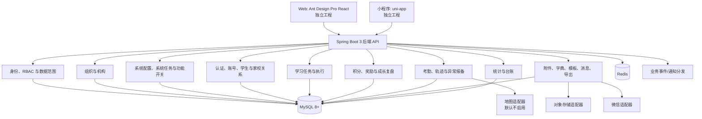
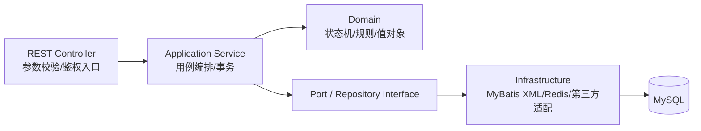
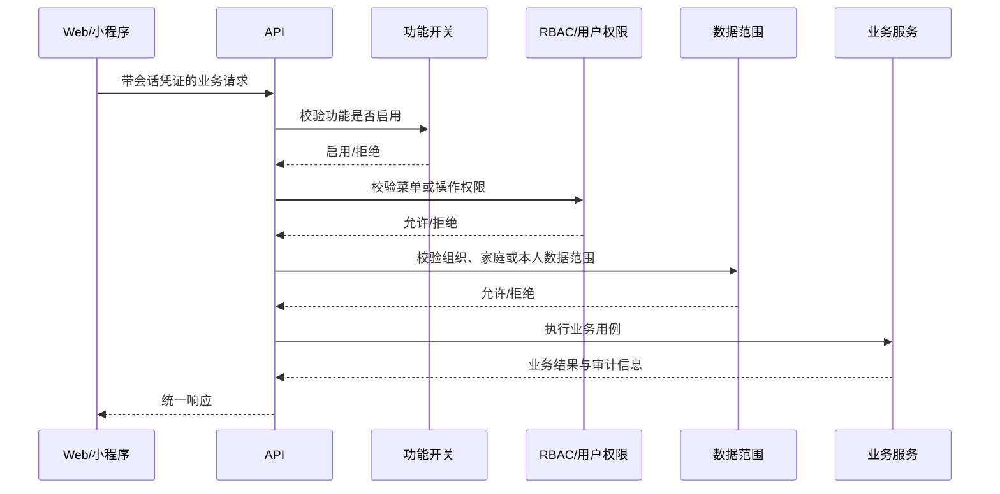

# 灵动伴随系统架构设计（HLD）

## V63 历史查询下载接入（当前增量）

`GrowthReviewExportHistoryService` 复用作业查询、专用历史授权及统一附件内容服务。SQL 在分页前限定原申请人、学生和 PDF 类型；下载关联查询同时限定作业、文件、模块、分类、上传人、有效状态与可见范围。新导出依赖关闭不影响合法历史读取，附件服务关闭仍拦截。详情只返回公开作业字段，不加载报告全文。前端专用请求层已补齐，页面操作尚待接入；下文较早增量的历史接口待办由本段更新。

## V63-B PDF 渲染基础

`growthpoint.infrastructure.pdf.GrowthReviewPdfRenderer` 是无状态的离线组件，输入已完成对象授权的复盘详情及模板，输出 PDF 字节和标准文件名；不提供独立 HTTP 接口，不查询数据库，不写附件存储。后续调用方必须复用导出作业及统一附件并重新核验对象权限，不能把渲染成功等同于下载授权。

依赖 PDFBox 3.0.8（[官方发布](https://pdfbox.apache.org/download)），中文字体随应用保留原始 OFL 许可并按使用字形嵌入 PDF。A4 固定边距、码点级换行、自动分页及页码，输入文本不解释 HTML 或远程资源；不支持的字符明确失败。单份 20 万字符/500 页为渲染资源保护上限，不是扩大业务补录长度。空数据、区间选择和异步失败状态在完整 PDF 作业接入中继续核验。

**版本**：V1.0（设计基线草案）  
**状态**：待评审  
**业务依据**：[灵动伴随-业务需求说明书-V1.0.md](../../灵动伴随-业务需求说明书-V1.0.md) 第 6 章  
**关联设计**：[FSD](01-功能详细设计-FSD-V1.0.md)、[API](06-API接口设计-V1.0.md)、[安全设计](07-权限与安全设计-V1.0.md)

## 1. 架构目标与约束

1. 在单一业务系统内保持模块边界清晰、事务一致和可测试性，不预设微服务拆分；当前采用模块化单体后端。
2. Web 与小程序是独立应用，使用同一版本化后端 API 契约，不能共享前端工程或私密配置。
3. 后端使用 Spring Boot 3+、JDK 17+、Maven 3.9+并兼容 Maven 4、MyBatis XML、MySQL 8+、Redis、Flyway；后续数据库切换须通过方言适配和回归验证，不将 MySQL 私有语法散落进业务层。
4. 所有变更通过 Flyway 发布；不以手工改库、直接修改生产配置或临时 SQL 作为常规变更方式。
5. 未成年人定位与轨迹默认禁用，首次个人主体小程序构建包不包含位置和地图能力；架构上必须同时保证构建期排除和运行期拦截。

## 2. 总体架构

```mermaid
flowchart TB
    WEB[Web: Ant Design Pro React\n独立工程] --> API[Spring Boot 3 后端 API]
    MINI[小程序: uni-app\n独立工程] --> API

    API --> IAM[身份、RBAC 与数据范围]
    API --> ORG[组织与机构]
    API --> SYS[系统配置、系统任务与功能开关]
    API --> ACC[认证、账号、学生与家校关系]
    API --> TASK[学习任务与执行]
    API --> POINT[积分、奖励与成长复盘]
    API --> ATT[考勤、轨迹与异常报备]
    API --> COM[附件、字典、模板、消息、导出]
    API --> RPT[统计与台账]

    IAM --> MYSQL[(MySQL 8+)]
    ORG --> MYSQL
    SYS --> MYSQL
    ACC --> MYSQL
    TASK --> MYSQL
    POINT --> MYSQL
    ATT --> MYSQL
    COM --> MYSQL
    RPT --> MYSQL

    API --> REDIS[(Redis)]
    COM --> FILE[对象存储适配器]
    COM --> WX[微信适配器]
    ATT --> MAP[地图适配器\n默认不启用]
    API --> OUTBOX[业务事件/通知分发]
```

## 3. 应用模块边界

| 模块 | 职责 | 不承担的职责 |
|---|---|---|
| `iam` | 用户、角色、权限目录、角色授权、用户补充允许/禁止、权限结果 | 不直接维护家庭或机构业务数据。 |
| `organization` | 组织类型、区域/学校/班级树、树路径、组织状态 | 不直接定义教师、家长、学生业务关系。 |
| `datascope` | 组织数据范围计算、组织管理员范围、自定义范围 | 不替代业务对象的“本人/亲子关系”数据规则。 |
| `audit` | 系统管理员发起的高风险系统任务和系统审核员审批 | 不处理任务打卡、积分、兑换、考勤等普通业务审核。 |
| `feature` | 功能开关查询、变更申请、审批后生效、后端拦截 | 不存放业务历史数据和独立权限逻辑。 |
| `configuration` | 附件规则、缓存、字典、模板、接口服务、配置变更记录 | 不让业务模块自建同类配置。 |
| `auth` / `account` / `student` | 平台账号密码认证、会话与设备管理；V19 学生档案、主家长关系、学生机构直接关系及范围查询 | 不处理学生登录、任务、积分或机构统计。 |
| `learningtask` | 三类任务、下发、认领、打卡、业务审核、转交和免执行；V24 审核通过事务编排 | 不接受客户端积分值；积分余额和台账持久化由 `growthpoint` 模块承担。 |
| `growthpoint` | V24 学生唯一积分账户和不可变台账；V25 本人/主家长安全查询；V26 主家长纠错；V27 家庭奖励、兑换快照、审批扣可用积分、核销和超时/到期调度 | 纠错仅受控回退任务；兑换只追加不可变台账。复盘、订阅、衰减、休眠清零和排行尚未实现。 |
| `institution` / `attendance` | 学校业务、班级教师学生关系、异常报备、围栏、考勤、轨迹 | 不读取家庭私有任务和奖励明细。 |
| `notification` | 站内消息、微信服务通知、夜间抑制、跳转与归档 | 不改变业务对象状态。 |
| `reporting` | 看板、台账、导出任务、脱敏导出 | 不提供绕过权限的数据读取。 |
| `integration` | 微信、地图、对象存储、对外接口适配器 | 不向业务层暴露供应商 SDK 类型。 |

模块间应以应用服务和稳定的命令/查询模型协作。禁止跨模块直接修改对方表；需要跨模块联动时，通过领域事件、事务后事件或受控应用服务完成。

## 4. 后端分层与代码约束

```mermaid
flowchart LR
    CTRL[REST Controller\n参数校验/鉴权入口] --> APP[Application Service\n用例编排/事务]
    APP --> DOMAIN[Domain\n状态机/规则/值对象]
    APP --> PORT[Port / Repository Interface]
    PORT --> INFRA[Infrastructure\nMyBatis XML/Redis/第三方适配]
    INFRA --> DB[(MySQL)]
```

1. Controller 只处理 HTTP 协议、参数校验、身份上下文和响应封装，不编写业务状态机。
2. Application Service 是用例和事务边界；一个公共方法应对应一个明确业务动作，例如“提交系统任务”或“审核任务打卡”。
3. Domain 层保存状态流转、权限前提、金额/积分不变量和校验规则；禁止依赖 Web、数据库或第三方 SDK。
4. 持久层使用 MyBatis 接口和 XML；SQL 集中在模块的 `infrastructure/persistence` 中，禁止业务服务中拼接 SQL。
5. DTO、命令、查询对象不得直接作为数据库实体复用；避免外部 API 字段变更穿透到领域模型。
6. 每个模块单独放置单元测试和集成测试；跨模块流程额外建立用例级集成测试。

## 5. 认证、授权与请求链

```mermaid
sequenceDiagram
    participant C as Web/小程序
    participant A as API
    participant F as 功能开关
    participant P as RBAC/用户权限
    participant D as 数据范围
    participant B as 业务服务

    C->>A: 带会话凭证的业务请求
    A->>F: 校验功能是否启用
    F-->>A: 启用/拒绝
    A->>P: 校验菜单或操作权限
    P-->>A: 允许/拒绝
    A->>D: 校验组织、家庭或本人数据范围
    D-->>A: 允许/拒绝
    A->>B: 执行业务用例
    B-->>A: 业务结果与审计信息
    A-->>C: 统一响应
```

当前认证链同时支持 `UserType.PLATFORM` 的 `WEB` 会话和 `UserType.STUDENT` 的 `MINIAPP` 会话。Spring Security 的 Bearer 过滤器将访问凭证作 SHA-256 摘要后查询 `auth_device_session`，验证会话为 `ACTIVE`、访问凭证未过期、所属用户启用且客户端类型与用户类型匹配，随后建立包含用户、会话、客户端类型和角色代码的身份上下文。健康检查、平台密码登录/刷新、学生登录、学生图形验证码和小程序能力摘要为明确列出的公开端点；其余 `/api/v1/**` 默认要求已认证。

会话数据库是当前事实源。访问凭证默认有效 30 分钟，刷新凭证默认有效 7 天，刷新时轮换两类凭证；访问凭证过期只拒绝该凭证，不提前使仍未过期的刷新凭证失效。退出当前设备、指定设备下线、一键下线及学生登录码重置通过更新会话状态立即撤销凭证。V21 已实现学生 8 位账号、4 位登录码、图形验证码、按账号设备/来源限流和 15 分钟锁定；V35 已实现学生一次性二维码票据并复用同一登录码风控。生产使用 Redis 保存短期验证码与频控状态，Redis 异常时失败关闭。短信、微信和 Redis 会话缓存尚未实现。

无论页面是否隐藏，服务端都必须完成上述检查；功能开关应当在业务数据读取与写入之前执行。

V19-V21、V35、V38、V41 的学生接口在动态 RBAC 通过后，由 `student` 与 `auth` 应用服务执行对象范围校验：系统管理员可读取全量学生；家长只可读取其活动亲子关系学生，写操作进一步要求活动主关系；机构管理员只可读取与其管理组织存在活动关系的学生。新建学生在同一事务内创建独立学生用户、`STUDENT` 角色、年度顺序账号和登录码；历史学生由主家长或直接机构管理员显式初始化，重置登录码会撤销旧会话。机构家长邀请、学生账号/扫码登录、家长微信、主副家长和学生机构关系生命周期已经实现；学生微信、换号和注销仍未实现。

## 6. 数据、缓存和事件

### 6.1 数据存储

1. MySQL 保存关系数据、业务状态、操作日志索引、系统任务、台账和配置元数据。
2. 文件内容不放入业务表；附件表只保存归属、文件元数据、访问控制信息和对象存储标识。
3. 所有当前和未来业务表、关联表使用应用层生成的 19 位雪花 `BIGINT id` 主键；不得使用自增、联合主键或外键字段充当主键。关联业务键以唯一约束保留，审计字段的具体定义见数据库设计。
4. 数据库切换时，通用表设计、SQL 写法和分页应先验证目标方言。当前不得将非 MySQL 目标数据库的假设写入核心业务逻辑。

### 6.2 Redis 缓存

| 缓存域 | 缓存内容 | 失效触发 |
|---|---|---|
| 权限 | 用户角色、权限结果、数据范围摘要 | 用户、角色、权限、组织管理员、组织关联变化后失效。 |
| 字典 | 启用字典类型和字典项 | 字典启停、排序、默认项、关键字典审批生效后失效。 |
| 组织 | 组织树与节点路径 | 组织、组织类型、组织状态变化后失效。 |
| 功能开关 | 全局及组织范围开关结果 | 功能开关审批生效后失效。 |
| 会话 | 数据库存储的登录会话、设备下线标记；后续可增加 Redis 加速 | 登录、刷新、退出、指定设备下线和一键下线时更新。 |
| 统计 | 允许缓存的摘要指标 | 源数据变更或报表刷新任务完成后失效。 |

缓存采用“数据库为事实源、缓存为加速层”的原则。缓存清除或刷新失败不能改变业务事实，应记录失败并提示操作人；全量或会话缓存清除必须通过系统任务。

当前实现已将字典缓存接入 Redis Spring Cache，并通过 V11 缓存操作台账提供字典缓存刷新/清除、全量缓存清除审批和失败留痕。V15 已提供数据库事实源的可撤销设备会话，但未接入 Redis 会话缓存处理器。全量清除仅处理 `CacheManager` 已注册缓存；权限、组织、功能开关、会话和统计缓存尚未接入对应处理器，请求这些域会记录失败而不伪造成功。

### 6.3 定时任务与消息分发

1. 定时用例包括每日 21:00 复盘初稿、周一周报、每月 1 日月报、审核超时处理、兑换自动驳回、轨迹到期清除、日志冷归档和夜间抑制判断。
2. 为避免业务事务提交前发送消息，任务完成、审核转交、兑换处理和系统任务生效后应写入可追溯的业务事件/待发送记录，再由分发器发送站内消息或微信服务通知。
3. 定时任务多实例运行时必须有单次执行保护；具体调度/锁实现可选 Redis 锁或数据库锁，但必须可监控和可重试。
4. 不能因为消息发送失败而回滚已成功完成的核心业务；失败的通知应有重试和可查询的处理状态。

## 7. 文件、导入导出和第三方适配

1. 附件、导入模板和导出文件通过统一文件服务访问对象存储；接口层只使用内部文件标识，不向客户端泄露供应商密钥、桶权限或永久直链。
2. 导入采用“上传 -> 模板校验 -> 逐行校验 -> 处理结果台账”的异步或受控流程；每条数据独立成功/失败并可追溯。
3. 导出采用“创建导出任务 -> 审核/权限校验 -> 生成文件 -> 通知下载”的流程。敏感导出先完成系统任务审批。
4. 微信、地图、对象存储和对外服务均通过模块内适配器接入；业务服务只依赖稳定的内部接口。第三方凭证只存在于环境密钥或本地忽略配置中，不能进入源码、迁移脚本、API 响应或前端包。

## 8. 运行形态

| 部署单元 | 内容 | 说明 |
|---|---|---|
| 后端服务 | Spring Boot 可执行服务 | 对外提供版本化 HTTPS API、后台任务和管理接口。 |
| MySQL | 关系数据库 | Flyway 管理结构和基础数据版本。 |
| Redis | 缓存与分布式协调 | 不作为唯一业务事实存储。 |
| 对象存储 | 附件、模板、导出文件 | 供应商待确认，通过适配器接入。 |
| Web 静态站点 | Ant Design Pro React 构建产物 | 与小程序独立发布。 |
| 小程序构建产物 | uni-app 生成的小程序包 | 首发构建不打入位置与地图能力。 |

生产拓扑、域名、证书、容器/虚拟机、数据库高可用、备份目标等尚未由业务侧确认，详见部署运维方案中的待确认项；这些不影响模块设计，但影响最终上线方案。

## 9. 可观测性与故障处理

1. 每个 API 请求生成并返回可追溯请求标识；操作日志记录操作人、角色、模块、操作类型、请求接口、IP、时间、结果与备注。
2. 关键业务事件、Flyway 迁移、缓存操作、第三方调用、导入导出、系统任务审批和定位相关拒绝请求必须可检索。
3. 健康检查只暴露必要状态，不输出密钥、数据库账号、个人信息或第三方响应体。
4. 配置、第三方、缓存或消息异常时，接口返回统一错误结果；业务数据不得因记录日志或发送通知失败被无声丢弃。

## 10. 当前实现与 HLD 的一致性边界

当前 `lingdong-bansui-server/` 使用 Flyway `V1` 至 `V38`。`learningtask` 模块除任务定义、目标、标签、发布后实例和教师班级关系外，已增加任务事件、暂停、打卡、审核转交、每日固定计划、打卡附件关联、待优化扫描、任务顺延、昨日任务复制批次、系统/家长个人任务模板，以及主家长关系变更时的家庭待审核任务转交；`auth` 模块增加学生二维码短时票据、家长手机号认证、家长微信绑定票据与持久绑定；`student` 模块增加主副家长邀请、解绑、晋升、转移和审计；`growthpoint` 模块保存学生唯一积分账户、不可变积分台账、家庭奖励、兑换快照、成长复盘，以及衰减规则、学生沉睡状态和提醒待投递记录。

Spring MVC 继续在带 `@RequirePermission` 的接口前执行动态权限决策，用户级 `DENY` 优先于角色授权；学习任务应用服务进一步执行家庭主关系、机构组织子树、教师活动班级、当前审核人和学生本人对象范围。积分、奖励和复盘服务额外校验客户端类型：学生本人只允许 `MINIAPP`，活动主关系家长只允许 `WEB`。`lingdong-bansui-web/` 已提供任务管理、审核待办、家长积分台账、奖励管理和复杂成长复盘；`lingdong-bansui-miniapp/` 已提供学生本人任务执行、“我的积分”、奖励兑换和日复盘摘要。两个前端仍独立构建、独立会话和独立路由，不共享 Web 状态。

V30-V37 已实现每日固定任务、统一图片附件、待优化与顺延、复制昨日任务、任务模板、学生二维码登录、家长手机号认证和家长微信绑定；V38 增加家长关系状态机、副家长跨模块只读和双前端页面。尚未实现周规则、Cron、节假日跳过、提醒实际投递、PDF/订阅/匿名排行、真实对象存储、真实短信、真实微信联调、学生微信认证及其他缓存域处理器。

后续编码必须以本 HLD 和对应详细设计为准；已有实现需要在每个模块进入下一阶段前按照 API、数据库和安全设计补齐审计、统一错误、鉴权接入和真实外部配置。

### 9.6 V36 认证组件边界

`ParentPhoneAuthenticationService` 负责家长认证状态机，短信发送由端口隔离，生产未配置时失败关闭；验证码摘要与频控由 Redis 原子操作承载，测试环境使用并发安全内存适配器。Web 和 uni-app 只消费统一 API 契约，但独立构建、独立路由和独立会话存储。`ParentOnboardingAccessInterceptor` 在动态 RBAC 前检查已纳入 V36 档案的家长状态，协议或引导未完成时返回 428，不依赖前端路由提供安全性。

### 9.7 V37 微信认证组件边界

`ParentWechatIdentityGateway` 隔离微信 `code2session`，生产适配器使用独立超时配置且不记录请求凭证或供应商敏感响应；`ParentWechatBindingTicketService` 只把微信身份写入服务端 Redis/测试内存存储，客户端仅持有随机不透明票据。`ParentWechatAuthenticationService` 负责编排功能开关、接口服务登记、绑定查询、V36 手机校验、唯一绑定和 `MINIAPP` 会话。生产调用必须同时满足功能启用、接口服务启用和微信配置完整，任一条件不满足均失败关闭。

### 9.8 V38 家长关系组件边界

`ParentRelationshipApplicationService` 作为关系状态机事务边界，协调关系行锁、邀请条件更新、账号验证或创建、范围键交换、不可变审计和待审核任务转交。`edu_parent_student` 保存当前主副关系，邀请表保存有限状态，变更日志只新增；任务、积分、奖励和复盘查询服务显式接受任一活动关系，写服务继续校验活动主关系。Web React 与 uni-app Vue 3 分别调用同一后端契约，但各自维护路由、能力判断和家长会话。

### 9.9 V39 账号安全组件边界

`auth_device_session` 继续是令牌有效性和设备状态事实，`auth_security_event` 只保存站内安全事件与已读状态。`AuthenticationApplicationService.createSession` 是平台、家长和学生登录的统一接入点，负责历史设备判定；`AccountSecurityEventService` 负责摘要、唯一范围、查询和已读事务。功能开关只控制用户管理接口和前端可见性，不阻断内部事件记录。Web 与 uni-app 共享 REST 契约，不共享路由、状态或令牌存储。

### 9.10 V40 机构小程序认证组件边界

`AuthenticationApplicationService` 复用统一设备会话和 V39 安全事件，只增加机构专用登录及机构 `MINIAPP` 持续校验；Web 准入规则保持独立。未知账号使用启动时生成的等价密码摘要完成一次哈希校验；失效会话通过独立事务撤销，避免刷新认证异常回滚安全状态。`PermissionAuthorizationInterceptor` 将令牌客户端传入动态权限决策，权限目录的 `WEB/MINIAPP/BOTH` 成为统一强制边界。审批停用机构小程序开关时批量撤销机构 `MINIAPP` 活动会话，不触碰机构 `WEB` 会话。`OrganizationAdminMapper` 提供启用管理组织存在性和直接组织摘要查询，`OrganizationWorkbenchQueryService` 只接受当前认证身份，不接收外部用户或组织范围参数。React Web 仅同步能力契约；uni-app 独立维护机构会话、登录页和工作台。

### 9.11 V41 学生机构关系组件边界

### 9.12 V42 家长账号生命周期组件边界

`ParentAccountLifecycleService` 统一编排功能开关、家长身份、用户行锁、验证码、换绑票据、手机号唯一性、不可变审计、注销状态机和会话撤销。票据由 `ParentMobileChangeTicketStore` 抽象，测试环境使用进程内过期存储，非测试环境使用 Redis；Redis 消费通过 Lua 原子读取删除并在不可用时失败关闭。Web 与 uni-app 仅共享 HTTP 契约，不共享页面、路由或会话存储。最终注销执行器和原号码失效人工核验不属于 V42 组件边界。

`StudentOrganizationLifecycleService` 是校内转班和转出的事务边界，先锁定学生，再组合组织数据范围、活动入学祖先、班级状态和功能开关校验。`edu_student_organization` 保存当前关系，`edu_student_organization_change` 只追加事件；Mapper 不提供审计更新或删除。Web 使用组织管理抽屉，uni-app 使用机构会话独立页面；两个客户端通过 `BOTH` 权限共享 API 契约，不共享页面代码。跨机构转学由原机构转出和新机构新建学生两个隔离流程组成。

### 9.13 V43 最终注销组件边界

`ParentAccountFinalizationBatchService` 只负责功能开关、到期标识分页和失败隔离；`ParentAccountFinalizationService` 使用 `REQUIRES_NEW` 形成单申请事务，依次锁定申请和用户、复核关系、匿名化身份、删除微信绑定、撤销会话并终结申请。调度配置可独立停用，批量大小、执行周期和关系延后周期由后端配置管理。业务历史不跨模块重写，继续通过稳定的 19 位内部用户标识关联；Web 只消费新增的 `CANCELLED` 终态，不参与终结编排。

### 9.14 V44 人工换绑组件边界

`ParentMobileManualRecoveryService` 统一编排功能开关、机构身份、组织子树候选范围、用户与关系锁、新号短信校验、条件更新、摘要审计和会话撤销。候选 Mapper 只从活动入学关系和活动主副家长关系生成结果，不接受前端传入组织范围。专用验证码用途不能通过公共家长接口发送；Web React 与 uni-app Vue 3 仅共享 REST 契约，分别维护机构页面和会话。V44 不引入证件存储、人工审批引擎或独立家庭支持角色。

### 9.15 V45 学生注销组件边界

`StudentAccountCancellationService` 统一编排功能开关、机构管理员身份、候选范围、学生与用户锁、关系复核、匿名化、凭据撤销和不可变审计。`StudentAccountCancellationMapper` 通过最新停用入学关系和组织路径计算授权，不信任前端传入组织标识。学生、用户、登录码、二维码、设备会话和审计在单事务内变更；Web React 抽屉与 uni-app 独立页面分别维护状态。该组件不接入审核引擎、附件、短信、微信、地图或对象存储。

## V46 学生微信认证架构补充

V46 复用微信 `code2Session` 适配器、短信服务、学生登录码风控、统一设备会话和全局功能开关。学生微信使用独立 Redis 键空间保存微信身份票据与最终校验票据，避免和家长微信票据互相消费。MySQL 只保存当前有效绑定，不可变审计保存绑定生命周期；Web 与 uni-app 继续保持独立前端代码和构建产物。

## V47 组织节点生命周期架构补充

`OrganizationOperationalStatusService` 统一判断和重算组织有效状态；自身状态保留管理员意图，有效状态保存祖先停用传播结果。新业务应用服务和候选查询依赖有效状态，历史只读查询保留原始关系。

`OrganizationChangeApplicationService` 复用系统任务状态机编排停用、移动和受控删除。申请事务保存快照并提交任务；批准结论和实际执行使用独立事务，执行异常再由独立失败事务记录，确保审批事实不会被执行回滚覆盖。组织行锁、版本条件更新和子树逐节点版本校验共同处理并发变更。

后端是功能开关、动态 RBAC 和角色边界的最终执行点。React Web 分别提供系统管理员维护界面、系统审核员审核界面和机构管理员既有业务界面；uni-app 保持独立代码和构建产物，不承载平台组织树管理。

## V48 班级基础管理架构补充

`ClassManagementApplicationService` 是机构班级日常维护边界，复用 `sys_organization`、组织有效状态、组织管理员授权和乐观锁，不创建第二套班级主表。班级查询由 MyBatis XML 根据当前用户授权学校收敛范围，客户端不能指定可管理组织范围。

`ClassTaskInvalidationService` 是停用联动的单一实现，负责锁定目标班级当前活动学生的未完成机构/教师任务、条件更新终态、关闭活动暂停并追加事件。机构管理员直接停用和系统任务批准停用班级都调用该服务，避免状态口径分叉。

React Web 与 uni-app Vue 3 分别维护班级页面和会话，复用同一后端契约与动态 `BOTH` 权限；后端功能开关、角色和数据范围仍是最终边界。V48 不引入消息、对象存储、地图、定位或统计组件。

## V49 权限授权边界架构补充

`PermissionAdministrationService` 作为角色和用户显式权限的事务边界，统一执行启用系统管理员、目标资源、权限状态和用户活动角色校验；Mapper 只负责幂等写入、查询和删除，不承载越权判断。

`PermissionDecisionService` 每次从数据库读取有效角色和显式效果，不依赖前端菜单状态。角色或用户任一 `DENY` 立即拒绝；无禁止时角色 `ALLOW` 生效，用户 `ALLOW` 仅在存在活动角色时补充功能权限，后续对象范围仍由数据权限层收敛。

React Web 通过资源式 REST 接口管理显式效果，uni-app 不依赖也不承载平台 IAM。V49 不新增缓存、消息、第三方或审计表，权限变更不可变审计进入下一独立专项。

## 通用组织数据范围查询架构补充

`OrganizationDataScopeService` 统一读取启用用户、活动角色范围、用户组织关系、自定义角色根和组织管理员根，输出不可变 `OrganizationDataScope`。该结果包含全部组织标志、本人标志和规范化组织根路径，单对象判断与列表查询不再维护两套范围语义。

`OrganizationMapper.findByRootPaths` 只接收应用服务解析后的根路径，并使用物化路径查询子树；无范围直接返回空集合，全部范围使用既有全量查询。后续业务 Mapper 可逐步复用该结果替换重复子查询，但当前不能据此宣称全部列表已完成迁移。

## V50 身份权限审计架构补充

`IamChangeAuditService` 是跨 IAM 模块的统一追加和查询边界，用户、角色、权限与数据范围应用服务在各自事务内调用。`IamChangeAuditMapper` 仅声明 `insert/findPage/count`，不暴露更新和删除。控制器显式把认证用户标识传入命令，内部历史调用保留可空操作者兼容路径。

## 统一访问边界架构验证补充

请求依次经过访问令牌有效性校验、动态 `PermissionDecisionService`、应用服务角色与功能开关校验、`OrganizationDataScopeService` 对象范围校验。令牌内角色编码不能替代数据库活动角色与权限查询；跨组织对象统一失败关闭。

## V51 数据字典架构补充

V51 复用既有字典领域、MyBatis XML 和 V10 表结构，由 `DictionaryManagementController` 提供 HTTP 适配，应用服务通过 `PermissionDecisionService` 做最终动态决策。权限服务以一条 MyBatis XML 查询按活动角色、客户端、权限状态及 `DENY` 优先规则生成有效权限编码，认证摘要接口将该结果提供给独立 Web 应用做入口裁剪。Springdoc 只生成受认证保护的 `/api/v1/openapi` JSON，不启用 Swagger UI。公共能力和前端可见性都不能替代后端权限和功能开关校验。

## V52 缓存管理架构补充

V52 复用 V11 的 `cache` 模块、系统任务模块和 `ManagedCacheHandler` 扩展点。`CacheManagementController` 只负责 HTTP 契约和功能开关，`CacheOperationApplicationService` 负责动态权限、固定角色、状态机和事务，MyBatis XML 负责最近台账及系统任务关联审核队列查询。`DictionaryCacheHandler` 管理 Spring Cache 字典缓存，`UserSessionCacheHandler` 通过设备会话 Mapper 撤销全部活动会话，全量处理直接遍历 `CacheManager` 已注册名称。未注册处理器统一生成失败台账，不能以空操作返回成功。React Web 通过独立 API 模块接入，uni-app 与缓存后台管理保持代码隔离。

## V53 接口服务管理架构补充

V53 复用 V12 的 `interfaceconfig` 领域、系统任务和三张接口服务表。`InterfaceServiceManagementController` 负责 HTTP 契约及功能开关，`InterfaceServiceApplicationService` 负责动态权限、固定角色、提交审核和变更执行，MyBatis XML 提供受限服务、变更、审核队列及调用台账查询。变更快照先持久化，审批事务与业务执行事务分离；执行失败保留已批准但未生效事实，避免伪造成功。React Web 使用独立 API 模块，uni-app 不依赖该管理模块。运行时网关适配继续作为独立边界，不与元数据管理控制器混合。

## V54 附件统一管理架构补充

V54 复用 V13 的规则、扩展名、受管文件和业务关系四张事实表，以及 `AttachmentContentStorage` 存储端口。`AttachmentManagementController` 只提供规则配置和安全元数据台账；`AttachmentRuleApplicationService` 负责动态权限、规范化、事务更新和乐观版本控制，`AttachmentLedgerApplicationService` 负责受限投影。任务附件控制器继续承载业务对象权限，预览和下载共用内容读取服务，不允许管理台账绕过业务权限读取文件。`ATTACHMENT_SERVICE` 在服务入口强制校验，父业务以空附件集合降级。React Web 与 uni-app 各自消费能力字段，不共享前端运行时状态。

## V55 导入导出模板管理架构补充

V55 复用 V14 模板表和 V13 附件核心，通过 `ManagedAttachmentContentService` 统一登记、存储、摘要确认、读取及失败补偿。`ImportExportTemplateApplicationService` 承担动态权限、字典约束、组合查询、乐观锁、唯一默认、附件关系和事务编排，MyBatis XML 负责受限投影、分组加锁及条件更新；Web Controller 只暴露七个安全契约。公共能力要求 `IMPORT_EXPORT_TEMPLATE_MANAGEMENT` 与 `ATTACHMENT_SERVICE` 同时启用且客户端为 Web。React Web 使用独立 API 和页面，uni-app 不依赖该模块。模板执行引擎、异步任务和对象存储适配保持为后续独立边界。

## V56 通用导入校验作业架构补充

V56 在 `templateconfig` 中扩展字段映射，在独立 `importjob` 模块实现作业创建、访问控制、条件领取、批处理、结果持久化和查询。POI 校验内核只接收文件字节、字段及字典快照和行数限制，不依赖 HTTP 会话或当前数据库配置；公式只读缓存值，不执行表达式。作业通过统一附件服务保存源文件和错误文件，失败补偿保留原始异常语义。

调度器按配置扫描排队作业，数据库条件更新保证多实例只有一个实例领取；单作业异常隔离，批次进度独立提交，终态幂等。`ImportBusinessProcessor` 仅保留后续扩展契约，V56 不注册生产业务写入实现。公共 Web 能力要求数据导入校验、模板管理和附件服务三个开关同时启用；React Web 与 uni-app 继续是独立应用，小程序不依赖该模块。

## V57 通用异步导出作业架构补充

V57 新增独立 `exportjob` 模块。应用层由创建、访问控制、选项、审核、查询、领取、执行、完成和批处理服务组成；`ExportDatasetAdapter` 与注册表隔离通用作业编排和具体数据集，首批实现积分台账与权限变更审计两个适配器。模板解析与 XLSX 流式写入只接收已固化列定义和分页数据，不依赖 HTTP 会话；结果文件通过统一附件端口保存，数据库提交失败或附件确认失败时执行补偿。

创建时捕获数据标识上界，执行时采用“上界加游标”分页，避免导出期间新增事实导致重复或漂移。调度器按配置扫描 `QUEUED` 作业，状态与版本条件更新保证多实例单次领取，单作业异常隔离。每一页读取前重新校验账号、权限、对象范围、模板和开关，失权立即失败关闭。敏感导出复用既有系统任务，但系统任务在导出文件成功落库后才生效。React Web 独立消费公共能力和 REST API，uni-app 不依赖该模块。

## V58 机构学员批量导入架构补充

V58 新增独立 `studentimport` 模块，以执行聚合和逐行事实隔离 V56 校验与学生领域写入。创建服务锁定校验结果和源行，调度服务以状态加版本条件领取；逐行处理器使用 `REQUIRES_NEW` 调用既有学生开户与班级绑定服务，保持账号规则单一来源。访问服务在创建、查询、执行、重试和下载时实时校验四个开关、Web 客户端、动态 RBAC、机构管理员角色、学校/班级范围和创建人。

凭证服务以 AES-256-GCM 和关联上下文完成行级、文件级两层加密，密钥只从环境变量或密钥管理系统读取。统一附件只保存 `.enc` 密文；一次下载采用版本条件消费，过期清理先幂等删除物理密文再更新状态，失败可由下一轮重试。React Web 消费该模块，uni-app 与其无依赖。

## V59 教师管理架构补充

V59 新增独立 `teacher` 模块，以应用服务协调既有用户、角色、组织、会话和教师班级关系，不复制用户或教师主档。目录查询通过 MyBatis XML 将组织根路径、学校、班级、状态和关键词合并到数据库分页；单对象访问使用同一组织范围服务，范围外结果不暴露存在性。资料和密码变更复用 IAM 审计，班级当前态继续保存在既有关系表，新增只追加日志保存变更事实。

Web 批量编排先校验客户端、批量权限和对应基础权限，再由 `REQUIRES_NEW` 条目服务逐项执行。教师创建带初始班级时在业务事务开始前追加班级权限判断。公共能力向 Web 与小程序分别返回教师管理开关；React 与 uni-app 使用独立路由、状态和 API 封装，小程序模块不依赖 Web 批量类型或入口。

## V60 机构与教师任务架构补充

V60 继续复用 `learningtask` 聚合，新增管理者进度查询服务和教师审核自动转交服务，不复制机构任务、教师任务或学生实例。MyBatis XML 在数据库层完成教师班级可见性、机构组织范围和分页裁剪；应用层负责功能开关、角色、任务来源与数据范围的组合校验。教师工作台位于独立 `teacher` 模块，只组合用户、实时权限和班级摘要。

自动转交由教师状态服务和班级关系服务在原事务内调用，先锁定待审核实例，再执行审核人版本条件更新、历史写入和事件写入，任何失败使外层状态变更回滚。React Web 与 uni-app 保持独立 API 封装和页面路由；小程序复用同一 REST 业务契约，但不依赖 Web 批量或复杂统计组件。

## V63 复盘导出选取准备补充

正式创建接入：`GrowthReviewExportApplicationService` 以可重复读事务串联生成授权、报告选取、作业入队、全文固化与申请事件，HTTP 入口为 `POST /api/v1/growth-review-export-jobs`。使用认证身份与服务器请求地址，来源仅保存 HMAC；返回统一作业公开字段。历史查询下载和前端操作待接入。下文“正式创建入口未接通”是更早增量记录，以本段为当前状态。

统一执行接入：`ExportJobExecutionService` 已按正式 `GROWTH_REVIEW_PDF` 类型分派生成组件，并复用原附件保存、业务关联、成功终态和失败补偿。执行前和保存后均重新鉴权；既有 XLSX 路径不变。队列扫描与版本领取复用原服务，正式创建入口及历史查询下载尚未接通。下文关于生成结果尚未接执行器的说明是较早增量记录，以本段为当前状态。

文件生成编排：`GrowthReviewPdfArtifactService` 从已校验的固化内容生成单份 PDF 或多份 PDF 的 ZIP，沿用现有渲染器和标准文件名。每份及结束时复核生成资格，失败不返回部分结果；压缩前累计体积与压缩输出缓冲区均受可配置上限约束。结果暂为内部文件描述与字节，尚未接入调度、统一附件保存及成功终态，不建立旁路下载接口。

统一模板适配：`GrowthReviewPdfTemplateService` 复用既有 EXPORT/REPORT 模板记录和统一附件读取，使用独立严格 JSON 解析器校验版本 1、复盘类型及简洁/详细模式列表。固化入口在授权之后核对模板启用状态、名称、版本与模式，再保存内容；不把任意 XLSX 模板转换为 PDF 配置，也不接受脚本、远程资源或任意布局指令。示例见 `docs/templates/成长复盘PDF模板-V1.json`，管理页面选择与正式创建/执行入口尚未接通。

2026-09-08 授权接入：`GrowthReviewExportAccessService` 将新生成与历史读取分离；`GrowthReviewExportPayloadStore.freeze` 在写入前已复核当前账号、角色、权限、亲子关系及四个生成依赖开关。V64 新增默认关闭的 PDF 新导出开关。历史读取方法不依赖新生成开关，但仍检查附件服务和对象权限，尚未接通实际下载端点。

新增内部 `GrowthReviewExportPayloadStore`，以版本化 JSON 保存准备结果，并绑定作业、申请人、学生与模板版本；物理存储为 `sys_export_job_payload`。创建采用强制加入事务和唯一作业外键，SQL 仅允许初始待领取作业写入，主事务失败时同步回滚。读取校验摘要和引用，不查询最新复盘来替换历史内容。该组件尚未接入 PDF 作业创建、调度或下载，不自行授予任何业务权限。

`GrowthReviewExportPreparationService` 在可重复读事务中组合动态读取权限、账号有效性、主副亲子关系与现有复盘查询，生成不可变报告列表。单份标识和周期区间互斥；区间 SQL 只选完整落入日期边界的周期，并按开始日期、标识排序。`lingdong.growth-review-export.max-reports` 默认 100，可配置范围 1 至 1000；超过上限明确拒绝，不截断结果。

准备结果包含当时的快照、分类、趋势与补录，准备服务自身只返回内存对象；持久化由上述内容存储组件承担。后续创建流程必须校验 PDF 功能开关、导出创建权限和统一模板，并在创建作业的事务中调用内容存储；执行时不能重新读取最新快照代替。当前未新增 HTTP 接口或附件文件，既有 XLSX 导出流程不变。

## V62 人工考勤架构补充

新增独立 `attendance` 模块，领域规则集中于 `AttendanceRules`，应用服务编排权限、范围、班级与学生锁、原子批量、更正版本和追加历史；MyBatis XML 在分页及计数前执行同一范围条件，不在内存过滤。机构范围复用 `OrganizationDataScopeService`，空范围失败关闭，教师与亲子关系直接引用现有事实，不复制组织树或家庭数据。

同班写入先锁班级，再按学生标识排序锁定有效关系，事实与动作同事务提交；数据库三元唯一键和版本条件更新提供最终冲突保护。HTTP 边界将所有雪花标识转为字符串。Web 和 uni-app 仅共享 REST 契约，不共享页面或私密配置。人工开关与地理开关独立，无第三方调用和位置模型。

## V61 学生异常报备架构补充

V61 新增独立 `exceptionreport` 模块，不向学生、任务或家校关系聚合写入重复事实。领域层定义三类异常和 `SUBMITTED -> HANDLED` 单向状态；应用层组合功能开关、角色、教师班级事实、学生班级事实、组织数据范围、幂等和乐观版本；MyBatis XML 在查询前完成教师或组织范围裁剪。

主记录、只追加动作和本地消息事件在同一数据库事务内提交。本地事件只表达“待分发”事实，未来消息适配器失败不得回滚已经提交的报备；V61 不注册真实微信发送、重试调度或送达状态。React Web 与 uni-app 分别维护页面、API 封装和路由，只共享后端 REST 契约。所有雪花标识在 HTTP 边界转换为字符串。
