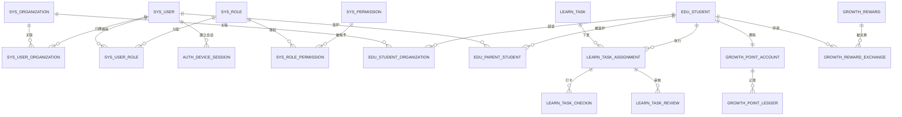

# 灵动学习数据库设计

**版本**：V1.0（设计基线草案）  
**状态**：待评审  
**技术约束**：MySQL 8+、MyBatis XML、Flyway；预留其他数据库方言适配  
**关联设计**：[FSD](01-功能详细设计-FSD-V1.0.md)、[Flyway 迁移规范](05-Flyway迁移规范-V1.0.md)、[权限与安全设计](07-权限与安全设计-V1.0.md)

## 1. 设计原则

1. 数据模型以 BRD 业务对象、状态和关系为唯一业务依据；表名和字段名是实现设计，不改变业务定义。
2. 以 `sys_organization` 树作为区域、学校、校区、年级、班级等组织范围的事实源；家长不进入组织树，家庭关联通过学生关系建模。
3. 家庭私有数据以学生和亲子关系为边界；机构业务数据以组织和学生机构关系为边界。任何查询均须显式带入授权后的组织、学生或家庭条件。
4. 任务定义、学生任务实例、打卡、审核和审核转交分表保存，避免一条任务记录同时承载多个学生的不同状态。
5. 积分账户与积分台账分离；余额是可快速读取的汇总，台账是可审计的事实，不允许用修改余额覆盖历史。
6. 状态采用业务枚举/字典编码保存，不通过删除记录表达停用、解绑、驳回或失效。重要历史数据使用状态、归档或匿名化处理。
7. 新表、字段、索引、基础数据和数据修复必须使用 Flyway 迁移发布；不得人工修改已发布表结构。

## 2. 通用物理规范

| 项目 | 规则 |
|---|---|
| 主键 | 所有表统一使用应用层雪花算法生成的 19 位 `BIGINT id`；禁止 `AUTO_INCREMENT`、联合主键和以外键字段作为主键。 |
| 关联键 | 使用 `BIGINT` 类型的 `*_id`；关联表的原联合业务键改为唯一约束，业务查询键、外部标识另建唯一约束或索引。 |
| 时间 | 使用 `TIMESTAMP` 保存创建、更新、发生、提交、审核等业务时间；统计口径统一采用中国标准时间，API 以 ISO 8601 表达。 |
| 状态 | 使用 `VARCHAR` 保存稳定状态码；页面文案由字典映射，禁用字典项不影响历史展示。 |
| 审计 | 新建业务表应至少包含 `created_at`、`updated_at`；需要追责的表增加 `created_by`、`updated_by`、操作来源或版本字段。已有 V1-V11 表按后续迁移逐步补齐，不手工改表。 |
| 逻辑删除 | 不以通用 `deleted` 字段替代业务状态。需要取消、解绑、停用、归档、匿名化时使用明确业务状态与事件记录。 |
| 索引 | 为组织/学生/状态/发生时间/外部业务编号等高频筛选建立组合索引；先依据查询场景设计，再通过真实数据量和执行计划验证。 |
| 密钥与敏感信息 | 密码只存不可逆散列；第三方密钥不进入业务表；身份证明、手机号、位置、情绪等敏感字段遵循安全设计的加密、脱敏和访问控制。 |

## 3. 逻辑 ER 模型

## 4. 已存在的 Flyway 基线（V1-V34）

以下表已由当前脚本创建。V1-V11 尚未进入共享环境时已重建为雪花主键基线，V12-V15 分别新增接口服务、附件、导入导出模板和设备会话基础，V16-V18 补充 IAM、组织和用户目录权限，V19-V23 新增学生关系、凭证、任务发布执行与审核基础，V24 新增积分账户和台账，V25 新增积分查询开关与权限，V26 增加积分纠错约束，V27 新增家庭奖励与兑换快照并扩展兑换台账关联；首次共享环境执行后，所有已执行版本成为不可修改的历史事实。

| 版本 | 表/对象 | 责任 |
|---|---|---|
| V1 | `sys_config` | 系统键值配置，区分密钥标记和启停状态。 |
| V2 | `sys_organization` | 组织树基础节点。 |
| V2 | `sys_user` | 通用用户账号基础信息。 |
| V2 | `sys_role`、`sys_permission` | 角色和权限目录。 |
| V2 | `sys_user_role`、`sys_role_permission` | 用户角色与角色权限。 |
| V2 | `sys_organization_admin` | 组织管理员绑定。 |
| V3 | `sys_organization_type` | 可配置组织类型；`sys_organization` 增加父级范围键和类型约束。 |
| V4 | `sys_user_organization` | 用户与组织关联。 |
| V5 | `sys_system_task` | 高风险系统任务和审核状态。 |
| V6 | `sys_feature_toggle` | 全局/组织功能开关；初始化地理考勤和学生轨迹为关闭。 |
| V7 | `sys_feature_toggle_change` | 开关变更任务与目标状态。 |
| V8 | `sys_user_permission` | 用户级补充允许/明确禁止权限。 |
| V9 | `sys_role_data_scope` | 自定义角色数据范围根组织。 |
| V10 | `sys_dictionary_type`、`sys_dictionary_item` | 可配置字典类型、字典项及按类型/状态/排序索引。 |
| V11 | `sys_cache_operation_log` | 缓存刷新/清除操作台账及系统任务关联。 |
| V12 | `sys_interface_service`、`sys_interface_service_change`、`sys_interface_call_log` | 接口服务受控元数据、审批提案和最小调用结果摘要。 |
| V13 | `sys_attachment_rule`、`sys_attachment_rule_extension`、`sys_file`、`sys_file_relation` | 附件规则、格式白名单、文件元数据和业务可见关系。 |
| V14 | `sys_import_export_template` | 导入导出模板的类型、模块、版本、附件关联、默认项和启停状态。 |
| V15 | `auth_device_session` | 平台账号 Web 设备会话、访问/刷新令牌摘要、到期时间和撤销状态。 |
| V16 | `sys_permission`、`sys_role_permission` 基础数据 | 12 个 Web 后台管理操作权限及其到内置 `SYS_ADMIN` 角色的授权关联；不新增表。 |
| V17 | `sys_permission`、`sys_role_permission` 基础数据 | 4 个 Web 组织管理操作权限及其到内置 `SYS_ADMIN` 角色的授权关联；不新增表。 |
| V18 | `sys_permission`、`sys_role_permission` 基础数据 | 2 个 Web 用户目录与账号状态操作权限及其到内置 `SYS_ADMIN` 角色的授权关联；不新增表。 |
| V19 | `edu_student`、`edu_parent_student`、`edu_student_organization` 与 RBAC 基础数据 | 学生档案、唯一主家长关系、学生机构直接关系；新增 `STUDENT_CREATE`、`STUDENT_READ` 操作权限。 |
| V20 | `edu_parent_binding_invitation` 与 RBAC 基础数据 | 机构向既有家长账号签发的一次性绑定邀请；原始令牌只在创建响应出现，表中仅保留 SHA-256 摘要；新增 `STUDENT_PARENT_INVITE_CREATE`、`STUDENT_PARENT_INVITE_RESPOND`。 |
| V21 | `auth_student_account_sequence`、`auth_student_credential` 与 RBAC/功能开关基础数据 | 按年份加行锁分配 8 位学生账号；保存登录码随机盐、HMAC-SHA256 摘要、密钥版本、失败次数、验证码状态、锁定和最后成功时间；新增初始化、重置权限及 `STUDENT_CODE_LOGIN` 全局开关。 |
| V22 | `edu_teacher_class`、`learn_task`、`learn_task_target`、`learn_task_tag`、`learn_task_assignment` 与 RBAC/字典/功能开关基础数据 | 保存教师班级关系、任务定义、原始目标、标签和发布后学生实例；新增任务分类/标签字典、`LEARNING_TASK_MANAGEMENT` 开关及 6 项 Web/小程序权限。 |
| V23 | `learn_task_assignment_event`、`learn_task_pause`、`learn_task_checkin`、`learn_task_reviewer_transfer` 与 RBAC 基础数据 | 扩展学生实例状态、版本和最近流转时间；保存执行事件、暂停、打卡版本和审核责任转交；新增学生执行、业务审核和免执行 3 项权限。 |
| V24 | `growth_point_account`、`growth_point_ledger` 与任务状态约束 | 为既有学生回填零余额唯一积分账户；保存不可变任务奖励台账；允许打卡 `APPROVED` 和任务事件 `REVIEW_APPROVED`。 |
| V25 | `sys_feature_toggle`、`sys_permission`、`sys_role_permission` 基础数据 | 不新增业务表；初始化 `GROWTH_POINT_QUERY`、学生本人查询权限、主家长孩子查询权限及最小角色授权。 |
| V26 | `growth_point_ledger`、`learn_task_assignment_event` 约束及访问基础数据 | 不新增业务表；允许纠错后重新审核发奖，以 `correction_of_id` 唯一约束防重复纠错，增加纠错检查约束、`POINT_CORRECTED`、独立开关和主家长 Web 权限。 |
| V27 | `growth_reward`、`growth_reward_exchange`、`growth_point_ledger.source_exchange_id` 及访问基础数据 | 保存按学生隔离的奖励、不可变兑换快照和六态流程；每笔兑换最多一条 `REDEMPTION` 台账；初始化独立开关、Web 家长两项权限和小程序学生权限。 |
| V28 | `growth_review`、`growth_review_snapshot`、`growth_review_category_stat`、`growth_review_daily_trend`、`growth_review_supplement` 及访问基础数据 | 保存学生周期逻辑复盘、不可变版本快照、分类、每日趋势和追加补录；初始化日报/周期报告开关及学生本人、主家长四项最小权限。 |
| V29 | `growth_point_decay_rule`、`growth_point_dormancy_state`、`growth_point_dormancy_notice`，并扩展 `growth_point_ledger` 与任务实例唯一约束 | 保存可追溯衰减规则、学生沉睡周期状态和提醒待投递记录；台账固化基础积分、衰减比例、连续天数与规则来源；同一任务可按不同计划日生成学生实例。 |
| V30 | `learn_task_recurrence`，并扩展 `learn_task` 周期配置 | 每个任务最多一个每日固定计划；保存开始日、可选结束日、下一生成日、运行状态、停止审计和乐观版本。 |
| V31 | 扩展 `sys_file`、`learn_task_checkin`，新增图片打卡规则与权限 | 文件保存模块、分类和 SHA-256 摘要；打卡正文允许为空但由应用层保证文字或附件至少一项；图片通过 `sys_file_relation` 关联。 |
| V32 | `learn_task_defer_history`，并扩展任务定义、任务实例与任务事件 | 固化自动/手动顺延类型、原任务来源、迁移次数、操作人和迁移前后日期；允许系统待优化事件无操作人，并初始化 Web 手动顺延权限。 |
| V33 | `learn_task_copy_batch`、`learn_task_copy_item`，并扩展任务生成类型 | 保存每学生每日唯一复制批次、源任务条目、目标任务、失败原因和重试次数；初始化独立功能开关及 Web 家长复制权限。 |
| V34 | `learn_task_template`、`learn_task_template_tag` | 保存系统只读模板与当前家长个人模板、可复用字段、标签、排序、状态和乐观版本；初始化模板开关、双权限、家长授权及两条系统模板。 |

**现状说明**：当前 60 张表已覆盖系统配置基础、组织、RBAC、用户关联、系统任务、功能开关、通用配置、设备会话、学生关系、登录凭证、学习任务发布执行审核、每日固定计划、图片打卡、待优化与顺延、按学生复制昨日任务、系统/家长个人任务模板、任务奖励积分、查询、纠错、家庭奖励兑换、V28 成长复盘及 V29 积分生命周期。二维码、微信绑定、消息实际投递、复杂周期、PDF、订阅和排行仍未实现。

## 5. 后续逻辑表设计

### 5.1 系统配置、附件与审计

| 逻辑表 | 核心字段 | 说明 |
|---|---|---|
| `sys_dictionary_type` | type_code、type_name、status、sort_order | 字典类型，供全局下拉、状态、类型与枚举统一引用。 |
| `sys_dictionary_item` | type_id、item_code、item_name、sort_order、is_default、status | 同类型项编码唯一；每类型最多一个默认项由服务层与约束共同保障。 |
| `sys_attachment_rule` | module_code、file_category、rule_name、max_file_size_bytes、max_batch_count、preview_enabled、download_scope、status | 当前由 V13 实现的附件通用规则。 |
| `sys_attachment_rule_extension` | rule_id、extension | 当前由 V13 实现的规则格式白名单，使用独立关联表保存。 |
| `sys_file` | storage_key、original_name、extension、content_type、size_bytes、uploader_id、status | 当前由 V13 实现的文件元数据和对象存储内部键；不保存供应商密钥。 |
| `sys_file_relation` | file_id、module_code、business_id、relation_type、visible_scope、status | 当前由 V13 实现的文件与业务对象关系，解除关系不物理删除文件元数据。 |
| `sys_import_export_template` | template_name、template_type、module_code、version、file_id、is_default、default_scope_key、status | 当前由 V14 实现。`module_code + template_type + version` 唯一；默认模板使用固定范围键 `DEFAULT`，非默认模板使用 `ID:<模板主键>`，由数据库唯一约束保证同模块同类型最多一个默认项。 |
| `sys_interface_service` | service_name、direction、purpose、caller_name、authorization_scope、authorization_scope_value、owner_id、status | 第三方或对外接口服务登记；当前已由 V12 实现。 |
| `sys_interface_service_change` | task_id、service_id、change_type、拟生效服务字段 | 接口服务新增、停用、授权范围调整的审核提案；一项任务只对应一项变更。 |
| `sys_interface_call_log` | service_id、caller_name、occurred_at、result、error_summary、trace_id | 当前已由 V12 实现的调用留痕，不保存完整敏感报文。 |
| `sys_cache_operation_log` | cache_type、module_code、operation_type、operator_id、result、occurred_at | 刷新/清除缓存的结果与失败原因。 |
| `sys_operation_log` | operator_id、role_snapshot、module_code、operation_type、request_uri、ip、result、occurred_at、remark | 审计查询与 180 天热存、冷归档索引。 |
| `sys_login_log` | user_id、device_id、login_type、result、ip、occurred_at | 登录、失败、锁定、退出和设备操作记录。 |

### 5.2 账号、学生与关系

| 逻辑表 | 核心字段 | 说明 |
|---|---|---|
| `auth_wechat_binding` | user_id/student_id、wechat_subject_id、binding_type、status、bound_at | 家长与学生的微信绑定分开管理，满足一对一和解绑要求。微信主体标识须加密/脱敏处理。 |
| `auth_device_session` | user_id、client_type、device_id、device_name、access_token_hash、refresh_token_hash、access_expires_at、refresh_expires_at、status、last_active_at、signed_out_at | V15 建表，V21 已复用于平台账号 `WEB` 和学生账号 `MINIAPP` 可撤销会话。仅保存两类令牌的 SHA-256 摘要；客户端类型由后端身份链决定，不接受前端越权切换。 |
| `auth_student_account_sequence` | sequence_year、current_value、created_at、updated_at | V21 已实现。年份唯一，分配时数据库行锁和期望值更新共同保证并发安全；账号为年份后两位加 6 位年度序号，序号范围 1 至 999999。 |
| `auth_student_credential` | student_user_id、code_hash、code_salt、key_version、failure_count、captcha_required、locked_until、code_updated_at、last_success_at | V21 已实现。学生用户唯一；登录码只保存随机盐和 HMAC-SHA256 摘要，失败次数限制为 0 至 10，验证码状态限制为 0/1。重置覆盖摘要并撤销活动会话，不保留明文。 |
| `edu_student` | student_name、grade_code、student_user_id、status | V19 建表，V21 新创建学生时在同一事务中关联独立 `STUDENT` 用户；历史学生允许该字段为空，须经受权对象范围接口显式初始化。头像尚未实现。 |
| `edu_parent_student` | parent_user_id、student_id、relation_role、status、primary_scope_key、bound_at、unbound_at | V19 已实现主家长关系；`(student_id, primary_scope_key)` 唯一约束确保当前基础能力只有一个主家长。副家长及关系变更尚未实现。 |
| `edu_parent_binding_invitation` | student_id、organization_id、inviter_user_id、token_hash、status、pending_scope_key、expires_at、responded_at、responded_by_user_id | V20 已实现机构发起的绑定邀请；只保存令牌 SHA-256 摘要。`(student_id, pending_scope_key)` 唯一约束保证每名学生至多一个待处理邀请，接受仍受主家长关系唯一约束保护。主家长发起、副家长、手机号快照和消息投递尚未实现。 |
| `edu_student_organization` | student_id、organization_id、relation_type、status、effective_from、effective_to | V19 建表；V22 已使用 `CLASS` 关系配置学生唯一活动班级，并保留既有入学关系。转学和完整学籍流程尚未实现。 |
| `edu_teacher_class` | teacher_user_id、class_organization_id、status、effective_from、effective_to | V22 已实现教师多班级活动关系和教师任务数据范围依据。教师与班级组合唯一，解除采用状态失效而非物理删除。 |

### 5.3 任务与执行

| 逻辑表 | 核心字段 | 说明 |
|---|---|---|
| `learn_task` | source_type、source_organization_id、creator_user_id、title、difficulty_level、base_points、duration_minutes、scheduled_date、category_code、remark、reviewer_user_id、review_timeout_hours、status | V22 已实现任务定义。来源为家庭/机构/教师，状态为 `DRAFT` 或 `PUBLISHED`；定义不保存每名学生执行状态。 |
| `learn_task_target` | task_id、target_type、target_id、created_at | V22 已实现原始组织/学生目标，同一任务、目标类型和目标标识唯一；发布后仍保留，便于追溯。 |
| `learn_task_tag` | task_id、tag_code、created_at | V22 已实现任务标签快照，同一任务标签编码唯一。 |
| `learn_task_assignment` | task_id、student_id、source_type、source_organization_id、current_status、current_reviewer_id、scheduled_date、due_at、last_transition_at、last_defer_type、defer_count、overnight_migrated、last_deferred_by_user_id、last_deferred_at、version_no | V22 建表、V23/V29/V32 扩展。`(task_id, student_id, scheduled_date)` 唯一；状态、版本与顺延字段共同约束并发迁移。 |
| `learn_task_assignment_event` | assignment_id、event_type、operator_user_id、from_status、to_status、reason、occurred_at | V23 已实现认领、暂停、恢复、放弃、打卡、驳回、转交和免执行；V24 新增审核通过事件；V32 新增可由系统写入且操作人为空的 `MARKED_NEEDS_IMPROVEMENT`。 |
| `learn_task_defer_history` | assignment_id、source_task_id、target_task_id、defer_type、from_scheduled_date、to_scheduled_date、operator_user_id、created_at | V32 已实现不可变顺延历史；每次顺延保存迁移前后日期和任务定义快照来源，标识由应用层生成 19 位雪花数字。 |
| `learn_task_copy_batch` | student_id、source_date、target_date、created_by_user_id、duplicate_confirmed、status、total_count、success_count、failure_count、completed_at | V33 已实现；`(student_id, target_date)` 唯一，保证每名学生每日一个复制批次。 |
| `learn_task_copy_item` | batch_id、source_task_id、target_task_id、task_title_snapshot、status、failure_code、failure_message、retry_count、started_at、completed_at | V33 已实现；`(batch_id, source_task_id)` 唯一，逐条记录成功、失败和显式重试，批次中断后仅恢复待处理条目。 |
| `learn_task_checkin` | assignment_id、submission_no、content、status、submitted_by_user_id、submitted_at、reviewed_by_user_id、reviewed_at、review_comment | V23 已实现文字打卡，V24 允许 `APPROVED`；V31 允许正文为空并通过 `sys_file_relation` 关联图片；`(assignment_id, submission_no)` 唯一，应用层保证文字或附件至少一项。 |
| `learn_task_reviewer_transfer` | assignment_id、from_reviewer_user_id、to_reviewer_user_id、transferred_by_user_id、transfer_reason、transferred_at | V23 已实现手动审核责任转交历史。 |
| `learn_task_pause` | assignment_id、pause_type、started_by_user_id、started_at、expires_at、resumed_at、close_type | V23 已实现情绪暂停和难题搁置；暂停不改变基础任务状态，支持手动、到期和终止三类关闭。 |
| `learn_task_template` | template_scope、owner_user_id、owner_scope_key、template_name、active_name_key、task_title、difficulty_level、duration_minutes、category_code、remark、sort_order、status、version_no | V34 已实现；系统模板拥有者为空且只读，个人模板按家长隔离；`(owner_scope_key, active_name_key)` 唯一并支持逻辑删除后名称复用。 |
| `learn_task_template_tag` | template_id、tag_code | V34 已实现；模板与标签唯一，标签来自启用任务标签字典，主键由应用层生成 19 位雪花数字。 |

### 5.4 积分、奖励与成长

| 逻辑表 | 核心字段 | 说明 |
|---|---|---|
| `growth_point_account` | student_id、total_points、available_points、version_no、created_at、updated_at | V24 已实现。每个学生唯一账户，账户主键复用学生 19 位雪花标识；新建学生同事务创建零余额账户，既有学生由迁移回填；余额按版本条件更新。 |
| `growth_point_ledger` | account_id、student_id、source_assignment_id、source_type、source_organization_id、change_type、amount、available_delta、reviewer_user_id、occurred_at、correction_of_id、remark | V24 实现 `TASK_REWARD`；V26 实现 `CORRECTION`。原记录禁止覆盖；纠错台账整笔负向关联原奖励，`available_delta` 可在原负值至 0 之间；同一原奖励最多一笔纠错，纠错后任务可重新审核并产生新奖励。兑换和休眠清零尚无业务入口。 |
| `growth_point_rule` | rule_scope、task_identifier、threshold、decay_rate、status、effective_from | 固定任务的衰减规则；最大衰减不超过 40%。 |
| `growth_reward` | student_id、created_by_parent_id、reward_name、required_points、description、expires_at、status、version_no、deleted_at | V27 家庭奖励库。奖励归属学生，创建家长仅作审计；当前活动主家长可维护，逻辑删除保留历史。 |
| `growth_reward_exchange` | reward_id、student_id、requester_user_id、名称/积分/说明快照、requested_at、approval_deadline、status、reviewed_by/at、reject_reason、verified_by/at、version_no | V27 兑换事实。六态流转、快照不可变，审批与核销人分别留痕；同一学生与奖励活动态由服务状态锁和查询共同控制。 |
| `growth_review` | student_id、period_type、period_start、period_end、current_snapshot_id、status、created_at、updated_at | V28 已实现。每个学生、周期类型和自然周期唯一；逻辑记录只指向当前快照，历史快照不覆盖。 |
| `growth_review_snapshot` | review_id、content_version、各状态任务数、completion_rate、earned_points、pause_count、generation_source、fact_fingerprint、data_cutoff_at、generated_at | V28 已实现。复盘版本不可变，同一逻辑复盘内版本号唯一；事实指纹相同不新增版本，迟到事实回补时追加新版本。 |
| `growth_review_category_stat` | snapshot_id、category_code、task_count、completed_count | V28 已实现。按快照和任务分类唯一，分类完成数不得超过任务数。 |
| `growth_review_daily_trend` | snapshot_id、trend_date、各状态任务数、completion_rate、earned_points、pause_count | V28 已实现。按快照和自然日唯一，为周、月复盘提供日趋势，不回查当前事实改写历史。 |
| `growth_review_supplement` | review_id、editor_user_id、editor_role、supplement_type、content、supplemented_at | V28 已实现。学生本人或活动主家长可在日复盘当日、次日追加三类补录；补录独立留痕且不修改复盘快照。 |
| `growth_point_decay_rule` | threshold_day、decay_percent、effective_from、effective_to、status、created_by、created_at、updated_at | V29 已实现。规则按连续天数阈值和生效区间保存；第 8 天 20%、第 16 天 40% 为当前基础规则，审核台账保存实际命中规则。 |
| `growth_point_dormancy_state` | student_id、cycle_started_at、last_effective_activity_at、last_reminder_created_at、cleared_at、version_no、created_at、updated_at | V29 已实现。每名学生唯一状态，记录当前沉睡周期、最近有效活跃、提醒和清零时点，通过版本条件更新支持幂等重试。 |
| `growth_point_dormancy_notice` | student_id、guardian_user_id、cycle_started_at、remind_at、status、created_at、updated_at | V29 已实现。按学生和沉睡周期唯一；有活动主家长时为 `PENDING`，无收件人时为 `NO_RECIPIENT`，只表达待投递事实。 |
| `learn_task_recurrence` | task_id、frequency_type、start_date、end_date、next_generation_date、status、stopped_by_user_id、stopped_at、version_no | V30 已实现。任务唯一计划，当前仅 `DAILY`；状态为 `ACTIVE/COMPLETED/STOPPED`，按下一生成日和计划标识索引扫描。 |

V29 为 `growth_point_ledger` 增加 `source_task_id`、`source_dormancy_notice_id`、`base_points_snapshot`、`decay_percent`、`streak_days`、`decay_rule_id`，并为历史任务奖励回填基础值。`learn_task_assignment` 的唯一约束调整为 `(task_id, student_id, scheduled_date)`，允许同一固定任务在不同自然日产生实例，同时仍阻止同日重复实例。
| `growth_report_subscription` | parent_user_id、student_id、subscription_type、status | 周报订阅开关。 |
| `growth_rank_snapshot` | class_organization_id、snapshot_date、anonymous_rank_key、student_id、points | 匿名排行快照；对外展示只使用匿名键。 |

### 5.5 机构、考勤、消息与报表

| 逻辑表 | 核心字段 | 说明 |
|---|---|---|
| `edu_exception_report` | student_id、class_organization_id、reporter_id、exception_type、content、status、reported_at | 教师异常报备，严格按班级和学生权限读取。 |
| `attendance_geofence` | organization_id、name、geometry_payload、effective_time_rule、status | 围栏配置；只有功能启用和位置授权成立后可使用。地理数据应按安全设计保护。 |
| `attendance_record` | student_id、organization_id、attendance_date、checkin_at、checkout_at、status、source | 签到、签退、迟到、早退、缺勤、请假结果。 |
| `student_location_track` | student_id、organization_id、occurred_at、location_payload、expires_at | 轨迹数据，默认不产生；保存前检查开关与授权，180 天到期删除。 |
| `msg_message` | recipient_id、message_type、business_type、business_id、title、content_summary、read_at、archived_at | 站内消息与业务跳转索引。 |
| `msg_delivery` | message_id、channel、delivery_status、attempt_count、last_error、sent_at | 微信服务通知等渠道投递与重试记录。 |
| `rpt_export_task` | requester_id、report_code、filter_snapshot、status、approval_task_id、file_id、completed_at | 导出任务、筛选快照、敏感导出审批和文件关联。 |
| `rpt_metric_snapshot` | metric_code、scope_type、scope_id、period_start、period_end、value_payload、generated_at | 可缓存的统计指标快照；口径以统计设计为准。 |

## 6. 数据隔离与访问条件

| 数据类型 | 必要访问条件 |
|---|---|
| 系统数据 | 系统管理员全局管理；系统审核员仅系统任务和历史。 |
| 机构/教师任务 | 功能许可 + 角色许可 + 授权组织子树/班级 + 任务来源范围。 |
| 家庭任务、奖励、家庭积分配置、家庭复盘 | 功能许可 + 主/副家长或学生本人关系；机构和教师查询必须被拒绝。 |
| 学生个人机构数据 | 机构角色按组织范围，家长按已绑定学生，学生按本人。 |
| 位置与轨迹 | 功能启用 + 家长位置授权有效 + 角色/组织范围；家长只看考勤结果，不看轨迹。 |
| 导出与统计 | 先缩小到授权数据集，再按脱敏规则生成；不得先全量查询再由前端过滤。 |

## 7. 数据留存、归档与删除

| 数据 | 规则 |
|---|---|
| 操作日志 | 热存储 180 天，超期冷归档并可审计查询。 |
| 学生轨迹 | 留存 180 天，到期自动清除。 |
| 已完成任务、积分台账、审核与兑换记录 | 作为成长、积分和审计溯源依据保留；注销按停止登录、关系解除、身份匿名化和必要记录保留原则处理。 |
| 附件 | 删除默认解除可见关系；归档业务保留可追溯元数据；物理删除在留存规则和审批条件满足后执行。 |
| 消息、导出、接口调用 | 保留满足业务追溯和审计所需的索引；具体期限未由 BRD 定义时不得擅自承诺。 |

## 8. 数据库评审与实施检查

1. 新增业务表前，核对其是否已在本设计和 FSD 中有清晰业务对象、状态、归属、权限和留存规则。
2. 新增字段前，核对字段是否来自 BRD/FSD；无来源字段须先进行设计评审。
3. 每张涉及组织、学生、家庭或时间范围的表必须在设计中列出查询条件和索引计划。
4. 每个外键、唯一约束、索引和初始化字典都必须有对应 Flyway 脚本、升级验证和回归测试。
