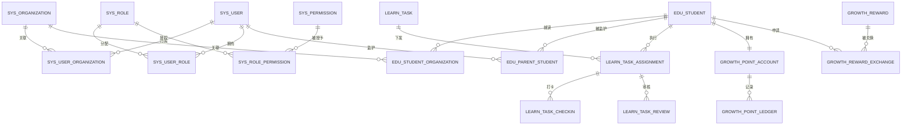

# 灵动学习数据库设计

**版本**：V1.0（设计基线草案）  
**状态**：待评审  
**技术约束**：MySQL 8+、MyBatis XML、Flyway；预留其他数据库方言适配  
**关联设计**：[FSD](01-功能详细设计-FSD-V1.0.md)、[Flyway 迁移规范](05-Flyway迁移规范-V1.0.md)、[权限与安全设计](07-权限与安全设计-V1.0.md)

## 1. 设计原则

1. 数据模型以 BRD 业务对象、状态和关系为唯一业务依据；表名和字段名是实现设计，不改变业务定义。
2. 以 `sys_organization` 树作为区域、学校、校区、年级、班级等组织范围的事实源；家长不进入组织树，家庭关联通过学生关系建模。
3. 家庭私有数据以学生和亲子关系为边界；机构业务数据以组织和学生机构关系为边界。任何查询均须显式带入授权后的组织、学生或家庭条件。
4. 任务定义、学生任务实例、打卡、审核和审核转交分表保存，避免一条任务记录同时承载多个学生的不同状态。
5. 积分账户与积分台账分离；余额是可快速读取的汇总，台账是可审计的事实，不允许用修改余额覆盖历史。
6. 状态采用业务枚举/字典编码保存，不通过删除记录表达停用、解绑、驳回或失效。重要历史数据使用状态、归档或匿名化处理。
7. 新表、字段、索引、基础数据和数据修复必须使用 Flyway 迁移发布；不得人工修改已发布表结构。

## 2. 通用物理规范

| 项目 | 规则 |
|---|---|
| 主键 | 优先 `BIGINT` 自增或由统一 ID 生成策略产生；同一表不得混用。当前 V1-V9 使用 `BIGINT AUTO_INCREMENT`。 |
| 关联键 | 使用与主键同类型的 `*_id`；业务查询键、外部标识另建唯一约束或索引。 |
| 时间 | 使用 `TIMESTAMP` 保存创建、更新、发生、提交、审核等业务时间；统计口径统一采用中国标准时间，API 以 ISO 8601 表达。 |
| 状态 | 使用 `VARCHAR` 保存稳定状态码；页面文案由字典映射，禁用字典项不影响历史展示。 |
| 审计 | 新建业务表应至少包含 `created_at`、`updated_at`；需要追责的表增加 `created_by`、`updated_by`、操作来源或版本字段。已有 V1-V9 表按后续迁移逐步补齐，不手工改表。 |
| 逻辑删除 | 不以通用 `deleted` 字段替代业务状态。需要取消、解绑、停用、归档、匿名化时使用明确业务状态与事件记录。 |
| 索引 | 为组织/学生/状态/发生时间/外部业务编号等高频筛选建立组合索引；先依据查询场景设计，再通过真实数据量和执行计划验证。 |
| 密钥与敏感信息 | 密码只存不可逆散列；第三方密钥不进入业务表；身份证明、手机号、位置、情绪等敏感字段遵循安全设计的加密、脱敏和访问控制。 |

## 3. 逻辑 ER 模型

## 4. 已存在的 Flyway 基线（V1-V9）

以下表已由当前脚本创建。它们是当前实现事实，后续扩展必须通过新版本迁移完成。

| 版本 | 表/对象 | 责任 |
|---|---|---|
| V1 | `sys_config` | 系统键值配置，区分密钥标记和启停状态。 |
| V2 | `sys_organization` | 组织树基础节点。 |
| V2 | `sys_user` | 通用用户账号基础信息。 |
| V2 | `sys_role`、`sys_permission` | 角色和权限目录。 |
| V2 | `sys_user_role`、`sys_role_permission` | 用户角色与角色权限。 |
| V2 | `sys_organization_admin` | 组织管理员绑定。 |
| V3 | `sys_organization_type` | 可配置组织类型；`sys_organization` 增加父级范围键和类型约束。 |
| V4 | `sys_user_organization` | 用户与组织关联。 |
| V5 | `sys_system_task` | 高风险系统任务和审核状态。 |
| V6 | `sys_feature_toggle` | 全局/组织功能开关；初始化地理考勤和学生轨迹为关闭。 |
| V7 | `sys_feature_toggle_change` | 开关变更任务与目标状态。 |
| V8 | `sys_user_permission` | 用户级补充允许/明确禁止权限。 |
| V9 | `sys_role_data_scope` | 自定义角色数据范围根组织。 |

**现状说明**：V1-V9 仅覆盖系统配置基础、组织、RBAC、用户关联、系统任务、功能开关和部分数据范围；不代表账号认证、学生、任务、积分、附件、字典、报表等业务表已经完成。

## 5. 后续逻辑表设计

### 5.1 系统配置、附件与审计

| 逻辑表 | 核心字段 | 说明 |
|---|---|---|
| `sys_dictionary_type` | type_code、type_name、status、sort_order | 字典类型，供全局下拉、状态、类型与枚举统一引用。 |
| `sys_dictionary_item` | type_id、item_code、item_name、sort_order、is_default、status | 同类型项编码唯一；每类型最多一个默认项由服务层与约束共同保障。 |
| `sys_attachment_rule` | module_code、file_category、allowed_extensions、max_size、preview_enabled、download_scope、status | 附件通用规则，不保存单个文件内容。 |
| `sys_file` | storage_key、original_name、extension、content_type、size_bytes、uploader_id、status | 文件元数据和对象存储引用；不保存供应商密钥。 |
| `sys_file_relation` | file_id、module_code、business_id、relation_type、visible_scope | 文件与业务对象的关系，支持一文件多引用及解除可见关系。 |
| `sys_import_export_template` | template_name、template_type、module_code、version、file_id、is_default、status | 模板配置与版本追溯。 |
| `sys_interface_service` | service_name、direction、purpose、caller_name、authorization_scope、owner_id、status | 第三方或对外接口服务登记。 |
| `sys_interface_call_log` | service_id、caller、occurred_at、result、error_summary、trace_id | 接口调用留痕，不保存完整敏感报文。 |
| `sys_cache_operation_log` | cache_type、module_code、operation_type、operator_id、result、occurred_at | 刷新/清除缓存的结果与失败原因。 |
| `sys_operation_log` | operator_id、role_snapshot、module_code、operation_type、request_uri、ip、result、occurred_at、remark | 审计查询与 180 天热存、冷归档索引。 |
| `sys_login_log` | user_id、device_id、login_type、result、ip、occurred_at | 登录、失败、锁定、退出和设备操作记录。 |

### 5.2 账号、学生与关系

| 逻辑表 | 核心字段 | 说明 |
|---|---|---|
| `auth_wechat_binding` | user_id/student_id、wechat_subject_id、binding_type、status、bound_at | 家长与学生的微信绑定分开管理，满足一对一和解绑要求。微信主体标识须加密/脱敏处理。 |
| `auth_device_session` | user_id、device_id、device_name、session_status、last_active_at、expired_at | 已登录设备、退出当前设备、一键下线和会话控制。 |
| `auth_login_code` | student_id、code_hash、failure_count、locked_until、updated_at | 学生 4 位登录码散列、错误次数和锁定时间，明文不得落库。 |
| `edu_student` | user_id、student_name、grade_code、avatar_file_id、status | 学生业务档案；与 `sys_user` 账号基础信息分离。 |
| `edu_parent_student` | parent_user_id、student_id、relation_role、status、bound_at、unbound_at | 主/副家长关系、绑定状态和变更时间。 |
| `edu_parent_binding_invitation` | student_id、inviter_id、target_mobile_snapshot、status、expires_at、confirmed_at | 机构或主家长发起的绑定邀请；机构邀请默认有效期 7 天，其他邀请按对应业务规则控制。 |
| `edu_student_organization` | student_id、organization_id、relation_type、status、effective_from、effective_to | 学生入校、班级、转班、转学等机构关系，不能承载家庭私有数据。 |
| `edu_teacher_class` | teacher_user_id、class_organization_id、status、effective_from、effective_to | 教师多班级关联和数据范围依据。 |

### 5.3 任务与执行

| 逻辑表 | 核心字段 | 说明 |
|---|---|---|
| `learn_task` | source_type、source_organization_id、creator_id、title、difficulty_code、point_rule、duration_minutes、category_code、remark、default_reviewer_rule、status | 任务定义，来源为家庭/机构/教师；不保存每名学生的执行状态。 |
| `learn_task_target` | task_id、target_type、target_id | 任务下发目标，支持学校、班级、指定学生；家庭任务目标为绑定学生。 |
| `learn_task_assignment` | task_id、student_id、source_type、current_status、current_reviewer_id、claimed_at、due_at、completed_at | 学生任务实例和状态；唯一约束防止同一任务重复下发给同一学生。 |
| `learn_task_checkin` | assignment_id、content、submitted_by、submitted_at、status | 打卡提交记录，附件通过 `sys_file_relation` 关联。 |
| `learn_task_review` | assignment_id、checkin_id、reviewer_id、result、comment、reviewed_at | 审核历史，驳回意见必填。 |
| `learn_task_review_transfer` | assignment_id、from_reviewer_id、to_reviewer_id、reason_code、transferred_at | 审核人失效、超时和组织转交记录。 |
| `learn_task_pause` | assignment_id、pause_type、started_at、ended_at、duration_minutes | 情绪暂停和难题搁置；保留类型，不把暂停当作基础任务状态。 |
| `learn_task_adjustment` | assignment_id、adjustment_type、operator_id、reason、occurred_at | 放弃、顺延、免执行、超时待优化等不可丢失的状态变更事实。 |
| `learn_task_template` | owner_scope、owner_id、template_name、task_payload_version、status | 常用或个人任务模板，低优先级业务对象。 |

### 5.4 积分、奖励与成长

| 逻辑表 | 核心字段 | 说明 |
|---|---|---|
| `growth_point_account` | student_id、total_points、available_points、updated_at、version | 每个学生唯一账户；总积分不因兑换降低，可用积分随兑换变化。 |
| `growth_point_ledger` | account_id、source_assignment_id、source_type、change_type、amount、available_delta、reviewer_id、occurred_at、correction_of_id | 任务发放、兑换、休眠清零、纠错等可追溯台账；禁止覆盖原记录。 |
| `growth_point_rule` | rule_scope、task_identifier、threshold、decay_rate、status、effective_from | 固定任务的衰减规则；最大衰减不超过 40%。 |
| `growth_reward` | owner_parent_id、student_id、reward_name、required_points、description、status、expires_at | 家庭奖励库，仅主家长可配置。 |
| `growth_reward_exchange` | reward_id、student_id、requested_at、status、approved_by、approved_at、verified_at | 兑换待审批、同意、驳回、待核销、已核销的状态与时间。 |
| `growth_review` | student_id、review_period_type、period_start、period_end、generated_at、content_version、status | 每日、周、月复盘的生成与补录版本。 |
| `growth_report_subscription` | parent_user_id、student_id、subscription_type、status | 周报订阅开关。 |
| `growth_rank_snapshot` | class_organization_id、snapshot_date、anonymous_rank_key、student_id、points | 匿名排行快照；对外展示只使用匿名键。 |

### 5.5 机构、考勤、消息与报表

| 逻辑表 | 核心字段 | 说明 |
|---|---|---|
| `edu_exception_report` | student_id、class_organization_id、reporter_id、exception_type、content、status、reported_at | 教师异常报备，严格按班级和学生权限读取。 |
| `attendance_geofence` | organization_id、name、geometry_payload、effective_time_rule、status | 围栏配置；只有功能启用和位置授权成立后可使用。地理数据应按安全设计保护。 |
| `attendance_record` | student_id、organization_id、attendance_date、checkin_at、checkout_at、status、source | 签到、签退、迟到、早退、缺勤、请假结果。 |
| `student_location_track` | student_id、organization_id、occurred_at、location_payload、expires_at | 轨迹数据，默认不产生；保存前检查开关与授权，180 天到期删除。 |
| `msg_message` | recipient_id、message_type、business_type、business_id、title、content_summary、read_at、archived_at | 站内消息与业务跳转索引。 |
| `msg_delivery` | message_id、channel、delivery_status、attempt_count、last_error、sent_at | 微信服务通知等渠道投递与重试记录。 |
| `rpt_export_task` | requester_id、report_code、filter_snapshot、status、approval_task_id、file_id、completed_at | 导出任务、筛选快照、敏感导出审批和文件关联。 |
| `rpt_metric_snapshot` | metric_code、scope_type、scope_id、period_start、period_end、value_payload、generated_at | 可缓存的统计指标快照；口径以统计设计为准。 |

## 6. 数据隔离与访问条件

| 数据类型 | 必要访问条件 |
|---|---|
| 系统数据 | 系统管理员全局管理；系统审核员仅系统任务和历史。 |
| 机构/教师任务 | 功能许可 + 角色许可 + 授权组织子树/班级 + 任务来源范围。 |
| 家庭任务、奖励、家庭积分配置、家庭复盘 | 功能许可 + 主/副家长或学生本人关系；机构和教师查询必须被拒绝。 |
| 学生个人机构数据 | 机构角色按组织范围，家长按已绑定学生，学生按本人。 |
| 位置与轨迹 | 功能启用 + 家长位置授权有效 + 角色/组织范围；家长只看考勤结果，不看轨迹。 |
| 导出与统计 | 先缩小到授权数据集，再按脱敏规则生成；不得先全量查询再由前端过滤。 |

## 7. 数据留存、归档与删除

| 数据 | 规则 |
|---|---|
| 操作日志 | 热存储 180 天，超期冷归档并可审计查询。 |
| 学生轨迹 | 留存 180 天，到期自动清除。 |
| 已完成任务、积分台账、审核与兑换记录 | 作为成长、积分和审计溯源依据保留；注销按停止登录、关系解除、身份匿名化和必要记录保留原则处理。 |
| 附件 | 删除默认解除可见关系；归档业务保留可追溯元数据；物理删除在留存规则和审批条件满足后执行。 |
| 消息、导出、接口调用 | 保留满足业务追溯和审计所需的索引；具体期限未由 BRD 定义时不得擅自承诺。 |

## 8. 数据库评审与实施检查

1. 新增业务表前，核对其是否已在本设计和 FSD 中有清晰业务对象、状态、归属、权限和留存规则。
2. 新增字段前，核对字段是否来自 BRD/FSD；无来源字段须先进行设计评审。
3. 每张涉及组织、学生、家庭或时间范围的表必须在设计中列出查询条件和索引计划。
4. 每个外键、唯一约束、索引和初始化字典都必须有对应 Flyway 脚本、升级验证和回归测试。
