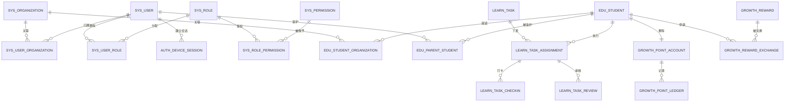

# 灵动学习数据库设计

## 2026-09-26 已验证增量

源码已验证至 V83，仍为 94 张业务表；远程数据库已恢复并验证至 V77（另有 1 张 Flyway 历史表），V78 至 V83 未发布。下文各历史增量的“当前/后续编号”保留为当时记录，不代表最新版本。

- V69–V72：匿名排行双端、家长周报、家长奖励及 Web 系统任务读取权限。
- V73–V75：全局功能变更版本和原状态、接口服务执行结果和变更前授权快照；不新增业务表。
- V76–V78：字典、模板、接口服务台账导出类型约束、独立默认模板模块和最小导出权限；沿用 sys_export_job 及其筛选/列/范围快照，不新增业务表。
- 原库 V56 失败恢复、备份及隔离演练见 [恢复记录](../deployment/MySQL迁移恢复与验证-2026-09-22.md)。已成功执行的迁移不得改写；后续版本先核对目录和实际数据库历史。

接口服务台账 V78 的字段、权限和验证结果见 [接口服务台账](../superpowers/specs/2026-09-22-lingdong-interface-ledger-export.md)。V79 为缓存操作日志新增类型约束、最小导出权限和 CACHE_REPORT 模板模块；V80 为系统任务审批台账新增类型约束、SYSTEM_TASK_EXPORT 权限、审核员本人导出作业读取授权和 SYSTEM_TASK_REPORT 模板模块。V81 增加奖励兑换报表类型约束、主家长导出权限及 REWARD_EXCHANGE_REPORT 模板模块。V82 增加异常报备导出约束、教师/机构导出及本人作业读取授权、EXCEPTION_REPORT_EXPORT 模板模块。V83 增加附件元数据台账导出类型约束、最小默认权限和 ATTACHMENT_LEDGER_REPORT 模板模块。均已本地全量验证，远程未发布。

## V68 匿名排行查看偏好

新增 growth_rank_preference，19 位雪花主键，parent_user_id、student_id、class_organization_id 外键及三列唯一键；enabled_flag、version_no、created_at、updated_at 保存本人主动查看状态及版本。同一孩子不同家长、同一家长不同班级独立；不参与参榜名单计算。新增默认关闭的 ANONYMOUS_CLASS_RANK 开关及 WEB 家长读取权限。后续迁移从 V69 开始，历史增量中的编号仅代表当时状态。详细字段与接口见 `../superpowers/specs/2026-09-09-lingdong-rank-query-design.md`。

## V67 周报待发队列增量

新增 growth_review_delivery，19 位雪花主键，订阅/周起始日唯一；保存订阅版本、报告与快照外键、待发或已取消状态、周一 22:00 过期时间及审计时间。偏好取消与待发取消共用事务；排队与偏好变更共用订阅人用户行锁。当前业务主键表 93 个，后续迁移从 V68 开始。没有微信内容或令牌，也没有表示已发送的状态。

## V66 周报订阅偏好增量

新增 growth_review_subscription：19 位雪花 BIGINT 主键，parent_user_id/student_id 外键及组合唯一约束，enabled_flag 默认 false，version_no 从 1 开始，created_at/updated_at 记录创建和最后变更时间；缺少记录时对外版本为 0。变更先锁本人用户行，再按版本更新，同状态幂等。当前业务主键表 92 个，本地迁移至 V66，后续从 V67 开始。尚无消息队列或投递结果，不保存微信标识。

**版本**：V1.0（设计基线草案）  
**状态**：待评审  
**技术约束**：MySQL 8+、MyBatis XML、Flyway；预留其他数据库方言适配  
**关联设计**：[FSD](01-功能详细设计-FSD-V1.0.md)、[Flyway 迁移规范](05-Flyway迁移规范-V1.0.md)、[权限与安全设计](07-权限与安全设计-V1.0.md)

## 1. 设计原则

2026-09-08 V65 增量：`sys_export_job.export_type` 增加 `GROWTH_REVIEW_PDF`，约束该类型必须指定学生、非敏感且不绑定系统审批任务；内容扩展表只允许关联此正式类型的应用写入。仅为 `EXPORT_JOB/REPORT_EXPORT` 附件规则补充 PDF、ZIP 格式，不覆盖其他配置。无新表，仍为 91 张业务主键表。

当前增量：V63 已新增 `sys_export_job_payload`，本地迁移后共 91 张业务主键表；该增量只提供复盘导出内容存储，PDF 创建与下载链路仍未接通。

`sys_export_job_payload` 字段：`id BIGINT` 为应用生成的 19 位雪花主键，`job_id BIGINT` 为唯一外键，关联 `sys_export_job.id`；`payload_type VARCHAR(32)` 固定 `GROWTH_REVIEW_PDF_V1`，`payload_json LONGTEXT` 保存版本化报告全文，`content_sha256 CHAR(64)` 保存完整性摘要，`created_at TIMESTAMP` 保存创建时间。应用层限制 UTF-8 正文为 8MB，并只提供创建时的一次写入及内部读取，不提供覆盖更新。新表不替代原作业状态、模板或统一附件表。

1. 数据模型以 BRD 业务对象、状态和关系为唯一业务依据；表名和字段名是实现设计，不改变业务定义。
2. 以 `sys_organization` 树作为区域、学校、校区、年级、班级等组织范围的事实源；家长不进入组织树，家庭关联通过学生关系建模。
3. 家庭私有数据以学生和亲子关系为边界；机构业务数据以组织和学生机构关系为边界。任何查询均须显式带入授权后的组织、学生或家庭条件。
4. 任务定义、学生任务实例、打卡、审核和审核转交分表保存，避免一条任务记录同时承载多个学生的不同状态。
5. 积分账户与积分台账分离；余额是可快速读取的汇总，台账是可审计的事实，不允许用修改余额覆盖历史。
6. 状态采用业务枚举/字典编码保存，不通过删除记录表达停用、解绑、驳回或失效。重要历史数据使用状态、归档或匿名化处理。
7. 新表、字段、索引、基础数据和数据修复必须使用 Flyway 迁移发布；不得人工修改已发布表结构。

## 2. 通用物理规范

| 项目 | 规则 |
|---|---|
| 主键 | 所有表统一使用应用层雪花算法生成的 19 位 `BIGINT id`；禁止 `AUTO_INCREMENT`、联合主键和以外键字段作为主键。 |
| 关联键 | 使用 `BIGINT` 类型的 `*_id`；关联表的原联合业务键改为唯一约束，业务查询键、外部标识另建唯一约束或索引。 |
| 时间 | 使用 `TIMESTAMP` 保存创建、更新、发生、提交、审核等业务时间；统计口径统一采用中国标准时间，API 以 ISO 8601 表达。 |
| 状态 | 使用 `VARCHAR` 保存稳定状态码；页面文案由字典映射，禁用字典项不影响历史展示。 |
| 审计 | 新建业务表应至少包含 `created_at`、`updated_at`；需要追责的表增加 `created_by`、`updated_by`、操作来源或版本字段。已有 V1-V11 表按后续迁移逐步补齐，不手工改表。 |
| 逻辑删除 | 不以通用 `deleted` 字段替代业务状态。需要取消、解绑、停用、归档、匿名化时使用明确业务状态与事件记录。 |
| 索引 | 为组织/学生/状态/发生时间/外部业务编号等高频筛选建立组合索引；先依据查询场景设计，再通过真实数据量和执行计划验证。 |
| 密钥与敏感信息 | 密码只存不可逆散列；第三方密钥不进入业务表；身份证明、手机号、位置、情绪等敏感字段遵循安全设计的加密、脱敏和访问控制。 |

## 3. 逻辑 ER 模型

```mermaid
erDiagram
    SYS_ORGANIZATION ||--o{ SYS_USER_ORGANIZATION : 关联
    SYS_USER ||--o{ SYS_USER_ORGANIZATION : 归属
    SYS_USER ||--o{ SYS_USER_ROLE : 拥有
    SYS_USER ||--o{ AUTH_DEVICE_SESSION : 建立会话
    SYS_ROLE ||--o{ SYS_USER_ROLE : 分配
    SYS_ROLE ||--o{ SYS_ROLE_PERMISSION : 授权
    SYS_PERMISSION ||--o{ SYS_ROLE_PERMISSION : 被授予
    SYS_ORGANIZATION ||--o{ EDU_STUDENT_ORGANIZATION : 关联
    EDU_STUDENT ||--o{ EDU_STUDENT_ORGANIZATION : 就读
    SYS_USER ||--o{ EDU_PARENT_STUDENT : 监护
    EDU_STUDENT ||--o{ EDU_PARENT_STUDENT : 被监护
    LEARN_TASK ||--o{ LEARN_TASK_ASSIGNMENT : 下发
    EDU_STUDENT ||--o{ LEARN_TASK_ASSIGNMENT : 执行
    LEARN_TASK_ASSIGNMENT ||--o{ LEARN_TASK_CHECKIN : 打卡
    LEARN_TASK_ASSIGNMENT ||--o{ LEARN_TASK_REVIEW : 审核
    EDU_STUDENT ||--|| GROWTH_POINT_ACCOUNT : 拥有
    GROWTH_POINT_ACCOUNT ||--o{ GROWTH_POINT_LEDGER : 记录
    EDU_STUDENT ||--o{ GROWTH_REWARD_EXCHANGE : 申请
    GROWTH_REWARD ||--o{ GROWTH_REWARD_EXCHANGE : 被兑换
```

## 4. 首批 Flyway 基线清单（V1-V37）

以下清单记录 V1-V37 首批脚本创建的表和对象，V38-V58 的增量设计在本文件后续对应章节继续记录。V1-V11 尚未进入共享环境时已重建为雪花主键基线，V12-V15 分别新增接口服务、附件、导入导出模板和设备会话基础，V16-V18 补充 IAM、组织和用户目录权限，V19-V23 新增学生关系、凭证、任务发布执行与审核基础，V24 新增积分账户和台账，V25 新增积分查询开关与权限，V26 增加积分纠错约束，V27 新增家庭奖励与兑换快照并扩展兑换台账关联；首次共享环境执行后，所有已执行版本成为不可修改的历史事实。

| 版本 | 表/对象 | 责任 |
|---|---|---|
| V1 | `sys_config` | 系统键值配置，区分密钥标记和启停状态。 |
| V2 | `sys_organization` | 组织树基础节点。 |
| V2 | `sys_user` | 通用用户账号基础信息。 |
| V2 | `sys_role`、`sys_permission` | 角色和权限目录。 |
| V2 | `sys_user_role`、`sys_role_permission` | 用户角色与角色权限。 |
| V2 | `sys_organization_admin` | 组织管理员绑定。 |
| V3 | `sys_organization_type` | 可配置组织类型；`sys_organization` 增加父级范围键和类型约束。 |
| V4 | `sys_user_organization` | 用户与组织关联。 |
| V5 | `sys_system_task` | 高风险系统任务和审核状态。 |
| V6 | `sys_feature_toggle` | 全局/组织功能开关；初始化地理考勤和学生轨迹为关闭。 |
| V7 | `sys_feature_toggle_change` | 开关变更任务与目标状态。 |
| V8 | `sys_user_permission` | 用户级补充允许/明确禁止权限。 |
| V9 | `sys_role_data_scope` | 自定义角色数据范围根组织。 |
| V10 | `sys_dictionary_type`、`sys_dictionary_item` | 可配置字典类型、字典项及按类型/状态/排序索引。 |
| V11 | `sys_cache_operation_log` | 缓存刷新/清除操作台账及系统任务关联。 |
| V12 | `sys_interface_service`、`sys_interface_service_change`、`sys_interface_call_log` | 接口服务受控元数据、审批提案和最小调用结果摘要。 |
| V13 | `sys_attachment_rule`、`sys_attachment_rule_extension`、`sys_file`、`sys_file_relation` | 附件规则、格式白名单、文件元数据和业务可见关系。 |
| V14 | `sys_import_export_template` | 导入导出模板的类型、模块、版本、附件关联、默认项和启停状态。 |
| V15 | `auth_device_session` | 平台账号 Web 设备会话、访问/刷新令牌摘要、到期时间和撤销状态。 |
| V16 | `sys_permission`、`sys_role_permission` 基础数据 | 12 个 Web 后台管理操作权限及其到内置 `SYS_ADMIN` 角色的授权关联；不新增表。 |
| V17 | `sys_permission`、`sys_role_permission` 基础数据 | 4 个 Web 组织管理操作权限及其到内置 `SYS_ADMIN` 角色的授权关联；不新增表。 |
| V18 | `sys_permission`、`sys_role_permission` 基础数据 | 2 个 Web 用户目录与账号状态操作权限及其到内置 `SYS_ADMIN` 角色的授权关联；不新增表。 |
| V19 | `edu_student`、`edu_parent_student`、`edu_student_organization` 与 RBAC 基础数据 | 学生档案、唯一主家长关系、学生机构直接关系；新增 `STUDENT_CREATE`、`STUDENT_READ` 操作权限。 |
| V20 | `edu_parent_binding_invitation` 与 RBAC 基础数据 | 机构向既有家长账号签发的一次性绑定邀请；原始令牌只在创建响应出现，表中仅保留 SHA-256 摘要；新增 `STUDENT_PARENT_INVITE_CREATE`、`STUDENT_PARENT_INVITE_RESPOND`。 |
| V21 | `auth_student_account_sequence`、`auth_student_credential` 与 RBAC/功能开关基础数据 | 按年份加行锁分配 8 位学生账号；保存登录码随机盐、HMAC-SHA256 摘要、密钥版本、失败次数、验证码状态、锁定和最后成功时间；新增初始化、重置权限及 `STUDENT_CODE_LOGIN` 全局开关。 |
| V22 | `edu_teacher_class`、`learn_task`、`learn_task_target`、`learn_task_tag`、`learn_task_assignment` 与 RBAC/字典/功能开关基础数据 | 保存教师班级关系、任务定义、原始目标、标签和发布后学生实例；新增任务分类/标签字典、`LEARNING_TASK_MANAGEMENT` 开关及 6 项 Web/小程序权限。 |
| V23 | `learn_task_assignment_event`、`learn_task_pause`、`learn_task_checkin`、`learn_task_reviewer_transfer` 与 RBAC 基础数据 | 扩展学生实例状态、版本和最近流转时间；保存执行事件、暂停、打卡版本和审核责任转交；新增学生执行、业务审核和免执行 3 项权限。 |
| V24 | `growth_point_account`、`growth_point_ledger` 与任务状态约束 | 为既有学生回填零余额唯一积分账户；保存不可变任务奖励台账；允许打卡 `APPROVED` 和任务事件 `REVIEW_APPROVED`。 |
| V25 | `sys_feature_toggle`、`sys_permission`、`sys_role_permission` 基础数据 | 不新增业务表；初始化 `GROWTH_POINT_QUERY`、学生本人查询权限、主家长孩子查询权限及最小角色授权。 |
| V26 | `growth_point_ledger`、`learn_task_assignment_event` 约束及访问基础数据 | 不新增业务表；允许纠错后重新审核发奖，以 `correction_of_id` 唯一约束防重复纠错，增加纠错检查约束、`POINT_CORRECTED`、独立开关和主家长 Web 权限。 |
| V27 | `growth_reward`、`growth_reward_exchange`、`growth_point_ledger.source_exchange_id` 及访问基础数据 | 保存按学生隔离的奖励、不可变兑换快照和六态流程；每笔兑换最多一条 `REDEMPTION` 台账；初始化独立开关、Web 家长两项权限和小程序学生权限。 |
| V28 | `growth_review`、`growth_review_snapshot`、`growth_review_category_stat`、`growth_review_daily_trend`、`growth_review_supplement` 及访问基础数据 | 保存学生周期逻辑复盘、不可变版本快照、分类、每日趋势和追加补录；初始化日报/周期报告开关及学生本人、主家长四项最小权限。 |
| V29 | `growth_point_decay_rule`、`growth_point_dormancy_state`、`growth_point_dormancy_notice`，并扩展 `growth_point_ledger` 与任务实例唯一约束 | 保存可追溯衰减规则、学生沉睡周期状态和提醒待投递记录；台账固化基础积分、衰减比例、连续天数与规则来源；同一任务可按不同计划日生成学生实例。 |
| V30 | `learn_task_recurrence`，并扩展 `learn_task` 周期配置 | 每个任务最多一个每日固定计划；保存开始日、可选结束日、下一生成日、运行状态、停止审计和乐观版本。 |
| V31 | 扩展 `sys_file`、`learn_task_checkin`，新增图片打卡规则与权限 | 文件保存模块、分类和 SHA-256 摘要；打卡正文允许为空但由应用层保证文字或附件至少一项；图片通过 `sys_file_relation` 关联。 |
| V32 | `learn_task_defer_history`，并扩展任务定义、任务实例与任务事件 | 固化自动/手动顺延类型、原任务来源、迁移次数、操作人和迁移前后日期；允许系统待优化事件无操作人，并初始化 Web 手动顺延权限。 |
| V33 | `learn_task_copy_batch`、`learn_task_copy_item`，并扩展任务生成类型 | 保存每学生每日唯一复制批次、源任务条目、目标任务、失败原因和重试次数；初始化独立功能开关及 Web 家长复制权限。 |
| V34 | `learn_task_template`、`learn_task_template_tag` | 保存系统只读模板与当前家长个人模板、可复用字段、标签、排序、状态和乐观版本；初始化模板开关、双权限、家长授权及两条系统模板。 |
| V35 | `auth_student_qr_ticket` | 保存学生、学生用户、随机票据摘要、状态、5 分钟到期时间、消费时间和签发人；初始化扫码开关、Web 签发权限及家长/机构管理员授权。 |
| V36 | `auth_user_agreement_acceptance`、`auth_parent_profile` | 保存家长协议版本接受事实和首次引导状态；初始化当前协议版本及家长手机号认证开关，业务服务与两端流程已本地完成。 |
| V37 | `auth_parent_wechat_binding` | 保存家长用户与小程序 `app_id + open_id` 的活动绑定、可选 `union_id` 和最后登录时间；初始化默认停用的家长微信认证开关。 |

**现状说明**：当前 Flyway 已推进至 V58，共 84 张显式非自增 `BIGINT id` 主键表；除上述首批基线外，后续章节继续记录主副家长关系、账号安全、微信认证、组织班级、权限审计、通用配置、导入校验、异步导出和学员批量导入等增量。真实短信/微信联调、消息实际投递、复杂周期、PDF、订阅、排行、其余业务导入和其余报表数据集仍未实现。

## 5. 后续逻辑表设计

### 5.1 系统配置、附件与审计

| 逻辑表 | 核心字段 | 说明 |
|---|---|---|
| `sys_dictionary_type` | type_code、type_name、status、sort_order | 字典类型，供全局下拉、状态、类型与枚举统一引用。 |
| `sys_dictionary_item` | type_id、item_code、item_name、sort_order、is_default、status | 同类型项编码唯一；每类型最多一个默认项由服务层与约束共同保障。 |
| `sys_attachment_rule` | module_code、file_category、rule_name、max_file_size_bytes、max_batch_count、preview_enabled、download_scope、status | 当前由 V13 实现的附件通用规则。 |
| `sys_attachment_rule_extension` | rule_id、extension | 当前由 V13 实现的规则格式白名单，使用独立关联表保存。 |
| `sys_file` | storage_key、original_name、extension、content_type、size_bytes、uploader_id、status | 当前由 V13 实现的文件元数据和对象存储内部键；不保存供应商密钥。 |
| `sys_file_relation` | file_id、module_code、business_id、relation_type、visible_scope、status | 当前由 V13 实现的文件与业务对象关系，解除关系不物理删除文件元数据。 |
| `sys_import_export_template` | template_name、template_type、module_code、version、file_id、is_default、default_scope_key、status | 当前由 V14 实现。`module_code + template_type + version` 唯一；默认模板使用固定范围键 `DEFAULT`，非默认模板使用 `ID:<模板主键>`，由数据库唯一约束保证同模块同类型最多一个默认项。 |
| `sys_interface_service` | service_name、direction、purpose、caller_name、authorization_scope、authorization_scope_value、owner_id、status | 第三方或对外接口服务登记；当前已由 V12 实现。 |
| `sys_interface_service_change` | task_id、service_id、change_type、拟生效服务字段 | 接口服务新增、停用、授权范围调整的审核提案；一项任务只对应一项变更。 |
| `sys_interface_call_log` | service_id、caller_name、occurred_at、result、error_summary、trace_id | 当前已由 V12 实现的调用留痕，不保存完整敏感报文。 |
| `sys_cache_operation_log` | cache_type、module_code、operation_type、operator_id、result、occurred_at | 刷新/清除缓存的结果与失败原因。 |
| `sys_operation_log` | operator_id、role_snapshot、module_code、operation_type、request_uri、ip、result、occurred_at、remark | 审计查询与 180 天热存、冷归档索引。 |
| `sys_login_log` | user_id、device_id、login_type、result、ip、occurred_at | 登录、失败、锁定、退出和设备操作记录。 |

### 5.2 账号、学生与关系

| 逻辑表 | 核心字段 | 说明 |
|---|---|---|
| `auth_wechat_binding` | user_id/student_id、wechat_subject_id、binding_type、status、bound_at | 家长与学生的微信绑定分开管理，满足一对一和解绑要求。微信主体标识须加密/脱敏处理。 |
| `auth_device_session` | user_id、client_type、device_id、device_name、access_token_hash、refresh_token_hash、access_expires_at、refresh_expires_at、status、last_active_at、signed_out_at | V15 建表，V21 已复用于平台账号 `WEB` 和学生账号 `MINIAPP` 可撤销会话。仅保存两类令牌的 SHA-256 摘要；客户端类型由后端身份链决定，不接受前端越权切换。 |
| `auth_student_account_sequence` | sequence_year、current_value、created_at、updated_at | V21 已实现。年份唯一，分配时数据库行锁和期望值更新共同保证并发安全；账号为年份后两位加 6 位年度序号，序号范围 1 至 999999。 |
| `auth_student_credential` | student_user_id、code_hash、code_salt、key_version、failure_count、captcha_required、locked_until、code_updated_at、last_success_at | V21 已实现。学生用户唯一；登录码只保存随机盐和 HMAC-SHA256 摘要，失败次数限制为 0 至 10，验证码状态限制为 0/1。重置覆盖摘要并撤销活动会话，不保留明文。 |
| `auth_student_qr_ticket` | student_id、student_user_id、token_hash、status、expires_at、consumed_at、issued_by_user_id | V35 已实现。原始 32 字节随机票据只在签发响应出现，数据库仅保存 SHA-256；新票据撤销同学生旧活动票据，扫码使用行锁并原子改为已消费。 |
| `edu_student` | student_name、grade_code、student_user_id、status | V19 建表，V21 新创建学生时在同一事务中关联独立 `STUDENT` 用户；历史学生允许该字段为空，须经受权对象范围接口显式初始化。头像尚未实现。 |
| `edu_parent_student` | parent_user_id、student_id、relation_role、status、primary_scope_key、bound_at、unbound_at | V38 已实现当前主副关系；`(student_id, primary_scope_key)` 唯一约束确保每名学生最多一个活动主家长和一个活动副家长，解绑使用关闭范围键。 |
| `edu_parent_binding_invitation` | student_id、organization_id、inviter_user_id、token_hash、status、pending_scope_key、expires_at、responded_at、responded_by_user_id | V20 机构发起的主家长绑定邀请；只保存令牌 SHA-256 摘要。V38 主副关系邀请由独立 `edu_parent_relationship_invitation` 承载，消息投递仍未实现。 |
| `edu_student_organization` | student_id、organization_id、relation_type、status、effective_from、effective_to | V19 建表；V22 已使用 `CLASS` 关系配置学生唯一活动班级，并保留既有入学关系。转学和完整学籍流程尚未实现。 |
| `edu_teacher_class` | teacher_user_id、class_organization_id、status、effective_from、effective_to | V22 已实现教师多班级活动关系和教师任务数据范围依据。教师与班级组合唯一，解除采用状态失效而非物理删除。 |

### 5.3 任务与执行

| 逻辑表 | 核心字段 | 说明 |
|---|---|---|
| `learn_task` | source_type、source_organization_id、creator_user_id、title、difficulty_level、base_points、duration_minutes、scheduled_date、category_code、remark、reviewer_user_id、review_timeout_hours、status | V22 已实现任务定义。来源为家庭/机构/教师，状态为 `DRAFT` 或 `PUBLISHED`；定义不保存每名学生执行状态。 |
| `learn_task_target` | task_id、target_type、target_id、created_at | V22 已实现原始组织/学生目标，同一任务、目标类型和目标标识唯一；发布后仍保留，便于追溯。 |
| `learn_task_tag` | task_id、tag_code、created_at | V22 已实现任务标签快照，同一任务标签编码唯一。 |
| `learn_task_assignment` | task_id、student_id、source_type、source_organization_id、current_status、current_reviewer_id、scheduled_date、due_at、last_transition_at、last_defer_type、defer_count、overnight_migrated、last_deferred_by_user_id、last_deferred_at、version_no | V22 建表、V23/V29/V32 扩展。`(task_id, student_id, scheduled_date)` 唯一；状态、版本与顺延字段共同约束并发迁移。 |
| `learn_task_assignment_event` | assignment_id、event_type、operator_user_id、from_status、to_status、reason、occurred_at | V23 已实现认领、暂停、恢复、放弃、打卡、驳回、转交和免执行；V24 新增审核通过事件；V32 新增可由系统写入且操作人为空的 `MARKED_NEEDS_IMPROVEMENT`。 |
| `learn_task_defer_history` | assignment_id、source_task_id、target_task_id、defer_type、from_scheduled_date、to_scheduled_date、operator_user_id、created_at | V32 已实现不可变顺延历史；每次顺延保存迁移前后日期和任务定义快照来源，标识由应用层生成 19 位雪花数字。 |
| `learn_task_copy_batch` | student_id、source_date、target_date、created_by_user_id、duplicate_confirmed、status、total_count、success_count、failure_count、completed_at | V33 已实现；`(student_id, target_date)` 唯一，保证每名学生每日一个复制批次。 |
| `learn_task_copy_item` | batch_id、source_task_id、target_task_id、task_title_snapshot、status、failure_code、failure_message、retry_count、started_at、completed_at | V33 已实现；`(batch_id, source_task_id)` 唯一，逐条记录成功、失败和显式重试，批次中断后仅恢复待处理条目。 |
| `learn_task_checkin` | assignment_id、submission_no、content、status、submitted_by_user_id、submitted_at、reviewed_by_user_id、reviewed_at、review_comment | V23 已实现文字打卡，V24 允许 `APPROVED`；V31 允许正文为空并通过 `sys_file_relation` 关联图片；`(assignment_id, submission_no)` 唯一，应用层保证文字或附件至少一项。 |
| `learn_task_reviewer_transfer` | assignment_id、from_reviewer_user_id、to_reviewer_user_id、transferred_by_user_id、transfer_reason、transferred_at | V23 已实现手动审核责任转交历史。 |
| `learn_task_pause` | assignment_id、pause_type、started_by_user_id、started_at、expires_at、resumed_at、close_type | V23 已实现情绪暂停和难题搁置；暂停不改变基础任务状态，支持手动、到期和终止三类关闭。 |
| `learn_task_template` | template_scope、owner_user_id、owner_scope_key、template_name、active_name_key、task_title、difficulty_level、duration_minutes、category_code、remark、sort_order、status、version_no | V34 已实现；系统模板拥有者为空且只读，个人模板按家长隔离；`(owner_scope_key, active_name_key)` 唯一并支持逻辑删除后名称复用。 |
| `learn_task_template_tag` | template_id、tag_code | V34 已实现；模板与标签唯一，标签来自启用任务标签字典，主键由应用层生成 19 位雪花数字。 |

### 5.4 积分、奖励与成长

| 逻辑表 | 核心字段 | 说明 |
|---|---|---|
| `growth_point_account` | student_id、total_points、available_points、version_no、created_at、updated_at | V24 已实现。每个学生唯一账户，账户主键复用学生 19 位雪花标识；新建学生同事务创建零余额账户，既有学生由迁移回填；余额按版本条件更新。 |
| `growth_point_ledger` | account_id、student_id、source_assignment_id、source_type、source_organization_id、change_type、amount、available_delta、reviewer_user_id、occurred_at、correction_of_id、remark | V24 实现 `TASK_REWARD`；V26 实现 `CORRECTION`。原记录禁止覆盖；纠错台账整笔负向关联原奖励，`available_delta` 可在原负值至 0 之间；同一原奖励最多一笔纠错，纠错后任务可重新审核并产生新奖励。兑换和休眠清零尚无业务入口。 |
| `growth_point_rule` | rule_scope、task_identifier、threshold、decay_rate、status、effective_from | 固定任务的衰减规则；最大衰减不超过 40%。 |
| `growth_reward` | student_id、created_by_parent_id、reward_name、required_points、description、expires_at、status、version_no、deleted_at | V27 家庭奖励库。奖励归属学生，创建家长仅作审计；当前活动主家长可维护，逻辑删除保留历史。 |
| `growth_reward_exchange` | reward_id、student_id、requester_user_id、名称/积分/说明快照、requested_at、approval_deadline、status、reviewed_by/at、reject_reason、verified_by/at、version_no | V27 兑换事实。六态流转、快照不可变，审批与核销人分别留痕；同一学生与奖励活动态由服务状态锁和查询共同控制。 |
| `growth_review` | student_id、period_type、period_start、period_end、current_snapshot_id、status、created_at、updated_at | V28 已实现。每个学生、周期类型和自然周期唯一；逻辑记录只指向当前快照，历史快照不覆盖。 |
| `growth_review_snapshot` | review_id、content_version、各状态任务数、completion_rate、earned_points、pause_count、generation_source、fact_fingerprint、data_cutoff_at、generated_at | V28 已实现。复盘版本不可变，同一逻辑复盘内版本号唯一；事实指纹相同不新增版本，迟到事实回补时追加新版本。 |
| `growth_review_category_stat` | snapshot_id、category_code、task_count、completed_count | V28 已实现。按快照和任务分类唯一，分类完成数不得超过任务数。 |
| `growth_review_daily_trend` | snapshot_id、trend_date、各状态任务数、completion_rate、earned_points、pause_count | V28 已实现。按快照和自然日唯一，为周、月复盘提供日趋势，不回查当前事实改写历史。 |
| `growth_review_supplement` | review_id、editor_user_id、editor_role、supplement_type、content、supplemented_at | V28 已实现。学生本人或活动主家长可在日复盘当日、次日追加三类补录；补录独立留痕且不修改复盘快照。 |
| `growth_point_decay_rule` | threshold_day、decay_percent、effective_from、effective_to、status、created_by、created_at、updated_at | V29 已实现。规则按连续天数阈值和生效区间保存；第 8 天 20%、第 16 天 40% 为当前基础规则，审核台账保存实际命中规则。 |
| `growth_point_dormancy_state` | student_id、cycle_started_at、last_effective_activity_at、last_reminder_created_at、cleared_at、version_no、created_at、updated_at | V29 已实现。每名学生唯一状态，记录当前沉睡周期、最近有效活跃、提醒和清零时点，通过版本条件更新支持幂等重试。 |
| `growth_point_dormancy_notice` | student_id、guardian_user_id、cycle_started_at、remind_at、status、created_at、updated_at | V29 已实现。按学生和沉睡周期唯一；有活动主家长时为 `PENDING`，无收件人时为 `NO_RECIPIENT`，只表达待投递事实。 |
| `learn_task_recurrence` | task_id、frequency_type、start_date、end_date、next_generation_date、status、stopped_by_user_id、stopped_at、version_no | V30 已实现。任务唯一计划，当前仅 `DAILY`；状态为 `ACTIVE/COMPLETED/STOPPED`，按下一生成日和计划标识索引扫描。 |

V29 为 `growth_point_ledger` 增加 `source_task_id`、`source_dormancy_notice_id`、`base_points_snapshot`、`decay_percent`、`streak_days`、`decay_rule_id`，并为历史任务奖励回填基础值。`learn_task_assignment` 的唯一约束调整为 `(task_id, student_id, scheduled_date)`，允许同一固定任务在不同自然日产生实例，同时仍阻止同日重复实例。
| `growth_report_subscription` | parent_user_id、student_id、subscription_type、status | 周报订阅开关。 |
| `growth_rank_snapshot` | class_organization_id、snapshot_date、anonymous_rank_key、student_id、points | 匿名排行快照；对外展示只使用匿名键。 |

### 5.5 机构、考勤、消息与报表

| 逻辑表 | 核心字段 | 说明 |
|---|---|---|
| `edu_exception_report` | student_id、class_organization_id、reporter_id、exception_type、content、status、reported_at | 教师异常报备，严格按班级和学生权限读取。 |
| `attendance_geofence` | organization_id、name、geometry_payload、effective_time_rule、status | 围栏配置；只有功能启用和位置授权成立后可使用。地理数据应按安全设计保护。 |
| `attendance_record` | student_id、organization_id、attendance_date、checkin_at、checkout_at、status、source | 签到、签退、迟到、早退、缺勤、请假结果。 |
| `student_location_track` | student_id、organization_id、occurred_at、location_payload、expires_at | 轨迹数据，默认不产生；保存前检查开关与授权，180 天到期删除。 |
| `msg_message` | recipient_id、message_type、business_type、business_id、title、content_summary、read_at、archived_at | 站内消息与业务跳转索引。 |
| `msg_delivery` | message_id、channel、delivery_status、attempt_count、last_error、sent_at | 微信服务通知等渠道投递与重试记录。 |
| `rpt_export_task` | requester_id、report_code、filter_snapshot、status、approval_task_id、file_id、completed_at | 导出任务、筛选快照、敏感导出审批和文件关联。 |
| `rpt_metric_snapshot` | metric_code、scope_type、scope_id、period_start、period_end、value_payload、generated_at | 可缓存的统计指标快照；口径以统计设计为准。 |

## 6. 数据隔离与访问条件

| 数据类型 | 必要访问条件 |
|---|---|
| 系统数据 | 系统管理员全局管理；系统审核员仅系统任务和历史。 |
| 机构/教师任务 | 功能许可 + 角色许可 + 授权组织子树/班级 + 任务来源范围。 |
| 家庭任务、奖励、家庭积分配置、家庭复盘 | 功能许可 + 主/副家长或学生本人关系；机构和教师查询必须被拒绝。 |
| 学生个人机构数据 | 机构角色按组织范围，家长按已绑定学生，学生按本人。 |
| 位置与轨迹 | 功能启用 + 家长位置授权有效 + 角色/组织范围；家长只看考勤结果，不看轨迹。 |
| 导出与统计 | 先缩小到授权数据集，再按脱敏规则生成；不得先全量查询再由前端过滤。 |

## 7. 数据留存、归档与删除

| 数据 | 规则 |
|---|---|
| 操作日志 | 热存储 180 天，超期冷归档并可审计查询。 |
| 学生轨迹 | 留存 180 天，到期自动清除。 |
| 已完成任务、积分台账、审核与兑换记录 | 作为成长、积分和审计溯源依据保留；注销按停止登录、关系解除、身份匿名化和必要记录保留原则处理。 |
| 附件 | 删除默认解除可见关系；归档业务保留可追溯元数据；物理删除在留存规则和审批条件满足后执行。 |
| 消息、导出、接口调用 | 保留满足业务追溯和审计所需的索引；具体期限未由 BRD 定义时不得擅自承诺。 |

## 8. 数据库评审与实施检查

1. 新增业务表前，核对其是否已在本设计和 FSD 中有清晰业务对象、状态、归属、权限和留存规则。
2. 新增字段前，核对字段是否来自 BRD/FSD；无来源字段须先进行设计评审。
3. 每张涉及组织、学生、家庭或时间范围的表必须在设计中列出查询条件和索引计划。
4. 每个外键、唯一约束、索引和初始化字典都必须有对应 Flyway 脚本、升级验证和回归测试。

## 10. V36 家长认证数据约束

`sys_user.mobile` 继续复用 V4 非空唯一约束；`auth_parent_profile.user_id` 唯一，`onboarding_status` 仅允许 `PENDING`、`COMPLETED`；协议接受表按用户、协议类型和版本唯一，接受事实只新增不覆盖。两张新表均使用应用层 19 位雪花 `BIGINT id`，当前 V1-V36 共 63 张显式非自增主键表。验证码明文和摘要均不写入 MySQL。

## 11. V37 家长微信绑定数据约束

`auth_parent_wechat_binding.id` 使用应用层 19 位雪花 `BIGINT`，不自增；`user_id` 唯一，保证一个家长最多一个活动微信身份；`app_id + open_id` 联合唯一，保证同一小程序身份不能绑定多个家长。`status` 当前仅允许 `ACTIVE`，换绑或解绑不得通过覆盖现有记录实现。`union_id` 仅作可选元数据，临时凭证、`session_key`、绑定票据和验证码均不写入 MySQL。V1-V37 当前共 64 张显式非自增主键表。

## 12. V38 家长关系数据约束

V38 将 `edu_parent_student.relation_role` 和 `primary_scope_key` 扩为 32 位：活动主、副关系分别使用 `PRIMARY`、`SECONDARY`，解绑关系使用 `CLOSED:<关系标识>`；现有学生与范围键唯一约束保证每名学生最多一个活动主家长和一个活动副家长。新增 `edu_parent_relationship_invitation` 和 `edu_parent_relationship_change_log`，邀请按学生、类型和待处理范围唯一，审计日志只新增。两张新表主键以及新增权限、开关基础数据标识均为应用层 19 位雪花数字；V1-V38 共 66 张显式非自增 `BIGINT id` 主键表。

## 13. V39 账号安全事件数据约束

`auth_security_event` 使用应用层 19 位雪花 `BIGINT id`，关联用户和可空会话，保存事件类型、风险级别、客户端、设备名称、SHA-256 设备摘要、内部唯一范围键、已读状态和时间。`(user_id,event_type,event_scope_key)` 防止同用户、同客户端、同设备首次登录重复记录；事件、级别、状态及已读时间一致性由检查约束保证。设备会话增加 `(user_id,client_type,device_id)` 历史索引。V1-V39 共 67 张显式非自增 `BIGINT id` 主键表。

## 14. V40 机构小程序认证数据约束

V40 不新增业务表，只插入全局内置启用开关 `ORGANIZATION_MINIAPP_AUTH`，其标识为 19 位雪花数字。机构管理员身份继续由 `sys_user`、启用 `ORG_ADMIN` 角色和 `sys_organization_admin` 直接管理关系共同判定；工作台查询只联结状态为 `ENABLED` 的 `sys_organization`。V1-V40 仍为 67 张显式非自增 `BIGINT id` 主键表。

## 15. V41 学生机构关系生命周期数据约束

`edu_student_organization_change` 使用应用层 19 位雪花 `BIGINT id`，保存学生、`CLASS_ASSIGN/CLASS_TRANSFER/ENROLLMENT_DEACTIVATE`、来源组织、目标组织、原因、操作者和发生时间。表只提供插入和按学生倒序查询，不提供更新或删除。`edu_student_organization` 继续保存当前活动关系及有效区间，既有唯一约束不修改；重复回到同一班级时重新激活关系行，完整事件顺序由审计表保存。V1-V41 共 68 张显式非自增 `BIGINT id` 主键表。

## 16. V42 家长账号生命周期数据约束

`auth_parent_mobile_change` 只追加保存用户、新旧手机号 HMAC 摘要、客户端和发生时间，不保存手机号明文、验证码或票据。`auth_parent_account_cancellation` 保存 `COOLING_OFF/REVOKED/FINALIZED` 受约束状态，以用户和活动范围键唯一保证每名用户最多一个活动申请；V42 不写入 `FINALIZED`。两表均使用应用层 19 位雪花 `BIGINT id` 且不自增，V1-V42 共 70 张显式非自增主键表。

## 17. V43 最终注销数据约束

V43 在既有注销申请表增加终结尝试次数、下次执行时间和最近业务错误码，并建立按状态、下次执行时间和主键排序的到期索引；不新增表或主键。终结后 `sys_user.id` 保持不变，用户名改为确定性匿名值，名称改为“已注销用户”，手机号和密码摘要置空，状态为 `CANCELLED`；微信绑定物理删除，设备会话改为撤销，申请改为 `FINALIZED`。任务、积分、审核、协议和历史关系外键继续引用原内部标识。V1-V43 仍为 70 张显式非自增 `BIGINT id` 主键表。

## 8.25 V44 家长手机号人工换绑审计

V44 新增 `auth_parent_mobile_manual_recovery`，以应用层 19 位雪花 `BIGINT id` 为主键，外键关联家长用户、学生、核验组织和操作用户。表保存新旧手机号 64 位 HMAC 摘要、最长 200 字原因、`WEB/MINIAPP` 客户端和完成时间，不保存号码、验证码或证件明文；按家长及学生分别建立时间序索引。V1-V44 共 71 张显式非自增 `BIGINT id` 主键表。

## 8.26 V45 学生账号注销审计

V45 新增 `auth_student_account_cancellation`，以应用层 19 位雪花 `BIGINT id` 为主键，外键关联学生、学生用户、最近停用入学组织和操作用户。`student_id` 唯一约束保证一个学生只有一条终态注销事实；表保存最长 200 字原因、`WEB/MINIAPP` 客户端、注销时间和创建时间，按组织及操作者建立时间序索引。原姓名、原 8 位账号、4 位登录码、密码摘要、二维码令牌和会话令牌均不写入审计。V1-V45 共 72 张显式非自增 `BIGINT id` 主键表。

## V46 学生微信认证数据补充

- `auth_student_wechat_binding`：当前有效绑定，`student_id`、`student_user_id`、`(app_id, open_id)`分别唯一。
- `auth_student_wechat_binding_audit`：记录 `BIND/UNBIND`、学生、操作者、客户端和时间，不保存微信标识、手机号、登录码、验证码或令牌。
- 两表主键均为应用层雪花算法生成的 19 位数字，对应 MySQL `BIGINT`，无自增列。
- 审计表不对可删除的当前绑定建立外键，`binding_id` 仅作为历史关联标识。

## V47 组织节点生命周期数据补充

- `sys_organization.effective_status`：持久化组织有效状态，仅允许 `ENABLED/DISABLED`；自身或任一祖先停用时为 `DISABLED`。
- `sys_organization.version_no`：大于零的乐观锁版本，编辑、启用、停用、移动和删除均按预期版本更新。
- `sys_organization_change`：保存系统任务、目标组织、变更类型、目标父节点、预期版本、组织快照、原因以及 `PENDING/APPLIED/FAILED` 执行状态；`task_id` 唯一。
- `sys_organization_change_audit`：保存直接编辑、启用、申请、执行、驳回和执行失败事件，不更新历史记录。
- 两张新增表主键和 V47 基础数据标识均为应用层生成的 19 位雪花 `BIGINT`，没有自增列；V1-V47 当前共 76 张显式非自增 `BIGINT id` 主键表。受控删除前统计下级组织及用户角色、组织管理员、用户组织、功能开关、数据范围、学生机构、邀请、教师班级、任务、积分、关系变更和账号安全审计等既有引用，存在任一引用即拒绝删除。

## V48 班级基础管理数据补充

- V48 不新增业务表，班级继续使用 `sys_organization.type_code = 'CLASS'`，并通过父节点约束直接隶属 `SCHOOL`；教师和学生继续复用现有关系表。
- `learn_task_assignment.current_status` 增加 `INVALIDATED`，`learn_task_assignment_event.event_type` 增加 `CLASS_INVALIDATED`，`sys_organization_change_audit.event_type` 增加 `CREATE`、`DISABLE`。
- 班级编码为 `CLS_` 加应用层 19 位雪花标识；V48 权限和开关基础标识均为 19 位数字。V1-V48 仍为 76 张显式非自增 `BIGINT id` 主键表。
- 已失效任务保留原任务、打卡、暂停和事件历史；重新启用班级不回填任务状态，避免覆盖已形成的终态事实。

## V49 权限授权边界数据补充

- `sys_role_permission.effect` 为非空字符串，取值限定为 `ALLOW` 或 `DENY`；历史角色授权统一回填为 `ALLOW`。
- `sys_user_permission.effect` 继续复用既有允许/禁止字段；角色和用户显式权限均以主体与权限唯一键实现幂等改效。
- V49 不新增表和主键，不引入自增列；V1-V49 仍为 76 张显式非自增 `BIGINT id` 主键表，现有标识继续由应用层生成 19 位雪花数字。
- 用户补充允许不保存组织或数据范围，不能通过该表扩大角色数据边界。权限变更审计表尚未实现。

## 通用组织数据范围数据补充

- 本专项不新增或修改表，不创建 Flyway 空迁移；下一数据库迁移仍从 V50 开始。
- 范围解析复用 `sys_user_role.organization_id`、`sys_role.data_scope`、`sys_role_data_scope`、`sys_user_organization`、`sys_organization_admin` 和 `sys_organization.organization_path`。
- 组织根路径只作为服务端运行期不可变查询条件，不新增客户端可写字段，也不把解析结果持久化为第二份授权事实。

## V50 身份权限变更审计数据补充

- 新增 `sys_iam_change_audit`，包含 19 位雪花 `id`、事件、操作者、对象与关联标识、组织标识、非敏感前后值和发生时间。
- 主键为显式非自增 `BIGINT`；V1-V50 当前共有 77 张此类主键表。通用目标不设置业务外键，避免对象后续匿名化或删除破坏审计留存。
- 事件、对象类型使用检查约束；发生时间、目标和操作者建立组合索引。新增 19 位权限与授权种子 `IAM_AUDIT_READ`。

## 统一访问边界数据验证补充

本专项只增加集成测试，不改变表结构或基础数据，不创建 V51 空迁移。验证复用 `sys_role.status`、`sys_role_permission.effect`、用户组织与角色组织标识、组织管理员关系、组织物化路径和功能开关状态。

## V51 数据字典数据补充

V51 不新增业务表，继续复用 `sys_dictionary_type` 与 `sys_dictionary_item`，因此显式非自增 `BIGINT id` 主键表仍为 77 张。迁移只新增 1 个功能开关、2 个权限和 2 个系统管理员授权，5 个标识均为 19 位雪花数字；历史 V1-V50 不修改。

## V52 缓存管理数据补充

V52 不新增业务表，复用 `sys_cache_operation_log`、`sys_system_task`、`auth_device_session`、`sys_feature_toggle` 和 RBAC 表，因此显式非自增 `BIGINT id` 主键表仍为 77 张。迁移新增 1 个功能开关、3 个权限和 4 个角色权限关联，共 8 个 19 位雪花数字标识。缓存台账状态扩展为 `PENDING/SUCCEEDED/FAILED/REJECTED`；用户会话清除只更新既有活动会话为 `REVOKED`，保留会话历史和时间，不物理删除。

## V53 接口服务管理数据补充

V53 不新增业务表，复用 `sys_interface_service`、`sys_interface_service_change`、`sys_interface_service_call_log`、`sys_system_task`、`sys_feature_toggle` 和 RBAC 表，因此显式非自增 `BIGINT id` 主键表仍为 77 张。迁移新增 1 个功能开关、3 个权限和 4 个角色权限关联，共 8 个 19 位雪花数字标识。服务启停和授权变更继续引用原服务，查询时以现有服务名称补齐变更展示；调用台账不保存报文、凭据和位置。

## V54 附件统一管理数据补充

V54 不新增业务表，为 `sys_attachment_rule` 增加非空 `BIGINT version_no`，默认值为 0；显式非自增 `BIGINT id` 主键表仍为 77 张。迁移新增 1 个功能开关、3 个权限和 3 个系统管理员允许授权，共 7 个新增 19 位雪花数字标识。文件台账查询只投影原始文件名、类型、大小、上传人、模块、分类、状态和时间，并把摘要转换为是否存在；不得投影存储键、文件系统路径或摘要原文。关系记录保留活动与已解除状态，不物理改写历史。

## V55 导入导出模板管理数据补充

V55 不新增业务表，为 `sys_import_export_template` 增加非空 `BIGINT version_no`，默认值为 0；显式非自增 `BIGINT id` 主键表仍为 77 张。迁移新增 1 个功能开关、2 个 Web 权限、2 个系统管理员允许授权、3 个字典类型和 7 个字典项，新增基础数据标识全部为 19 位数字。模板文件继续引用 `sys_file`，并通过 `sys_file_relation` 保存 `TEMPLATE_FILE/SYSTEM_CONFIGURATION` 活动关系。列表只投影文件名、内容类型、大小和审计时间，不返回存储键或摘要；状态和默认更新使用 `version_no` 条件更新，同模块同类型默认切换在事务内加锁。

## V56 通用导入校验作业数据补充

V56 新增 `sys_import_export_template_field`、`sys_import_job` 和 `sys_import_job_row_result` 三张表，显式非自增 `BIGINT id` 主键表增至 80 张；主键由应用层生成 19 位雪花数字。字段表对模板内字段编码、表头和顺序建立唯一约束。作业表保存作业编码、模板标识与版本、字段和字典快照、源文件与错误文件引用、创建人、可选组织、状态、版本及计数，并为状态领取、创建人和组织查询建立索引。行结果表按作业和行号唯一，只保存状态与受限错误摘要。

模板、文件、用户和组织外键均采用受限删除，不级联删除历史作业事实。源文件与错误文件继续通过 `sys_file` 和 `sys_file_relation` 统一管理，API 不投影存储键、摘要或永久地址。V56 同时新增数据导入校验开关、两项 Web 权限、系统管理员授权和 `.xlsx` 附件规则，基础数据标识均为 19 位数字。

## V57 通用异步导出作业数据补充

V57 新增 `sys_export_job` 和 `sys_export_job_event` 两张表，显式非自增 `BIGINT id` 主键表增至 82 张，所有主键和新增基础数据标识均为 19 位雪花数字。作业表保存唯一作业编码、数据集、模板快照、申请人、可选学生与系统任务、筛选/列/范围/脱敏策略快照、理由、敏感标记、状态与版本、结果文件、进度、受限失败摘要、请求来源 HMAC 摘要及各阶段时间；不保存原始 IP、永久下载地址或内部敏感变更正文。

作业表对作业编码、系统任务和结果文件建立唯一约束，对状态与进度建立检查约束，并提供队列领取、本人台账和数据集时间索引。事件表按作业追加不可变状态事件，保存可选操作人、中文摘要和发生时间，并建立作业时间索引。模板、用户、学生、系统任务、结果文件和事件操作人均采用受限外键，不级联删除历史事实。V57 同时新增 `DATA_EXPORT` 开关、四项 Web 权限、三角色最小授权及 `EXPORT_JOB/REPORT_EXPORT` 的 `.xlsx` 附件规则。

## V58 机构学员批量导入数据补充

V58 新增 `sys_student_import_execution` 与 `sys_student_import_row` 两张表，显式非自增 `BIGINT id` 主键表增至 84 张。执行表保存唯一执行编码、唯一校验作业、导入人、学校、可选班级、状态版本、计数、受限失败摘要、加密凭证文件及交付时间；行表按执行和源行号唯一，保存状态、学生标识、账号、失败摘要、短期密文、密钥版本与尝试次数，不保存学生姓名或明文登录码。新增主键和 22 个种子标识均为 19 位数字。组织物理删除保护已覆盖执行表的学校与班级外键。

## V59 教师管理数据补充

V59 新增 `edu_teacher_class_change_log` 一张不可变日志表，显式非自增 `BIGINT id` 主键表增至 85 张。日志保存教师用户、班级组织、`BIND/UNBIND` 事件、操作人和发生时间，为教师、班级与时间建立查询索引；用户和组织均采用受限外键，不级联删除历史事实。组织物理删除引用计数同步覆盖日志中的班级外键。

V59 复用 `sys_user`、`sys_user_organization`、`sys_user_role` 和 `edu_teacher_class`，不新增教师主表。新增教师管理开关、六项权限及机构管理员授权；班级关系写权限继续复用 `TEACHER_CLASS_ASSIGN`。所有新增主键和基础数据标识均为 19 位数字，当前 85 张主键表均不使用自增。

## V60 机构与教师任务数据补充

V60 不新增业务表，继续使用 `learn_task`、`learn_task_assignment`、`learn_task_reviewer_transfer`、`learn_task_assignment_event`、`edu_teacher_class` 和学生班级关系。为审核自动转交增加当前审核人、状态、来源组织联合索引；学生进度按任务、活动班级和教师班级关系查询，不保存统计快照或重复任务副本。

V60 新增一项任务进度权限及机构管理员、教师两条授权，三个新增基础数据标识均为 19 位数字；既有六项任务操作权限客户端范围调整为 `BOTH`。当前仍为 85 张显式非自增 `BIGINT id` 主键表。

## V62 人工考勤数据补充

V62 新增 `attendance_record` 与 `attendance_record_action`，非自增 `BIGINT id` 主键表共 90 张。事实表字段包括学生、班级、DATE 日期、五种状态、可空 TIME 签到签退、固定 MANUAL 来源、最近操作人、BIGINT 版本及创建更新时间；`班级+学生+日期` 唯一。状态、来源、非负版本、时间先后及缺勤/请假无时间由 CHECK 约束保护；学生、班级、操作人均为外键。

动作表保存事实外键、CREATE/CORRECT、操作人外键、变更前后状态和签到签退、版本及发生时间；`record_id+version_no` 唯一，只追加。索引覆盖班级日期、学生日期、状态日期和动作记录时间。组织物理删除引用检查包含考勤班级。两表全部字段及类型见 [专项数据模型](../superpowers/specs/2026-09-07-lingdong-manual-attendance-design.md)，精确约束以 `V62__add_manual_attendance.sql` 为准。

新增一个全局开关、两项 BOTH 权限及六条最小角色授权，共九个 19 位种子。V62 不增加坐标、轨迹、请假申请、消息或报表快照表。

## V61 学生异常报备数据补充

V61 新增 `edu_exception_report`、`edu_exception_report_action` 和 `msg_local_event` 三张表，显式非自增 `BIGINT id` 主键表增至 88 张。主表保存学生、班级、报备教师、异常类型、事实描述、单向状态、处理人、处理时间、幂等键和版本；动作表只追加提交与处理前后状态；本地事件表保存事件类型、业务标识、接收方类型与标识、摘要和 `PENDING` 状态。

教师加幂等键建立唯一约束，状态、班级、学生、报备人及时间建立查询索引，处理使用状态与版本条件更新。组织物理删除引用计数同步覆盖报备班级外键。新增一个功能开关、三项权限和四条角色授权，八个种子标识均为 19 位数字；三张新表均无数据库自增主键。
