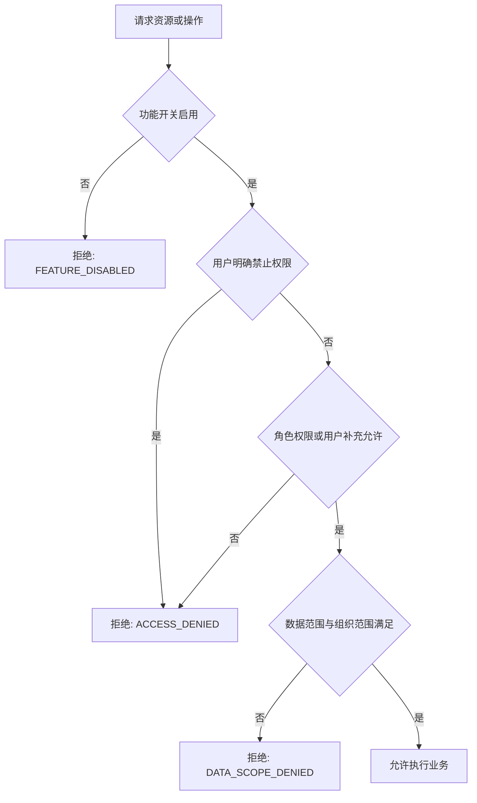

# 灵动学习权限与安全设计

**版本**：V1.0（设计基线草案）  
**状态**：待评审  
**业务依据**：BRD 第 3.1、3.2、6.2 章及已确认未成年人定位规则  
**关联设计**：[FSD](01-功能详细设计-FSD-V1.0.md)、[数据库设计](04-数据库设计-V1.0.md)、[API 设计](06-API接口设计-V1.0.md)

## 1. 安全目标

1. 只允许经过认证、授权且满足数据范围的用户访问业务；前端隐藏不是安全边界，所有判定在后端强制执行。
2. 保护未成年人、家长、学习、情绪和位置数据，不以产品分析、营销、画像或广告目的扩展使用。
3. 确保系统审核员的权限严格限于系统管理员提交的高风险系统任务，杜绝其进入普通业务审核流。
4. 将功能开关纳入安全决策，关闭后拒绝旧链接、接口调用、位置采集、地图调用和后台自动任务。
5. 所有敏感操作、导出、系统配置、权限变更和第三方调用可审计、可追溯、可复核。

## 2. 身份与会话安全

| 控制项 | 当前实施情况与后续要求 |
|---|---|
| 认证凭证 | 已实现平台账号 Web 密码登录和学生账号小程序登录。后端以 `SecureRandom` 生成访问凭证和刷新凭证，只保存其 SHA-256 摘要到 `auth_device_session`；每次认证均查询 `ACTIVE` 会话、客户端类型、访问凭证到期时间和用户启用状态。访问凭证默认 30 分钟，刷新凭证默认 7 天。 |
| 密码 | 已实现：复用 `sys_user.password_hash` 保存 BCrypt 不可逆散列，不记录明文、不写入日志、不返回 API；密码规则为 8 至 20 位且同时包含字母和数字。仅 `SYS_ADMIN` 可通过应用服务为平台账号设置或重置密码。 |
| 刷新与撤销 | 已实现：刷新成功时同时轮换两类凭证，旧刷新凭证立即失效。访问凭证到期只拒绝该访问凭证，不提前终止仍有效的刷新凭证；刷新凭证到期、退出、指定设备下线和一键下线才会使会话不可继续使用。 |
| 设备管理 | 已实现：每次登录建立设备会话；支持退出当前设备、下线指定自身设备和一键下线，服务端通过 `SIGNED_OUT` 或 `REVOKED` 状态使旧访问/刷新凭证立即失效。设备列表不返回原始令牌或摘要。 |
| 验证码 | V21 已实现学生登录图形验证码：默认 2 分钟有效、一次消费、绑定学生账号和设备标识，并按来源限制申请频率。短信 6 位验证码仍未实现。 |
| 学生登录码 | V21 已实现 4 位随机登录码；每条凭证使用独立 16 字节随机盐和带版本密钥的 HMAC-SHA256，不以明文、可逆密文或普通无密钥摘要持久化。第 5 次失败要求图形验证码，第 10 次锁定 15 分钟，成功后清零失败状态。 |
| 二维码登录 | 设计目标，尚未实现。后续二维码应 5 分钟有效、单次消费并绑定发起会话。 |
| 微信绑定 | 设计目标，尚未实现。家长微信与手机号账号、学生微信与学生账号的绑定模型和回退方式须随账号关系模块落地。 |
| 防暴力与频控 | V21 已对学生登录按账号设备每分钟 10 次、来源每分钟 60 次限流，对验证码按来源 5 分钟 10 次限流；Redis 或保护存储不可用时返回 503，不允许绕过风控继续登录。绑定、导出、上传的专项频控仍待对应模块实现。 |

当前认证失败、令牌缺失或失效返回 HTTP 401 与 `AUTH_REQUIRED`，已认证但无权操作他人会话返回 HTTP 403 与 `ACCESS_DENIED`。认证接口不启用 Spring Security 自动生成的默认用户；密码、原始访问凭证、原始刷新凭证和令牌摘要不得写入响应日志、异常信息或数据库明文字段。

### 2.1 V21 学生身份专项控制

1. 学生账号使用 `YYNNNNNN` 年度序列规则。序列在数据库行锁事务内分配，达到年度上限后明确失败，不循环、不复用；账号只能由受权家长或机构管理员创建学生或初始化历史学生时生成。
2. `STUDENT` 用户只允许通过学生登录端点建立 `MINIAPP` 会话；平台密码登录拒绝学生账号，平台用户也不能借学生接口创建小程序学生会话。
3. 初始登录码和重置登录码只在单次成功响应出现。重置与撤销该学生全部活动会话处于同一事务，避免旧设备继续使用。
4. 生产启动必须提供当前密钥版本对应的 Base64 密钥，解码后至少 32 字节；配置只保存环境变量占位，不在代码、Flyway、日志或前端产物中写入真实密钥。密钥轮换通过 `key_version` 保持旧摘要可校验，再按受控流程重置或迁移。
5. 未知账号、错误类型、停用账号、无凭证和登录码错误统一执行等价摘要比较并返回 `STUDENT_AUTH_FAILED`，不向客户端暴露账号是否存在。来源地址取服务端连接地址，不直接信任未经受控代理校验的转发头。
6. `STUDENT_CODE_LOGIN` 是后端强制安全边界：关闭后公开能力摘要返回不可用，小程序隐藏入口，直达登录页不可操作，验证码与登录接口拒绝请求且不创建会话。

## 3. 授权模型

### 3.1 决策顺序

功能开关、角色、用户权限、数据范围和组织范围必须同时由后端读取并计算；不得由客户端传入角色、组织范围或“管理员”标识代替。

**当前实施边界**：V16 已在 IAM 管理接口实现“Bearer 会话认证 -> `@RequirePermission` 动态 RBAC 决策 -> 应用服务业务规则”的请求链，V17 沿用该链路开放组织类型和组织树管理，V18 沿用该链路开放用户目录和账号状态变更。权限决策实时读取角色授权和用户级 `ALLOW`/`DENY`，其中 `DENY` 优先；没有权限时在进入 Controller 前返回 `403 ACCESS_DENIED`。权限目录变更、用户显式权限配置、密码设置及角色/组织数据范围配置即使通过路由权限，仍由应用服务额外验证操作者是 `SYS_ADMIN`，不满足时同样返回 `403 ACCESS_DENIED`。V17 的组织树全量读取和组织新增、V18 的用户目录查询均仅向 `SYS_ADMIN` 种子授权，因为角色数据范围、用户组织关联和组织管理员范围尚未接入对应查询的服务端过滤条件。V18 的账号停用或锁定会撤销目标用户全部活动设备会话，重新启用不恢复旧会话。V19 的学生接口在该链路后执行关系范围校验：`STUDENT_CREATE` 仅授予家长、机构管理员，`STUDENT_READ` 授予系统管理员、家长、机构管理员；系统管理员全量读取，家长按活动亲子关系读取，机构管理员按其直接管理组织的活动学生关系读取。跨范围详情返回 `404 RESOURCE_NOT_FOUND`，请求体中的组织标识只作为待校验目标，不能替代组织管理员身份。功能开关与对象数据范围尚未形成通用 HTTP 拦截链，后续业务接口必须按本节流程补齐，不能把 V16-V20 的实现路径视作全业务通用授权完成。

V20 延续上述链路。`STUDENT_PARENT_INVITE_CREATE` 只授予 `ORG_ADMIN`：即使请求已通过 RBAC，应用服务仍验证目标组织启用、操作者为该组织直接管理员、学生与该组织有活动直接关系、学生没有有效主家长；系统管理员不能替代机构管理员创建。`STUDENT_PARENT_INVITE_RESPOND` 只授予 `PARENT`：应用服务再验证请求令牌的 SHA-256 摘要、邀请状态及七天有效期；系统管理员不能替代家长响应。原始令牌只在创建响应返回一次，任何持久化、日志、异常文本和后续读取接口均不得出现原始令牌。接受邀请以条件状态更新和主家长唯一约束共同防止并发重复绑定。

V22 学习任务继续使用“功能开关 -> 客户端权限 -> 动态 RBAC -> 来源角色 -> 对象/组织范围 -> 状态”的后端决策顺序。`LEARNING_TASK_MANAGEMENT` 是后端强制边界；关闭后 Web 和小程序隐藏入口、直达页面不请求任务数据，班级关系、候选项、草稿、发布和学生任务接口均返回 `FEATURE_DISABLED`。公开能力接口仅返回启停布尔值，不返回角色、组织、任务数量或其他敏感数据。

| V22 操作 | 客户端与权限 | 服务端数据范围 |
|---|---|---|
| 配置学生当前班级 | Web；`STUDENT_CLASS_ASSIGN` | 仅机构管理员授权组织子树内启用学生和班级。 |
| 配置教师班级 | Web；`TEACHER_CLASS_ASSIGN` | 仅机构管理员授权组织子树内启用教师和班级。 |
| 创建/编辑任务 | Web；`LEARNING_TASK_CREATE` | 家长活动主关系、机构管理员组织子树或教师活动班级；来源创建后不可修改。 |
| 管理查询 | Web；`LEARNING_TASK_READ_MANAGED` | 家庭和教师任务仅创建人；机构任务仅来源组织位于当前数据范围。 |
| 单项/批量发布 | Web；`LEARNING_TASK_PUBLISH` | 发布前重新校验来源、目标、审核人和学生启用状态；已发布不可重复。 |
| 学生本人任务 | 小程序；`TASK_ASSIGNMENT_READ_SELF` | 从会话用户反查学生档案，不接受客户端学生标识；其他学生实例统一返回 404。 |

家庭任务定义、原始目标和其他家庭成员不得向机构或教师返回。学生实例只返回本人展示所需的任务快照、来源名称、审核人显示名和当前状态，不返回班级原始目标、其他学生、完整账号、手机号或家庭关系。所有 19 位标识按字符串交给前端，避免 JavaScript 精度损失。批量发布对外失败原因中性化，内部日志可以记录任务标识和异常栈，但不得记录密钥、登录码或其他请求敏感字段。

### 3.2 角色边界

| 角色 | 允许范围 | 明确禁止 |
|---|---|---|
| 系统管理员 | 组织、用户、角色、权限、数据范围、系统配置、功能开关、系统任务发起、全局审计管理 | 不能绕过系统审核使高风险系统任务直接生效。 |
| 系统审核员 | 查看、审批、驳回系统管理员提交的高风险系统任务及其历史 | 不审批学习任务、打卡、积分、兑换、考勤或自己提交的系统任务；不管理角色和组织。 |
| 机构（学校）管理员 | 授权机构范围内学校、班级、教师、学生、机构任务、考勤、报表 | 不读取家庭私有任务、家庭奖励、家庭积分配置、家庭复盘。 |
| 教师 | 授权班级任务、进度、教师任务审核、异常报备 | 不读家庭私有数据，不操作其他班级或系统配置。 |
| 主家长 | 绑定学生、家庭任务、打卡审核、奖励、兑换、复盘 | 不编辑机构/教师任务、不访问其他家庭或班级明细。 |
| 副家长 | 绑定学生的允许查看数据与规定通知 | 默认无家庭任务编辑、审核、奖励配置和兑换审批。 |
| 学生 | 本人任务执行、暂停/搁置、打卡、积分和兑换申请、个人成长查看 | 不配置任务、积分、奖励、组织、账号关系或任何审核。 |

系统内置六类角色不得删除。系统管理员新建自定义角色时，权限、数据范围和组织范围不得超出该管理员被授予的可授权边界；自定义角色停用后立即失去访问效果。

### 3.3 数据范围

| 范围 | 计算规则 |
|---|---|
| 全部 | 仅系统级被授权角色；仍受功能开关和业务隐私规则限制。 |
| 本区域/本学校/本班级 | 目标组织必须是用户组织关联和角色/组织管理员范围交集中的节点或子树。 |
| 自定义 | 目标组织必须落在角色配置的自定义组织根节点子树内，并同时通过用户组织关联。 |
| 本人 | 只适用于用户自身、绑定学生或学生本人等业务实体，不自动赋予组织树读取能力。 |
| 家庭 | 以有效亲子关系为事实源；机构关联不能扩大为家庭私有数据读取权。 |

数据范围要在数据库查询条件或服务端对象授权中落实，禁止先查全量结果后由前端隐藏。组织管理员绑定进一步收缩数据范围，不可被同一用户的其他允许权限扩大。

## 4. 功能开关与高风险操作

1. 每个受控接口和后台任务先校验功能开关。关闭时拒绝新建、编辑、审核、采集、生成新待办、新通知和新数据。
2. 全局功能开关调整必须形成系统任务，经系统审核员审批，生效后清理功能开关缓存并写变更日志。
3. 高风险系统任务还包括重要组织停用、数据恢复、敏感导出、全量/会话缓存清除、接口服务新增/停用/扩大授权、跨区域组织管理员授权、关键字典变更和超组织范围数据权限调整。
4. 系统任务审批必须区分“审批通过”和“实际生效”。只有受影响配置/操作已成功执行后，任务才可标记为已生效。
5. 维护模式是全局写入控制；启动前 24 小时公告，维护期间只允许历史数据只读访问。

## 5. 未成年人隐私与数据保护

### 5.1 数据分类

| 分类 | 示例 | 控制要求 |
|---|---|---|
| 一般业务数据 | 组织名称、任务标题、字典项 | 常规 RBAC、审计与最小必要访问。 |
| 个人信息 | 姓名、手机号、头像、设备信息、亲子关系 | 访问最小化、传输保护、展示和导出脱敏。 |
| 敏感成长数据 | 学习记录、积分、情绪暂停、难题搁置、异常报备 | 严格按角色和学生关系访问，不用于画像、营销或数据挖掘。 |
| 位置与轨迹 | 围栏命中、签到签退、轨迹坐标 | 默认不采集；开关、审批、授权、角色和数据范围全部满足才可处理。 |
| 密钥与凭证 | 微信密钥、对象存储密钥、接口客户端密钥 | 环境密钥/受控密钥管理；永不存储于代码、迁移、日志、接口响应或前端包。 |

### 5.2 脱敏与导出

1. 页面和导出按角色、场景和最小必要原则脱敏；手机号显示前 3 位和后 4 位，中间 4 位替换为 `****`。
2. 姓名按姓氏加掩码展示，例如“张*”；未成年人手机号在导出中完全脱敏不展示。
3. 导出先通过功能、权限、组织/学生范围和敏感导出审批校验，再创建导出任务；记录导出人、时间、范围、原因和文件。
4. 对外接口默认不返回未成年人位置、情绪、家庭私有任务、家庭奖励和家庭积分配置。
5. V18 用户目录接口不返回密码散列、会话或令牌；手机号沿用本节规则，长度不足 7 位时仅返回 `****`。

### 5.3 位置专项

1. `GEO_ATTENDANCE` 与 `STUDENT_LOCATION_TRACK` 默认关闭，首次个人主体工具类目小程序构建包不包含位置/地图能力。
2. 后续启用须依次满足：系统管理员发起高风险任务 -> 系统审核员审批 -> 发布主体与平台条件满足 -> 家长位置授权有效 -> 功能、组织、角色范围满足。
3. 家长可以撤销授权；撤销后服务端立即停止新位置采集、签到签退和轨迹生成。已有数据按留存规则处理。
4. 学生轨迹最多留存 180 天；机构授权角色可按范围查看，家长只查看考勤结果。

## 6. 审计、日志与不可抵赖

| 事件 | 必须记录的信息 |
|---|---|
| 登录、退出、锁定、设备下线 | 用户、设备、登录方式、结果、来源、时间、请求标识。 |
| 权限、组织、组织管理员变更 | 操作人、对象、变更前后、原因、时间、审批任务（如有）。 |
| 系统任务 | 发起人、审批人、任务类型、影响范围、状态、意见、实际生效结果。 |
| 导出、缓存、配置、附件、模板、接口服务 | 操作人、资源、范围、结果、失败说明、时间、请求标识。 |
| 任务审核、积分纠错、兑换、异常报备 | 业务对象、执行人、审核人、前后状态、意见、时间。 |
| 第三方调用 | 服务名称、方向、调用方、结果、异常摘要、请求标识；不记录敏感完整报文。 |

操作日志热存储 180 天后冷归档。归档记录仍可检索、查询和导出，但不得手工篡改或无审计删除。

## 7. 输入、文件与接口安全

1. 所有请求参数经过服务端类型、长度、枚举、范围和状态校验；禁止将客户端传入的组织 ID、用户 ID、角色代码直接视为授权依据。
2. MyBatis XML 使用参数绑定，禁止 SQL 字符串拼接；动态排序字段使用服务端白名单。
3. 附件先校验格式、大小、归属和权限，再写入对象存储；下载/预览每次按业务数据权限校验，使用短时受控授权而不是永久公开链接。
4. 导入文件先匹配受控模板，逐行校验，隔离失败行；不把原始导入内容直接拼接进 SQL 或日志。
5. 对外接口使用独立客户端身份、授权范围、签名/时间戳/重放防护和调用日志；不能共享后台用户会话。
6. 所有外部回调需验证来源、签名和幂等性；回调失败不暴露内部异常细节。

## 8. 安全验收用例

- [ ] 功能关闭后，菜单、路由、旧链接、接口和后台任务均无法执行新操作。
- [ ] 系统审核员不能访问学习任务、积分、兑换、考勤审核接口，且不能审批自己提交的系统任务。
- [ ] 家长、教师、机构管理员跨学生、跨班级、跨学校、跨家庭请求均被后端拒绝。
- [ ] 用户明确禁止权限覆盖角色允许；用户补充权限不能扩大组织/数据范围。
- [ ] 停用用户、停用角色、停用组织和失效会话立即失去访问能力。
- [ ] 密码、登录码、密钥、微信凭证、位置坐标和完整敏感报文不出现在响应、日志或前端构建产物中。
- [ ] 定位未审批、未授权、已撤销授权或默认关闭时，服务端不产生新的位置、考勤和轨迹记录。
- [ ] 敏感导出未获审批时不能生成文件；获批导出仍按脱敏和数据范围生成。

## 9. V23-V24 任务执行、业务审核与积分安全边界

| 权限码 | 客户端 | 默认角色 | 服务端附加范围 |
|---|---|---|---|
| `TASK_ASSIGNMENT_EXECUTE_SELF` | `MINIAPP` | 学生 | 只从当前会话反查学生档案，只能操作本人任务实例。 |
| `TASK_ASSIGNMENT_REVIEW` | `WEB` | 家长、教师、机构管理员 | 只读取和操作当前审核人待办；候选审核人按家庭主关系、活动班级或机构范围裁剪。 |
| `TASK_ASSIGNMENT_EXEMPT` | `WEB` | 家长、教师、机构管理员 | 家庭任务限活动主家长；教师任务限创建教师或组织管理员；机构任务限组织数据范围。 |

1. 任务实例跨学生、跨家庭、跨班级或跨审核人访问统一返回 `404 RESOURCE_NOT_FOUND`，避免对象枚举。
2. 暂停、打卡、驳回、转交和免执行均在任务实例行锁内校验期望状态和版本号；并发旧请求返回 `409 STATE_CONFLICT`。
3. 打卡和审核意见执行必填、长度和枚举校验；MyBatis XML 全部使用参数绑定。V23 只接收文字打卡，不接受客户端文件路径或外部 URL。
4. 转交目标不能由客户端任意指定，必须命中服务端候选查询；转交前后审核人、操作人、原因和时间写入独立历史。
5. `LEARNING_TASK_MANAGEMENT` 停用后，Web 审核视图、小程序执行入口和后端写接口同时不可用。
6. V24 审核通过端点不接收客户端积分、学生、来源或账户余额；服务端从锁定的任务与账户计算并在一个事务内完成打卡、任务、账户、台账和事件写入。
7. 积分账户使用版本条件更新；任务奖励和 V26 纠错均锁定任务、打卡和账户，重复审核、并发旧请求或任一步写入失败均不得产生部分入账。

## 10. V25 积分账户与台账查询安全边界

| 权限码 | 客户端 | 默认角色 | 服务端附加范围 |
|---|---|---|---|
| `GROWTH_POINT_READ_SELF` | `MINIAPP` | 学生 | 从当前会话反查启用学生档案，不接受学生标识。 |
| `GROWTH_POINT_READ_CHILD` | `WEB` | 家长 | 仅活动 `PRIMARY_GUARDIAN` 且固定 `PRIMARY` 范围的学生。 |

1. `GROWTH_POINT_QUERY` 是独立全局开关；前端入口与直达页隐藏只是体验控制，后端应用服务始终执行强制开关校验。
2. 统一积分账户汇总家庭、机构和教师来源，教师、机构管理员、系统管理员、系统审核员均不获得读取统一账户的内置权限，防止家庭数据通过汇总值侧漏。
3. 家长跨学生请求统一返回 `404 RESOURCE_NOT_FOUND`；学生端点不允许 Web 会话，家长端点不允许小程序会话，即使后续发生错误用户级授权也不能绕过客户端和角色前置条件。
4. 查询只读取不可变台账和账户快照，不提供更改、删除或覆盖接口；账户内部 `version_no` 不进入响应，所有 19 位标识按字符串序列化。
5. 机构与教师统计进入后续版本时必须以 `source_type`、`source_organization_id` 和组织/班级范围共同过滤，不能通过学生统一账户推算或导出家庭私有来源。

## 11. V26 积分纠错安全边界

| 权限码 | 客户端 | 默认角色 | 服务端附加范围 |
|---|---|---|---|
| `GROWTH_POINT_CORRECT_CHILD` | `WEB` | 家长 | 活动主关系学生、家庭来源奖励、当前家长本人原审核、72 小时内、未纠错且任务仍已完成。 |

1. `GROWTH_POINT_CORRECTION` 与查询开关独立；关闭后 Web 隐藏操作列，后端仍先于业务读取强制拒绝，`MINIAPP` 能力摘要不声明纠错能力。
2. 接口先校验 Web 家长身份和活动主关系，跨学生按 404 处理；教师、机构管理员、系统管理员、系统审核员和学生均无内置纠错权限。
3. 客户端不得提交积分值。服务端从锁定的原奖励计算累计扣减和可用扣减，并同时校验原审核人、来源、时限、任务、打卡和账户版本。
4. 原奖励不可覆盖；反向台账唯一关联原奖励，任务事件记录操作人、前后状态、原因、原台账和纠错台账。事务失败不得遗留余额、状态或日志的部分变化。
5. 可用积分未来可能已被兑换，故纠错最多扣至 0；累计积分仍整笔扣除。该规则避免负余额且保留 `amount` 与 `available_delta` 的独立审计语义。

## 12. V27 家庭奖励与兑换安全边界

| 权限码 | 客户端 | 默认角色 | 服务端附加范围 |
|---|---|---|---|
| `REWARD_MANAGE_CHILD` | `WEB` | 家长 | 仅活动主关系学生；可维护该学生奖励，创建人只作审计记录。 |
| `REWARD_EXCHANGE_REVIEW_CHILD` | `WEB` | 家长 | 仅活动主关系学生；可查询并处理该学生兑换。 |
| `REWARD_EXCHANGE_SELF` | `MINIAPP` | 学生 | 只从当前会话反查学生档案，仅可查询和申请本人奖励。 |

1. `REWARD_EXCHANGE` 停用后 Web、小程序入口和直达页均隐藏，后端奖励、摘要、申请与处理端点仍在读取业务对象前强制拒绝；前端门禁不能替代服务端控制。
2. 家长对象范围以当前活动 `PRIMARY_GUARDIAN` 主关系为准。跨家庭、跨学生和主关系失效统一返回 404；教师、机构管理员、系统管理员和系统审核员均无家庭奖励内置权限。
3. 学生申请只提交奖励标识，学生身份、奖励归属、所需积分、状态和有效期均由服务端计算；不得信任客户端传入的学生、积分、余额或兑换状态。
4. 申请保存奖励名称、积分和描述快照，后续奖励编辑、下架、逻辑删除或主家长变化不能改写历史兑换事实。
5. 同意兑换在同一事务内锁定兑换、奖励和学生积分账户，再校验审批期限、奖励有效期、活动主关系和可用余额；版本条件更新与 `source_exchange_id` 唯一约束共同防止重复扣分。
6. 并发审批只允许一个请求成功，其他旧请求返回 409；兑换状态、可用余额和唯一不可变台账任一步失败时整体回滚。台账中的 19 位兑换来源标识按字符串输出，Web 与小程序均可追溯到对应兑换。

## 13. V28 成长复盘安全边界

| 权限码 | 客户端 | 默认角色 | 服务端附加范围 |
|---|---|---|---|
| `GROWTH_REVIEW_READ_SELF` | `MINIAPP` | 学生 | 由当前会话反查启用学生档案，只能查询本人历史。 |
| `GROWTH_REVIEW_SUPPLEMENT_SELF` | `MINIAPP` | 学生 | 只允许本人日复盘且处于补录窗口。 |
| `GROWTH_REVIEW_READ_CHILD` | `WEB` | 家长 | 仅活动 `PRIMARY_GUARDIAN` 主关系学生。 |
| `GROWTH_REVIEW_SUPPLEMENT_CHILD` | `WEB` | 家长 | 仅活动主关系学生的日复盘且处于补录窗口。 |

1. 学生端点不接收学生标识；家长端点必须同时校验 Web 客户端、家长角色、动态权限和当前活动主关系。教师、机构管理员、系统管理员、系统审核员均不获得家庭复盘内置权限。
2. 复盘查询使用学生对象范围隔离，跨家庭、跨学生和复盘归属不匹配统一按 404 处理，避免通过标识枚举学生及家庭数据。
3. `DAILY_GROWTH_REVIEW`、`PERIODIC_GROWTH_REPORT` 关闭后前端隐藏相应入口和周期，后端停止新生成；历史快照仍按既有权限读取。日复盘补录受每日开关拦截。
4. 自动生成只读取服务端任务、暂停和不可变积分台账事实。客户端不能提交指标、完成率、积分、快照版本、事实指纹或生成时间。
5. 每次事实变化通过新快照版本留存，旧快照、分类和趋势不得更新或删除；补录写入独立追加表，不修改统计快照。所有 19 位标识按字符串响应。
6. 批处理按雪花学生标识游标分页，单个学生失败只记录不含敏感正文的业务摘要并继续；重复事实指纹不新增版本，避免重试制造重复快照。

## 14. V29 积分生命周期安全边界

1. `POINT_LIFECYCLE` 是服务端强制开关。关闭后衰减计算回退为全额发放，沉睡后台任务直接退出；客户端隐藏展示不是授权依据。
2. 连续任务天数只能由服务端根据同一任务标识、学生、来源和计划自然日计算，不能接受客户端传入的连续天数、比例、规则或积分值。
3. 审核通过继续在任务、打卡和账户锁内完成；衰减规则选择与积分台账写入处于同一事务，规则变化只影响其生效时点之后的新台账，不回写历史。
4. 纠错台账不得计入连续完成历史；复制任务产生新任务标识，不得通过标题、分类或客户端参数冒充原固定任务以继承连续天数。
5. 沉睡批处理按学生游标分页并逐学生开启独立事务。清零使用账户版本条件更新和唯一来源通知约束，重复调度或并发执行不得重复扣减。
6. 有效活跃仅包括任务执行事件、非休眠清零积分变动和用户主动复盘补录；登录、查看、系统自动复盘生成及提醒创建不能重置沉睡周期。
7. 提醒收件人只从当前活动主家长关系查询，不接受批处理参数指定。无主家长时保存 `NO_RECIPIENT`，不得改投其他家长、教师或机构管理员。
8. Web 与小程序只能读取已获对象权限的台账审计字段；教师和机构管理员不能借助统一账户或沉睡状态推断家庭私有积分信息。沉睡状态和提醒记录不提供通用前端查询接口。

## 15. V30 每日固定任务安全边界

1. 固定任务创建、发布、生成和停止均受 `LEARNING_TASK_MANAGEMENT` 后端开关控制；关闭后批处理直接退出，Web 隐藏入口不能替代后端拦截。
2. 停止沿用 `LEARNING_TASK_PUBLISH` 权限并再次执行任务来源范围校验。家庭任务只允许创建家长，教师任务只允许创建教师，机构任务按组织管理员授权子树判断；越权统一返回 404。
3. 发布时计划与首日实例同事务写入；后台锁定计划行后生成，计划级 `REQUIRES_NEW` 隔离异常，实例唯一约束和缺失学生查询共同保证重复调度不重复写入。
4. 计划日期、当前有效目标和审核人均来自服务端持久化数据；客户端不能提交生成游标、计划状态、版本、学生集合或任务实例标识。
5. 主动停止使用 `ACTIVE -> STOPPED` 条件更新并记录操作人和时间，不删除已生成实例。所有计划、任务、学生和操作人雪花标识在 API 中按字符串传输。
6. 调度固定使用 `Asia/Shanghai`，默认每日 00:05 执行；测试配置关闭自动调度。真实环境启用前需完成单节点或分布式调度互斥验证。

## 16. V31 图片打卡附件安全边界

1. 上传仅允许小程序学生在 `LEARNING_TASK_CHECKIN/IMAGE` 规则下执行；读取允许学生本人和当前有效审核人，越权统一返回 404，避免文件标识探测。
2. 服务端同时校验扩展名、图片文件头和规则大小，不信任客户端 MIME；`application/octet-stream` 仅在文件头与扩展名一致时归一化为受支持图片类型。
3. 存储键由服务端生成并由存储适配器校验归一化路径，API 不返回本地路径、对象键、永久直链或存储凭证；文件内容摘要使用 SHA-256 保存。
4. 打卡关联前校验上传人、模块、分类、未删除和未关联状态；打卡、任务状态、事件及关系处于同一事务。已关联附件不得由临时删除接口删除或复用。
5. 本地目录适配器仅用于本地开发和自动化测试。接入对象存储时继续实现统一内容存储端口，并补齐病毒扫描、生命周期、失败补偿及受控临时访问策略。

## 17. V32 待优化与顺延安全边界

1. 待优化扫描与自动顺延受 `LEARNING_TASK_MANAGEMENT` 后端开关控制；关闭后调度直接退出，前端隐藏不替代后端拒绝。
2. 手动顺延只允许 Web 端具有 `TASK_ASSIGNMENT_DEFER` 权限的家长、教师和机构管理员。家庭任务再次核验活动主家长关系，教师任务核验任务创建人，机构任务核验授权组织子树；越权对象统一返回 404。
3. 客户端只能提交未来 1 至 7 天目标日期，不得提交学生、来源任务、顺延类型、迁移次数、隔夜标记、操作人或目标任务标识。所有派生字段由服务端从锁定事实计算。
4. 自动与手动顺延均在事务内锁定实例，复制任务定义与标签、迁移原实例并写入不可变历史。状态条件、版本和唯一约束共同防止重复调度及并发改期。
5. 23:59 系统事件允许操作人为空并明确记录系统原因；手动历史必须记录当前用户。顺延不补发积分、不修改既有审核、台账或历史复盘快照。
6. 小程序只读取本人任务的隔夜迁移标记，不开放顺延权限或管理接口；19 位标识继续按字符串传输，防止 JavaScript 精度丢失。

## 18. V33 按学生复制昨日任务安全边界

1. 复制接口同时校验 `LEARNING_TASK_MANAGEMENT`、`COPY_PREVIOUS_DAY_TASK`、Web 客户端、`PARENT` 角色、动态权限和活动主家长对象范围；系统管理员、教师和机构管理员不能替代家长操作。
2. 客户端不得提交源日期、目标日期、源任务列表、目标任务标识、审核人、积分、状态或重试状态；服务端从上海业务日、关系和数据库事实派生。
3. 候选 SQL 固定过滤当前家长创建的家庭任务和指定学生，不返回其他家长、机构或教师任务；越权学生、批次和条目统一按不可访问资源处理。
4. 批次和条目均以唯一约束防重，条目使用独立事务；失败信息对客户端使用中性文案，不暴露数据库、任务归属或内部异常。重复请求仅恢复待处理条目。
5. 复制不携带打卡、附件、审核、积分、暂停、顺延或周期计划，防止历史事实和奖励重复；新任务标识使连续完成规则重新计数。
6. 小程序公共能力固定返回复制不可用，前端产物不包含入口；所有批次、条目和任务雪花标识继续按字符串传输。

## 19. V34 任务模板安全边界

1. 查询同时校验双功能开关、Web 客户端、家长角色和 `LEARNING_TASK_TEMPLATE_READ`；维护操作额外校验 `LEARNING_TASK_TEMPLATE_MANAGE_PERSONAL`。
2. 系统模板由迁移预置且应用服务拒绝编辑、删除和排序；个人模板的拥有者由当前会话服务端写入，客户端不得指定范围或拥有者。
3. 所有个人模板查询和锁定 SQL 均带当前家长标识；跨家长模板与系统模板管理按不可访问资源处理，避免通过错误差异枚举数据。
4. 名称唯一同时使用应用预查和数据库唯一约束，数据库并发冲突转换为业务状态冲突；编辑、删除和全量排序均校验乐观版本。
5. 模板只保存可复用字段，不保存学生、日期、审核人、状态、积分、附件或历史事实；选用模板仍走原任务创建和发布权限、范围及状态校验。
6. 小程序公共能力固定关闭且产物不包含模板入口；所有模板雪花标识按字符串传输，功能停用时 Web 隐藏且后端拒绝。
