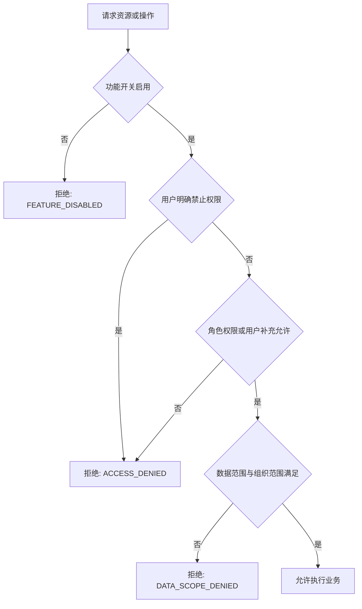

# 灵动学习权限与安全设计

**版本**：V1.0（设计基线草案）  
**状态**：待评审  
**业务依据**：BRD 第 3.1、3.2、6.2 章及已确认未成年人定位规则  
**关联设计**：[FSD](01-功能详细设计-FSD-V1.0.md)、[数据库设计](04-数据库设计-V1.0.md)、[API 设计](06-API接口设计-V1.0.md)

## 1. 安全目标

1. 只允许经过认证、授权且满足数据范围的用户访问业务；前端隐藏不是安全边界，所有判定在后端强制执行。
2. 保护未成年人、家长、学习、情绪和位置数据，不以产品分析、营销、画像或广告目的扩展使用。
3. 确保系统审核员的权限严格限于系统管理员提交的高风险系统任务，杜绝其进入普通业务审核流。
4. 将功能开关纳入安全决策，关闭后拒绝旧链接、接口调用、位置采集、地图调用和后台自动任务。
5. 所有敏感操作、导出、系统配置、权限变更和第三方调用可审计、可追溯、可复核。

## 2. 身份与会话安全

| 控制项 | 当前实施情况与后续要求 |
|---|---|
| 认证凭证 | 已实现平台账号 Web 密码登录和学生账号小程序登录。后端以 `SecureRandom` 生成访问凭证和刷新凭证，只保存其 SHA-256 摘要到 `auth_device_session`；每次认证均查询 `ACTIVE` 会话、客户端类型、访问凭证到期时间和用户启用状态。访问凭证默认 30 分钟，刷新凭证默认 7 天。 |
| 密码 | 已实现：复用 `sys_user.password_hash` 保存 BCrypt 不可逆散列，不记录明文、不写入日志、不返回 API；密码规则为 8 至 20 位且同时包含字母和数字。仅 `SYS_ADMIN` 可通过应用服务为平台账号设置或重置密码。 |
| 刷新与撤销 | 已实现：刷新成功时同时轮换两类凭证，旧刷新凭证立即失效。访问凭证到期只拒绝该访问凭证，不提前终止仍有效的刷新凭证；刷新凭证到期、退出、指定设备下线和一键下线才会使会话不可继续使用。 |
| 设备管理 | 已实现：每次登录建立设备会话；支持退出当前设备、下线指定自身设备和一键下线，服务端通过 `SIGNED_OUT` 或 `REVOKED` 状态使旧访问/刷新凭证立即失效。设备列表不返回原始令牌或摘要。 |
| 验证码 | V21 已实现学生登录图形验证码：默认 2 分钟有效、一次消费、绑定学生账号和设备标识，并按来源限制申请频率。短信 6 位验证码仍未实现。 |
| 学生登录码 | V21 已实现 4 位随机登录码；每条凭证使用独立 16 字节随机盐和带版本密钥的 HMAC-SHA256，不以明文、可逆密文或普通无密钥摘要持久化。第 5 次失败要求图形验证码，第 10 次锁定 15 分钟，成功后清零失败状态。 |
| 二维码登录 | 设计目标，尚未实现。后续二维码应 5 分钟有效、单次消费并绑定发起会话。 |
| 微信绑定 | 设计目标，尚未实现。家长微信与手机号账号、学生微信与学生账号的绑定模型和回退方式须随账号关系模块落地。 |
| 防暴力与频控 | V21 已对学生登录按账号设备每分钟 10 次、来源每分钟 60 次限流，对验证码按来源 5 分钟 10 次限流；Redis 或保护存储不可用时返回 503，不允许绕过风控继续登录。绑定、导出、上传的专项频控仍待对应模块实现。 |

当前认证失败、令牌缺失或失效返回 HTTP 401 与 `AUTH_REQUIRED`，已认证但无权操作他人会话返回 HTTP 403 与 `ACCESS_DENIED`。认证接口不启用 Spring Security 自动生成的默认用户；密码、原始访问凭证、原始刷新凭证和令牌摘要不得写入响应日志、异常信息或数据库明文字段。

### 2.1 V21 学生身份专项控制

1. 学生账号使用 `YYNNNNNN` 年度序列规则。序列在数据库行锁事务内分配，达到年度上限后明确失败，不循环、不复用；账号只能由受权家长或机构管理员创建学生或初始化历史学生时生成。
2. `STUDENT` 用户只允许通过学生登录端点建立 `MINIAPP` 会话；平台密码登录拒绝学生账号，平台用户也不能借学生接口创建小程序学生会话。
3. 初始登录码和重置登录码只在单次成功响应出现。重置与撤销该学生全部活动会话处于同一事务，避免旧设备继续使用。
4. 生产启动必须提供当前密钥版本对应的 Base64 密钥，解码后至少 32 字节；配置只保存环境变量占位，不在代码、Flyway、日志或前端产物中写入真实密钥。密钥轮换通过 `key_version` 保持旧摘要可校验，再按受控流程重置或迁移。
5. 未知账号、错误类型、停用账号、无凭证和登录码错误统一执行等价摘要比较并返回 `STUDENT_AUTH_FAILED`，不向客户端暴露账号是否存在。来源地址取服务端连接地址，不直接信任未经受控代理校验的转发头。
6. `STUDENT_CODE_LOGIN` 是后端强制安全边界：关闭后公开能力摘要返回不可用，小程序隐藏入口，直达登录页不可操作，验证码与登录接口拒绝请求且不创建会话。

## 3. 授权模型

### 3.1 决策顺序

功能开关、角色、用户权限、数据范围和组织范围必须同时由后端读取并计算；不得由客户端传入角色、组织范围或“管理员”标识代替。

**当前实施边界**：V16 已在 IAM 管理接口实现“Bearer 会话认证 -> `@RequirePermission` 动态 RBAC 决策 -> 应用服务业务规则”的请求链，V17 沿用该链路开放组织类型和组织树管理，V18 沿用该链路开放用户目录和账号状态变更。权限决策实时读取角色授权和用户级 `ALLOW`/`DENY`，其中 `DENY` 优先；没有权限时在进入 Controller 前返回 `403 ACCESS_DENIED`。权限目录变更、用户显式权限配置、密码设置及角色/组织数据范围配置即使通过路由权限，仍由应用服务额外验证操作者是 `SYS_ADMIN`，不满足时同样返回 `403 ACCESS_DENIED`。V17 的组织树全量读取和组织新增、V18 的用户目录查询均仅向 `SYS_ADMIN` 种子授权，因为角色数据范围、用户组织关联和组织管理员范围尚未接入对应查询的服务端过滤条件。V18 的账号停用或锁定会撤销目标用户全部活动设备会话，重新启用不恢复旧会话。V19 的学生接口在该链路后执行关系范围校验：`STUDENT_CREATE` 仅授予家长、机构管理员，`STUDENT_READ` 授予系统管理员、家长、机构管理员；系统管理员全量读取，家长按活动亲子关系读取，机构管理员按其直接管理组织的活动学生关系读取。跨范围详情返回 `404 RESOURCE_NOT_FOUND`，请求体中的组织标识只作为待校验目标，不能替代组织管理员身份。功能开关与对象数据范围尚未形成通用 HTTP 拦截链，后续业务接口必须按本节流程补齐，不能把 V16-V20 的实现路径视作全业务通用授权完成。

V20 延续上述链路。`STUDENT_PARENT_INVITE_CREATE` 只授予 `ORG_ADMIN`：即使请求已通过 RBAC，应用服务仍验证目标组织启用、操作者为该组织直接管理员、学生与该组织有活动直接关系、学生没有有效主家长；系统管理员不能替代机构管理员创建。`STUDENT_PARENT_INVITE_RESPOND` 只授予 `PARENT`：应用服务再验证请求令牌的 SHA-256 摘要、邀请状态及七天有效期；系统管理员不能替代家长响应。原始令牌只在创建响应返回一次，任何持久化、日志、异常文本和后续读取接口均不得出现原始令牌。接受邀请以条件状态更新和主家长唯一约束共同防止并发重复绑定。

V22 学习任务继续使用“功能开关 -> 客户端权限 -> 动态 RBAC -> 来源角色 -> 对象/组织范围 -> 状态”的后端决策顺序。`LEARNING_TASK_MANAGEMENT` 是后端强制边界；关闭后 Web 和小程序隐藏入口、直达页面不请求任务数据，班级关系、候选项、草稿、发布和学生任务接口均返回 `FEATURE_DISABLED`。公开能力接口仅返回启停布尔值，不返回角色、组织、任务数量或其他敏感数据。

| V22 操作 | 客户端与权限 | 服务端数据范围 |
|---|---|---|
| 配置学生当前班级 | Web；`STUDENT_CLASS_ASSIGN` | 仅机构管理员授权组织子树内启用学生和班级。 |
| 配置教师班级 | Web；`TEACHER_CLASS_ASSIGN` | 仅机构管理员授权组织子树内启用教师和班级。 |
| 创建/编辑任务 | Web；`LEARNING_TASK_CREATE` | 家长活动主关系、机构管理员组织子树或教师活动班级；来源创建后不可修改。 |
| 管理查询 | Web；`LEARNING_TASK_READ_MANAGED` | 家庭和教师任务仅创建人；机构任务仅来源组织位于当前数据范围。 |
| 单项/批量发布 | Web；`LEARNING_TASK_PUBLISH` | 发布前重新校验来源、目标、审核人和学生启用状态；已发布不可重复。 |
| 学生本人任务 | 小程序；`TASK_ASSIGNMENT_READ_SELF` | 从会话用户反查学生档案，不接受客户端学生标识；其他学生实例统一返回 404。 |

家庭任务定义、原始目标和其他家庭成员不得向机构或教师返回。学生实例只返回本人展示所需的任务快照、来源名称、审核人显示名和当前状态，不返回班级原始目标、其他学生、完整账号、手机号或家庭关系。所有 19 位标识按字符串交给前端，避免 JavaScript 精度损失。批量发布对外失败原因中性化，内部日志可以记录任务标识和异常栈，但不得记录密钥、登录码或其他请求敏感字段。

### 3.2 角色边界

| 角色 | 允许范围 | 明确禁止 |
|---|---|---|
| 系统管理员 | 组织、用户、角色、权限、数据范围、系统配置、功能开关、系统任务发起、全局审计管理 | 不能绕过系统审核使高风险系统任务直接生效。 |
| 系统审核员 | 查看、审批、驳回系统管理员提交的高风险系统任务及其历史 | 不审批学习任务、打卡、积分、兑换、考勤或自己提交的系统任务；不管理角色和组织。 |
| 机构（学校）管理员 | 授权机构范围内学校、班级、教师、学生、机构任务、考勤、报表 | 不读取家庭私有任务、家庭奖励、家庭积分配置、家庭复盘。 |
| 教师 | 授权班级任务、进度、教师任务审核、异常报备 | 不读家庭私有数据，不操作其他班级或系统配置。 |
| 主家长 | 绑定学生、家庭任务、打卡审核、奖励、兑换、复盘 | 不编辑机构/教师任务、不访问其他家庭或班级明细。 |
| 副家长 | 绑定学生的允许查看数据与规定通知 | 默认无家庭任务编辑、审核、奖励配置和兑换审批。 |
| 学生 | 本人任务执行、暂停/搁置、打卡、积分和兑换申请、个人成长查看 | 不配置任务、积分、奖励、组织、账号关系或任何审核。 |

系统内置六类角色不得删除。系统管理员新建自定义角色时，权限、数据范围和组织范围不得超出该管理员被授予的可授权边界；自定义角色停用后立即失去访问效果。

### 3.3 数据范围

| 范围 | 计算规则 |
|---|---|
| 全部 | 仅系统级被授权角色；仍受功能开关和业务隐私规则限制。 |
| 本区域/本学校/本班级 | 目标组织必须是用户组织关联和角色/组织管理员范围交集中的节点或子树。 |
| 自定义 | 目标组织必须落在角色配置的自定义组织根节点子树内，并同时通过用户组织关联。 |
| 本人 | 只适用于用户自身、绑定学生或学生本人等业务实体，不自动赋予组织树读取能力。 |
| 家庭 | 以有效亲子关系为事实源；机构关联不能扩大为家庭私有数据读取权。 |

数据范围要在数据库查询条件或服务端对象授权中落实，禁止先查全量结果后由前端隐藏。组织管理员绑定进一步收缩数据范围，不可被同一用户的其他允许权限扩大。

## 4. 功能开关与高风险操作

1. 每个受控接口和后台任务先校验功能开关。关闭时拒绝新建、编辑、审核、采集、生成新待办、新通知和新数据。
2. 全局功能开关调整必须形成系统任务，经系统审核员审批，生效后清理功能开关缓存并写变更日志。
3. 高风险系统任务还包括重要组织停用、数据恢复、敏感导出、全量/会话缓存清除、接口服务新增/停用/扩大授权、跨区域组织管理员授权、关键字典变更和超组织范围数据权限调整。
4. 系统任务审批必须区分“审批通过”和“实际生效”。只有受影响配置/操作已成功执行后，任务才可标记为已生效。
5. 维护模式是全局写入控制；启动前 24 小时公告，维护期间只允许历史数据只读访问。

## 5. 未成年人隐私与数据保护

### 5.1 数据分类

| 分类 | 示例 | 控制要求 |
|---|---|---|
| 一般业务数据 | 组织名称、任务标题、字典项 | 常规 RBAC、审计与最小必要访问。 |
| 个人信息 | 姓名、手机号、头像、设备信息、亲子关系 | 访问最小化、传输保护、展示和导出脱敏。 |
| 敏感成长数据 | 学习记录、积分、情绪暂停、难题搁置、异常报备 | 严格按角色和学生关系访问，不用于画像、营销或数据挖掘。 |
| 位置与轨迹 | 围栏命中、签到签退、轨迹坐标 | 默认不采集；开关、审批、授权、角色和数据范围全部满足才可处理。 |
| 密钥与凭证 | 微信密钥、对象存储密钥、接口客户端密钥 | 环境密钥/受控密钥管理；永不存储于代码、迁移、日志、接口响应或前端包。 |

### 5.2 脱敏与导出

1. 页面和导出按角色、场景和最小必要原则脱敏；手机号显示前 3 位和后 4 位，中间 4 位替换为 `****`。
2. 姓名按姓氏加掩码展示，例如“张*”；未成年人手机号在导出中完全脱敏不展示。
3. 导出先通过功能、权限、组织/学生范围和敏感导出审批校验，再创建导出任务；记录导出人、时间、范围、原因和文件。
4. 对外接口默认不返回未成年人位置、情绪、家庭私有任务、家庭奖励和家庭积分配置。
5. V18 用户目录接口不返回密码散列、会话或令牌；手机号沿用本节规则，长度不足 7 位时仅返回 `****`。

### 5.3 位置专项

1. `GEO_ATTENDANCE` 与 `STUDENT_LOCATION_TRACK` 默认关闭，首次个人主体工具类目小程序构建包不包含位置/地图能力。
2. 后续启用须依次满足：系统管理员发起高风险任务 -> 系统审核员审批 -> 发布主体与平台条件满足 -> 家长位置授权有效 -> 功能、组织、角色范围满足。
3. 家长可以撤销授权；撤销后服务端立即停止新位置采集、签到签退和轨迹生成。已有数据按留存规则处理。
4. 学生轨迹最多留存 180 天；机构授权角色可按范围查看，家长只查看考勤结果。

## 6. 审计、日志与不可抵赖

| 事件 | 必须记录的信息 |
|---|---|
| 登录、退出、锁定、设备下线 | 用户、设备、登录方式、结果、来源、时间、请求标识。 |
| 权限、组织、组织管理员变更 | 操作人、对象、变更前后、原因、时间、审批任务（如有）。 |
| 系统任务 | 发起人、审批人、任务类型、影响范围、状态、意见、实际生效结果。 |
| 导出、缓存、配置、附件、模板、接口服务 | 操作人、资源、范围、结果、失败说明、时间、请求标识。 |
| 任务审核、积分纠错、兑换、异常报备 | 业务对象、执行人、审核人、前后状态、意见、时间。 |
| 第三方调用 | 服务名称、方向、调用方、结果、异常摘要、请求标识；不记录敏感完整报文。 |

操作日志热存储 180 天后冷归档。归档记录仍可检索、查询和导出，但不得手工篡改或无审计删除。

## 7. 输入、文件与接口安全

1. 所有请求参数经过服务端类型、长度、枚举、范围和状态校验；禁止将客户端传入的组织 ID、用户 ID、角色代码直接视为授权依据。
2. MyBatis XML 使用参数绑定，禁止 SQL 字符串拼接；动态排序字段使用服务端白名单。
3. 附件先校验格式、大小、归属和权限，再写入对象存储；下载/预览每次按业务数据权限校验，使用短时受控授权而不是永久公开链接。
4. 导入文件先匹配受控模板，逐行校验，隔离失败行；不把原始导入内容直接拼接进 SQL 或日志。
5. 对外接口使用独立客户端身份、授权范围、签名/时间戳/重放防护和调用日志；不能共享后台用户会话。
6. 所有外部回调需验证来源、签名和幂等性；回调失败不暴露内部异常细节。

## 8. 安全验收用例

- [ ] 功能关闭后，菜单、路由、旧链接、接口和后台任务均无法执行新操作。
- [ ] 系统审核员不能访问学习任务、积分、兑换、考勤审核接口，且不能审批自己提交的系统任务。
- [ ] 家长、教师、机构管理员跨学生、跨班级、跨学校、跨家庭请求均被后端拒绝。
- [ ] 用户明确禁止权限覆盖角色允许；用户补充权限不能扩大组织/数据范围。
- [ ] 停用用户、停用角色、停用组织和失效会话立即失去访问能力。
- [ ] 密码、登录码、密钥、微信凭证、位置坐标和完整敏感报文不出现在响应、日志或前端构建产物中。
- [ ] 定位未审批、未授权、已撤销授权或默认关闭时，服务端不产生新的位置、考勤和轨迹记录。
- [ ] 敏感导出未获审批时不能生成文件；获批导出仍按脱敏和数据范围生成。
