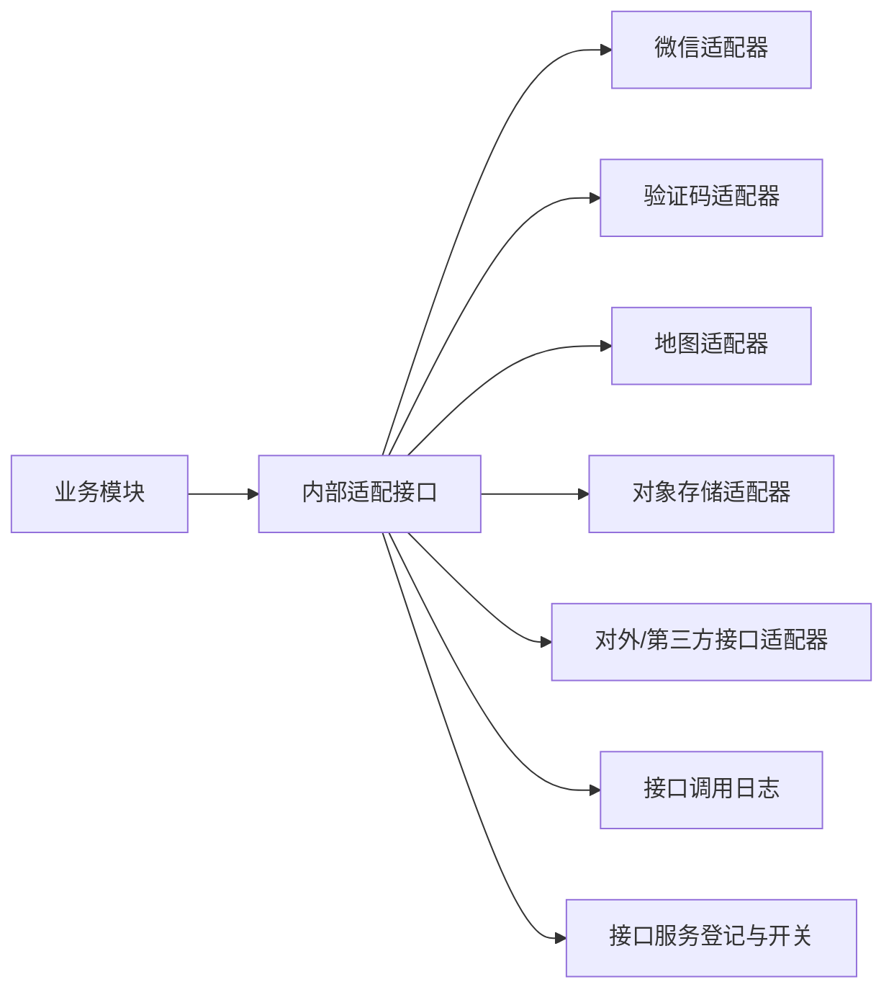
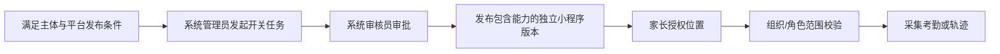

# 灵动学习第三方集成设计

**版本**：V1.0（设计基线草案）  
**状态**：待评审  
**关联设计**：[HLD](03-系统架构设计-HLD-V1.0.md)、[安全设计](07-权限与安全设计-V1.0.md)、[API 设计](06-API接口设计-V1.0.md)

## 1. 集成原则

1. 第三方能力仅用于已明确的业务目的：微信登录/服务通知、短信验证码、地图考勤、对象存储、已登记的对内/对外接口服务。
2. 业务模块不得直接依赖供应商 SDK；通过 `integration` 适配层定义内部稳定接口，供应商替换不改变任务、积分、账号等领域规则。
3. 所有第三方服务先在接口服务管理中登记用途、方向、调用方、授权范围、责任人和启停状态；新增、停用或扩大授权范围须走系统任务审核。
4. 凭证只存放于环境密钥或被 Git 忽略的本地配置中，不进入源码、Flyway 脚本、日志、接口响应、截图或前端构建包。
5. 调用记录保留服务名称、方向、调用方、时间、结果、异常摘要和请求标识；不保存完整敏感报文、访问令牌、微信凭证或位置坐标。

## 2. 集成架构

内部适配接口只暴露业务所需的输入输出，例如“以微信授权结果换取内部登录主体”“发送服务通知”“上传受控附件”“计算围栏命中”，不暴露厂商 SDK 对象和原始密钥字段。

## 3. 微信能力

| 能力 | 业务用途 | 调用前置 | 失败处理 |
|---|---|---|---|
| 小程序登录 | 家长/学生符合规则时的微信授权登录与绑定 | 小程序客户端、授权结果有效、账号/亲子关系满足 FSD 规则 | 回退到验证码或学生登录码，不允许登录卡死。 |
| 家长微信绑定 | 家长账号与微信一对一绑定 | 手机号账户校验通过，未绑定其他账号 | 冲突时拒绝并提示使用已有账号处理。 |
| 学生微信绑定 | 已创建学生、完成亲子关系、登录码和主家长验证通过 | 仅一对一绑定，家长可受控解绑 | 验证失败拒绝；不允许绕过亲子关系。 |
| 服务通知 | 任务、审核、兑换、报告等经业务规则允许的主动通知 | 消息对象、模板、用户订阅/授权、夜间抑制均满足 | 站内消息先落库；微信发送失败进入重试和调用台账。 |

首次个人主体开发阶段使用个人开发者主体相关配置仅用于开发/测试和允许的微信能力。生产发布前必须根据小程序类目、主体资质、平台审核和实际功能重新核对权限范围；不得将个人开发凭证传播至前端或提交仓库。

## 4. 短信验证码能力

1. 短信仅用于账号注册、登录、密码重置、手机号变更、亲子绑定邀请等需要手机号验证的业务流程，不作为常规主动业务通知渠道。
2. 发送前执行手机号格式、频率、验证码有效期和风控校验；响应不返回验证码明文。
3. 短信供应商、签名、模板、备案和费用配置尚未指定，作为部署前待确认项；业务实现必须保持供应商可替换。
4. 失败时按 FSD 的兜底路径处理，例如微信授权登录失败回退到验证码登录；不得把短信平台异常视为已完成绑定或重置。

## 5. 地图、位置和考勤能力

### 5.1 默认关闭与构建边界

1. `GEO_ATTENDANCE` 与 `STUDENT_LOCATION_TRACK` 全局默认关闭。
2. 个人主体、工具类目首次小程序构建包不得包含地图 SDK、位置权限申请、后台定位、围栏计算或轨迹采集能力；运行时隐藏页面不足以满足该要求。
3. 地图适配器可以在后端保留未启用的接口边界，但不得在首次构建中触发客户端地图/定位调用。

### 5.2 后续启用条件

1. 未满足任何一个条件时，后端拒绝位置采集、地图调用、自动签到签退和轨迹生成，并且不新增相关数据。
2. 家长撤销位置授权后立即停止新采集；历史轨迹最多保存 180 天。
3. 机构授权角色可查看其范围内的规定数据，家长只查看自家学生考勤结果，不能查看轨迹明细。
4. 地图供应商、地理围栏算法精度、坐标存储格式、资质和 SDK 隐私清单尚未指定，不应在未评审前写入业务代码。

## 6. 对象存储与文件预览

| 场景 | 设计要求 |
|---|---|
| 上传 | 统一附件服务先校验格式、大小、业务归属和权限，再授予短时上传授权；命名采用不暴露个人信息的内部对象键。 |
| 存储 | 文件内容存对象存储，数据库存文件元数据和内部存储标识；上传素材加密留存并可溯源。 |
| 预览/下载 | 每次按业务对象权限校验，生成短时受控结果；不提供长期公开链接。 |
| 使用场景 | 头像、机构资料、模板导入、任务打卡、复盘截图、报表附件、考勤凭证等统一复用。 |
| 删除 | 先解除业务可见关系；是否物理删除按归档、留存和审批规则执行。 |

对象存储供应商、区域、CDN、病毒检测、预览转换服务和灾备策略尚未指定。选择后应在接口服务管理中登记并补充部署参数，不影响上述统一业务接口。

## 7. 消息服务

1. 产品主动通知渠道是小程序站内消息和微信服务通知；短信验证码是账号认证通道，不承担普通任务/积分/报表提醒。
2. 所有主动消息在 22:00 至次日 07:00 静默保存，次日按规则补发；用户手动查看不受影响。
3. 家庭审批提醒以主家长为对象；副家长只接收 BRD 允许的与学生直接相关消息；机构消息发送给对应教师和机构管理员。
4. 通知投递采用“业务成功后落站内消息 -> 异步调用微信服务通知 -> 记录投递状态”的顺序。第三方发送失败不回滚核心业务结果。

## 8. 接口服务管理与对外接口

| 字段 | 说明 |
|---|---|
| 服务名称、方向、用途 | 明确本系统调用第三方或第三方调用本系统，以及业务目的。 |
| 调用方、授权范围、责任人 | 必填；缺失任一项不得启用。 |
| 认证方式 | 按对外 API 安全设计使用独立客户端身份、签名/时间戳和重放防护，不能共享后台用户会话。 |
| 启停与审批 | 新增、停用、扩大范围属于高风险系统任务。 |
| 调用台账 | 记录调用方、时间、服务、结果和异常说明。 |

对外服务默认不提供家庭私有数据、未成年人位置/轨迹、情绪暂停、难题搁置、家庭奖励和家庭积分配置。任何新增数据范围均需先完成业务、隐私、安全和系统任务评审。

## 9. 集成测试与验收

- [ ] 供应商异常、超时、重复回调、签名失败和网络断开均不破坏业务状态机。
- [ ] 微信登录/绑定失败能回退到受控登录方式，不能形成半绑定账号。
- [ ] 第三方密钥、令牌、完整手机号、位置坐标不出现在日志、响应和前端包。
- [ ] 位置开关关闭、审批未通过、构建不含能力、授权无效或撤销时均无位置/轨迹新数据。
- [ ] 上传、预览、下载、删除均执行统一附件规则与业务数据权限。
- [ ] 对外接口未登记、已停用、无授权范围或无责任人时拒绝调用。
- [ ] 站内消息与微信通知在夜间抑制、失败重试、跳转详情和对象权限上保持一致。
