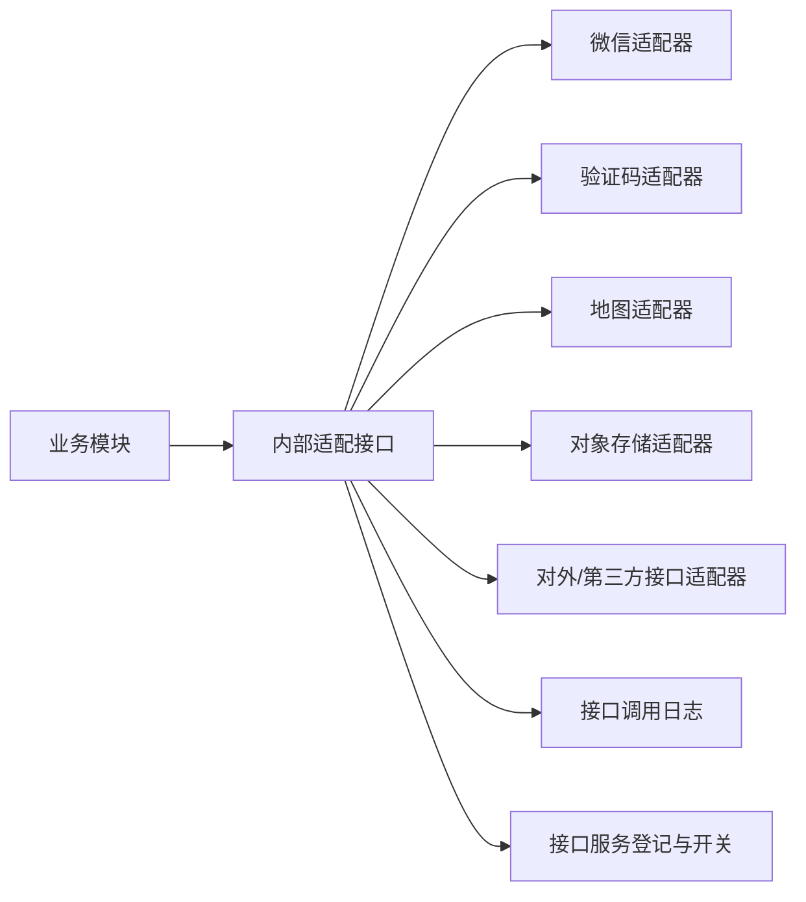
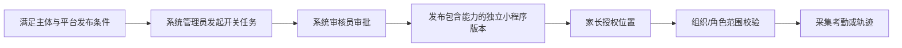

# 灵动学习第三方集成设计

**版本**：V1.0（设计基线草案）  
**状态**：待评审  
**关联设计**：[HLD](03-系统架构设计-HLD-V1.0.md)、[安全设计](07-权限与安全设计-V1.0.md)、[API 设计](06-API接口设计-V1.0.md)

## 1. 集成原则

1. 第三方能力仅用于已明确的业务目的：微信登录/服务通知、短信验证码、地图考勤、对象存储、已登记的对内/对外接口服务。
2. 业务模块不得直接依赖供应商 SDK；通过 `integration` 适配层定义内部稳定接口，供应商替换不改变任务、积分、账号等领域规则。
3. 所有第三方服务先在接口服务管理中登记用途、方向、调用方、授权范围、责任人和启停状态；新增、停用或扩大授权范围须走系统任务审核。
4. 凭证只存放于环境密钥或被 Git 忽略的本地配置中，不进入源码、Flyway 脚本、日志、接口响应、截图或前端构建包。
5. 调用记录保留服务名称、方向、调用方、时间、结果、异常摘要和请求标识；不保存完整敏感报文、访问令牌、微信凭证或位置坐标。

## 2. 集成架构

```mermaid
flowchart LR
    BIZ[业务模块] --> PORT[内部适配接口]
    PORT --> WX[微信适配器]
    PORT --> SMS[验证码适配器]
    PORT --> MAP[地图适配器]
    PORT --> OSS[对象存储适配器]
    PORT --> EXT[对外/第三方接口适配器]
    PORT --> LOG[接口调用日志]
    PORT --> CFG[接口服务登记与开关]
```

内部适配接口只暴露业务所需的输入输出，例如“以微信授权结果换取内部登录主体”“发送服务通知”“上传受控附件”“计算围栏命中”，不暴露厂商 SDK 对象和原始密钥字段。

## 3. 微信能力

| 能力 | 业务用途 | 调用前置 | 失败处理 |
|---|---|---|---|
| 小程序登录 | 家长/学生符合规则时的微信授权登录与绑定 | 小程序客户端、授权结果有效、账号/亲子关系满足 FSD 规则 | 回退到验证码或学生登录码，不允许登录卡死。 |
| 家长微信绑定 | 家长账号与微信一对一绑定 | 手机号账户校验通过，未绑定其他账号 | 冲突时拒绝并提示使用已有账号处理。 |
| 学生微信绑定 | 已创建学生、完成亲子关系、登录码和主家长验证通过 | 仅一对一绑定，家长可受控解绑 | 验证失败拒绝；不允许绕过亲子关系。 |
| 服务通知 | 任务、审核、兑换、报告等经业务规则允许的主动通知 | 消息对象、模板、用户订阅/授权、夜间抑制均满足 | 站内消息先落库；微信发送失败进入重试和调用台账。 |

首次个人主体开发阶段使用个人开发者主体相关配置仅用于开发/测试和允许的微信能力。生产发布前必须根据小程序类目、主体资质、平台审核和实际功能重新核对权限范围；不得将个人开发凭证传播至前端或提交仓库。

## 4. 短信验证码能力

1. 短信仅用于账号注册、登录、密码重置、手机号变更、亲子绑定邀请等需要手机号验证的业务流程，不作为常规主动业务通知渠道。
2. 发送前执行手机号格式、频率、验证码有效期和风控校验；响应不返回验证码明文。
3. 短信供应商、签名、模板、备案和费用配置尚未指定，作为部署前待确认项；业务实现必须保持供应商可替换。
4. 失败时按 FSD 的兜底路径处理，例如微信授权登录失败回退到验证码登录；不得把短信平台异常视为已完成绑定或重置。

## 5. 地图、位置和考勤能力

### 5.1 默认关闭与构建边界

1. `GEO_ATTENDANCE` 与 `STUDENT_LOCATION_TRACK` 全局默认关闭。
2. 个人主体、工具类目首次小程序构建包不得包含地图 SDK、位置权限申请、后台定位、围栏计算或轨迹采集能力；运行时隐藏页面不足以满足该要求。
3. 地图适配器可以在后端保留未启用的接口边界，但不得在首次构建中触发客户端地图/定位调用。

### 5.2 后续启用条件

```mermaid
flowchart LR
    A[满足主体与平台发布条件] --> B[系统管理员发起开关任务]
    B --> C[系统审核员审批]
    C --> D[发布包含能力的独立小程序版本]
    D --> E[家长授权位置]
    E --> F[组织/角色范围校验]
    F --> G[采集考勤或轨迹]
```

1. 未满足任何一个条件时，后端拒绝位置采集、地图调用、自动签到签退和轨迹生成，并且不新增相关数据。
2. 家长撤销位置授权后立即停止新采集；历史轨迹最多保存 180 天。
3. 机构授权角色可查看其范围内的规定数据，家长只查看自家学生考勤结果，不能查看轨迹明细。
4. 地图供应商、地理围栏算法精度、坐标存储格式、资质和 SDK 隐私清单尚未指定，不应在未评审前写入业务代码。

## 6. 对象存储与文件预览

| 场景 | 设计要求 |
|---|---|
| 上传 | 统一附件服务先校验格式、大小、业务归属和权限，再授予短时上传授权；命名采用不暴露个人信息的内部对象键。 |
| 存储 | 文件内容存对象存储，数据库存文件元数据和内部存储标识；上传素材加密留存并可溯源。 |
| 预览/下载 | 每次按业务对象权限校验，生成短时受控结果；不提供长期公开链接。 |
| 使用场景 | 头像、机构资料、模板导入、任务打卡、复盘截图、报表附件、考勤凭证等统一复用。 |
| 删除 | 先解除业务可见关系；是否物理删除按归档、留存和审批规则执行。 |

对象存储供应商、区域、CDN、病毒检测、预览转换服务和灾备策略尚未指定。选择后应在接口服务管理中登记并补充部署参数，不影响上述统一业务接口。

## 7. 消息服务

1. 产品主动通知渠道是小程序站内消息和微信服务通知；短信验证码是账号认证通道，不承担普通任务/积分/报表提醒。
2. 所有主动消息在 22:00 至次日 07:00 静默保存，次日按规则补发；用户手动查看不受影响。
3. 家庭审批提醒以主家长为对象；副家长只接收 BRD 允许的与学生直接相关消息；机构消息发送给对应教师和机构管理员。
4. 通知投递采用“业务成功后落站内消息 -> 异步调用微信服务通知 -> 记录投递状态”的顺序。第三方发送失败不回滚核心业务结果。

## 8. 接口服务管理与对外接口

| 字段 | 说明 |
|---|---|
| 服务名称、方向、用途 | 明确本系统调用第三方或第三方调用本系统，以及业务目的。 |
| 调用方、授权范围、责任人 | 必填；缺失任一项不得启用。 |
| 认证方式 | 按对外 API 安全设计使用独立客户端身份、签名/时间戳和重放防护，不能共享后台用户会话。 |
| 启停与审批 | 新增、停用、扩大范围属于高风险系统任务。 |
| 调用台账 | 记录调用方、时间、服务、结果和异常说明。 |

对外服务默认不提供家庭私有数据、未成年人位置/轨迹、情绪暂停、难题搁置、家庭奖励和家庭积分配置。任何新增数据范围均需先完成业务、隐私、安全和系统任务评审。

## 9. 集成测试与验收

- [ ] 供应商异常、超时、重复回调、签名失败和网络断开均不破坏业务状态机。
- [ ] 微信登录/绑定失败能回退到受控登录方式，不能形成半绑定账号。
- [ ] 第三方密钥、令牌、完整手机号、位置坐标不出现在日志、响应和前端包。
- [ ] 位置开关关闭、审批未通过、构建不含能力、授权无效或撤销时均无位置/轨迹新数据。
- [ ] 上传、预览、下载、删除均执行统一附件规则与业务数据权限。
- [ ] 对外接口未登记、已停用、无授权范围或无责任人时拒绝调用。
- [ ] 站内消息与微信通知在夜间抑制、失败重试、跳转详情和对象权限上保持一致。

## 9. V36 短信适配边界

V36 只定义 `ParentSmsSender` 端口和本地/测试适配器，未伪造真实供应商成功。生产未配置适配器固定失败关闭并返回 `SMS_DELIVERY_UNAVAILABLE`；接入真实供应商时必须在同一端口实现超时、供应商错误映射、脱敏日志、发送结果审计和监控，不得改变业务接口或返回验证码。短信凭证仅允许通过环境变量或受控密钥服务注入。

## 10. V37 微信认证适配边界

V37 通过 `ParentWechatIdentityGateway` 调用微信 `code2session`，生产适配器配置连接/读取超时，供应商错误、缺少 `openid` 或 `session_key`、网络异常均映射为统一不可用并失败关闭。生产启用还要求接口服务管理中存在调用方为 `miniapp`、方向为 `OUTBOUND`、类型为 `WECHAT` 的启用登记，并且微信应用标识与密钥配置完整。日志和异常不得记录应用密钥、临时凭证、`session_key` 或完整 `openid`。本轮只使用测试假网关验证契约，未调用真实微信。

## 11. V38 关系邀请外部能力边界

V38 复用 `ParentSmsSender` 和关系专用验证码用途完成副家长绑定及监护权转移证明，不新增短信供应商协议，也不伪造真实投递成功。真实短信启用前必须完成接口服务登记、模板报备、限流、失败告警和脱敏审计；短信不可用时邀请创建失败关闭，不得把验证码写入响应、日志、MySQL 或前端包。站内消息和微信服务通知仍未实现，当前邀请标识由业务侧通过受控方式转交。

## 12. V39 安全事件通知边界

V39 只实现应用内安全事件，不调用短信、微信服务通知、邮件或推送供应商，也不把外部通知描述为已完成。后续接入外部通知时，应由事件消费者读取脱敏事件标识，通过接口服务管理登记、限流、重试和告警；通知内容不得包含令牌、设备摘要、内部范围键或完整个人信息。

## 13. V40 外部能力边界

V40 机构管理员小程序只实现账号密码登录，不调用微信 `code2session`、地图、定位、短信或消息供应商，也不新增第三方接口服务登记。后续机构微信登录必须单独完成主体资质、接口登记、唯一绑定、凭证保护和故障关闭设计，不得复用或扩大当前密码端点。

## 14. V41 外部能力边界

V41 的转班与转出只使用本地业务数据、动态权限和 Flyway，不调用短信、微信、地图、定位、对象存储或消息供应商。跨机构转学不会通过第三方同步原学生账号；目标机构仍使用既有创建学生与家长确认绑定流程。后续通知只可消费脱敏关系事件，不得携带家庭私有数据或认证凭据。

## 15. V42 外部能力边界

V42 复用家长短信发送抽象并新增旧号、新号和注销三种隔离用途，不新增供应商协议。非测试换绑票据使用 Redis 并在连接、序列化或原子消费失败时关闭操作；本地测试不连接远程 Redis。手机号换绑保留既有微信绑定，不调用微信接口，不处理原号码失效人工核验。最终注销若需通知、实名核验或第三方删除，必须在后续设计中登记接口、明确资质和失败补偿后实施。

## 16. V43 外部能力边界

V43 最终注销不调用短信、微信、地图、定位、对象存储或消息供应商。微信解绑仅删除本地绑定事实，不持有或调用第三方删除接口；调度状态保存在 MySQL 业务表，不依赖 Redis。真实环境若需注销结果通知、实名核验或第三方侧删除，必须先在接口服务管理中登记并完成资质、失败补偿和脱敏审计设计。原号码失效人工核验仍未实现。

## 14. V44 第三方边界

V44 只复用既有短信发送端口和验证码 Redis 存储，新用途为 `MANUAL_MOBILE_RECOVERY_NEW`；未配置或不可用时失败关闭，不伪造发送成功。线下身份核验由机构业务人员完成，系统不接入身份证、实名核验、地图、定位、对象存储或微信接口。真实短信模板、签名、频控和供应商回执须在批准环境及接口服务登记启用后验证。

## 15. V45 第三方边界

V45 学生账号注销不调用微信、短信、地图、定位、对象存储、Redis 或外部实名服务。注销只处理本地 MySQL 事务内的学生、用户、登录码、二维码、设备会话和审计事实；现有学生会话即使曾缓存，也必须因数据库会话状态和用户终态失效。未来如增加外部身份解绑，必须通过接口服务管理登记并采用事务后可靠事件，不得改变 V45 本地注销的原子边界。

## V46 微信与短信集成补充

学生微信认证复用既有微信小程序 `code2Session` 适配器，测试环境使用固定内存网关，不访问真实微信。短信增加独立用途 `STUDENT_WECHAT_BIND`，与家长注册、家长微信绑定和关系管理验证码完全隔离。功能默认停用，个人开发者主体上线期间只有在类目、隐私和审核条件允许时才启用；主监护人手机号不可用的机构人工兜底不通过第三方接口旁路实现。

## V48 第三方能力边界

V48 班级基础管理只使用本地数据库、现有会话和权限能力，不调用微信、短信、地图、定位、对象存储、消息供应商或外部接口。小程序构建产物不新增定位、地图或轨迹代码；班级停用任务失效在本地事务内完成，不依赖 Redis 或第三方回调。真实环境发布仍须按批准流程验证 MySQL 8 与 Redis 基础连接，但 V48 没有新增第三方适配配置。

## V49 第三方能力边界

V49 权限授权边界只访问本地权限、角色和用户数据库表，不调用微信、短信、地图、定位、对象存储、Redis 或其他第三方服务。平台权限管理仅在 Web 提供，不改变个人主体小程序类目、隐私声明或构建产物。外部身份源和单点登录若后续接入，仍须先映射为本地用户与活动角色，不能通过第三方声明绕过本地明确禁止和数据范围。

## 通用组织数据范围第三方边界

范围解析只使用本地数据库授权事实，不调用 Redis、地图、定位、微信、短信、对象存储或外部身份源。第三方返回的机构或用户声明不能直接成为根路径；后续单点登录或外部组织同步必须先通过本地受控映射和授权流程。

## V50 身份权限审计第三方边界

V50 全部记录与查询均在本地关系数据库内完成，不依赖 Redis、微信、短信、地图、定位、对象存储或日志供应商。后续外部身份源引发本地授权变化时，必须通过受控应用服务写入，不能绕过审计记录器直接改表。

## 统一访问边界第三方说明

专项测试只使用本地 H2、MockMvc 和本地令牌实现，不连接 Redis、微信、短信、地图、定位、对象存储或远程数据库。外部身份声明未来仍必须映射到本地活动角色和组织范围后参与同一决策。

## V51 数据字典第三方边界

数据字典闭环只依赖本地关系数据库和 Web 应用，不调用微信、短信、地图、定位、Redis、对象存储或其他第三方。OpenAPI 仅描述本系统接口，不自动登记或发布到外部接口平台。

## V52 缓存管理第三方边界

V52 本地验收使用 H2、Spring Cache 和 Web 模拟数据，不连接远程 Redis、MySQL、微信、短信、地图、定位或对象存储。缓存管理通过 Spring `CacheManager` 抽象适配本地与 Redis 实现，业务代码不写 Redis 专有命令。用户会话撤销更新本地会话事实表，不依赖微信会话接口；后续真实 Redis 联调需验证缓存名称、序列化、键前缀和清除范围，禁止使用无命名空间的外部实例全库清除。

## V53 接口服务管理第三方边界

V53 管理第三方及对外接口的本地元数据、审批和最小调用结果，不在配置表保存第三方密钥、令牌、签名私钥或完整报文，也不实际调用微信、短信、地图、Redis、对象存储或学校系统。真实接入前必须按具体协议补齐凭据托管、签名验签、时间窗、防重放、限流、幂等、熔断和告警；个人主体阶段不启用未成年人定位能力，功能停用后相关入口和后端请求均不可用。

## V54 附件存储第三方边界

V54 继续通过 `AttachmentContentStorage` 隔离业务与存储实现，本地受控目录仅用于开发和自动化验证，不形成生产对象存储结论。管理台账不返回对象键，业务下载不接受外部路径。接入云对象存储前仍须确定供应商、桶与目录隔离、服务端加密、短时授权、病毒扫描、内容检测、Office 转码、生命周期、备份恢复和费用告警；这些能力未实现，不计入 V54 完成范围。小程序构建未引入定位或地图调用。

## V55 模板文件第三方边界

V55 模板文件复用 `AttachmentContentStorage` 与统一附件元数据，不直接绑定云对象存储、Office、Excel 或第三方导入引擎。本地自动化和视觉验收使用 H2、本地受控内容及模拟接口，不连接远程 MySQL、Redis、微信、地图、对象存储或学校系统。后续接入真实文件处理服务时必须单独确定病毒扫描、宏与公式风险、Office 转码、对象存储加密和短时授权、异步回调鉴权、防重放、失败重试和费用告警；当前小程序源码与构建产物仍无定位、地图及模板后台管理调用。

## V56 XLSX 校验第三方边界

V56 使用应用内 Apache POI 读取 `.xlsx`，不调用外部 Excel、Office、OCR、AI 或学校系统服务；公式不执行，只读取可用缓存结果。源文件和错误文件继续通过 `AttachmentContentStorage` 端口隔离存储实现，本地验证不形成生产对象存储结论。接入真实对象存储或内容安全服务前仍须确定病毒扫描、宏检测、服务端加密、短时授权、文件保留与销毁、异步回调验签、防重放、失败重试和费用告警。本轮未连接远程 MySQL、Redis、微信、地图、对象存储、共享测试、预生产或生产环境；uni-app 源码与产物无导入后台能力。

## V57 XLSX 导出第三方边界

V57 使用应用内 Apache POI 生成 `.xlsx`，不调用外部报表、Office、PDF、OCR、AI 或学校系统服务。结果继续通过 `AttachmentContentStorage` 端口和统一附件关系隔离存储实现，本地测试使用受控临时目录，不形成生产对象存储结论。接入云对象存储和内容安全服务前仍须确定桶及目录隔离、服务端加密、病毒与公式注入检测、短时授权、下载审计、保留和销毁、备份恢复、失败重试及费用告警。本轮未连接远程 MySQL、Redis、微信、地图、对象存储、共享测试、预生产或生产环境；uni-app 源码与产物无导出中心能力。

## V58 学员凭证第三方边界

V58 使用应用内 Apache POI 和 JDK 密码库生成、加密凭证，不调用第三方开户、Excel 或密钥服务。`AttachmentContentStorage` 当前仅承载二次加密后的 `.enc` 内容；生产接入对象存储或密钥管理系统前，仍须完成密钥轮换、最小权限、备份排除、删除一致性、下载审计和故障演练。本轮未连接远程 MySQL、Redis、微信、地图、对象存储、共享测试、预生产或生产环境。

## V60 机构与教师任务第三方边界

V60 的教师登录、工作台、任务、审核和进度均复用现有账号密码、REST、MySQL 与 Redis 抽象，不新增微信开放能力、地图、定位、轨迹、消息或学校第三方接口。uni-app 仅生成 H5 和微信小程序本地构建产物，个人主体资质下继续由后台开关关闭未成年人定位能力。本轮未连接远程 MySQL、Redis、微信、地图、对象存储、共享测试、预生产、生产或业务 UAT。

## V61 学生异常报备第三方边界

V61 只在业务事务中写入 `msg_local_event` 待分发事实，不调用微信订阅消息、短信、学校接口或第三方消息网关，也不实现重试调度和送达回执。未来接入方必须独立消费事件、幂等投递并记录可审计结果，投递失败不得回滚报备事实。

异常报备不采集定位、地图、轨迹、图片或家庭私有数据，个人主体小程序包继续不包含相关能力。本轮未连接远程 MySQL、Redis、微信、地图、对象存储、共享测试、预生产、生产或业务 UAT。
