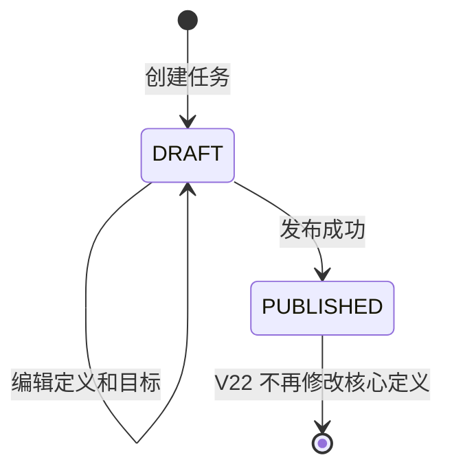

# 灵动学习 V22 学习任务定义与下发设计

**版本**：V1.0

**日期**：2026-08-01

**状态**：设计已确认，待实施

**业务依据**：《灵动学习业务需求文档》3.4 节、《功能详细设计》FSD-TASK-01，以及 V21 已实现的学生身份、亲子关系和机构关系能力。

## 1. 建设目标

V22 建立学习任务的第一条端到端纵向能力：主家长、机构管理员和教师在 Web 端创建任务、配置目标并发布；后端将组织或学生目标展开为稳定的学生任务实例；学生在 uni-app 小程序查看本人待认领任务并按来源筛选。

本版本只实现任务定义、目标配置、发布和学生接收，不提前实现认领、计时、打卡、审核、积分、顺延、暂停、免执行、复制昨日、周期任务或模板。学生任务初始状态固定为 `PENDING_CLAIM`，后续状态流转在下一版本基于该实例继续实现。

## 2. 核心设计选择

采用“不可变已发布任务定义 + 原始目标记录 + 按学生展开的任务实例”模型。

1. `learn_task` 保存创建人确认的任务定义，草稿可编辑，发布后核心内容不可修改。
2. `learn_task_target` 保存发布前配置的原始目标，用于解释任务为何下发给某名学生。
3. 发布时按当前有效亲子、组织、班级和学生状态展开 `learn_task_assignment`，同一任务和学生只产生一个实例。
4. 学生转班、退出机构、班级停用或教师权限变化不反向删除已经发布的历史实例；未发布草稿始终按发布时的最新关系重新校验。
5. 已发布任务不得物理删除。任务内容不可变，因此学生实例可通过任务外键稳定读取标题、难度、积分、时长、分类、标签和备注。

不采用动态成员查询模型，因为成员变动会改变历史任务归属；不采用每名学生复制完整任务定义模型，因为会造成定义重复、批量维护不一致和来源难以追溯。

## 3. 角色、客户端与数据边界

| 角色 | V22 允许操作 | 数据范围 |
|---|---|---|
| 主家长 | 创建、编辑、查看、发布家庭任务 | 仅自己作为活动主家长关联的学生 |
| 机构管理员 | 配置学生当前班级、配置教师班级关系；创建、编辑、查看、发布机构任务 | `OrganizationDataScopeService` 判定可访问的启用组织子树 |
| 教师 | 创建、编辑、查看、发布教师任务 | 仅活动教师班级关系中的启用班级及班内活动学生 |
| 学生 | 查看本人已发布任务实例并按来源筛选 | 当前会话对应的启用学生本人 |
| 系统管理员 | 不代替业务角色创建或发布学习任务 | 可通过后续审计能力查看，不在 V22 提供全局任务业务操作 |
| 系统审核员 | 无学习任务权限 | 不参与任何任务创建、发布或业务审核 |

任务管理接口只接受 `WEB` 会话。学生任务列表只接受 `MINIAPP` 学生会话。V22 不为家长、机构管理员或教师增加小程序密码登录，也不复用 Web 会话到小程序。

## 4. 任务来源与目标规则

### 4.1 家庭任务

1. `sourceType` 固定为 `FAMILY`，`sourceOrganizationId` 必须为空。
2. 目标只允许 `STUDENT`，每名学生必须启用且当前用户是其活动主家长。
3. 默认审核人为当前主家长，不接受请求体覆盖。
4. 机构管理员和教师不得读取家庭任务定义、目标或家庭学生实例明细。

### 4.2 机构任务

1. `sourceType` 固定为 `ORGANIZATION`，`sourceOrganizationId` 必填且必须是当前机构管理员可访问的启用组织。
2. 目标可为 `ORGANIZATION` 或 `STUDENT`。组织目标必须位于来源组织自身或其子树；学生目标必须与来源组织子树存在活动机构或班级关系。
3. 组织目标发布时展开该节点及其启用子组织下的活动学生关系，并对学生去重。
4. 默认审核人为任务创建的机构管理员。可指定教师作为审核人，但所有目标必须收敛到该教师的活动授权班级；学校、校区或年级等跨班目标不得指定单一教师。

### 4.3 教师任务

1. `sourceType` 固定为 `TEACHER`，`sourceOrganizationId` 必须是教师活动授权班级。
2. 组织目标仅允许该班级；学生目标必须是该班级当前活动学生。
3. 默认审核人为创建任务的教师，不接受请求体指定其他审核人。
4. 教师失去班级关系后不能发布新的该班任务；已发布实例保留，后续审核人转交由审核版本实现。

## 5. 班级关系最小补齐

### 5.1 学生当前班级

复用 `edu_student_organization`，以 `relation_type = 'CLASS'` 表示学生当前班级。机构管理员通过专用接口设置学生当前班级：事务内锁定学生现有活动班级关系，停用旧关系后建立或重新启用新关系，保证应用层面同一学生最多一个活动班级。

目标班级必须是启用的 `CLASS` 组织，当前机构管理员必须具有组织数据范围，学生必须与该班级所属学校或上级组织存在活动机构关系。班级变化不删除历史任务实例。

### 5.2 教师授权班级

新增 `edu_teacher_class` 保存教师与班级的活动关系。机构管理员只能在自己的组织数据范围内绑定或解除教师班级；目标用户必须启用、类型为 `PLATFORM` 且拥有启用的 `TEACHER` 角色；目标组织必须是启用班级。

教师与班级的历史关系不物理删除，解除时设置 `status = 'INACTIVE'` 和 `effective_to`。同一教师与班级只保留一条业务关系，重新绑定时更新原记录。

## 6. 数据模型

### 6.1 `edu_teacher_class`

| 字段 | 规则 |
|---|---|
| `id` | 应用层 19 位雪花 `BIGINT` 主键 |
| `teacher_user_id` | 教师平台用户外键 |
| `class_organization_id` | 班级组织外键 |
| `status` | `ACTIVE`、`INACTIVE` |
| `effective_from`、`effective_to` | 关系有效时间 |
| `created_at`、`updated_at` | 审计时间 |

唯一约束为 `(teacher_user_id, class_organization_id)`；查询索引覆盖教师/状态和班级/状态。

### 6.2 `learn_task`

| 字段 | 规则 |
|---|---|
| `id` | 应用层 19 位雪花 `BIGINT` 主键 |
| `source_type` | `FAMILY`、`ORGANIZATION`、`TEACHER` |
| `source_organization_id` | 家庭为空；机构为来源组织；教师为来源班级 |
| `creator_user_id` | 创建人平台用户 |
| `title` | 去除首尾空格后 1 至 50 字符 |
| `difficulty_level` | 1、2、3，分别表示简单、中等、困难 |
| `base_points` | 后端固定计算为 `difficulty_level * 10`，请求体不得提交 |
| `duration_minutes` | 1 至 1440 分钟 |
| `scheduled_date` | 中国标准时间下的计划日期，只允许当天或未来日期 |
| `category_code` | 可空；非空时必须是 `TASK_CATEGORY` 下启用字典项 |
| `remark` | 可空，最长 200 字符 |
| `reviewer_user_id` | 按来源规则确定的当前默认审核人 |
| `review_timeout_hours` | V22 固定写入 72，供后续审核版本使用 |
| `status` | `DRAFT`、`PUBLISHED` |
| `published_at` | 发布成功时间，草稿为空 |
| `created_at`、`updated_at` | 审计时间 |

索引覆盖创建人/状态/计划日期、来源组织/来源/状态和发布时间。已发布任务不允许物理删除。

### 6.3 `learn_task_target`

| 字段 | 规则 |
|---|---|
| `id` | 应用层 19 位雪花 `BIGINT` 主键 |
| `task_id` | 任务外键 |
| `target_type` | `ORGANIZATION`、`STUDENT` |
| `target_id` | 对应组织或学生标识 |
| `created_at` | 创建时间 |

唯一约束为 `(task_id, target_type, target_id)`，防止相同目标重复配置。

### 6.4 `learn_task_tag`

| 字段 | 规则 |
|---|---|
| `id` | 应用层 19 位雪花 `BIGINT` 主键 |
| `task_id` | 任务外键 |
| `tag_code` | `TASK_TAG` 下启用字典项编码 |
| `created_at` | 创建时间 |

唯一约束为 `(task_id, tag_code)`；同一任务最多 20 个标签。

### 6.5 `learn_task_assignment`

| 字段 | 规则 |
|---|---|
| `id` | 应用层 19 位雪花 `BIGINT` 主键 |
| `task_id`、`student_id` | 任务与学生外键，组合唯一 |
| `source_type`、`source_organization_id` | 发布时固化的来源，便于隔离查询和统计 |
| `current_status` | V22 固定为 `PENDING_CLAIM` |
| `current_reviewer_id` | 发布时固化的有效审核人 |
| `scheduled_date` | 任务计划日期快照 |
| `due_at` | 计划日期当日 `23:59:59`，按中国标准时间计算后写入本地日期时间 |
| `claimed_at`、`completed_at` | V22 为空，为后续状态版本预留 |
| `created_at`、`updated_at` | 审计时间 |

索引覆盖学生/状态/计划日期、审核人/状态和来源组织/状态。唯一约束 `(task_id, student_id)` 是发布幂等和重叠目标去重的最后数据库防线。

## 7. 功能开关与权限

V22 新增全局功能开关 `LEARNING_TASK_MANAGEMENT`，初始状态为启用。所有任务管理、发布和学生任务读取服务在查询业务数据前检查该开关。关闭后：

1. Web 隐藏任务菜单和创建、编辑、发布按钮。
2. 小程序隐藏任务列表入口；旧页面直达显示功能不可用。
3. 后端拒绝任务定义、目标、发布和学生实例查询，不创建新实例。
4. 历史数据保留，不删除任务和学生实例。

新增权限：

| 权限码 | 客户端 | 初始角色 |
|---|---|---|
| `STUDENT_CLASS_ASSIGN` | `WEB` | `ORG_ADMIN` |
| `TEACHER_CLASS_ASSIGN` | `WEB` | `ORG_ADMIN` |
| `LEARNING_TASK_CREATE` | `WEB` | `PARENT`、`ORG_ADMIN`、`TEACHER` |
| `LEARNING_TASK_READ_MANAGED` | `WEB` | `PARENT`、`ORG_ADMIN`、`TEACHER` |
| `LEARNING_TASK_PUBLISH` | `WEB` | `PARENT`、`ORG_ADMIN`、`TEACHER` |
| `TASK_ASSIGNMENT_READ_SELF` | `MINIAPP` | `STUDENT` |

RBAC 只决定是否进入用例，来源角色、组织子树、亲子关系、班级关系和学生本人范围继续由应用服务与 SQL 强制校验。用户同时拥有多种角色时，必须按请求中的 `sourceType` 执行对应来源规则，不合并为更宽权限。

## 8. 状态与发布事务

发布流程：

1. 检查功能开关、`LEARNING_TASK_PUBLISH`、Web 客户端和当前用户状态。
2. 使用 `SELECT ... FOR UPDATE` 锁定任务，验证任务属于当前操作者可管理范围且状态为 `DRAFT`。
3. 重新校验来源组织、主家长关系、教师班级关系、审核人和全部原始目标。
4. 展开当前启用学生并按学生标识去重；零学生时返回状态冲突。
5. 为每名学生写入一个 `PENDING_CLAIM` 实例；任一实例失败则整个单任务发布回滚。
6. 条件更新任务为 `PUBLISHED` 并写入 `published_at`。

重复发布返回 `409 STATE_CONFLICT`，不返回既有实例作为伪成功。批量发布接口按任务标识逐条启动独立事务，返回成功数、失败数和每个失败任务的中性原因；一个任务失败不回滚其他任务。

## 9. API 契约

所有 19 位标识以 JSON 字符串返回和接收。

### 9.1 班级关系

| 方法与路径 | 用途 |
|---|---|
| `PUT /api/v1/students/{studentId}/class` | 设置学生当前班级，请求体为 `classOrganizationId` |
| `PUT /api/v1/teachers/{teacherUserId}/classes/{classId}` | 建立或重新启用教师班级关系 |
| `DELETE /api/v1/teachers/{teacherUserId}/classes/{classId}` | 解除教师班级关系 |
| `GET /api/v1/teachers/{teacherUserId}/classes` | 查询当前用户有权管理或教师本人可见的活动班级 |

### 9.2 任务候选项

| 方法与路径 | 用途 |
|---|---|
| `GET /api/v1/learning-task-options/organizations` | 按必填 `sourceType` 查询当前用户可用于任务来源或组织目标的启用组织，可按 `organizationType` 筛选 |
| `GET /api/v1/learning-task-options/students` | 按必填 `sourceType` 查询当前用户可选择的启用学生，可按 `organizationId` 和 `keyword` 筛选 |
| `GET /api/v1/learning-task-options/teachers` | 查询机构管理员可选择的启用教师，可按 `classId` 和 `keyword` 筛选 |

候选项接口只接受 `WEB` 会话并在数据库查询和应用服务中完成数据范围裁剪，不允许前端取得全量数据后自行过滤。家长只返回其活动主关系学生；机构管理员只返回授权组织子树内的组织、学生和教师；教师只返回本人活动授权班级及班级内学生。教师候选项只向具备教师班级配置或机构任务管理权限的机构管理员开放。

`sourceType` 必须为当前用户角色允许的 `FAMILY`、`ORGANIZATION` 或 `TEACHER`。即使用户同时持有多个内置角色，也不得省略或合并来源候选集合；前端切换来源时重新请求对应候选项，后端对来源和角色再次匹配。

组织候选项响应只包含标识、名称、组织类型、父组织标识和展示路径；学生候选项只包含标识、姓名、脱敏后的学生账号和当前班级；教师候选项只包含用户标识、显示名称和已授权班级。候选项不得返回手机号、密码摘要、家庭关系明细或组织范围外标识。

### 9.3 任务管理

| 方法与路径 | 用途 |
|---|---|
| `POST /api/v1/learning-tasks` | 创建任务草稿及其目标、标签 |
| `GET /api/v1/learning-tasks` | 按来源、状态、计划日期和关键字查询当前用户可管理任务 |
| `GET /api/v1/learning-tasks/{id}` | 查询可管理任务详情、目标和标签 |
| `PATCH /api/v1/learning-tasks/{id}` | 仅编辑草稿定义、目标和标签 |
| `POST /api/v1/learning-tasks/{id}/publish` | 发布单个任务并返回生成实例数 |
| `POST /api/v1/learning-tasks/batch-publish` | 逐任务独立发布，最多 100 个任务标识 |

创建和编辑请求字段为：`sourceType`、`sourceOrganizationId`、`title`、`difficultyLevel`、`durationMinutes`、`scheduledDate`、`categoryCode`、`tagCodes`、`remark`、`reviewerUserId`、`targets`。目标元素包含 `targetType`、`targetId`。`basePoints`、状态、创建人和审核超时时间均由后端生成。

目录固定按 `scheduled_date DESC, created_at DESC, id DESC` 排序，使用 `page`、`pageSize`，页大小 1 至 100。

### 9.4 学生任务列表

| 方法与路径 | 用途 |
|---|---|
| `GET /api/v1/task-assignments` | 学生读取本人任务，支持 `sourceType`、`scheduledDate`、`page`、`pageSize` |
| `GET /api/v1/task-assignments/{id}` | 学生读取本人任务详情 |

响应展示来源、标题、难度、基础积分、执行时长、日期、分类、标签、备注、状态和审核人展示名；不得返回审核人手机号、组织外其他学生、家庭关系或任务目标全集。

## 10. Web 与小程序交互

### 10.1 Web

新增“学习任务”受保护路由，页面根据当前角色显示来源选项：家长只显示家庭，机构管理员只显示机构，教师只显示教师；多角色用户可显式切换来源。页面包含紧凑列表、筛选栏、创建/编辑抽屉、目标选择和发布确认，不把页面设计为营销卡片。

草稿显示编辑和发布操作；已发布任务只读。发布确认明确显示目标摘要和计划日期。批量发布显示成功、失败数量及失败明细，不因部分失败显示整体成功。

组织管理页增加最小班级关系配置入口：机构管理员可为学生选择当前班级、为教师绑定或解除班级。该入口不扩展为完整教务排课模块。

### 10.2 uni-app 小程序

学生主页增加任务入口和本人任务列表。列表使用稳定行式布局，显示来源标签、标题、计划日期、难度、积分和 `待认领` 状态；提供全部、家庭、机构、教师四个来源分段筛选。任务详情只读，不展示尚未实现的认领、打卡或审核按钮。

页面加载和直接访问都重新读取 `LEARNING_TASK_MANAGEMENT` 能力；功能关闭时隐藏入口并显示不可用状态。任务接口使用已有学生 `MINIAPP` 会话，不持久化额外身份信息。

## 11. 错误与并发规则

| 场景 | HTTP/错误码 |
|---|---|
| 参数、日期、难度、时长、标签或目标格式错误 | `400 VALIDATION_ERROR` |
| 缺少动态权限、客户端类型不符 | `403 ACCESS_DENIED` |
| 对象不存在或不在家庭/组织/班级/本人范围 | `404 RESOURCE_NOT_FOUND` |
| 重复发布、编辑已发布任务、零有效学生、无有效审核人 | `409 STATE_CONFLICT` |
| 功能关闭 | `409 FEATURE_DISABLED` |

任务发布依靠任务行锁、状态条件更新和 `(task_id, student_id)` 唯一约束防止并发重复。班级设置依靠学生关系锁和先停用后启用顺序防止应用层并发产生两个活动班级；对应并发测试必须使用两个独立事务验证。

批量发布不得通过同类内部方法调用绕过 Spring 事务代理，应使用独立发布事务服务或 `TransactionTemplate` 明确建立每项事务边界。

## 12. 安全与隐私

1. 后端从 Bearer 会话取得用户、客户端和角色，不接受请求体操作者标识。
2. 家庭任务定义和目标不向机构管理员、教师或其他家庭返回；机构和教师任务只向家长返回其子女个人实例，不返回班级目标或其他学生。
3. 组织目标必须在数据库查询或应用服务中按组织路径和活动关系展开，不允许前端上传已经“过滤好”的学生集合替代权限判断。
4. 任务标题、备注、分类和标签进入日志时只记录任务标识和结果，不记录完整学习内容。
5. 所有主键由 `IdGenerator` 生成；Flyway 只使用固定 19 位雪花值写入权限、授权和功能开关，不生成业务任务。
6. V22 测试只使用本地 H2 和测试会话，不连接远程 MySQL、Redis、微信或生产环境。

## 13. 测试与验收

### 13.1 后端自动化

1. Flyway V1-V22 空库连续迁移、新表、外键、索引、唯一约束、权限和功能开关种子。
2. 学生班级切换、教师班级绑定/解除、跨组织拒绝和并发单活动班级。
3. 组织、学生和教师候选项按家长关系、机构组织树或教师班级关系裁剪，且不返回敏感字段。
4. 三种来源任务创建规则、字段校验、字典校验、草稿编辑和已发布不可编辑。
5. 家庭、组织子树、班级、指定学生目标展开，重叠目标去重，停用学生排除和零学生拒绝。
6. 任务发布行锁、重复发布、单任务原子回滚及批量逐项事务。
7. 家庭隐私、机构范围、教师班级范围、学生本人范围和客户端类型隔离。
8. 功能开关关闭时管理端和学生端接口均拒绝且不产生任务实例。

### 13.2 前端自动化与构建

1. Web 测试覆盖来源角色切换、草稿创建、目标选择、发布确认、批量部分失败和功能关闭。
2. 小程序类型检查覆盖任务 DTO 和会话请求；页面验证来源筛选、空态、错误态、关闭态和无操作按钮。
3. 执行 Web 测试与生产构建、miniapp 类型检查、H5 构建和微信小程序构建。
4. 使用 `390×844` 和 `1280×800` 视口检查文本、筛选控件、列表行、表单和弹层无溢出或重叠。

## 14. 明确不在 V22 的内容

1. 学生认领、计时、打卡、附件和任务状态流转。
2. 家庭、教师或机构业务审核及审核人自动转交。
3. 积分发放、衰减、纠错、奖励和成长复盘。
4. 周期任务、复制昨日、顺延、暂停、难题搁置、放弃、免执行和删除规则。
5. 任务模板、批量导入、导出和复杂统计。
6. 家长、教师和机构管理员的小程序登录及小程序任务管理。

这些能力后续必须复用 V22 的任务定义、来源、原始目标和学生任务实例，不新建平行任务模型。
