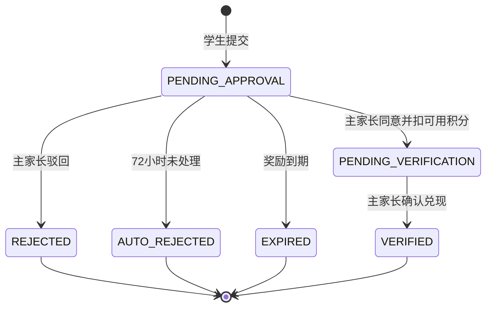

# 灵动学习 V27 家庭奖励与积分兑换闭环设计

## 1. 目标与范围

V27 在 V24-V26 学生唯一积分账户、不可变积分台账、安全查询和纠错能力之上，实现家庭奖励配置、学生兑换申请、主家长审批、可用积分扣减、奖励核销和超时处理闭环。

本版本严格采用“每个学生独立奖励库”：奖励直接归属一个学生，当前活动主家长负责配置和处理，多个孩子之间不共享奖励或兑换记录。副家长、机构管理员、教师和系统审核员不得配置奖励、审批兑换或查看家庭兑换明细。

本版本不实现积分衰减、休眠清零、成长复盘、消息实际投递、兑换记录导出、家长小程序登录、家庭公共奖励库或商业付费奖励。消息事件和导出能力待对应基础模块完成后接入，不在 V27 内伪造适配器。

## 2. 角色与客户端边界

| 角色 | 当前客户端 | 能力 |
|---|---|---|
| 活动主家长 | Web | 选择活动主关系孩子，新增、编辑、上下架、逻辑删除奖励；查询兑换；同意、驳回、核销。 |
| 学生 | uni-app 小程序 | 浏览本人可兑换奖励，提交兑换申请，查询本人兑换状态和历史。 |
| 副家长 | 暂无对应当前实现入口 | 需求保留只读能力，待副家长关系和对应客户端认证完成后接入。 |
| 其他角色 | Web/小程序 | 不展示入口，后端拒绝访问家庭奖励和兑换数据。 |

`REWARD_EXCHANGE` 功能开关同时控制奖励库、兑换申请、审批和核销。Web 与小程序公共能力摘要按客户端返回该能力；入口隐藏不能替代后端开关、RBAC、会话类型和对象范围校验。

## 3. 奖励模型

### 3.1 奖励字段

`growth_reward` 保存：19 位雪花主键、学生标识、创建家长标识、奖励名称、所需积分、奖励描述、可空有效期、状态、版本号和创建/更新时间。

约束如下：

1. 奖励名称去除首尾空白后长度为 1 至 30 字。
2. 所需积分为正整数；客户端不得提交零或负数。
3. 奖励描述可空，最长 200 字。
4. 有效期可空；填写时必须晚于保存时刻。
5. 状态为 `ONLINE`、`OFFLINE`、`DELETED`。删除采用逻辑删除，历史兑换仍可追溯。
6. 只有 `ONLINE` 且未到有效期的奖励向学生展示并允许申请。
7. 手动下架或删除后不再接受新申请；已存在的待审批、待核销和已核销记录不被删除。
8. 奖励到期自动下架；其待审批申请进入已失效，待核销记录不受影响。

当前活动主家长可以管理该学生的既有奖励，不以奖励最初创建人作为永久管理边界。创建家长标识只用于审计和追溯，避免主家长变更后奖励库无人管理。

## 4. 兑换模型与状态机

`growth_reward_exchange` 保存：19 位雪花主键、奖励和学生标识、申请学生用户标识、奖励名称/积分/描述快照、申请时间、审批截止时间、状态、处理家长、处理时间、驳回原因、核销家长、核销时间、版本号和创建/更新时间。

奖励快照在申请事务中写入。奖励后续编辑、下架、删除或主家长变更均不能修改历史兑换内容。

状态规则：

1. `PENDING_APPROVAL` 不扣积分。
2. 同意后直接进入 `PENDING_VERIFICATION`，不保留无业务停留时间的中间“已同意”状态。
3. `REJECTED` 需要 1 至 500 字中性原因，不扣积分。
4. 申请时间满 72 小时仍未处理时进入 `AUTO_REJECTED`，不扣积分。
5. 奖励有效期到达时，仍待审批的申请进入 `EXPIRED`，不扣积分。原始素材中的“积分返还”在当前扣分时点下等价为“不发生扣分”。
6. `PENDING_VERIFICATION` 表示积分已经扣除且等待实际兑现；奖励后续下架、删除或到期不影响核销，也不自动返还积分。
7. `VERIFIED` 为最终状态，不得重复核销。
8. 同一学生与奖励存在待审批或待核销记录时不得重复申请；记录进入最终状态后可以再次申请同一奖励。

## 5. 积分事务与不可变台账

学生提交兑换申请时只校验当前可用积分是否不低于奖励积分，不冻结也不预扣积分。待审批期间其他兑换可能先被同意，因此主家长同意时必须再次校验余额。

同意兑换在一个事务中完成：

1. 校验功能开关、Web 会话、家长权限和当前活动主关系。
2. 锁定兑换记录，确认仍为 `PENDING_APPROVAL`，未超过 72 小时且奖励未到期。
3. 锁定学生积分账户，确认可用积分充足。
4. 只减少 `available_points`，不减少 `total_points`，并递增账户版本号。
5. 写入一笔不可变 `REDEMPTION` 台账：`amount=0`、`available_delta=-所需积分`，关联兑换记录并记录处理家长。
6. 将兑换更新为 `PENDING_VERIFICATION`，保存处理人和时间。

`growth_point_ledger` 增加可空 `source_exchange_id`。每个兑换记录最多关联一笔 `REDEMPTION` 台账，数据库唯一约束与事务状态条件共同防止重复扣分。V27 调整既有台账检查约束，允许兑换台账总积分变化为 0、可用积分变化为负数；既有任务奖励和纠错约束保持不变。

任一步失败必须整体回滚。余额不足、状态已变化、并发旧版本、重复审批或重复核销返回状态冲突，不产生部分扣分或孤立台账。

## 6. 自动处理

新增可配置批量任务，周期扫描：

1. 审批截止时间已到且仍为 `PENDING_APPROVAL` 的记录，条件更新为 `AUTO_REJECTED`。
2. 奖励有效期已到时，将仍在线的奖励条件更新为 `OFFLINE`，并将对应待审批记录条件更新为 `EXPIRED`。
3. 单批处理固定上限，循环续批，避免长事务；条件更新携带原状态或版本，支持多实例并发而不重复处理。
4. 审批接口本身再次检查 72 小时和奖励有效期，即使定时任务延迟，也不能批准过期申请。

自动处理仅改变未扣分的待审批记录，不生成积分台账，也不连接共享测试、预生产或生产数据库进行验证。

## 7. RBAC 与接口契约

V27 新增最小权限：

| 权限编码 | 客户端 | 默认角色 | 用途 |
|---|---|---|---|
| `REWARD_MANAGE_CHILD` | Web | `PARENT` | 管理活动主关系学生奖励。 |
| `REWARD_EXCHANGE_REVIEW_CHILD` | Web | `PARENT` | 查询并审批、驳回、核销孩子兑换。 |
| `REWARD_EXCHANGE_SELF` | MINIAPP | `STUDENT` | 浏览本人奖励、申请并查询本人兑换。 |

主要接口：

| 方法与路径 | 说明 |
|---|---|
| `GET /api/v1/rewards/students/{studentId}` | 主家长查询孩子奖励库，包含下架历史。 |
| `POST /api/v1/rewards/students/{studentId}` | 主家长新增奖励。 |
| `PATCH /api/v1/rewards/{rewardId}` | 当前主家长编辑或上下架奖励。 |
| `DELETE /api/v1/rewards/{rewardId}` | 当前主家长逻辑删除奖励。 |
| `GET /api/v1/rewards/me` | 学生查询本人在线且未到期奖励。 |
| `POST /api/v1/reward-exchanges` | 学生按奖励标识提交申请，不接收学生标识和积分。 |
| `GET /api/v1/reward-exchanges/me` | 学生分页查询本人兑换历史。 |
| `GET /api/v1/reward-exchanges/students/{studentId}` | 主家长分页查询孩子兑换记录。 |
| `POST /api/v1/reward-exchanges/{id}/approve` | 主家长同意，原子扣减可用积分。 |
| `POST /api/v1/reward-exchanges/{id}/reject` | 主家长填写原因后驳回。 |
| `POST /api/v1/reward-exchanges/{id}/verify` | 主家长确认奖励已实际兑现。 |

所有 19 位标识以字符串传输。学生接口从 `MINIAPP` 会话反查本人，不接收学生标识；家长接口只允许 `WEB` 会话和当前活动主关系。跨对象资源统一按 404 隐藏，缺少 RBAC 权限返回 403，功能停用返回 409。

## 8. 双端交互

Web 侧栏对符合能力摘要和家长角色的用户显示“奖励管理”。页面先选择活动主关系孩子，再提供“奖励库”和“兑换处理”两个页签。奖励库支持新增、编辑、上下架和删除确认；兑换处理按状态筛选，待审批提供同意/驳回，待核销提供核销。窄屏宽表仅在内容面板内部滚动。

uni-app 学生首页在能力启用时显示“奖励兑换”。页面顶部展示可用积分，以不超过 8 像素圆角的重复奖励项展示名称、描述、所需积分和有效期；积分不足时兑换按钮禁用。页面通过页签切换“可兑换奖励”和“我的兑换”，提交前二次确认，成功后刷新余额、奖励和兑换记录。

功能停用、会话失效或权限变化后，入口、直达页面和操作按钮同步不可用；前端不发送绕过请求。

## 9. 测试与验收

1. Flyway 从空库连续执行 V1-V27，验证两张新表、外键、检查/唯一约束、台账关联字段、开关、权限、角色授权和全部表显式 `BIGINT id` 主键。
2. 后端覆盖主家长奖励增改、上下架、逻辑删除、关系越权、字段边界和到期隐藏。
3. 学生覆盖本人列表、积分不足、重复活动申请、跨学生隐藏、申请快照和功能停用。
4. 审批覆盖余额二次校验、只扣可用积分、累计积分不变、唯一兑换台账、重复/并发审批、驳回原因、72 小时自动驳回、奖励到期失效和待核销不受下架影响。
5. 核销覆盖当前主家长、合法状态、历史主家长变更和重复核销。
6. Web 覆盖孩子切换、奖励配置、审批、驳回和核销；uni-app 覆盖奖励列表、积分不足禁用、申请确认和状态历史。
7. Web 生产构建、uni-app 类型检查、H5 和微信小程序构建全部通过，并在桌面、窄屏和移动视口完成无重叠、无页面级横向溢出的视觉核验。
8. 数据库自动化仍只使用本地 H2 MySQL 兼容模式，不连接远程 MySQL、Redis、微信服务，也不在共享测试、预生产或生产数据库执行。
