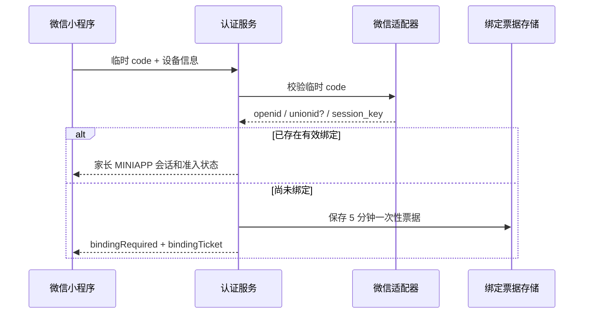

# 灵动学习 V37 家长微信授权与手机号绑定设计

## 1. 目标与需求依据

V37 在 V36 家长手机号认证基础上增加微信小程序快捷登录。首次微信授权不得直接创建无手机号家长，必须通过手机号短信验证码绑定唯一家长账号；后续授权命中有效绑定后才可直接建立家长小程序会话。微信能力只属于 uni-app 的微信小程序构建，Web 与 H5 继续使用手机号验证码或密码。

## 2. 设计结论

采用“微信临时凭证换取身份 + 服务端一次性绑定票据 + 手机号短信确认”的方案：

1. 小程序调用 `wx.login` 获取临时 `code`，只把 `code`、设备信息提交后端。
2. 后端通过微信适配端口换取 `openid`、可选 `unionid` 和 `session_key`。
3. 已存在有效绑定时，后端直接为该家长创建 `MINIAPP` 会话。
4. 未绑定时，后端不创建用户和会话，只签发 5 分钟、一次性使用的绑定票据。
5. 家长完成手机号 `WECHAT_BIND` 验证码、当前协议接受和绑定票据校验后，后端在事务内查找或创建唯一家长，再建立微信绑定与小程序会话。

## 3. 范围

### 3.1 本次实现

- `PARENT_WECHAT_AUTH` 全局功能开关，默认关闭。
- 微信登录适配端口、生产 HTTP 适配器和本地/测试假实现。
- 微信身份一对一绑定、已绑定快捷登录、首次手机号绑定。
- Redis 一次性绑定票据与测试内存实现，固定 5 分钟有效期。
- 独立短信验证码用途 `WECHAT_BIND`。
- uni-app 微信小程序家长登录入口、绑定表单、失败回退和协议处理。
- 微信调用、绑定冲突、票据重放、功能停用和敏感信息自动化测试。

### 3.2 本次不实现

- 不实现学生微信登录或学生微信绑定。
- 不实现微信绑定解除、换绑、多个微信绑定同一家长。
- 不依赖微信手机号授权能力自动创建账号。
- 不在 Web 或 H5 显示微信登录入口。
- 不接入微信昵称、头像等非登录必要资料。
- 不在本地自动化中连接真实微信、远程 MySQL、Redis、共享测试、预生产或生产环境。

## 4. 数据模型与唯一性

新增 `auth_parent_wechat_binding`：

- `id`：应用层生成的 19 位雪花 `BIGINT` 主键，禁止自增。
- `user_id`：家长用户，唯一，外键关联 `sys_user.id`。
- `app_id`、`open_id`：同一小程序下的微信身份，组合唯一。
- `union_id`：可空辅助标识，不作为当前登录主键。
- `status`：当前仅允许 `ACTIVE`，为后续受控解绑保留状态字段。
- `bound_at`、`last_login_at`、`created_at`、`updated_at`：绑定和登录审计时间。

一名家长当前只允许一个微信绑定；一个 `app_id + open_id` 只能对应一个家长。发生冲突时不覆盖、不自动合并、不自动换绑，统一返回中性认证失败。

## 5. 微信适配边界

定义内部端口 `ParentWechatIdentityGateway`，业务层只接收微信登录临时凭证并取得内部值对象，不依赖微信 SDK 或 HTTP 报文。

生产适配器通过服务端配置的 `app-id` 和 `app-secret` 调用微信登录凭证校验接口。密钥不得进入前端、接口响应、数据库、Flyway、业务日志或文档。微信错误、超时、响应缺字段和网络异常统一映射为受控的第三方认证不可用错误。

`session_key` 仅在本次服务端交换结果对象中短暂存在，不持久化、不缓存、不打印、不返回小程序。`unionid` 只在微信实际返回时保存，不能假定个人主体一定取得该字段。

## 6. 一次性绑定票据

1. 票据使用安全随机值，客户端只持有不透明字符串。
2. Redis 以票据摘要为键，保存 `appId`、`openId`、可选 `unionId`，有效期固定 5 分钟。
3. 票据只能消费一次；过期、重复、篡改或存储故障全部失败关闭。
4. 客户端不得直接提交 `openid` 或 `unionid` 参与绑定，避免伪造微信身份。
5. 绑定事务失败后票据不恢复，用户重新发起微信授权，避免不确定状态重放。

## 7. 首次绑定与快捷登录流程

### 7.1 微信授权交换

### 7.2 手机号绑定

1. 小程序使用现有短信端点申请 `WECHAT_BIND` 验证码。
2. 用户提交手机号、验证码、绑定票据、当前协议版本和设备信息。
3. 后端先消费票据和验证码，再按手机号加锁查询 `sys_user`。
4. 手机号不存在时，按 V36 规则创建 `FAMILY` 用户、授予 `PARENT`、创建家长档案并记录协议接受。
5. 手机号存在时，必须是启用的家长账号；按当前协议版本补充接受事实。
6. 后端创建唯一微信绑定并建立 `MINIAPP` 会话，返回 V36 已定义的协议和首次引导状态。

## 8. 接口契约

- `GET /api/v1/public/parent-auth-context`：增加 `wechatEnabled`，供小程序决定是否显示微信入口。
- `POST /api/v1/auth/parent-wechat-sessions`：提交微信临时 `code`、设备信息。已绑定返回会话；未绑定返回 `bindingRequired=true` 和一次性绑定票据。
- `POST /api/v1/auth/parent-wechat-bindings`：提交绑定票据、手机号、`WECHAT_BIND` 验证码、协议接受和设备信息，完成绑定并返回家长会话。
- `POST /api/v1/auth/parent-sms-codes`：扩展支持 `WECHAT_BIND`，继续执行用途、客户端和频率隔离。

微信登录和绑定接口只接受 `MINIAPP`，其他客户端统一拒绝。认证与冲突错误不暴露手机号是否注册、微信是否已绑定、目标账号状态或其他主体信息。

## 9. 功能开关和服务登记

1. `PARENT_WECHAT_AUTH` 关闭时，小程序不展示微信入口，两个微信接口均由后端拒绝。
2. 关闭微信能力不影响 V36 手机号验证码、密码登录和已建立会话。
3. 生产调用前必须同时满足微信接口服务登记启用和凭证配置完整；任一条件不满足均失败关闭。
4. 功能关闭后不得签发新票据或建立新的微信会话，已存在绑定记录保留，不做破坏性清理。

## 10. 小程序交互

- 家长登录页在 `mp-weixin` 且 `wechatEnabled=true` 时显示带微信图标的“微信快捷登录”按钮。
- 首次授权进入手机号绑定视图；验证码倒计时、协议勾选和错误反馈复用 V36 交互规则。
- 微信失败、票据失效或绑定冲突时保留手机号验证码和密码登录入口，不产生死循环。
- H5 调试构建不显示微信按钮，也不调用 `wx.login`。
- 家长会话继续写入独立家长存储键，不得覆盖学生会话。

## 11. 安全与审计

- 日志禁止出现 `app-secret`、临时 `code`、`session_key`、完整 `openid`、完整手机号、短信验证码和绑定票据。
- 调用台账只记录请求标识、服务、结果、耗时和脱敏错误类别。
- 微信 code 重放、绑定票据重放、短信验证码重放均不能建立第二个会话或绑定。
- 数据库唯一约束和事务共同处理并发绑定，应用层预检查不能替代唯一约束。
- 停用、锁定、非家长账号即使存在历史绑定也不得登录。

## 12. 验收标准

- 首次微信授权只返回绑定要求，不创建无手机号用户或会话。
- 手机号验证成功后最多创建一个家长、一个家长档案、一个角色关系和一条微信绑定。
- 已绑定微信后可建立 `MINIAPP` 家长会话，并继续执行协议和首次引导准入。
- 不同微信不能绑定同一家长，同一微信不能绑定不同家长。
- `session_key`、密钥、验证码和票据不落库、不进日志、不进前端产物。
- 功能关闭、服务未登记、配置缺失、微信异常、票据异常和 Redis 故障全部失败关闭并可回退手机号登录。
- Flyway 从空库连续迁移到 V37，全部主键表均无自增语法。
- 后端全量测试、Web 全量测试和构建、uni-app 类型检查、H5 与微信小程序构建全部通过。

