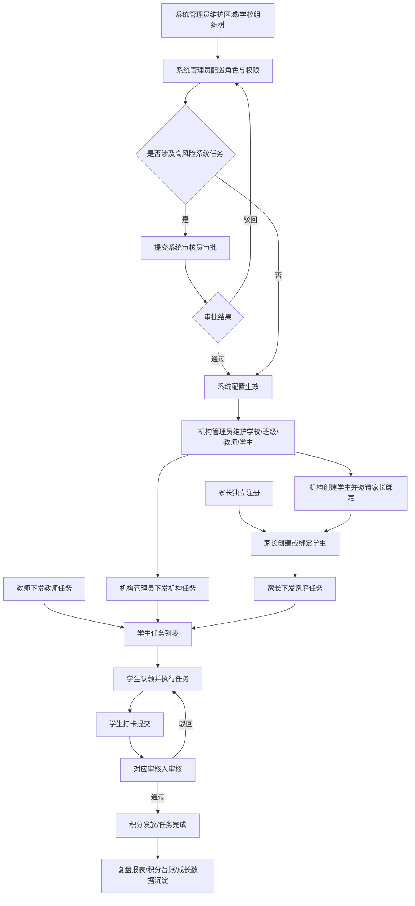
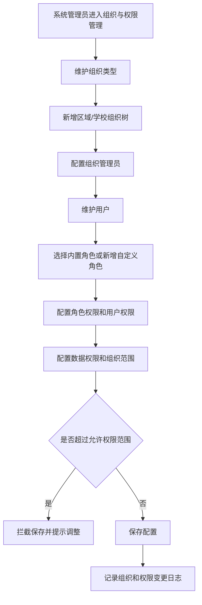
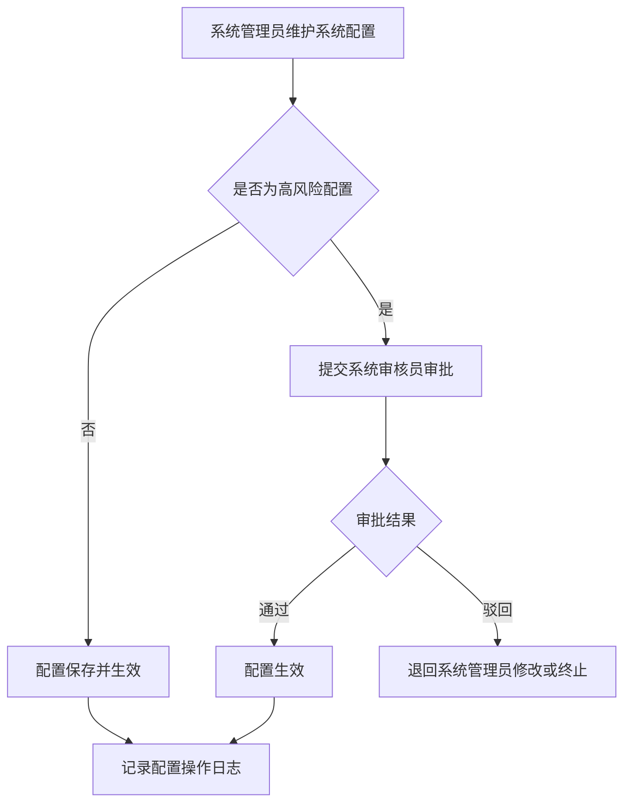
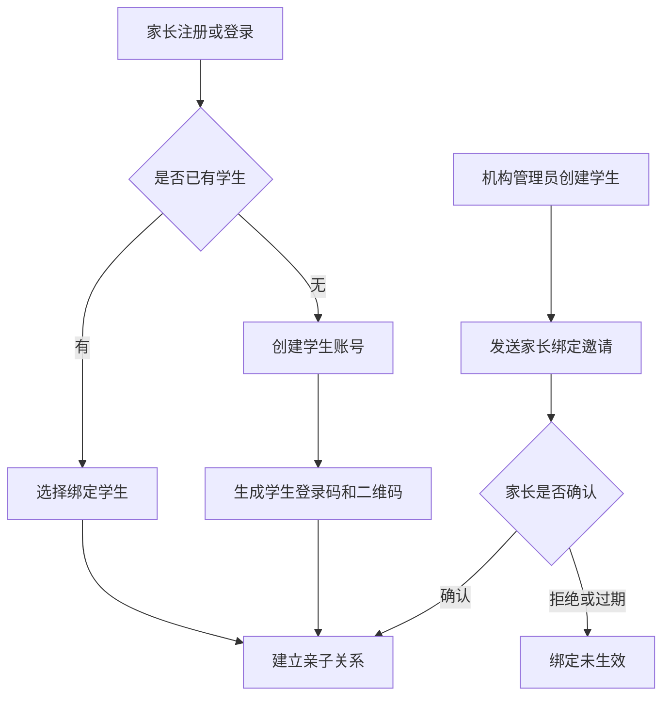
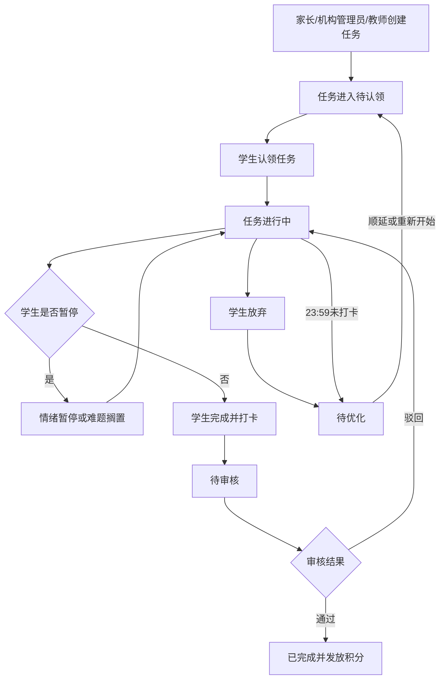
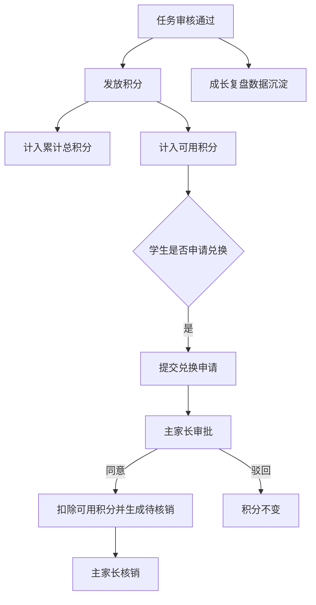
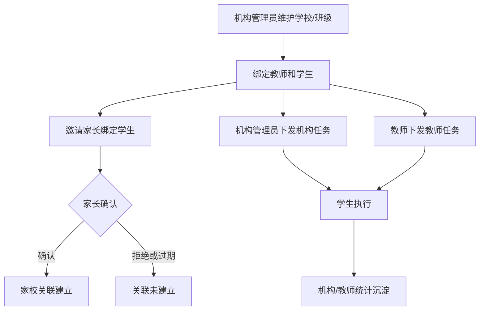

# 灵动学习业务需求文档

**文档版本**：V1.0

**编制角色**：业务需求分析师（基于原始需求素材与业务口径调整编制）

**文档用途**：本文档为灵动学习项目业务需求基线，用于支撑产品原型设计、需求评审、业务范围锁定、研发评估与测试用例设计。本文档以《灵动学习-需求原始素材汇总V1.0》为基础，并按业务方最新确认口径调整角色体系、权限体系、组织架构、端应用边界、功能启停规则与项目建设范围。

**适用范围**：灵动学习小学生自律成长管家系统，覆盖后台管理、Web端业务操作、小程序端业务操作、家校任务协同、学生自律成长、积分激励、数据统计、权限管控、系统审核、功能启停等业务场景。

**编写规范**：本文档以业务规则、业务流程、用户行为、页面展示、字段约束、权限范围、统计口径为主。技术架构仅作为业务建设约束列明，不展开代码实现、接口协议、部署方案。

# 1 业务总体概述

## 1.1 业务现状与痛点

当前小学生自律成长管理主要依赖家长、教师、学校机构分别线下管理，任务下发、完成反馈、积分激励、成长复盘、考勤统计、家校协同之间缺少统一数字化支撑。

家庭侧，家长通常通过口头安排、纸质清单、聊天工具或临时记录管理孩子学习任务，存在任务遗漏、执行状态不清、积分规则不统一、成长过程难沉淀等问题。学生遇到情绪波动或难题时，也缺少低压力的自主调节机制。

学校或机构侧，班级任务、学生考勤、学习状态、异常报备和班级统计往往依赖人工汇总，任务下发效率低，过程数据滞后，机构管理员和教师难以及时掌握学生执行情况。

家校协同侧，机构与家长既可能是两个独立主体，也可能围绕学生建立关联关系。若缺少清晰的数据隔离和任务来源标识，容易出现家庭私有数据被机构查看、机构任务被家长误改、学生端任务来源混乱等问题。

系统管控侧，需要支持区域、学校树形组织架构和RBAC权限管控，并允许系统管理员按实际运营需要新增角色、分配权限范围。若角色权限固定、组织范围不清，将难以适配多区域、多学校、多岗位协作管理。

## 1.2 业务建设目标

1. 建立面向系统管理员、系统审核员、机构管理员、教师、家长、学生的统一业务角色体系，明确各角色权责、操作范围和数据边界。
2. 建立家校双主体协同模式，支持机构独立分配学习任务、家长独立分配学习任务，也支持机构下关联家长和学生后开展协同管理。
3. 建立以区域、学校为主线的树形组织架构，支撑区域管理、学校管理、班级管理、教师管理、学生管理和数据范围控制。
4. 建立RBAC权限管控体系，支持系统管理员新增自定义角色并动态分配菜单权限、操作权限、数据权限和组织范围权限。
5. 建立正向自律成长业务闭环，覆盖任务创建、任务认领、执行打卡、审核确认、积分发放、奖励兑换、成长复盘。
6. 建立功能启停管控能力，后台可配置功能启用或停用，功能停用后相关菜单、入口、按钮、页面、操作全部隐藏不可见，并同步限制相关业务操作。
7. 明确Web端和小程序端为两个独立前端应用。操作性功能两端均需覆盖，复杂统计、权限配置、组织配置、批量管理等重管理能力以Web端为主。
8. 建立统一统计报表和台账能力，支持家庭、学生、教师、机构、系统管理等不同维度的数据查看、筛选、导出和追溯。
9. 坚持未成年人合规、无教培红线、无广告变现、无付费氪金、只奖不罚、情绪友好、数据隔离的业务底线。

## 1.3 业务边界范围

**纳入范围（本次项目建设业务）**：

1. 账号与登录：系统管理员、系统审核员、机构管理员、教师、家长、学生账号登录、账号安全、微信授权、设备管理。
2. 组织架构：区域、学校、班级、人员关系维护，支持区域到学校的树形组织管理。
3. RBAC权限：内置角色、自定义角色、菜单权限、功能操作权限、数据范围权限、组织范围权限。
4. 系统审核：系统审核员审批系统管理员提交的高风险系统任务。
5. 系统配置：附件管理、缓存管理、数据字典管理、导入导出模板配置管理、接口服务管理。
6. 功能启停：后台配置功能开关，停用后前端全部隐藏不可见，历史数据按规则保留。
7. 学生账号管理：家长创建学生、机构创建学生、亲子绑定、副家长绑定、学生转班转学、账号注销、登录码重置。
8. 学习任务管理：家庭任务、机构任务、教师任务的创建、下发、认领、执行、打卡、审核、顺延、放弃、免执行。
9. 积分与奖励：正向积分、积分审核、积分台账、积分衰减、休眠清零、奖励库、兑换审批、奖励核销。
10. 成长复盘：每日复盘、周/月报表、补录、PDF导出、报表订阅、匿名积分排行。
11. 学校机构管理：学校/机构、班级、教师、学生、家长关联、机构任务、考勤围栏、机构报表。
12. 教师端业务：教师任务下发、学生任务进度查看、班级复盘、考勤查看、异常报备。
13. 学生端业务：任务查看、任务认领、任务执行、情绪暂停、难题搁置、打卡提交、积分查询、奖励兑换申请、个人成长数据查看。
14. 消息通知：站内消息、微信服务通知、夜间抑制、消息归档、跳转业务详情。
15. 数据安全合规：未成年人隐私保护、数据脱敏、位置授权、操作日志、数据留存、帮助中心、意见反馈、维护只读。
16. 项目建设约束：后端Spring Boot 3+、JDK 17+、Maven 3.9+并兼容Maven 4、MyBatis XML、MySQL 8+、Redis、Web端Ant Design Pro React、小程序端uni-app。

**剔除范围（本次文档不展开内容）**：

1. 具体代码实现、接口协议、数据库表结构、部署架构、服务器规格。
2. 第三方SDK具体厂商选型和采购商务规则。
3. 非自律成长业务相关的课程售卖、在线教学、搜题解题、广告投放、付费氪金、商业变现。
4. 与灵动学习无关的通用OA、财务、人事、资产管理等独立系统。

## 1.4 业务名词术语定义

| 业务术语 | 官方业务释义 | 业务补充说明 |
|---|---|---|
| 系统管理员 | 平台最高系统管理角色，负责组织、角色、权限、功能开关、系统配置、系统任务发起 | 可新增自定义角色并分配权限，但自定义角色权限不得超过系统允许范围 |
| 系统审核员 | 审批系统管理员提交的高风险系统任务的角色 | 不审批学习任务、积分审核、兑换审批、学生打卡审核 |
| 机构管理员 | 学校或机构管理角色，负责本机构下学校、班级、教师、学生、机构任务、考勤、报表管理 | 数据范围受组织树和RBAC权限控制 |
| 教师 | 班级教学管理角色，负责本班任务下发、学生数据查看、异常报备 | Web端和小程序端均可支持操作性功能，复杂统计以Web端为主 |
| 家长 | 家庭管理角色，负责子女账号、家庭任务、积分审核、奖励管理、成长复盘 | 可独立存在，也可通过学生与机构建立关联 |
| 学生 | 学习任务执行角色，负责任务认领、执行、打卡、情绪暂停、积分兑换申请 | 无管理和配置权限 |
| RBAC | 基于角色的权限控制 | 角色关联菜单、按钮、数据范围、组织范围 |
| 组织树 | 以区域、学校为核心的层级组织结构 | 支持区域下挂学校，学校下挂班级、教师、学生 |
| 家庭任务 | 由家长创建并分配给学生的学习任务 | 家庭私有数据，机构和教师不可查看家庭私有明细 |
| 机构任务 | 由机构管理员创建并下发的学习任务 | 属于机构公开业务数据 |
| 教师任务 | 由教师创建并下发给本班学生的学习任务 | 属于班级教学任务，纳入机构统计 |
| 待认领 | 学习任务初始状态，学生尚未开始执行 | 学生可点击认领 |
| 进行中 | 学生已认领并正在执行任务 | 可打卡、放弃、情绪暂停 |
| 待审核 | 学生提交打卡后等待审核的状态 | 家庭任务由主家长审核，机构/教师任务按配置由教师或机构管理员审核 |
| 已完成 | 审核通过后的任务状态 | 任务记录永久留存 |
| 待优化 | 当日未完成或学生放弃后形成的中性状态 | 不扣分、不惩罚、不负面评价 |
| 情绪暂停 | 学生在进行中任务内主动触发的临时暂停 | 单次最长2小时 |
| 功能开关 | 后台对业务功能启用或停用的管控能力 | 停用后相关功能全部隐藏不可见 |
| 附件管理 | 统一管理系统内上传、下载、查看、预览的文件资料 | 所有业务模块不得各自建设独立附件能力 |
| 数据字典 | 统一维护下拉选择、状态枚举、类型选项等基础业务字典 | 页面下拉框和枚举展示统一来源 |
| 导入导出模板 | 统一配置系统导入、导出文件模板 | 覆盖学员导入、任务导入、报表导出等场景 |
| 接口服务 | 面向第三方对接或对外提供的数据服务配置 | 仅描述业务管理要求，不展开接口协议 |

# 2 业务角色与全域流程

## 2.1 业务角色矩阵

| 业务角色 | 核心业务权责 | 核心业务操作场景 |
|---|---|---|
| 系统管理员 | 系统全局管理、组织架构管理、角色权限管理、功能启停、系统配置、系统任务发起、日志审计 | 新增区域/学校、配置角色、分配权限、发起公告发布/数据恢复/敏感导出/全局开关调整等系统任务 |
| 系统审核员 | 审批系统管理员提交的高风险系统任务 | 审核系统公告发布、机构停用、数据恢复、敏感数据导出、全局功能开关调整等任务 |
| 机构管理员 | 管理本机构或授权组织范围内的学校、班级、教师、学生、机构任务、考勤、报表 | 班级管理、学员管理、机构任务下发、围栏配置、机构报表查看和导出 |
| 教师 | 管理授权班级内教学任务、学生执行进度、考勤和异常报备 | 创建教师任务、查看学生任务进度、查看班级复盘、提交异常报备 |
| 家长 | 管理绑定子女、家庭任务、积分审核、奖励兑换、成长复盘 | 创建学生账号、绑定学生、创建家庭任务、审核打卡、配置奖励、审批兑换 |
| 学生 | 执行学习任务、自主调节、提交打卡、查看积分和成长记录 | 认领任务、执行任务、情绪暂停、难题搁置、打卡、兑换申请、查看复盘 |

## 2.2 全域总体业务流程

系统整体业务从组织与权限配置开始，形成机构、教师、家长、学生可协作但数据边界清晰的业务闭环。

全域流程应遵循以下原则：

1. 机构、教师、家长均可独立分配学习任务，但任务必须标注来源。
2. 学生端可统一查看任务，也可按家庭任务、机构任务、教师任务筛选。
3. 家庭私有数据与机构公开数据双向隔离。
4. 功能开关优先于角色权限和数据权限；功能停用后相关入口和操作全部隐藏不可见。
5. 系统审核员只审批系统管理员提交的高风险系统任务，不参与学习过程业务审批。

# 3 分模块精细化业务需求（核心原型依据）

## 3.1 组织管理与权限管理模块

### 3.1.1 模块业务定位

本模块承载系统组织结构、用户、角色、权限、数据范围和组织管理员配置，是全系统访问控制和数据隔离的基础。系统按区域、学校树形架构组织业务对象，通过RBAC实现不同角色、不同组织范围、不同数据维度的权限管控。组织下配置的管理员可管理对应组织范围内所有授权事项。

### 3.1.2 模块功能拆解清单

| 序号 | 功能名称 | 详细业务需求描述 | 需求优先级 |
|---|---|---|---|
| 1 | 用户管理 | 支持系统管理员、系统审核员、机构管理员、教师、家长、学生等用户账号查询、启用、停用、重置、组织关联维护 | 高 |
| 2 | 角色管理 | 支持内置角色和自定义角色管理，内置角色包括系统管理员、系统审核员、机构管理员、教师、家长、学生 | 高 |
| 3 | 自定义角色管理 | 系统管理员可新增运维角色、数据查看角色等自定义角色 | 高 |
| 4 | 角色权限管理 | 支持按角色分配菜单权限、页面权限、按钮权限、业务操作权限 | 高 |
| 5 | 用户权限管理 | 支持在角色权限基础上为指定用户配置补充权限或限制权限 | 高 |
| 6 | 数据权限管理 | 支持按全部、本区域、本学校、本班级、本人、自定义范围控制数据查看和操作边界 | 高 |
| 7 | 区域、学校组织树新增 | 支持新增、编辑、启用、停用区域节点、学校节点，区域可按实际业务形成多级结构 | 高 |
| 8 | 组织类型新增 | 支持配置区域、学校、校区、年级、班级等组织类型，组织类型可用于组织树节点分类 | 高 |
| 9 | 组织管理员配置 | 支持为区域、学校等组织节点配置组织管理员，组织管理员可管理对应组织下所有授权事项 | 高 |
| 10 | 班级管理 | 支持学校下创建班级、维护班级基础信息、绑定教师和学生 | 高 |
| 11 | 权限范围约束 | 自定义角色和用户补充权限不得超过授权范围，权限分配遵循最小权限原则 | 高 |
| 12 | 权限变更日志 | 用户、角色、权限、数据范围、组织管理员变更均需留存操作日志 | 中 |

### 3.1.3 模块业务功能流程图

### 3.1.4 精细化业务场景需求

常规场景：

1. 系统管理员创建区域、学校、班级，并将教师、学生归属到对应学校和班级。
2. 系统管理员新增运维角色，并授予日志查看、系统配置查看、问题处理等限定权限。
3. 系统管理员配置组织管理员，组织管理员可在对应组织范围内管理用户、班级、任务、统计等授权事项。
4. 机构管理员只能在授权学校或机构范围内维护班级、教师、学生和机构任务。

边界场景：

1. 家长不作为组织树节点管理，家长通过学生亲子关系与学校产生业务关联。
2. 学生可属于学校和班级，也可仅由家长独立创建，作为未关联机构的家庭学生存在。
3. 教师可绑定一个或多个班级，数据查看范围以授权班级为准。
4. 用户可同时关联角色权限和组织范围，最终可见功能由功能开关、角色权限、用户权限、数据权限共同决定。

异常场景：

1. 角色被停用后，已关联用户无法继续使用该角色权限。
2. 组织节点停用后，其下级节点和人员不再产生新业务，但历史数据保留可查询。
3. 权限变更后，已登录用户重新进入相关页面时按最新权限展示。

### 3.1.5 业务状态流转规则

| 状态 | 触发条件 | 可流转状态 | 不可逆向场景 |
|---|---|---|---|
| 启用 | 组织、角色、权限正常使用 | 停用 | - |
| 停用 | 管理员执行停用 | 启用 | 停用期间不得新增业务 |
| 待生效 | 权限调整已提交但需审核 | 已生效/已驳回 | 审核通过前不得使用新权限 |
| 已生效 | 权限保存或审批通过 | 停用/调整 | - |
| 已禁用 | 用户、角色、组织管理员被禁用 | 启用 | 禁用期间不可执行对应管理事项 |

### 3.1.6 页面字段业务规范

| 字段名称 | 页面展示 | 是否必填 | 字段业务规则/选项 | 业务约束说明 |
|---|---|---|---|---|
| 区域名称 | 是 | 是 | 最大50字符 | 同级区域名称不可重复 |
| 学校名称 | 是 | 是 | 最大100字符 | 同一区域下不可重复 |
| 班级名称 | 是 | 是 | 最大50字符 | 同一学校下不可重复 |
| 组织类型 | 是 | 是 | 区域/学校/校区/年级/班级/自定义 | 用于组织树节点分类 |
| 组织管理员 | 是 | 否 | 选择已有用户 | 管理范围不得超过所在组织 |
| 用户账号 | 是 | 是 | 手机号或账号名 | 同系统内唯一 |
| 用户状态 | 是 | 是 | 启用/停用/锁定 | 停用后不可登录 |
| 角色名称 | 是 | 是 | 最大30字符 | 内置角色名称不可删除 |
| 角色类型 | 是 | 是 | 内置角色/自定义角色 | 自定义角色可停用 |
| 菜单权限 | 是 | 是 | 按菜单树勾选 | 未授权菜单不可见 |
| 操作权限 | 是 | 是 | 新增/编辑/删除/审核/导出等 | 未授权按钮不可见 |
| 数据范围 | 是 | 是 | 全部/本区域/本学校/本班级/本人/自定义 | 不得超过授权组织范围 |

### 3.1.7 业务权限矩阵（功能+数据）

| 业务角色 | 功能操作权限 | 数据查看权限 |
|---|---|---|
| 系统管理员 | 用户、角色、角色权限、用户权限、数据权限、组织、组织类型、组织管理员、功能开关、系统配置管理 | 全局数据，按审计和管理需要查看 |
| 系统审核员 | 审批系统管理员提交的系统任务 | 仅查看待审批任务及审批历史 |
| 机构管理员 | 本机构组织、班级、教师、学生、机构任务管理 | 授权机构或学校范围内数据 |
| 教师 | 本班任务、学生进度、异常报备 | 授权班级学生机构和教师任务数据 |
| 家长 | 子女绑定、家庭任务、积分奖励管理 | 自家绑定学生数据 |
| 学生 | 任务执行、个人数据查看 | 个人任务、积分、复盘、考勤数据 |

### 3.1.8 特殊业务约束规则

1. RBAC权限控制覆盖菜单、页面、按钮、操作、数据和组织范围。
2. 功能开关优先级高于RBAC权限；功能停用后，即使角色拥有权限，也不可见、不可操作。
3. 系统管理员新增自定义角色时，不得绕过系统审核和权限边界。
4. 家长通过学生关系建立业务关联，不纳入区域学校组织树的层级节点。
5. 组织管理员的管理范围以所绑定组织节点为边界，可管理该组织及下级组织内授权事项。
6. 用户权限不得绕过角色权限和数据权限形成越权访问。
7. 权限生效优先级统一为：功能开关 > 禁止权限 > 用户单独限制权限 > 角色权限 > 用户补充权限 > 数据权限 > 组织范围权限。
8. 禁止权限优先于允许权限；当同一用户同时拥有多个角色时，只要任一授权范围内存在明确禁止权限，即对应功能不可见、不可操作。
9. 用户补充权限仅能在用户已授权组织范围内增加功能操作，不得扩大数据范围，不得突破组织范围。
10. 数据权限最终按角色数据范围、用户组织范围、组织管理员授权范围取交集；需扩大到交集外时，必须由系统管理员发起高风险系统任务并经系统审核员审批。
11. 组织管理员只能管理所绑定组织及下级组织内已授权事项，不自动拥有系统配置、系统审核、全局功能开关、跨组织数据查看权限。
12. 组织管理员不得给自己扩权，不得将自身不具备的权限授予他人。

## 3.2 系统配置、系统审核与功能启停模块

### 3.2.1 模块业务定位

本模块用于统一管理系统通用配置、公共能力、系统高风险操作审核和全局功能启停。系统配置覆盖附件管理、缓存管理、数据字典管理、导入导出模板配置、接口服务管理等通用功能，所有业务模块涉及同类能力时统一调用，不允许各模块自行维护一套孤立规则。系统管理员发起涉及全局影响、敏感数据、重要配置的系统任务时，由系统审核员审批。功能启停用于控制业务功能可用性，停用后相关功能全部隐藏不可见。

### 3.2.2 模块功能拆解清单

| 序号 | 功能名称 | 详细业务需求描述 | 需求优先级 |
|---|---|---|---|
| 1 | 系统任务提交 | 系统管理员提交公告发布、机构停用、数据恢复、敏感导出、全局开关调整等任务 | 高 |
| 2 | 系统任务审批 | 系统审核员审批通过或驳回系统管理员提交的任务 | 高 |
| 3 | 审批意见记录 | 审批通过或驳回均需填写或记录审批意见、审批人、审批时间 | 高 |
| 4 | 附件管理 | 所有涉及附件上传、下载、查看、预览的业务场景统一调用附件管理能力，统一配置文件类型、大小、预览、下载、删除和权限规则 | 高 |
| 5 | 缓存管理 | 支持按缓存类型、业务模块清除缓存或刷新缓存，并记录操作日志；全量清除缓存属于高风险系统任务 | 中 |
| 6 | 数据字典管理 | 所有涉及下拉框、状态、类型、枚举选项的字典统一在此配置管理，支持字典类型、字典项、排序、启停和默认项 | 高 |
| 7 | 导入导出模板配置管理 | 所有涉及导入、导出文件模板的业务场景均在此功能下配置模板，支持模板版本、默认模板和启停管理 | 高 |
| 8 | 接口服务管理 | 对第三方对接接口或对外提供接口进行业务登记、启停、授权范围和责任人配置，新增、停用、扩大授权范围需审批 | 中 |
| 9 | 功能开关配置 | 支持后台启用或停用学生账号创建、任务复制、积分兑换、复盘、情绪暂停、考勤、报表导出等功能 | 高 |
| 10 | 功能停用隐藏 | 功能停用后相关菜单、入口、页面、按钮、弹窗、操作全部隐藏不可见 | 高 |
| 11 | 历史数据保留 | 功能停用后历史数据按规则保留，可查询或导出，禁止新增、编辑、审核等操作 | 高 |
| 12 | 开关变更日志 | 功能开关变更需记录操作人、时间、变更前后状态、原因 | 中 |

### 3.2.3 模块业务功能流程图

### 3.2.4 精细化业务场景需求

常规场景：

1. 系统管理员调整全局功能开关，提交后由系统审核员审批，审批通过后生效。
2. 系统管理员发布系统公告，系统审核员审核通过后按范围展示。
3. 系统管理员发起数据恢复申请，系统审核员审批通过后执行恢复。
4. 系统管理员维护附件格式、大小、预览范围等规则，业务模块上传附件时统一调用。
5. 系统管理员维护任务类型、任务状态、组织类型、考勤状态等数据字典，下拉框统一使用字典配置。
6. 系统管理员维护导入导出模板，学员导入、任务导入、报表导出等场景统一使用模板。
7. 系统管理员登记第三方对接或对外服务接口，明确接口用途、调用方、授权范围、启停状态和责任人。
8. 系统管理员按缓存类型刷新权限缓存、字典缓存、组织缓存、功能开关缓存、用户会话缓存等缓存项。
9. 系统管理员配置接口服务方向，区分“本系统调用第三方”和“第三方调用本系统”。

需系统审核员审批的高风险系统任务清单：

1. 发布全局系统公告。
2. 停用机构、学校、区域等重要组织节点。
3. 发起数据恢复。
4. 发起敏感数据导出。
5. 调整全局功能开关。
6. 全量清除缓存或清除用户会话缓存。
7. 新增接口服务、停用接口服务、扩大接口服务授权范围。
8. 跨区域配置组织管理员或扩大组织管理员管理范围。
9. 变更系统关键字典，例如任务状态、角色类型、组织类型、审核状态。
10. 调整用户或角色的数据权限至原授权组织范围之外。

边界场景：

1. 系统审核员不得审批自己提交的任务。
2. 系统审核员不参与家长积分审核、奖励兑换审批、教师任务审核、学生打卡审核。
3. 功能停用后，旧链接或收藏入口不得继续展示功能页面。
4. 附件管理只统一业务规则和入口，不改变各业务模块对附件归属和数据权限的控制。
5. 字典项停用后，新增或编辑页面不可继续选择该字典项，历史数据仍按原值展示。
6. 导入导出模板变更后，新导入导出任务使用最新模板，历史导出文件不被覆盖。
7. 接口服务停用后，相关第三方对接或对外服务停止使用，历史调用记录保留可查。
8. 附件删除仅解除业务可见关系，是否物理删除按数据留存规则处理；已归档业务中的附件保留可追溯记录。
9. 缓存默认按模块刷新，不默认执行全量清除；全量清除前需展示影响范围和二次确认。
10. 清除用户会话缓存会导致相关用户重新登录，必须在操作前明确提示。
11. 接口服务的调用记录需保留可查，包括调用方、调用时间、服务名称、调用结果和异常说明。

异常场景：

1. 审批驳回后，任务状态变为已驳回，系统管理员可修改后重新提交。
2. 功能停用时，相关待处理业务按各模块规则处理，不再生成新待办、新通知、新数据。
3. 功能恢复后，历史数据继续可查，后续业务按恢复后的规则执行。
4. 缓存清除或刷新失败时，需要向操作人展示失败提示，并保留失败记录。
5. 导入模板不匹配时，导入任务不得继续执行，并提示模板错误原因。
6. 接口服务授权范围缺失时，不允许启用该接口服务。

### 3.2.5 业务状态流转规则

| 状态 | 触发条件 | 可流转状态 | 不可逆向场景 |
|---|---|---|---|
| 草稿 | 系统管理员创建任务未提交 | 待审核/作废 | - |
| 待审核 | 系统管理员提交任务 | 已通过/已驳回 | 审批中不得重复提交 |
| 已通过 | 系统审核员审批通过 | 已生效 | 不可再次审批 |
| 已驳回 | 系统审核员驳回 | 草稿/重新提交 | 不可直接生效 |
| 已生效 | 审批通过后执行完成 | - | 不可撤回，需发起新任务调整 |
| 配置启用 | 附件规则、字典、模板、接口服务、功能开关正常使用 | 配置停用/配置调整 | - |
| 配置停用 | 管理员停用配置项 | 配置启用 | 停用期间不可被新增业务选用 |

### 3.2.6 页面字段业务规范

| 字段名称 | 页面展示 | 是否必填 | 字段业务规则/选项 | 业务约束说明 |
|---|---|---|---|---|
| 任务类型 | 是 | 是 | 公告发布/机构停用/数据恢复/敏感导出/功能开关调整/系统配置调整 | 决定审批字段 |
| 任务标题 | 是 | 是 | 最大100字符 | 应清晰描述事项 |
| 任务说明 | 是 | 是 | 最大1000字符 | 说明原因、影响范围 |
| 影响范围 | 是 | 是 | 全局/区域/学校/机构/指定用户 | 需与任务类型匹配 |
| 审批状态 | 是 | 是 | 草稿/待审核/已通过/已驳回/已生效 | 系统自动流转 |
| 审批意见 | 是 | 驳回必填 | 最大500字符 | 驳回必须说明原因 |
| 附件类型 | 是 | 是 | 图片/文档/表格/PDF/音视频/其他 | 附件规则配置使用 |
| 允许格式 | 是 | 是 | jpg/png/pdf/docx/xlsx/mp4等 | 按附件类型配置 |
| 单文件大小限制 | 是 | 是 | 按MB设置 | 超出限制不可上传 |
| 是否允许批量上传 | 是 | 是 | 是/否 | 按业务模块配置 |
| 是否允许在线预览 | 是 | 是 | 是/否 | 不支持预览时展示下载入口 |
| 下载权限范围 | 是 | 是 | 全部授权用户/上传人/所属业务角色/自定义 | 不得突破业务数据权限 |
| 删除规则 | 是 | 是 | 仅解除业务关系/归档隐藏/物理删除申请 | 物理删除需审批 |
| 缓存类型 | 是 | 是 | 权限缓存/字典缓存/组织缓存/功能开关缓存/用户会话缓存/业务统计缓存 | 用于缓存操作范围 |
| 缓存操作类型 | 是 | 是 | 刷新/清除 | 全量清除需审批 |
| 字典编码 | 是 | 是 | 英文、数字、下划线 | 同一字典类型下唯一 |
| 字典名称 | 是 | 是 | 最大50字符 | 页面展示名称 |
| 字典类型 | 是 | 是 | 任务类型/任务状态/组织类型/考勤状态/审核状态等 | 同类型下字典编码唯一 |
| 字典排序 | 是 | 否 | 正整数 | 前端按排序展示 |
| 是否默认项 | 是 | 否 | 是/否 | 同一字典类型最多一个默认项 |
| 模板类型 | 是 | 是 | 导入模板/导出模板 | 用于区分业务场景 |
| 模板适用模块 | 是 | 是 | 学员/任务/积分/考勤/报表等 | 业务模块调用依据 |
| 模板版本 | 是 | 是 | V1.0、V1.1等 | 新版本不覆盖历史模板 |
| 是否默认模板 | 是 | 是 | 是/否 | 同模块同类型仅一个默认模板 |
| 模板状态 | 是 | 是 | 启用/停用 | 停用后不可新建使用 |
| 接口服务名称 | 是 | 是 | 最大100字符 | 第三方或对外服务登记名称 |
| 接口方向 | 是 | 是 | 本系统调用第三方/第三方调用本系统 | 用于区分责任边界 |
| 接口用途 | 是 | 是 | 地图/微信/短信/学校系统/数据同步/其他 | 需明确业务目的 |
| 调用方名称 | 是 | 是 | 最大100字符 | 第三方或内部系统名称 |
| 接口服务状态 | 是 | 是 | 启用/停用 | 停用后不可调用 |
| 授权范围 | 是 | 是 | 全局/区域/学校/机构/指定调用方 | 用于控制接口服务使用范围 |
| 责任人 | 是 | 是 | 选择系统用户 | 用于异常处理和对接沟通 |

### 3.2.7 业务权限矩阵（功能+数据）

| 业务角色 | 功能操作权限 | 数据查看权限 |
|---|---|---|
| 系统管理员 | 创建、提交、查看自己发起的系统任务；配置附件、缓存、字典、导入导出模板、接口服务、功能开关 | 查看全局配置和审批结果 |
| 系统审核员 | 审批、驳回系统管理员提交的系统任务 | 查看待审批任务和审批历史 |
| 机构管理员 | 无系统任务审批权限 | 仅查看与本机构相关的公告或功能状态 |
| 教师/家长/学生 | 无系统审核权限 | 仅看到已生效功能和公告 |

### 3.2.8 特殊业务约束规则

1. 功能停用后必须做到菜单不可见、页面不可见、按钮不可见、操作不可触发。
2. 功能开关关闭不等同于删除历史数据，历史数据按合规和业务留存规则处理。
3. 审批任务与学习任务为不同业务概念，文档和页面应避免混用。
4. 附件上传、下载、查看、预览必须统一调用附件管理，不允许业务模块私自定义文件规则。
5. 所有下拉框、枚举选项、状态选项统一从数据字典取值。
6. 所有导入导出模板统一由模板配置管理维护，业务模块仅选择适用模板。
7. 第三方对接或对外提供服务的接口必须先在接口服务管理中登记、授权、启用后使用。
8. 系统配置项应区分普通配置和高风险配置，高风险配置必须走系统任务审批。
9. 导入导出模板变更后，仅影响新创建的导入导出任务，历史导出文件和历史导入记录保持原模板版本可追溯。
10. 接口服务未配置授权范围、责任人、启停状态时，不允许启用。

## 3.3 账号登录与学生账号管理模块

### 3.3.1 模块业务定位

本模块承载六类角色账号登录、家长与学生关系建立、机构与学生关系建立、学生账号生命周期管理。系统支持家长独立创建学生，也支持机构创建学生后邀请家长绑定。

### 3.3.2 模块功能拆解清单

| 序号 | 功能名称 | 详细业务需求描述 | 需求优先级 |
|---|---|---|---|
| 1 | 多角色登录 | 支持系统管理员、系统审核员、机构管理员、教师、家长、学生按权限登录 | 高 |
| 2 | 家长注册登录 | 支持手机号验证码、密码登录，小程序支持微信授权登录 | 高 |
| 3 | 学生登录 | 支持4位简易登录码、扫码登录、微信授权绑定后快捷登录 | 高 |
| 4 | 微信绑定 | 家长微信与手机号账号一对一绑定；学生微信与学生账号一对一绑定 | 高 |
| 5 | 家长创建学生 | 家长填写姓名、年级、头像后创建学生并自动生成登录码、二维码 | 高 |
| 6 | 机构创建学生 | 机构管理员创建学生后可邀请家长确认绑定 | 高 |
| 7 | 副家长绑定 | 主家长邀请副家长绑定同一学生，副家长仅查看数据和接收相关消息 | 中 |
| 8 | 登录码重置 | 主家长或授权机构管理员可按规则重置学生登录码 | 中 |
| 9 | 账号注销 | 家长注销需先解除学生绑定；学生注销需满足无机构关联等条件 | 中 |
| 10 | 设备管理 | 支持查看已登录设备、退出当前设备、一键下线 | 中 |

### 3.3.3 模块业务功能流程图

### 3.3.4 精细化业务场景需求

常规场景：

1. 家长首次注册后创建学生账号，直接建立主家长关系。
2. 机构管理员创建学生后，向家长手机号发送绑定邀请，家长确认后建立亲子关系。
3. 学生使用登录码或二维码完成登录，并进入任务执行页面。

边界场景：

1. 一个学生可绑定主家长和副家长，首次绑定家长默认为主家长。
2. 主家长解绑后，若存在副家长，最早绑定的副家长自动升级为主家长。
3. 所有家长解绑后，学生账号仍永久有效，机构数据仍按机构关系保留，家庭数据归属学生账号。
4. 家长更换手机号后，微信绑定、亲子绑定、历史数据保持不变。

异常场景：

1. 原手机号失效时，可通过机构管理员或平台人工核验流程协助处理。
2. 学生登录码连续错误5次需输入图形验证码，连续错误10次锁定15分钟。
3. 二维码有效期5分钟，过期后自动刷新生成新二维码。

### 3.3.5 业务状态流转规则

| 状态 | 触发条件 | 可流转状态 | 不可逆向场景 |
|---|---|---|---|
| 待绑定 | 机构创建学生但家长未确认 | 已绑定/邀请失效 | 家庭创建学生无此状态 |
| 已绑定 | 家长确认或家长直接创建 | 已解绑 | - |
| 已解绑 | 家长解除亲子关系 | 待绑定/无家长管理 | 原家长不可继续查看学生数据 |
| 无家长管理 | 所有家长解绑 | 已绑定 | 家庭管理功能暂停 |
| 已注销 | 满足注销条件并确认注销 | - | 不可恢复为普通账号 |

### 3.3.6 页面字段业务规范

| 字段名称 | 页面展示 | 是否必填 | 字段业务规则/选项 | 业务约束说明 |
|---|---|---|---|---|
| 手机号 | 是 | 是 | 11位中国大陆手机号 | 作为家长登录标识 |
| 验证码 | 是 | 是 | 6位数字，5分钟有效 | 1分钟内最多发送3次 |
| 密码 | 是 | 按登录方式 | 8-20位，字母+数字组合 | 禁止简单密码 |
| 学生姓名 | 是 | 是 | 最大20字符 | 仅主家长或授权机构角色可编辑 |
| 年级 | 是 | 是 | 最大10字符 | 每年9月1日可提醒更新 |
| 头像 | 是 | 否 | jpg/png，最大10MB | 选填 |
| 登录码 | 是 | 否 | 系统生成4位数字 | 不可手动编辑 |

### 3.3.7 业务权限矩阵（功能+数据）

| 业务角色 | 功能操作权限 | 数据查看权限 |
|---|---|---|
| 系统管理员 | 可查看账号管理台账，处理系统级异常 | 全局账号台账，敏感信息按规则脱敏 |
| 机构管理员 | 创建机构学生、邀请家长绑定、协助处理账号异常 | 本机构学生和家长关联信息 |
| 教师 | 查看本班学生基础信息 | 本班学生机构维度数据 |
| 主家长 | 创建、编辑、解绑学生，重置登录码，邀请副家长 | 自家学生全部家庭数据和可见机构数据 |
| 副家长 | 查看学生数据，无编辑审核配置权限 | 绑定学生的可查看数据 |
| 学生 | 登录、查看个人中心、退出设备 | 个人账号和个人成长数据 |

### 3.3.8 特殊业务约束规则

1. 学生禁止自主注册，学生账号仅由家长或机构创建。
2. 主家长拥有家庭管理权限，副家长默认仅查看和接收与学生相关消息。
3. 机构不得强制绑定家长，亲子关系必须由家长确认。
4. 家庭私有数据不得因机构绑定而向机构开放。

## 3.4 学习任务管理模块

### 3.4.1 模块业务定位

本模块承载家庭任务、机构任务、教师任务的创建、下发、执行、打卡、审核、顺延、放弃、免执行和状态流转。任务来源必须清晰标识，学生端统一承载执行体验，管理端按任务来源隔离管理。

### 3.4.2 模块功能拆解清单

| 序号 | 功能名称 | 详细业务需求描述 | 需求优先级 |
|---|---|---|---|
| 1 | 家庭任务创建 | 家长创建家庭学习任务，可设置标题、难度、积分、时长、分类、标签、备注 | 高 |
| 2 | 机构任务创建 | 机构管理员创建机构任务，可下发至学校、班级或指定学生 | 高 |
| 3 | 教师任务创建 | 教师创建本班任务并下发给授权班级或学生 | 高 |
| 4 | 任务来源标识 | 所有任务标识家庭/机构/教师来源，学生端可筛选 | 高 |
| 5 | 任务认领 | 学生对待认领任务发起认领，状态转为进行中 | 高 |
| 6 | 任务打卡 | 学生提交文字、图片等打卡素材，任务进入待审核 | 高 |
| 7 | 任务审核 | 家庭任务由主家长审核；机构/教师任务按配置由教师或机构管理员审核 | 高 |
| 8 | 情绪暂停 | 进行中任务可由学生触发情绪暂停，暂停不改变基础状态 | 高 |
| 9 | 难题搁置 | 与情绪暂停共用暂停机制，但记录暂停类型 | 高 |
| 10 | 任务放弃 | 学生可放弃已认领但未提交打卡的任务，状态转为待优化 | 中 |
| 11 | 任务顺延 | 待优化任务可手动或自动顺延，保留原任务配置和来源标识 | 中 |
| 12 | 免执行 | 家长或授权管理角色可按规则设置任务免执行，不产生积分和待优化 | 中 |
| 13 | 批量复制 | 支持按学生维度复制昨日任务，每日每学生一次 | 中 |
| 14 | 任务模板 | 支持常用任务模板和个人模板 | 低 |

### 3.4.3 模块业务功能流程图

### 3.4.4 精细化业务场景需求

常规场景：

1. 家长创建家庭任务，学生认领并打卡，主家长审核通过后发放积分。
2. 机构管理员创建机构任务，下发至班级，学生完成后纳入机构统计。
3. 教师创建本班任务，下发至学生，查看完成进度和班级统计。
4. 家庭任务默认由主家长审核；教师任务默认由创建任务的教师审核；机构任务默认由机构管理员审核，也可在下发时指定授权教师审核。

边界场景：

1. 学生端可统一展示所有任务，但必须展示来源标签，并支持按来源筛选。
2. 家长可查看自家子女机构和教师任务完成情况，但不可编辑或删除机构/教师任务。
3. 机构和教师不可查看家庭私有任务详情。
4. 审核驳回后，任务退回进行中，学生可重新完善提交。
5. 学生放弃任务无次数上限，不产生扣分或惩罚记录。
6. 教师任务审核人离职、停用或失去班级权限时，待审核任务自动转交同班授权教师；若无同班授权教师，则转交对应组织管理员或机构管理员。
7. 机构任务指定审核人失效时，待审核任务转交机构管理员；机构管理员失效时，转交上级组织管理员。
8. 家庭任务主家长解绑后，若存在副家长升级为主家长，则待审核任务同步转交新主家长；若无主家长，则家庭任务审核暂停，仅保留历史数据查看。

异常场景：

1. 批量复制或批量下发采用单条独立处理，成功条目生效，失败条目汇总展示并支持重试。
2. 功能开关关闭后，相关任务入口和按钮全部隐藏，未完成流程按功能关闭规则处理。
3. 进行中任务被设置免执行后，任务执行立即终止，不产生积分。

### 3.4.5 业务状态流转规则

| 状态 | 触发条件 | 可流转状态 | 不可逆向场景 |
|---|---|---|---|
| 待认领 | 任务创建或顺延后 | 进行中/免执行/删除 | 不可直接完成 |
| 进行中 | 学生认领任务 | 待审核/待优化/情绪暂停/免执行 | 不可直接已完成 |
| 情绪暂停 | 学生触发暂停 | 进行中/免执行 | 仅为临时挂起 |
| 待审核 | 学生提交打卡 | 已完成/进行中 | 审核前不发积分 |
| 已完成 | 审核通过 | - | 禁止手动删除 |
| 待优化 | 放弃或23:59未打卡 | 待认领/进行中/顺延 | 不作为惩罚状态 |
| 免执行 | 授权角色设置免执行 | - | 不产生积分 |
| 审核人失效 | 当前审核人离职、停用、解绑或权限移除 | 待审核（转交新审核人） | 不得因审核人失效自动通过 |

### 3.4.6 页面字段业务规范

| 字段名称 | 页面展示 | 是否必填 | 字段业务规则/选项 | 业务约束说明 |
|---|---|---|---|---|
| 任务标题 | 是 | 是 | 最大50字符 | - |
| 任务来源 | 是 | 是 | 家庭/机构/教师 | 系统自动标识 |
| 难度 | 是 | 是 | 简单/中等/困难 | 对应积分规则 |
| 积分 | 是 | 是 | 按难度和规则计算 | 不允许学生修改 |
| 执行时长 | 是 | 是 | 分钟 | 用于计划和展示 |
| 分类 | 是 | 否 | 字典配置 | 可筛选 |
| 标签 | 是 | 否 | 字典配置 | 可多选 |
| 备注 | 是 | 否 | 最大200字符 | 已认领后仅可编辑辅助信息 |
| 默认审核人 | 是 | 是 | 主家长/创建教师/机构管理员/指定教师 | 按任务来源自动生成或下发时指定 |
| 审核人失效处理 | 是 | 是 | 转交同班教师/机构管理员/组织管理员/新主家长 | 系统按规则自动转交 |
| 审核超时时限 | 是 | 是 | 默认72小时 | 可由功能配置调整 |
| 审核意见 | 是 | 驳回必填 | 最大500字符 | 文案须中性 |

### 3.4.7 业务权限矩阵（功能+数据）

| 业务角色 | 功能操作权限 | 数据查看权限 |
|---|---|---|
| 机构管理员 | 创建、编辑、下发、查看机构任务 | 授权机构范围内机构任务数据 |
| 教师 | 创建、下发、查看本班教师任务 | 授权班级的教师任务和机构公开数据 |
| 主家长 | 创建、编辑、审核家庭任务 | 自家学生家庭任务及可见机构/教师任务结果 |
| 副家长 | 查看家庭任务和学生执行情况 | 绑定学生可查看数据 |
| 学生 | 认领、打卡、放弃、暂停任务 | 个人全部任务列表和执行记录 |

### 3.4.8 特殊业务约束规则

1. 家庭任务、机构任务、教师任务数据源独立，学生端执行体验统一。
2. 任务状态统一使用待认领、进行中、待审核、已完成、待优化等中性文案。
3. 所有任务逾期类描述统一使用待优化，不使用惩罚性表达。
4. 完成任务不允许手动删除，作为成长复盘和积分溯源依据。
5. 任务进入待审核后必须存在明确审核责任人；无审核责任人时不得提交成功，应提示配置审核人或转交规则。
6. 审核超时默认72小时。家庭任务超时未审核默认自动通过；机构任务和教师任务超时未审核默认转交上级审核人，不自动通过。
7. 自动转交审核任务时需记录原审核人、新审核人、转交原因、转交时间。
8. 同一任务只能有一个当前有效审核人，可保留多个历史审核人记录。

## 3.5 积分奖励与成长复盘模块

### 3.5.1 模块业务定位

本模块承载学生正向积分激励、奖励兑换、积分台账、成长复盘和可视化报表。系统坚持只奖不罚，不设置扣分、罚分、批评、负面评价。

### 3.5.2 模块功能拆解清单

| 序号 | 功能名称 | 详细业务需求描述 | 需求优先级 |
|---|---|---|---|
| 1 | 积分获取 | 学生认领、执行、打卡、审核通过后获得积分 | 高 |
| 2 | 积分审核 | 家庭任务由主家长审核，机构/教师任务按来源审核规则处理 | 高 |
| 3 | 积分台账 | 每笔积分记录来源任务、获取时间、积分数量、审核状态、获取类型 | 高 |
| 4 | 积分衰减 | 同一固定任务连续完成达到阈值后按规则衰减，最大衰减40% | 中 |
| 5 | 休眠清零 | 学生连续30天无任务执行和积分变动，未使用积分自动清零，清零前提醒 | 中 |
| 6 | 奖励库 | 主家长配置家庭奖励，学生可浏览上架奖励 | 高 |
| 7 | 兑换申请 | 学生可用积分足够时发起奖励兑换申请 | 高 |
| 8 | 兑换审批 | 主家长同意后扣除可用积分，驳回不扣积分 | 高 |
| 9 | 奖励核销 | 学生实际获得奖励后，主家长确认核销 | 中 |
| 10 | 每日复盘 | 每日自动生成任务完成率、积分、暂停次数、待优化任务等复盘 | 高 |
| 11 | 周/月报表 | 自动生成周报、月报，支持趋势和类型分布 | 高 |
| 12 | PDF导出 | 支持复盘报告导出，功能关闭后隐藏导出入口 | 中 |
| 13 | 匿名排行 | 班级内匿名积分排行，不展示真实姓名 | 低 |

### 3.5.3 模块业务功能流程图

### 3.5.4 精细化业务场景需求

常规场景：

1. 学生完成任务并审核通过后，积分即时发放并进入积分台账。
2. 学生用可用积分发起奖励兑换，主家长审批同意后扣除积分。
3. 每日21:00生成当日复盘初稿，周一生成上周周报，每月1日生成上月月报。
4. 家庭任务、机构任务、教师任务审核通过后，积分均进入学生同一个累计总积分账户和可用积分账户。

边界场景：

1. 累计总积分不因兑换减少，可用积分随兑换减少。
2. 待优化任务次日完成后可正常获取积分，无积分扣减。
3. 兑换申请72小时未审批自动驳回，积分不变动。
4. 家长误操作审核通过后，可在72小时内发起积分纠错。
5. 家长可使用学生可用积分审批家庭奖励兑换；机构管理员和教师不得配置或审批家庭奖励。
6. 机构管理员和教师仅可查看机构任务、教师任务产生的积分统计，不可查看家庭奖励库、家庭积分配置和家庭兑换明细。
7. 家长不得调整机构任务和教师任务的积分规则，只能查看自家子女相关任务积分结果。

异常场景：

1. 积分不足时，兑换按钮禁用。
2. 奖励过期自动下架，未兑换申请自动失效。
3. 功能关闭后，积分兑换、每日复盘、PDF导出等入口按功能开关隐藏。

### 3.5.5 业务状态流转规则

| 状态 | 触发条件 | 可流转状态 | 不可逆向场景 |
|---|---|---|---|
| 待发放 | 学生提交打卡进入审核 | 已发放/未发放 | 审核通过前不计积分 |
| 已发放 | 审核通过 | 已纠错 | 需按纠错规则处理 |
| 兑换待审批 | 学生提交兑换申请 | 已同意/已驳回/自动驳回 | 审批前不扣积分 |
| 待核销 | 兑换审批同意 | 已核销 | 核销前仍为待兑现 |
| 已核销 | 家长确认奖励已兑现 | - | 不可重复核销 |

### 3.5.6 页面字段业务规范

| 字段名称 | 页面展示 | 是否必填 | 字段业务规则/选项 | 业务约束说明 |
|---|---|---|---|---|
| 积分数量 | 是 | 是 | 按任务规则自动计算 | 不允许学生编辑 |
| 积分类型 | 是 | 是 | 家庭任务/机构任务/教师任务/纠错 | 用于台账筛选 |
| 积分归属账户 | 是 | 是 | 累计总积分/可用积分 | 三类任务积分统一归属学生账户 |
| 积分来源组织 | 是 | 否 | 家庭/学校/班级/机构 | 机构任务和教师任务需记录来源组织 |
| 奖励名称 | 是 | 是 | 最大30字符 | 主家长配置 |
| 所需积分 | 是 | 是 | 正整数 | 不得小于0 |
| 奖励描述 | 是 | 否 | 最大200字符 | 不得含商业诱导内容 |
| 兑换状态 | 是 | 是 | 待审批/已同意/已驳回/待核销/已核销 | 系统流转 |
| 复盘日期 | 是 | 是 | 日/周/月 | 用于筛选导出 |

### 3.5.7 业务权限矩阵（功能+数据）

| 业务角色 | 功能操作权限 | 数据查看权限 |
|---|---|---|
| 主家长 | 积分审核、奖励配置、兑换审批、奖励核销、复盘补录 | 自家学生积分、奖励、复盘全量数据 |
| 副家长 | 无审核和审批权限 | 绑定学生积分、奖励、复盘查看 |
| 学生 | 查看积分、提交兑换申请、查看复盘 | 个人积分和成长数据 |
| 机构管理员 | 查看机构任务积分统计 | 机构公开任务积分统计 |
| 教师 | 查看本班学生机构/教师任务积分表现 | 授权班级统计数据 |

### 3.5.8 特殊业务约束规则

1. 系统不允许扣分、罚分、负面评价、批评类文案。
2. 未成年人情绪数据仅用于个人复盘展示，不用于画像、营销或算法挖掘。
3. 匿名排行不展示学生真实姓名，家长仅可查看自家子女所在班级匿名排行。
4. 学生只有一个累计总积分账户和一个可用积分账户，不按任务来源拆分多个可用积分账户。
5. 积分台账必须记录积分来源任务、任务来源类型、审核人、审核时间和来源组织。
6. 家庭奖励兑换只消耗学生可用积分，不允许机构或教师直接扣减学生可用积分。

## 3.6 机构、教师、考勤与家校协同模块

### 3.6.1 模块业务定位

本模块承载学校机构业务管理、教师班级管理、学生考勤、机构任务、教师任务、家校关联和机构报表。机构与家庭是独立主体，可各自管理任务，也可围绕学生形成协同。

### 3.6.2 模块功能拆解清单

| 序号 | 功能名称 | 详细业务需求描述 | 需求优先级 |
|---|---|---|---|
| 1 | 学校/机构管理 | 机构管理员在授权组织范围内维护学校或机构业务信息 | 高 |
| 2 | 班级管理 | 新增、编辑、启用、停用班级，绑定教师和学生 | 高 |
| 3 | 教师管理 | 维护教师账号、绑定班级、设置教师数据范围 | 高 |
| 4 | 学员管理 | 批量或单个创建学生账号、绑定班级、邀请家长绑定 | 高 |
| 5 | 机构任务 | 机构管理员创建并下发机构任务 | 高 |
| 6 | 教师任务 | 教师创建并下发本班任务 | 高 |
| 7 | 地理考勤 | 配置学校围栏、考勤时段、签到签退规则 | 中 |
| 8 | 轨迹记录 | 合规记录学生在校轨迹，家长仅查看考勤结果 | 中 |
| 9 | 异常报备 | 教师提交学生出勤、学习、心态异常报备 | 中 |
| 10 | 家校关联 | 机构邀请家长绑定学生，家长确认后建立关联 | 高 |

### 3.6.3 模块业务功能流程图

### 3.6.4 精细化业务场景需求

常规场景：

1. 机构管理员创建班级、绑定教师、导入学生，向家长发起绑定邀请。
2. 教师在Web端或小程序端创建本班任务，查看学生完成进度。
3. 学生进入学校围栏后自动签到，离开后自动签退。

边界场景：

1. 家长未绑定机构时，仍可独立创建学生和家庭任务。
2. 家长绑定机构后，可查看自家子女机构任务、教师任务、考勤结果，不可查看班级其他学生明细。
3. 教师不得查看学生家庭私有任务、家庭积分配置、家庭奖励库。
4. 复杂统计、批量导入、权限配置、组织配置以Web端为主；小程序端提供高频操作和简版统计查看。

异常场景：

1. 班级停用后，该班级不再接收新机构任务，历史数据保留。
2. 机构停用后，机构业务暂停，家长仍可登录并查看家庭私有数据。
3. 家长邀请链接过期后，机构管理员可重新发送。

### 3.6.5 业务状态流转规则

| 状态 | 触发条件 | 可流转状态 | 不可逆向场景 |
|---|---|---|---|
| 班级启用 | 班级正常使用 | 班级停用 | - |
| 班级停用 | 管理员停用班级 | 班级启用 | 停用期间不接收新任务 |
| 家校待绑定 | 机构发送邀请 | 已绑定/已拒绝/已过期 | 未确认前不建立亲子关系 |
| 家校已绑定 | 家长确认绑定 | 已解绑 | - |
| 考勤正常 | 学生按规则签到签退 | 迟到/早退/缺勤/请假 | 按考勤规则生成 |

### 3.6.6 页面字段业务规范

| 字段名称 | 页面展示 | 是否必填 | 字段业务规则/选项 | 业务约束说明 |
|---|---|---|---|---|
| 学校名称 | 是 | 是 | 最大100字符 | 归属区域 |
| 班级名称 | 是 | 是 | 最大50字符 | 归属学校 |
| 教师姓名 | 是 | 是 | 最大20字符 | 可绑定多个班级 |
| 学生姓名 | 是 | 是 | 最大20字符 | 可绑定家长 |
| 考勤时段 | 是 | 是 | 开始时间/结束时间 | 机构配置 |
| 围栏范围 | 是 | 是 | 学校地理范围 | 需家长授权采集位置 |
| 异常类型 | 是 | 是 | 出勤异常/学习状态异常/心态异常 | 教师提交 |

### 3.6.7 业务权限矩阵（功能+数据）

| 业务角色 | 功能操作权限 | 数据查看权限 |
|---|---|---|
| 机构管理员 | 学校、班级、教师、学生、机构任务、考勤、报表管理 | 授权机构范围数据 |
| 教师 | 本班任务下发、进度查看、异常报备 | 授权班级学生机构和教师任务数据 |
| 家长 | 确认绑定、查看自家子女机构任务和考勤结果 | 自家子女个人维度数据 |
| 学生 | 查看并执行机构/教师任务，查看个人考勤 | 个人数据 |

### 3.6.8 特殊业务约束规则

1. 机构任务和教师任务纳入机构统计，但不得向机构开放家庭私有数据。
2. 家长仅查看自家子女个人维度机构数据，不查看全班、全校明细。
3. 轨迹数据仅机构授权角色可查看，家长仅查看考勤结果。

# 4 业务数据统计与可视化需求

## 4.1 首页/数据看板业务需求

| 看板对象 | 核心指标 | 展示形式 | 统计周期 | 业务规则 |
|---|---|---|---|---|
| 系统管理员 | 区域数、学校数、机构数、用户数、功能开关状态、系统任务待审数 | 数字卡片/列表/趋势图 | 实时/日 | 复杂统计在Web端完整展示 |
| 系统审核员 | 待审核系统任务、已审核任务、驳回任务 | 待办列表/统计卡片 | 实时 | 仅展示系统管理员提交的任务 |
| 机构管理员 | 班级数、学员数、机构任务完成率、考勤统计、活跃度趋势 | 卡片/饼图/柱状图/折线图 | 日/周/月 | Web端展示完整统计，小程序端展示摘要 |
| 教师 | 本班任务完成率、学生考勤状态、异常报备数 | 卡片/列表/简表 | 实时/日 | 操作性功能两端支持 |
| 家长 | 当日任务完成率、待审核数、累计积分、可用积分、待优化任务数 | 卡片/列表/图表 | 实时/日 | 家庭数据和自家子女机构数据分区展示 |
| 学生 | 当日任务、可用积分、累计积分、成长徽章、复盘入口 | 列表/卡片 | 实时 | 小程序端为主要使用场景 |

## 4.2 业务报表台账需求

| 报表名称 | 报表字段 | 筛选条件 | 统计口径 | 导出格式 |
|---|---|---|---|---|
| 系统任务审批台账 | 任务类型、发起人、审批人、状态、时间、意见 | 时间、状态、任务类型 | 按系统任务统计 | Excel |
| 权限变更日志 | 操作人、角色、权限项、变更前后、时间 | 时间、角色、操作人 | 按变更记录统计 | Excel |
| 附件管理台账 | 附件名称、所属模块、上传人、上传时间、文件类型、文件大小、状态 | 所属模块、上传人、时间、文件类型 | 按附件记录统计 | Excel |
| 缓存操作日志 | 缓存类型、业务模块、操作类型、操作人、操作时间、操作结果 | 时间、模块、操作结果 | 按缓存操作记录统计 | Excel |
| 数据字典台账 | 字典类型、字典编码、字典名称、排序、状态、更新时间 | 字典类型、状态 | 按字典项统计 | Excel |
| 导入导出模板台账 | 模板名称、模板类型、适用模块、版本、状态、更新时间 | 模板类型、适用模块、状态 | 按模板记录统计 | Excel |
| 接口服务台账 | 接口服务名称、接口用途、调用方、授权范围、状态、责任人 | 调用方、状态、责任人 | 按接口服务记录统计 | Excel |
| 学生任务报表 | 学生、任务名称、来源、状态、积分、审核状态 | 学生、来源、状态、时间 | 按任务明细统计 | Excel/PDF |
| 家庭复盘报告 | 完成率、积分、暂停次数、待优化数、成长趋势 | 学生、日期范围 | 按日/周/月统计 | PDF |
| 积分明细报表 | 获取时间、来源任务、积分数量、获取类型、审核状态 | 学生、时间、任务类型 | 按时间倒序 | Excel |
| 奖励兑换报表 | 奖励名称、所需积分、申请时间、审批状态、核销状态 | 学生、状态、时间 | 按兑换记录统计 | Excel |
| 机构任务统计 | 学校、班级、任务数、完成数、完成率、平均积分 | 区域、学校、班级、时间 | 按班级和任务来源统计 | Excel/PDF |
| 考勤统计报表 | 学生、签到、签退、迟到、早退、缺勤、请假 | 学校、班级、日期 | 按学生和日期统计 | Excel/PDF |
| 异常报备台账 | 学生、异常类型、报备教师、处理状态、时间 | 班级、类型、状态 | 按报备记录统计 | Excel |

# 5 页面交互与原型通用业务规范

## 5.1 系统核心页面清单

| 应用 | 页面类型 | 页面名称 | 页面功能说明 |
|---|---|---|---|
| Web端 | 业务配置页 | 组织架构管理页 | 维护区域、学校、班级组织树 |
| Web端 | 业务配置页 | 组织类型管理页 | 维护区域、学校、校区、年级、班级等组织类型 |
| Web端 | 业务配置页 | 组织管理员配置页 | 为区域、学校等组织节点配置组织管理员 |
| Web端 | 业务配置页 | 角色权限管理页 | 管理内置角色、自定义角色、权限分配 |
| Web端 | 业务配置页 | 用户管理页 | 管理各类用户账号、状态、角色和组织关联 |
| Web端 | 业务配置页 | 数据权限管理页 | 配置角色或用户的数据查看与操作范围 |
| Web端 | 审核处理页 | 系统任务审批页 | 系统审核员审批系统管理员提交的任务 |
| Web端 | 业务配置页 | 功能开关管理页 | 配置功能启用、停用、影响范围 |
| Web端 | 业务配置页 | 附件管理页 | 统一配置附件上传、下载、查看、预览规则 |
| Web端 | 业务配置页 | 缓存管理页 | 按业务模块清除或刷新缓存 |
| Web端 | 业务配置页 | 数据字典管理页 | 统一维护下拉框、状态、类型等字典项 |
| Web端 | 业务配置页 | 导入导出模板配置页 | 统一维护业务导入导出模板 |
| Web端 | 业务配置页 | 接口服务管理页 | 管理第三方对接和对外服务接口配置 |
| Web端 | 列表页 | 学校/机构管理页 | 管理机构基础信息 |
| Web端 | 列表页 | 班级管理页 | 管理班级和教师绑定 |
| Web端 | 列表页 | 学员管理页 | 管理学生、班级、家长绑定 |
| Web端 | 列表页 | 机构任务管理页 | 创建、下发、查看机构任务 |
| Web端 | 列表页 | 教师任务管理页 | 教师创建并管理本班任务 |
| Web端 | 数据统计页 | 机构数据报表页 | 展示复杂机构统计和导出 |
| Web端 | 日志台账页 | 操作日志页 | 查询系统操作、审批、导出日志 |
| 小程序端 | 列表页 | 教师任务列表页 | 教师查看本班任务和任务状态 |
| 小程序端 | 新增/编辑页 | 教师任务创建页 | 教师创建、编辑、下发本班任务 |
| 小程序端 | 列表页 | 学生完成进度页 | 教师查看本班学生任务完成进度 |
| 小程序端 | 审核处理页 | 教师任务审核页 | 教师审核学生提交的教师任务打卡 |
| 小程序端 | 审核处理页 | 异常报备页 | 教师提交出勤、学习状态、心态异常报备 |
| 小程序端 | 数据统计页 | 教师班级简版统计页 | 教师查看本班任务完成率、考勤摘要、异常数量 |
| 小程序端 | 列表页 | 机构学员简版管理页 | 机构管理员查看学员、班级、家长绑定摘要 |
| 小程序端 | 列表页 | 机构任务查看/下发页 | 机构管理员查看机构任务并执行高频下发操作 |
| 小程序端 | 数据统计页 | 机构考勤查看页 | 机构管理员查看考勤结果摘要 |
| 小程序端 | 数据统计页 | 机构简版数据页 | 机构管理员查看班级数、学员数、任务完成摘要 |
| Web端/小程序端 | 列表页 | 家庭任务列表页 | 家长创建、编辑、查看家庭任务 |
| Web端/小程序端 | 审核处理页 | 任务审核页 | 对学生提交的任务打卡进行审核 |
| Web端/小程序端 | 业务配置页 | 奖励库管理页 | 家长配置奖励库 |
| Web端/小程序端 | 数据统计页 | 成长复盘页 | 查看学生成长复盘，Web端支持复杂报表 |
| 小程序端 | 列表页 | 学生任务列表页 | 学生查看、认领、执行任务 |
| 小程序端 | 详情页 | 任务详情页 | 展示任务要求、来源、积分、状态 |
| 小程序端 | 操作页 | 任务打卡页 | 学生提交文字、图片打卡 |
| 小程序端 | 操作页 | 情绪暂停页 | 学生选择暂停原因并暂停任务 |
| 小程序端 | 个人中心页 | 学生个人中心 | 查看积分、成长徽章、设备、绑定状态 |

## 5.2 全局通用业务交互规则

1. **应用边界**：Web端和小程序端为独立前端应用，页面结构、导航方式、交互习惯可分别设计，但业务状态、业务规则、权限结果必须一致。
2. **操作覆盖**：家长、教师、机构管理员的高频操作功能两端均应支持；复杂统计、批量导入、权限配置、组织配置、系统审核以Web端为主。
3. **功能隐藏**：用户无权限或功能停用时，相关菜单、入口、页面、按钮、弹窗、操作项全部隐藏不可见。
4. **搜索筛选**：任务列表支持按任务名称、任务来源、任务状态筛选；学生列表支持按姓名、年级、班级筛选；积分明细支持按时间、任务类型筛选。
5. **分页展示**：列表默认每页20条，支持10/20/50/100条切换，最大单页100条。
6. **列表排序**：任务列表默认按创建时间倒序；积分明细默认按时间倒序；学生列表默认按姓名拼音或班级顺序展示。
7. **操作弹窗**：确认、删除、驳回、停用、解绑等高风险操作需二次确认。
8. **表单校验**：必填项实时校验，错误字段明确提示，提交失败不得清空已填写内容。
9. **操作提示**：成功、失败、异常、权限不足使用统一轻提示，文案温和、准确、无负面评价。
10. **批量操作**：批量复制、批量下发、批量导出等操作需展示处理进度，成功和失败条目分别反馈。
11. **夜间抑制**：每日22:00至次日07:00抑制主动弹窗和主动推送，用户手动操作不受影响。
12. **消息跳转**：点击消息后跳转到对应业务详情页，不跳空白页或无效首页。
13. **统一附件**：所有附件上传、下载、查看、预览必须使用统一附件管理规则。
14. **统一字典**：所有下拉框、状态、类型、枚举选项必须使用数据字典配置。
15. **统一模板**：所有导入导出业务必须使用导入导出模板配置管理中的模板。
16. **小程序简化**：小程序端提供高频操作和摘要查看，不承载复杂权限配置、复杂组织配置、批量导入模板配置、接口服务配置、全量统计分析。
17. **Web完整管理**：Web端承载系统配置、权限组织配置、复杂统计、台账追溯、批量导入导出、系统审核等完整后台管理能力。

# 6 项目建设约束与合规规则

## 6.1 技术选型约束

1. 后端采用Spring Boot 3+。
2. JDK采用JDK 17+。
3. 构建工具采用Maven 3.9+并兼容Maven 4；如强制使用Maven 4，需提前评估插件兼容性。
4. 持久层采用MyBatis XML文件方式。
5. 默认数据库采用MySQL 8+。
6. 数据访问层应预留数据库方言适配能力，避免强绑定MySQL私有语法；如后续切换PostgreSQL、达梦、人大金仓等数据库，需单独适配和测试。
7. 缓存采用Redis。
8. Web前端采用Ant Design Pro React。
9. 小程序前端采用uni-app。
10. Web端和小程序端为独立前端应用，不混合为同一个前端工程或同一套页面。

## 6.2 安全隐私与合规规则

1. 未成年人个人信息、学习数据、情绪数据、位置数据严格保护，禁止非授权访问和对外泄露。
2. 未成年人位置数据采集需家长明确授权，授权有效期1年，家长可随时撤销。
3. 情绪暂停、难题搁置等心态数据仅用于个人复盘展示，不用于用户画像、营销分析、商业推荐或数据挖掘。
4. 用户数据展示和导出需按规则脱敏，未成年人手机号在导出中完全脱敏不展示。
5. 数据导出需记录导出人、导出时间、导出范围、导出原因和导出文件。
6. 系统不提供搜题、解题、课程教学、学科辅导等教培功能。
7. 系统不提供广告、弹窗推广、付费氪金、诱导消费等商业变现功能。
8. 系统坚持只奖不罚，不设置扣分、罚分、批评、负面评价。
9. 操作日志热存储180天，超期冷归档留存，支持审计查询。
10. 学生轨迹数据留存180天，超期自动清除。
11. 系统提供帮助中心和意见反馈入口，反馈分类包括功能建议、问题报告、其他。
12. 系统维护或升级前提前24小时发布维护公告，维护期间用户可只读访问历史数据，禁止新增、编辑、提交等写操作。
